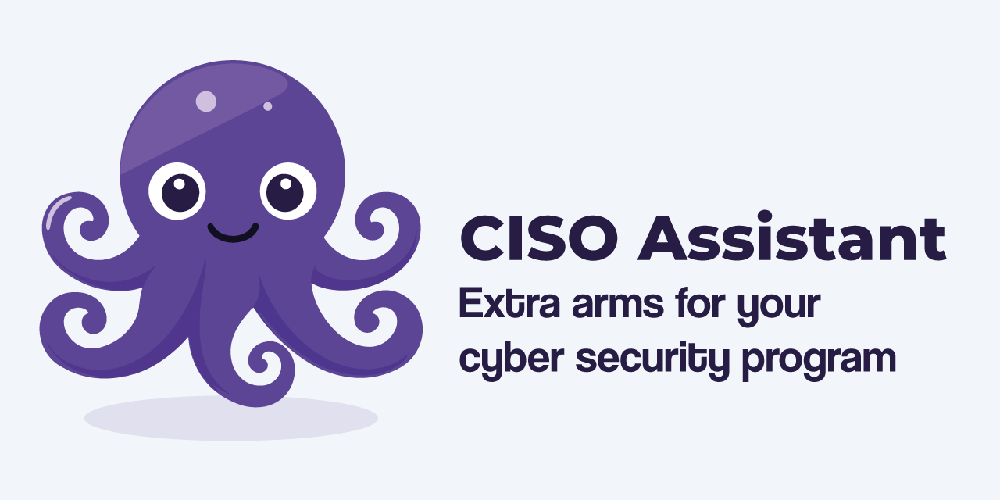
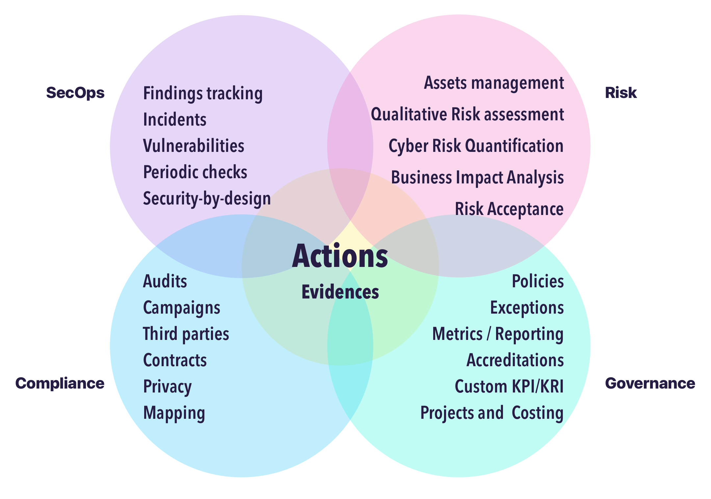
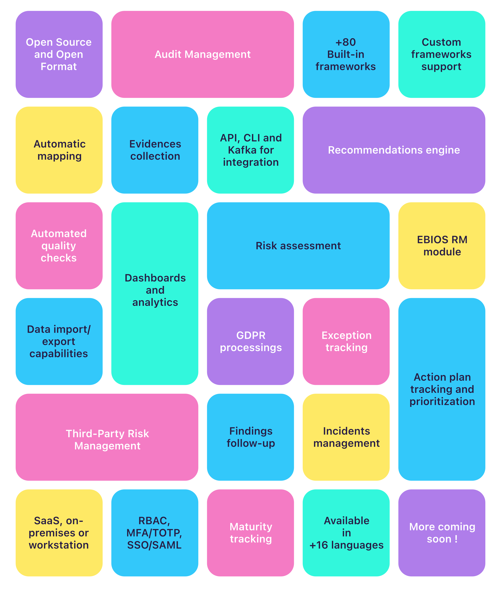
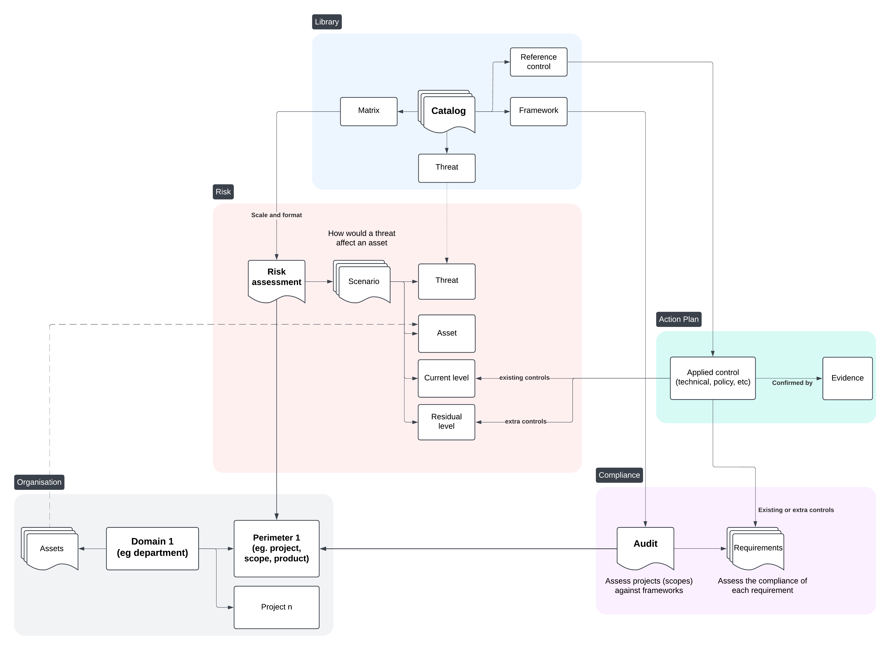
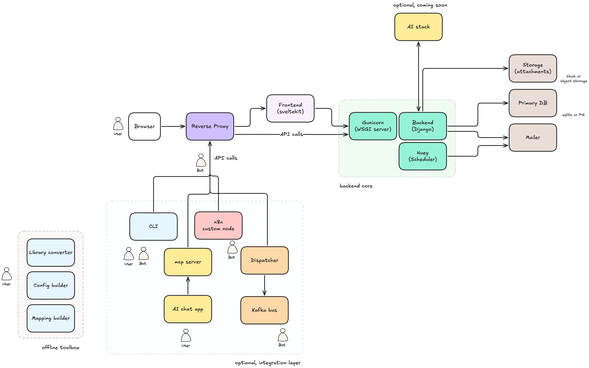

<p align="center">
Star the project 🌟 to get releases notification and help growing the community!
</p>

<p align="center">
    <a href="https://trendshift.io/repositories/9343" target="_blank"></a>
    <br />
    <a href="https://intuitem.com">intuitem.com</a>
    ·
    <a href="https://intuitem.com/trial">SaaS Free trial</a>
    ·
    <a href="https://intuitem.releasedhub.com/ciso-assistant-public/roadmap/d738f2fd">Roadmap</a>
    ·
    <a href="https://intuitem.gitbook.io/ciso-assistant" target="_blank">Docs</a>
    ·
    <a href="#supported-languages-">Languages</a>
    ·
    <a href="https://discord.gg/qvkaMdQ8da">Discord</a>
    ·
    <a href="#supported-frameworks-">Frameworks</a>
    <br />

</p>




<a href="https://intuitem.gitbook.io/ciso-assistant"></a>
<a href="https://ca-api-doc.pages.dev/"></a>

CISO Assistant offers a fresh perspective on Cybersecurity Management and **GRC** (Governance, Risk, and Compliance) practices:

- Designed as a central hub to connect multiple cybersecurity concepts with smart linking between objects,
- Built as a **multi-paradigm** tool that adapts to different backgrounds, methodologies, and expectations,
- Explicitly **decouples** compliance from cybersecurity controls, enabling reusability across the platform,
- Promotes **reusability** and interlinking instead of redundant work,
- Developed with an **API-first** approach to support both UI interaction and external **automation**,
- Comes packed with a wide range of built-in standards, security controls, and threat libraries,
- Offers an **open format** to customize and reuse your own objects and frameworks,
- Includes built-in **risk assessment** and **remediation tracking** workflows,
- Supports custom frameworks via a simple syntax and flexible tooling,
- Provides rich **import/export** capabilities across various channels and formats (UI, CLI, Kafka, reports, etc.).



Our vision is to create a **one-stop-shop** for cybersecurity management—modernizing GRC through **simplification** and **interoperability**.

As practitioners working with cybersecurity and IT professionals, we've faced the same issues: tool fragmentation, data duplication, and a lack of intuitive, integrated solutions. CISO Assistant was born from those lessons, and we're building a community around **pragmatic**, **common-sense** principles.

We’re constantly evolving with input from users and customers. Like an octopus 🐙, CISO Assistant keeps growing extra arms—bringing clarity, automation, and productivity to cybersecurity teams while reducing the effort of data input and output.

[](https://www.codefactor.io/repository/github/intuitem/ciso-assistant-community)
[](https://github.com/intuitem/ciso-assistant-community/actions/workflows/backend-api-tests.yml)
[](https://github.com/intuitem/ciso-assistant-community/actions/workflows/functional-tests.yml)
[](https://app.fossa.com/projects/git%2Bgithub.com%2Fab-smith%2Fciso-assistant-community?ref=badge_small)

---

## Quick Start 🚀

> [!TIP]
> The easiest way to get started is through the [free trial of cloud instance available here](https://intuitem.com/trial).

Alternatively, once you have _Docker_ and _Docker-compose_ installed, on your workstation or server:

clone the repo:

```sh
git clone --single-branch -b main https://github.com/intuitem/ciso-assistant-community.git
```

and run the starter script

```sh
./docker-compose.sh     # Linux/MacOS
./docker-compose.ps1    # Windows
```

If you are looking for other installation options for self-hosting, check the [config builder](./config/) and the [docs](https://intuitem.gitbook.io/ciso-assistant).

> [!NOTE]
> The docker-compose script uses prebuilt Docker images supporting most of the standard hardware architecture.
> If you're using **Windows**, make sure to have [Docker Desktop with WSL2](https://www.docker.com/products/docker-desktop/) installed and trigger the PowerShell script. It will feed Docker Desktop on your behalf.

The docker compose file can be adjusted to pass extra parameters to suit your setup (e.g. Mailer settings).

> [!WARNING]
> If you're getting warnings or errors about image's platform not matching host platform, raise an issue with the details and we'll add it shortly after. You can also use `docker-compose-build.sh` instead (see below) to build for your specific architecture.

> [!CAUTION]
> Don't use the `main` branch code directly for production as it's the merge upstream and can have breaking changes during our development. Either use the `tags` for stable versions or prebuilt images.

---

## Features



Upcoming features are listed on the roadmap.

CISO Assistant is developed and maintained by [Intuitem](https://intuitem.com/), a company specialized in Cybersecurity, Cloud, and Data/AI.

---

## Core Concepts

Here’s an extract of some of the building blocks in CISO Assistant to illustrate the decoupling concept that encourages reusability:



For full details, check the [data model documentation](documentation/architecture/data-model.md).

---

## Decoupling Concept

At the heart of CISO Assistant lies the **decoupling principle**, which enables powerful use cases and major time savings:

- Reuse past assessments across scopes or frameworks,
- Evaluate a single scope against multiple frameworks simultaneously,
- Let CISO Assistant handle reporting and consistency checks so you can focus on remediation,
- Separate control implementation from compliance tracking.

Here is an illustration of the **decoupling** principle and its advantages:

<https://github.com/user-attachments/assets/87bd4497-5cc2-4221-aeff-396f6b6ebe62>

## System architecture



## End-user Documentation

Check out the online documentation on <https://intuitem.gitbook.io/ciso-assistant>.

## Setting up the local AI engine

Read more here: [AI engine](backend/chat/README.md)

## Supported frameworks 🐙

1. ISO 27001:2013 & 27001:2022 🌐
2. NIST Cyber Security Framework (CSF) v1.1 🇺🇸
3. NIST Cyber Security Framework (CSF) v2.0 🇺🇸
4. NIS2 🇪🇺
5. SOC2 🇺🇸
6. PCI DSS 4.0.1 💳
7. CMMC v2 🇺🇸
8. PSPF 🇦🇺
9. General Data Protection Regulation (GDPR): Full text and checklist from GDPR.EU 🇪🇺
10. Essential Eight 🇦🇺
11. NYDFS 500 with 2023-11 amendments 🇺🇸
12. DORA (Act, RTS, ITS and GL) 🇪🇺
13. NIST AI Risk Management Framework 🇺🇸🤖
14. NIST SP 800-53 rev5 🇺🇸
15. Règles OIV - Secteur « Activités civiles de l'Etat » (2019) 🇫🇷
16. CCB CyberFundamentals Framework 🇧🇪
17. NIST SP-800-66 (HIPAA) 🏥
18. HDS/HDH 🇫🇷
19. OWASP Application Security Verification Standard (ASVS) 4 🐝🖥️
20. RGS v2.0 🇫🇷
21. AirCyber ✈️🌐
22. Cyber Resilience Act (CRA) 🇪🇺
23. TIBER-EU 🇪🇺
24. NIST Privacy Framework 🇺🇸
25. TISAX (VDA ISA) v5.1 and v6.0 🚘
26. ANSSI hygiene guide 🇫🇷
27. Essential Cybersecurity Controls (ECC) 🇸🇦
28. CIS Controls v8\* 🌐
29. CSA CCM (Cloud Controls Matrix)\* ☁️
30. FADP (Federal Act on Data Protection) 🇨🇭
31. NIST SP 800-171 rev2 (2021) 🇺🇸
32. ANSSI : recommandations de sécurité pour un système d'IA générative 🇫🇷🤖
33. NIST SP 800-218: Secure Software Development Framework (SSDF) 🖥️
34. GSA FedRAMP rev5 ☁️🇺🇸
35. Cadre Conformité Cyber France (3CF) v1 (2021) ✈️🇫🇷
36. ANSSI : SecNumCloud ☁️🇫🇷
37. Cadre Conformité Cyber France (3CF) v2 (2024) ✈️🇫🇷
38. ANSSI : outil d’autoévaluation de gestion de crise cyber 💥🇫🇷
39. BSI: IT-Grundschutz-Kompendium 🇩🇪
40. NIST SP 800-171 rev3 (2024) 🇺🇸
41. ENISA: 5G Security Controls Matrix 🇪🇺
42. OWASP Mobile Application Security Verification Standard (MASVS) 🐝📱
43. Agile Security Framework (ASF) - baseline - by intuitem 🤗
44. ISO 27001:2013 🌐 (For legacy and migration)
45. EU AI Act 🇪🇺🤖
46. FBI CJIS 🇺🇸👮
47. Operational Technology Cybersecurity Controls (OTCC) 🇸🇦
48. Secure Controls Framework (SCF) 🇺🇸🌐
49. NCSC - Cyber Assessment Framework (CAF) v3.2 🇬🇧
50. California Consumer Privacy Act (CCPA) 🇺🇸
51. California Consumer Privacy Act Regulations 🇺🇸
52. NCSC Cyber Essentials 🇬🇧
53. Directive Nationale de la Sécurité des Systèmes d'Information (DNSSI) Maroc 🇲🇦
54. Part-IS ✈️🇪🇺
55. ENS Esquema Nacional de seguridad 🇪🇸
56. Korea ISA ISMS-P 🇰🇷
57. Swiss ICT minimum standard 🇨🇭
58. Adobe Common Controls Framework (CCF) v5 🌐
59. BSI Cloud Computing Compliance Criteria Catalogue (C5) 🇩🇪
60. Référentiel d’Audit de la Sécurité des Systèmes d’Information, ANCS Tunisie 🇹🇳
61. ECB Cyber resilience oversight expectations for financial market infrastructures 🇪🇺
62. Mindeststandard-des-BSI-zur-Nutzung-externer-Cloud-Dienste (Version 2.1) 🇩🇪
63. Formulaire d'évaluation de la maturité - niveau fondamental (DGA) 🇫🇷
64. NIS2 technical and methodological requirements 2024/2690 🇪🇺
65. Saudi Arabian Monetary Authority (SAMA) Cybersecurity Framework 🇸🇦
66. Guide de sécurité des données (CNIL) 🇫🇷
67. International Traffic in Arms Regulations (ITAR) 🇺🇸
68. Federal Trade Commission (FTC) Standards for Safeguarding Customer Information 🇺🇸
69. OWASP's checklist for LLM governance and security 🌐
70. Recommandations pour les architectures des systèmes d’information sensibles ou à diffusion restreinte (ANSSI) 🇫🇷
71. CIS benchmark for Kubernetes v1.10 🌐
72. De tekniske minimumskrav for statslige myndigheder 🇩🇰
73. Google SAIF framework 🤖
74. Recommandations relatives à l'administration sécurisée des SI (ANSSI) 🇫🇷
75. Prudential Standard CPS 230 - Operational Risk Management (APRA) 🇦🇺
76. Prudential Standard CPS 234 - Information Security (APRA) 🇦🇺
77. Vehicle Cyber Security Audit (VCSA) v1.1 🚘
78. Cisco Cloud Controls Framework (CCF) v3.0 ☁️🌐
79. FINMA - Circular 2023/01 - Operational risks and resilience - Banks 🇨🇭
80. Post-Quantum Cryptography (PQC) Migration Roadmap (May 2025) 🔐
81. Cloud Sovereignty Framework - 1.2.1 - Oct 2025 🇪🇺
82. ISO 22301:2019 outline - Business continuity management systems 🌐
83. CCB CyberFundamentals Framework 2025 🇧🇪
84. Prestataires de détection des incidents de sécurité (PDIS) - Référentiel d’exigences 🇫🇷
85. Vendor Due Diligence - simple baseline - intuitem 🌐
86. Points de contrôle Active Directory (AD) - ANSSI 🇫🇷
87. ISO 42001:2023 outline - Artificial Intelligence Management System, including Annex A 🤖🌐
88. India's Digital Personal Data Protection Act (DPDPA) - 2023 🇮🇳
89. E-ITS (Estonia's national cyber security standard) - 2024 🇪🇪
90. Microsoft cloud security benchmark v1 - ☁️🌐
91. Baseline informatiebeveiliging Overheid 2 (BIO2) 🇳🇱
92. ANSSI : Questionnaire MonAideCyber 🇫🇷
93. ITSP.10.171 - Protecting specified information in non-Government of Canada systems and organizations 🇨🇦
94. CISA Vendor Supply Chain Risk Management (SCRM) Template 🇺🇸
95. European Sustainability Reporting Standards (ESRS) 🇪🇺
96. ITIL 4 Management Practices 🌐
97. NOREA - DORA in Control Framework v3.0 🇪🇺
98. NIS-1 transposition FR 🇫🇷
99. PSSI État 🇫🇷
100. Checklist de dossier d'homologation 🇫🇷
101. Cahier des charges Label EBIOS RM v3.1 🇫🇷
102. SecNumCloud v3.2 Annexe 2 : recommandations aux commanditaires ☁️🇫🇷
103. CCB CyberFundamentals Small - Self assessment 🇧🇪
104. Mitre ATT&CK v18.1 - Threat catalog 🌐
105. Mitre D3FEND - Reference controls 🌐
106. OWASP Top 10 Web - Threat catalog 🐝🌐
107. OWASP MAS Threat Modelling Guide - Threat catalog 🐝📱
108. CISA Cybersecurity Performance Goals (CPG) v2.0 🇺🇸
109. ANSSI : Référentiel Cyber France pour la réglementation NIS2 (ReCyF) 🇫🇷
110. Cadre Conformité Cyber France (3CF) v3.1 (2026) ✈️🇫🇷
111. Règles OIV - Secteur « Transport aérien » (2016) ✈️🇫🇷
112. IEC 62443 series — parts 2-1, 2-4, 3-2, 3-3, 4-1, 4-2 🏭🌐
113. CER Directive (Critical Entities Resilience) 🇪🇺
114. EUDI ARF — EU Digital Identity Wallet High-Level Requirements (Annex 2.02) 🇪🇺
115. UK Defence Standard 05-138 Issue 4 🇬🇧
116. Référentiel HAS - Certification des établissements de santé pour la qualité des soins 🇫🇷🏥
117. Personal Data Protection Law (PDPL) 🇸🇦
118. NCSC - Cyber Assessment Framework (CAF) v4.0 🇬🇧

### Community contributions

1. PGSSI-S (Politique Générale de Sécurité des Systèmes d'Information de Santé) 🇫🇷
2. ANSSI : Recommandations de configuration d'un système GNU/Linux 🇫🇷
3. PSSI-MCAS (Politique de sécurité des systèmes d’information pour les ministères chargés des affaires sociales) 🇫🇷
4. ANSSI : Recommandations pour la protection des systèmes d'information essentiels 🇫🇷
5. ANSSI : Recommandations de sécurité pour l'architecture d'un système de journalisation 🇫🇷
6. ANSSI : Recommandations de sécurité relatives à TLS 🇫🇷
7. New Zealand Information Security Manual (NZISM) 🇳🇿
8. Clausier de sécurité numérique du Club RSSI Santé 🇫🇷
9. Référentiel National de Sécurité de l’Information (RNSI), MPT Algérie 🇩🇿
10. Misure minime di sicurezza ICT per le pubbliche amministrazioni, AGID Italia 🇮🇹
11. Framework Nazionale CyberSecurity v2, FNCS Italia 🇮🇹
12. Framework Nazionale per la Cybersecurity e la Data Protection, ACN Italia 🇮🇹
13. PSSIE du Bénin, ANSSI Bénin 🇧🇯
14. IGI 1300 / II 901 - Liste des exigences pour la mise en oeuvre d'un SI classifié (ANSSI) 🇫🇷
15. Référentiel Général de Sécurité 2.0 - Annexe B2 🇫🇷
16. Recommandations sur la sécurisation des systèmes de contrôle d'accès physique et de vidéoprotection 🇫🇷
17. Recommandations pour un usage sécurisé d’(Open)SSH 🇫🇷
18. Recommandations de sécurité relatives à IPsec pour la protection des flux réseau 🇫🇷
19. Recommandations relatives à l'interconnexion d'un système d'information à internet 🇫🇷
20. Guides des mécanismes cryptographiques 🇫🇷
21. Swift Customer Security Controls Framework (CSCF) v2025 🏦🌐
22. OWASP Application Security Verification Standard (ASVS) 5 🐝🖥️
23. NIST 800-82 (OT) - appendix 🏭🤖
24. RBI Master Direction 2023 - india 🏦🇮🇳
25. Loi 05-20 relative à la cybersécurité (Maroc) 🇲🇦
26. Lithuanian NIS2 Cybersecurity Law (Kibernetinio saugumo įstatymas) 🇱🇹
27. Prestataire d'audit de sécurité des systèmes d'information (PASSI) 🇫🇷
28. ANS Programme CaRE - Domaine 2 (Continuité et reprise d'activité, sauvegarde) 🇫🇷🏥
29. ANS HospiConnect HOP'EN2 (Sécurisation de l'accès au SIH) 🇫🇷🏥
30. Loi n° 09-08 relative à la protection des personnes physiques 🇲🇦
31. Checklist des exigences de la Loi n° 09-08 🇲🇦
32. Référentiel des exigences de qualification des prestataires de services cloud ☁️🇲🇦
33. AI Defense Matrix 🤖🌐
34. Zero Trust for Operational Technology (ZT OT) 🇺🇸🏭
35. T.C. CBDDO Bilgi ve İletişim Güvenliği Rehberi (BİGR) 🇹🇷

<br/>

> [!NOTE]
> Frameworks with `*` require an extra manual step of getting the latest Excel sheet through their website as their license prevent direct usage. You can load the Excel sheet directly as a library.

<br/>

Checkout the [library](/backend/library/libraries/) and [tools](/tools/) for the Domain Specific Language used and how you can define your own.

### Coming soon

- Indonesia PDP 🇮🇩
- OWASP SAMM
- COBAC R-2024/01
- ICO Data protection self-assessment 🇬🇧
- ASD ISM 🇦🇺

- and much more: just ask on [Discord](https://discord.gg/qvkaMdQ8da). If it's an open standard, we'll do it for you, _free of charge_ 😉

## Add your own custom library

A library can represent a framework, a threat catalog, a set of reference controls, or even a custom risk matrix.

Libraries can now be loaded **directly from Excel files**. There is no need to manually convert them to YAML beforehand—the conversion is handled internally when an Excel file is uploaded.

Take a look at the `tools` directory and its [dedicated README](tools/README.md), which describes the expected format of library source files in Excel. The `excel` subdirectory contains example XLSX files used as sources for the existing libraries and can be used as templates for creating your own.

To load a library from an Excel file, go to the **Governance → Library** page, click **Load**, and select your Excel source file. Any validation or parsing errors will be reported during the import process.

### Optional: converting libraries to YAML

While Excel files can be loaded directly, it is still possible to convert library source files to YAML using external Python scripts:

- `convert_library_v2.py` helps you generate a library from a simple Excel file. Once your items are structured in the expected format, run the script to produce the corresponding YAML file.
- The `tools` directory also contains specialized converters for specific frameworks (for example, CIS or CCM Controls).

### Creating mapping libraries

To facilitate the creation of mappings between frameworks, you can use the `prepare_mapping_v2.py` tool. It generates an Excel file based on two existing framework libraries in YAML format. After filling in the mappings, the resulting Excel file can be:

- loaded directly into the application, or
- converted to YAML using `convert_library_v2.py`.

## Community

Join our [open Discord community](https://discord.gg/qvkaMdQ8da) to interact with the team and other GRC experts.

## Testing the cloud version

> The fastest and easiest way to get started is through the [free trial of cloud instance available here](https://intuitem.com/trial).

## Testing locally 🚀

To run CISO Assistant locally in a straightforward way, you can use Docker compose.

0. Update docker

Make sure you have a recent version of docker (>= 27.0).

1. Clone the repository

```sh
git clone --single-branch -b main https://github.com/intuitem/ciso-assistant-community.git
cd ciso-assistant-community
```

2. Launch docker-compose script for prebuilt images:

```sh
./docker-compose.sh     # Linux/MacOS
./docker-compose.ps1    # Windows
```

_Alternatively_, you can use this variant to build the docker images for your specific architecture:

```sh
./docker-compose-build.sh     # Linux/MacOS
./docker-compose-build.ps1    # Windows
```

When asked for, enter your email and password for your superuser.

You can then reach CISO Assistant using your web browser at [https://localhost:8443/](https://localhost:8443/)

For the following executions, use "docker compose up" directly.

## Setting up CISO Assistant for development

> [!WARNING]
>
> ### Important note for Windows users
>
> The best working solution for users developing on **Windows** is to use [Ubuntu](https://apps.microsoft.com/detail/9pdxgncfsczv) installed on [WSL2](https://apps.microsoft.com/detail/9p9tqf7mrm4r) (Docker is not required).
>
> It is now also possible to run and develop CISO Assistant natively on Windows without WSL2 nor Docker, but it will require some extra steps.
> Please note that the native running on Windows is still in **EXPERIMENTAL PHASE** and should **NOT** be used if you are unsure of what you are doing, or if you want to ensure stability throughout development.
> Nevertheless, we would love to hear any suggestions in order to enhance the development experience for Windows users. Please feel free to open an Issue/PR about it!

### Requirements

- Python 3.14+
- pip 25.3+
- uv 0.9+
- node 24+
- npm 10.2+
- pnpm 10.30+
- yaml-cpp (`brew install yaml-cpp libyaml` or `apt install libyaml-cpp-dev`)

<details>
<summary>[EXPERIMENTAL] Additional requirements for development on Windows without WSL2</summary>

If you want to develop the project without WSL2, you will need to install [MSYS2](https://www.msys2.org/), add the `MSYS2 UCRT64` binaries to your [system PATH environment variable](https://learn.microsoft.com/en-us/powershell/module/microsoft.powershell.core/about/about_environment_variables?view=powershell-7.6#set-environment-variables-in-the-system-control-panel) (usually, the binaries are in `C:\msys64\ucrt64\bin`) and then install the following dependencies via `pacman` using `MSYS2 UCRT64`.

```sh
pacman -S mingw-w64-ucrt-x86_64-file mingw-w64-ucrt-x86_64-pango
```

You will also have to add those 2 system environment variables after installing the dependencies:

```conf
MAGIC=Full path to the `magic.mgc` file (usually `C:\msys64\ucrt64\share\misc\magic.mgc`)
WEASYPRINT_DLL_DIRECTORIES=Same path as your MSYS2 UCRT64 binaries
```

Given that the default encoding on Windows isn't `UTF-8` but `cp1252`, certain python script printing `UTF-8` characters such as emojis may cause the backend crash or malfunction in some cases (e.g. library importation).
To avoid this issue with this project, enforce the `UTF-8` encoding by adding these 2 user environment variables:

```conf
PYTHONUTF8=1
PYTHONIOENCODING=utf-8:replace
```

> [!NOTE]
>
> ### Known issues
>
> - The `libmagic` library on Windows (MIME detection) struggles to recognize an Excel file (`.xlsx`) by reading its first `2048` bits as it returns `application/octet-stream` most of the time when importing an Excel library (backend displays the warning message `[warning  ] Invalid MIME type`). This doesn't prevent the Excel file from being imported thanks to the fallback method in `backend/library/views.py:StoredLibraryViewSet.upload_library`.

</details>

### Running the backend

1. Clone the repository.

```sh
git clone git@github.com:intuitem/ciso-assistant-community.git
cd ciso-assistant-community
```

2. Create a file in the parent folder (e.g. ../myvars) and store your environment variables within it by copying and modifying the following code and replace `"<XXX>"` by your private values. Take care not to commit this file in your git repo.

**Mandatory variables**

All variables in the backend have handy default values.

**Recommended variables**

```sh
export DJANGO_DEBUG=True

# Default url is set to http://localhost:5173 but you can change it, e.g. to use https with a caddy proxy
export CISO_ASSISTANT_URL=https://localhost:8443

# Setup a development mailer with Mailhog for example
export EMAIL_HOST_USER=''
export EMAIL_HOST_PASSWORD=''
export DEFAULT_FROM_EMAIL=ciso-assistant@ciso-assistantcloud.com
export EMAIL_HOST=localhost
export EMAIL_PORT=1025
export EMAIL_USE_TLS=True  # true for STARTTLS
export EMAIL_USE_SSL=False # true for SMTPS
```

**Other variables**

```sh
# CISO Assistant will use SQLite by default, but you can setup PostgreSQL by declaring these variables
export POSTGRES_NAME=ciso-assistant
export POSTGRES_USER=ciso-assistantuser
export POSTGRES_PASSWORD=<XXX>
export POSTGRES_PASSWORD_FILE=<XXX>  # alternative way to specify password
export DB_HOST=localhost
export DB_PORT=5432  # optional, default value is 5432

# CISO Assistant will use filesystem storage backend by default.
# Only one cloud storage backend can be active at a time (USE_S3 and USE_AZURE are mutually exclusive).

# --- AWS S3 ---
# You can use a S3 Bucket by declaring these variables
# The S3 bucket must be created before starting CISO Assistant
export USE_S3=True
export AWS_STORAGE_BUCKET_NAME=<your-bucket-name>
export AWS_S3_REGION_NAME=<aws-region>  # optional, e.g., us-east-1

# S3 Authentication Option 1: Access Key (for standalone deployments or S3-compatible services)
export AWS_ACCESS_KEY_ID=<XXX>
export AWS_SECRET_ACCESS_KEY=<XXX>
export AWS_S3_ENDPOINT_URL=<your-bucket-endpoint>  # required for S3-compatible services (e.g., MinIO)

# S3 Authentication Option 2: IRSA (for Kubernetes/EKS deployments)
# When running on EKS with IAM Roles for Service Accounts (IRSA) enabled,
# these environment variables are automatically injected by the pod's service account.
# No explicit configuration is needed - just ensure USE_S3=True and AWS_STORAGE_BUCKET_NAME are set.
# export AWS_WEB_IDENTITY_TOKEN_FILE=/var/run/secrets/eks.amazonaws.com/serviceaccount/token
# export AWS_ROLE_ARN=arn:aws:iam::123456789012:role/ciso-assistant-s3-role

# --- Azure Blob Storage ---
# You can use an Azure Blob Storage container instead of S3.
# The container must be created before starting CISO Assistant.
# export USE_AZURE=True
# export AZURE_CONTAINER=<your-container-name>          # default: ciso-assistant-container
# export AZURE_CUSTOM_DOMAIN=<your-custom-domain>       # optional, e.g., cdn.example.com
# export AZURE_LOCATION=<path-prefix>                   # optional, path prefix within the container (e.g., "media")

# Azure Authentication Option 1: Account Key
# export AZURE_ACCOUNT_NAME=<your-storage-account-name>
# export AZURE_ACCOUNT_KEY=<your-storage-account-key>

# Azure Authentication Option 2: Connection String
# export AZURE_CONNECTION_STRING=<your-connection-string>

# Azure Authentication Option 3: Managed Identity (for Azure-hosted deployments)
# Requires AZURE_ACCOUNT_NAME. The pod/VM's assigned managed identity is used automatically.
# export AZURE_ACCOUNT_NAME=<your-storage-account-name>
# export AZURE_USE_MANAGED_IDENTITY=True

# Add a second backup mailer (will be deprecated, not recommended anymore)
export EMAIL_HOST_RESCUE=<XXX>
export EMAIL_PORT_RESCUE=587
export EMAIL_HOST_USER_RESCUE=<XXX>
export EMAIL_HOST_PASSWORD_RESCUE=<XXX>
export EMAIL_USE_TLS_RESCUE=True
export EMAIL_USE_SSL_RESCUE=False

# You can define the email of the first superuser, useful for automation. A mail is sent to the superuser for password initialization
export CISO_SUPERUSER_EMAIL=<XXX>

# By default, Django secret key is generated randomly at each start of CISO Assistant. This is convenient for quick test,
# but not recommended for production, as it can break the sessions (see
# this [topic](https://stackoverflow.com/questions/15170637/effects-of-changing-djangos-secret-key) for more information).
# To set a fixed secret key, use the environment variable DJANGO_SECRET_KEY.
export DJANGO_SECRET_KEY=...

# Sandbox mode for running untrusted code (e.g. library excel files)
# WARNING: Sandboxing must be enabled in production environments.
export ENABLE_SANDBOX=True  # optional, default value is True in production enfironments (DJANGO_DEBUG=False) and False in development environments (DJANGO_DEBUG=True).

# Logging configuration
export LOG_LEVEL=INFO # optional, default value is INFO. Available options: DEBUG, INFO, WARNING, ERROR, CRITICAL
export LOG_FORMAT=plain # optional, default value is plain. Available options: json, plain

# Authentication options
export AUTH_TOKEN_TTL=3600 # optional, default value is 3600 seconds (60 minutes). It defines the time to live of the authentication token
export AUTH_TOKEN_AUTO_REFRESH=True # optional, default value is True. It defines if the token TTL should be refreshed automatically after each request authenticated with the token
export AUTH_TOKEN_AUTO_REFRESH_TTL=36000 # optional, default value is 36000 seconds (10 hours). It defines the time to live of the authentication token after auto refresh. You can disable it by setting it to 0.
```

3. Install uv

Visit the uv website for instructions: <https://docs.astral.sh/uv/getting-started/installation/>

4. Move to backend and install required dependencies.

```sh
cd backend
uv sync
```

5. Recommended: Install the pre-commit hooks.

```sh
pre-commit install
```

6. If you want to setup Postgres:

- Launch one of these commands to enter in Postgres:
  - `psql as superadmin`
  - `sudo su postgres`
  - `psql`
- Create the database "ciso-assistant"
  - `create database ciso-assistant;`
- Create user "ciso-assistantuser" and grant it access
  - `create user ciso-assistantuser with password '<POSTGRES_PASSWORD>';`
  - `grant all privileges on database ciso-assistant to ciso-assistantuser;`

7. If you want to setup s3 bucket:

- Choose your s3 provider or try s3 feature with miniO with this command:
  - `docker run -p 9000:9000 -p 9001:9001 -e "MINIO_ROOT_USER=XXX" -e "MINIO_ROOT_PASSWORD=XXX" quay.io/minio/minio server /data --console-address ":9001"`
- You can now check your bucket on <http://localhost:9001>
  - Fill the login with the credentials you filled on the docker run env variables
- Export in the backend directory all the env variables asked about S3
  - You can see the list above in the recommanded variables

8. Apply migrations.

```sh
uv run python manage.py migrate
```

9. Create a Django superuser, that will be CISO Assistant administrator.

> If you have set a mailer and CISO_SUPERUSER_EMAIL variable, there's no need to create a Django superuser with `createsuperuser`, as it will be created automatically on first start. You should receive an email with a link to setup your password.

```sh
uv run python manage.py createsuperuser
```

10. Run development server.

```sh
uv run python manage.py runserver
```

<details>
<summary>[EXPERIMENTAL] How to run development server natively on Windows?</summary>

When running Django's development server natively on Windows, SvelteKit SSR can open enough concurrent API connections to hit the server's small default listen backlog. This may cause intermittent `ECONNREFUSED` / `TypeError: fetch failed` errors in the frontend.

Use the helper scripts documented in [`tools/.windows/README.md`](tools/.windows/README.md) for the native Windows development setup.

</details>

11. For Huey (tasks runner)

- prepare a mailer for testing.
- run `python manage.py run_huey -w 2 -k process` or equivalent in a separate shell.
- you can use `MAIL_DEBUG` to have mail on the console for easier debug

### Running the frontend

1. cd into the frontend directory

```shell
cd frontend
```

2. Install dependencies

```bash
npm install -g pnpm
pnpm install
```

3. Start a development server (make sure that the django app is running)

```bash
pnpm run dev
```

4. Reach the frontend on <http://localhost:5173>

> [!NOTE]
> Safari will not properly work in this setup, as it requires https for secure cookies. The simplest solution is to use Chrome or Firefox. An alternative is to use a caddy proxy. Please see the [readme file](frontend/README.md) in frontend directory for more information on this.

5. Environment variables

All variables in the frontend have handy default values.

If you move the frontend on another host, you should set the following variable: `PUBLIC_BACKEND_API_URL`. Its default value is <http://localhost:8000/api>.

The `PUBLIC_BACKEND_API_EXPOSED_URL` is necessary for proper functioning of the SSO. It points to the URL of the API as seen from the browser. It should be equal to the concatenation of `CISO_ASSISTANT_URL` (in the backend) with "/api".

When you launch "node server" instead of "pnpm run dev", you need to set the ORIGIN variable to the same value as `CISO_ASSISTANT_URL` in the backend (e.g. <http://localhost:3000>).

### Managing migrations

The migrations are tracked by version control, <https://docs.djangoproject.com/en/4.2/topics/migrations/#version-control>

For the first version of the product, it is recommended to start from a clean migration.

Note: to clean existing migrations, type:

```sh
find . -path "*/migrations/*.py" -not -name "__init__.py" -delete
find . -path "*/migrations/*.pyc"  -delete
```

After a change (or a clean), it is necessary to re-generate migration files:

```sh
uv run python manage.py makemigrations
uv run python manage.py migrate
```

These migration files should be tracked by version control.

### Test suite

To run API tests on the backend, simply type `uv run pytest` in a shell in the backend folder.

To run functional tests on the frontend, do the following actions:

- in the frontend folder, launch the following command:

```shell
tests/e2e-tests.sh
```

The goal of the test harness is to prevent any regression, i.e. all the tests shall be successful, both for backend and frontend.

## API and Swagger

- The interactive API documentation (Swagger UI) is available only in development mode.
  To enable it, set `export DJANGO_DEBUG=True` before starting the backend.
- Once the server is running, the documentation will be accessible at `<backend_endpoint>/api/schema/swagger/`,
  for example: <http://127.0.0.1:8000/api/schema/swagger/>.

To interact with the API via Swagger or directly with HTTP calls:

1. Authenticate by sending a POST request to `/api/iam/login/` with your credentials in the request body. The response will include an authentication token.
2. Include this token in the header of subsequent requests as: `Authorization: Token <token>`

⚠️ Note: use `Token`, **not** `Bearer`.

When using the interactive Swagger UI, simply log in, the token will be automatically handled for subsequent requests.

## Setting CISO Assistant for production

The docker-compose.yml highlights a relevant configuration with a Caddy proxy in front of the frontend. It exposes API calls only for SSO. Note that docker-compose.yml exposes the full API, which is not yet recommended for production.

Set `DJANGO_DEBUG=False` for security reasons.

> [!NOTE]
> The frontend cannot infer the host automatically, so you need to either set the ORIGIN variable, or the `HOST_HEADER` and `PROTOCOL_HEADER` variables. Please see [the sveltekit doc](https://kit.svelte.dev/docs/adapter-node#environment-variables-origin-protocolheader-hostheader-and-port-header) on this tricky issue. Beware that this approach does not work with "pnpm run dev", which should not be a worry for production.

> [!NOTE]
> Caddy needs to receive a SNI header. Therefore, for your public URL (the one declared in `CISO_ASSISTANT_URL`), you need to use a FQDN, not an IP address, as the SNI is not transmitted by a browser if the host is an IP address. Another tricky issue!

> [!NOTE]
> The docker-compose template files are now launching the backend, huey and frontend in non-root mode. If you use an old docker-compose.yml file, it is recommended to update it. The containers are compatible with both root and non-root modes.

### Non-root docker containers

docker-compose.yml now relies on a non-root user 1001:1001, which is available in the image. Older deployments are using root user, which is still supported. To transition to non-root, use the following steps in the host:

- docker compose down
- update the docker-compose.yml file
- sudo chown -R 1001:1001 db
- docker compose up -d

## Supported languages 🌐

[](https://intuitem.github.io/metrics/i18n/)

Reference is `en.json`; coverage = share of reference keys present in each locale file. Auto-refreshed daily — full breakdown at the [dashboard](https://intuitem.github.io/metrics/i18n/).

## Contributors 🤝

<a href="https://github.com/intuitem/ciso-assistant-community/graphs/contributors">
  
</a>

## Built With 💜

- [Django](https://www.djangoproject.com/) - Python Web Development Framework
- [SvelteKit](https://kit.svelte.dev/) - Frontend Framework
- [eCharts](https://echarts.apache.org) - Charting library
- [unovis](https://unovis.dev) - Complementary charting library
- [Gunicorn](https://gunicorn.org/) - Python WSGI HTTP Server for UNIX
- [Caddy](https://caddyserver.com) - The coolest reverse Proxy
- [Gitbook](https://www.gitbook.com) - Documentation platform
- [PostgreSQL](https://www.postgresql.org/) - Open Source RDBMS
- [SQLite](https://www.sqlite.org/index.html) - Open Source RDBMS
- [Docker](https://www.docker.com/) - Container Engine
- [inlang](https://inlang.com/) - The ecosystem to globalize your software
- [Huey](https://huey.readthedocs.io/en/latest/) - A lightweight task queue

## Security

Great care has been taken to follow security best practices. Please report any issue to <security@intuitem.com>.

## License

This repository contains the source code for both the Open Source edition of CISO Assistant (Community Edition), released under the AGPL v3, as well as the commercial edition of CISO Assistant (Pro and Enterprise Editions), released under the intuitem Commercial Software License. This mono-repository approach is adopted for simplicity.

All the files within the top-level "enterprise" directory are released under the intuitem Commercial Software License.

All the files outside the top-level "enterprise" directory are released under the [AGPLv3](https://choosealicense.com/licenses/agpl-3.0/).

See [LICENSE.md](./LICENSE.md) for details. For more details about the commercial editions, you can reach us on <contact@intuitem.com>.

Unless otherwise noted, all files are © intuitem.

## Activity


