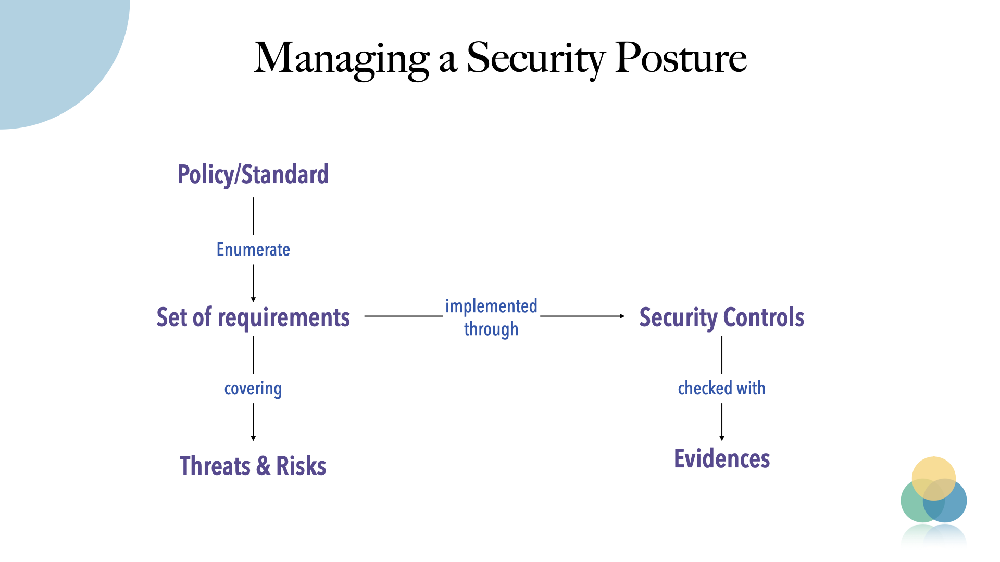

<p align="center">
Star the project 🌟 to get releases notification and help growing the community!
</p>

<p align="center">
    <br />
    <a href="https://intuitem.com">intuitem.com</a>
    ·
    <a href="https://intuitem.com/trial">SaaS Free trial</a>
    ·
    <a href="https://intuitem.gitbook.io/ciso-assistant" target="_blank">Docs</a>
    ·
    <a href="#supported-languages-">Languages</a>
    ·
    <a href="https://discord.gg/qvkaMdQ8da">Discord</a>
    ·
    <a href="#supported-frameworks-">Frameworks</a>
    <br />
</p>


[](https://github.com/intuitem/ciso-assistant-community/actions/workflows/backend-coverage.yaml)
[](https://github.com/intuitem/ciso-assistant-community/actions/workflows/backend-api-tests.yml)
[](https://github.com/intuitem/ciso-assistant-community/actions/workflows/functional-tests.yml)

CISO Assistant brings a different take to **GRC** and Cyber Security Posture Management:

- by explicitly decoupling compliance from cybersecurity controls implementation
- has built-in standards, security controls and threats
- risk assessment and remediation plan follow-up
- allows to manage a catalog for security controls and threats
- you can bring your own framework as well using a simple syntax
- manage audit, evidences collection and report generation

Our vision is to provide a one stop shop for cyber security posture management and cover the layers of **GRC** (Governance, Risk and Compliance). As practitioners interacting with multiple cybersecurity and IT professionals, we have struggled with fragmentation and lack of efficient tooling. We keep improving CISO Assistant with anything that could bring clarity and productivity to cybersecurity teams and reduce the effort of research, audit management and paperwork.

CyberSecurity teams need to use GRC as a foundation to structure their program and implement the right tools and processes to mitigate the risks, and leave the rest to CISO Assistant 🐙

The vision of the tool is based on this model:



The full details are available in the [data model](documentation/architecture/data-model.md).

The decoupling allows you to save a considerable amount of time:

- reuse previous assessments,
- assess a scope against multiple frameworks at the same time,
- leave the reporting formatting and sanity check to CISO assistant and focus on your fixes,
- balance controls implementation and compliance follow-up

CISO Assistant is developed and maintained by [intuitem](https://intuitem.com/), a French 🇫🇷 company specialized in Cyber Security, Cloud and Data/AI.

## Quick Start 🚀

> [!TIP]
> The easiest way to get started is through the [free trial of cloud instance available here](https://intuitem.com/trial).

Alternatively, once you have _Docker_ and _Docker-compose_ installed, on your workstation or server, _clone_ the repo and run:

```sh
./docker-compose.sh
```

> [!NOTE]
> The docker-compose script uses prebuilt Docker images supporting most of the standard hardware architecture.
> If you're using **Windows**, Make sure to have [WSL](https://learn.microsoft.com/en-us/windows/wsl/install) installed and trigger the script within a WSL command line. It will feed Docker Desktop on your behalf.

> [!WARNING]
> If you're getting warnings or errors about image's platform not matching host platform, raise an issue with the details and we'll add it shortly after. You can also use `docker-compose-build.sh` instead (see below) to build for your specific architecture.

## End-user Documentation

Check out the online documentation on https://intuitem.gitbook.io/ciso-assistant.

## Supported frameworks 🐙

1. ISO 27001:2022 🌐
2. NIST Cyber Security Framework (CSF) v1.1 🇺🇸
3. NIST Cyber Security Framework (CSF) v2.0 🇺🇸
4. NIS2 🇪🇺
5. SOC2 🇺🇸
6. PCI DSS 4.0 💳
7. CMMC v2 🇺🇸
8. PSPF 🇦🇺
9. GDPR checklist from GDPR.EU 🇪🇺
10. Essential Eight 🇦🇺
11. NYDFS 500 with 2023-11 amendments 🇺🇸
12. DORA 🇪🇺
13. NIST AI Risk Management Framework 🇺🇸🤖
14. NIST SP 800-53 rev5 🇺🇸
15. France LPM/OIV rules 🇫🇷
16. CCB CyberFundamentals Framework 🇧🇪
17. NIST SP-800-66 (HIPAA) 🏥
18. HDS/HDH 🇫🇷
19. OWASP Application Security Verification Standard (ASVS) 🐝🖥️
20. RGS v2.0 🇫🇷
21. AirCyber ✈️🌐
22. Cyber Resilience Act (CRA) 🇪🇺
23. TIBER-EU 🇪🇺
24. NIST Privacy Framework 🇺🇸
25. TISAX (VDA ISA) 🚘
26. ANSSI hygiene guide 🇫🇷
27. Essential Cybersecurity Controls (ECC) 🇸🇦
28. CIS Controls v8\* 🌐
29. CSA CCM (Cloud Controls Matrix)\* ☁️
30. FADP (Federal Act on Data Protection) 🇨🇭
31. NIST SP 800-171 rev2 (2021) 🇺🇸
32. ANSSI : recommandations de sécurité pour un système d'IA générative 🇫🇷🤖
33. NIST SP 800-218: Secure Software Development Framework (SSDF) 🖥️
34. GSA FedRAMP rev5 ☁️🇺🇸
35. Cadre Conformité Cyber France (3CF) v1 (2021) ✈️🇫🇷
36. ANSSI : SecNumCloud ☁️🇫🇷
37. Cadre Conformité Cyber France (3CF) v2 (2024) ✈️🇫🇷
38. ANSSI : outil d’autoévaluation de gestion de crise cyber 💥🇫🇷
39. BSI: IT-Grundschutz-Kompendium 🇩🇪
40. NIST SP 800-171 rev3 (2024) 🇺🇸
41. ENISA: 5G Security Controls Matrix 🇪🇺
42. OWASP Mobile Application Security Verification Standard (MASVS) 🐝📱
43. Agile Security Framework (ASF) - by intuitem. A baseline of 14 security domains for flash assessment and custom frameworks 🤗   
44. EU AI Act

### Community contributions

1. ISO 27001:2022, version Française 🇫🇷🌐
2. PGSSI-S (Politique Générale de Sécurité des Systèmes d'Information de Santé) 🇫🇷
3. ANSSI : Recommandations de configuration d'un système GNU/Linux 🇫🇷
4. PSSI-MCAS (Politique de sécurité des systèmes d’information pour les ministères chargés des affaires sociales) 🇫🇷

<br/>

> [!NOTE]
> `*` These frameworks require an extra manual step of getting the latest Excel sheet through their website as their license prevent direct usage.

<br/>

Checkout the [library](/backend/library/libraries/) and [tools](/tools/) for the Domain Specific Language used and how you can define your own.

### Coming soon

- FBI CJIS
- Secure Controls Framework (SCF)
- CCPA
- Part-IS
- SOX
- NIST 800-82
- NCSC Cyber Assessment Framework (CAF)
- UK Cyber Essentials
- and much more: just ask on [Discord](https://discord.gg/qvkaMdQ8da). If it's an open standard, we'll do it for you, _free of charge_ 😉

### Add your own library (framework, threat catalog, reference controls catalog or matrix)

Have a look in the tools directory and its dedicated readme. The convert_library.py script will help you create your library from a simple Excel file. A typical framework can be ingested in a few hours.

You will also find some specific converters in the tools directory (e.g. for CIS or CCM Controls).

## Community

Join our [open Discord community](https://discord.gg/qvkaMdQ8da) to interact with the team and other GRC experts.

## Testing the cloud version

> The fastest and easiest way to get started is through the [free trial of cloud instance available here](https://intuitem.com/trial).

## Testing locally 🚀

To run CISO Assistant locally in a straightforward way, you can use Docker compose.

0. Update docker

Make sure you have a recent version of docker (>= 25.0).

1. Clone the repository

```sh
git clone https://github.com/intuitem/ciso-assistant-community.git
cd ciso-assistant-community
```

2. Launch docker-compose script for prebuilt images:

```sh
./docker-compose.sh
```

_Alternatively_, you can use this variant to build the docker images for your specific architecture:

```sh
./docker-compose-build.sh
```

When asked for, enter your email and password for your superuser.

You can then reach CISO Assistant using your web browser at [https://localhost:8443/](https://localhost:8443/)

For the following executions, use "docker compose up" directly.

> [!TIP]
> If you want a fresh install, simply delete the `db` directory, (default: backend/db) where the database is stored.

## Docker-compose on remote

For docker setup on a remote server or hypervisor, checkout the [specific instructions here](https://intuitem.gitbook.io/ciso-assistant/deployment/remote-virtualization)

## Setting up CISO Assistant for development

### Requirements

- Python 3.11+
- pip 20.3+
- node 18+
- npm 10.2+
- yaml-cpp (brew install yaml-cpp libyaml or apt install libyaml-cpp-dev)

### Running the backend

1. Clone the repository.

```sh
git clone git@github.com:intuitem/ciso-assistant-community.git
cd ciso-assistant-community
```

2. Create a file in the parent folder (e.g. ../myvars) and store your environment variables within it by copying and modifying the following code and replace `"<XXX>"` by your private values. Take care not to commit this file in your git repo.

**Mandatory variables**

All variables in the backend have handy default values.

**Recommended variables**

```sh
export DJANGO_DEBUG=True

# Default url is set to http://localhost:5173 but you can change it, e.g. to use https with a caddy proxy
export CISO_ASSISTANT_URL=https://localhost:8443

# Setup a development mailer with Mailhog for example
export EMAIL_HOST_USER=''
export EMAIL_HOST_PASSWORD=''
export DEFAULT_FROM_EMAIL=ciso-assistant@ciso-assistantcloud.com
export EMAIL_HOST=localhost
export EMAIL_PORT=1025
export EMAIL_USE_TLS=True
```

**Other variables**

```sh
# CISO Assistant will use SQLite by default, but you can setup PostgreSQL by declaring these variables
export POSTGRES_NAME=ciso-assistant
export POSTGRES_USER=ciso-assistantuser
export POSTGRES_PASSWORD=<XXX>
export POSTGRES_PASSWORD_FILE=<XXX>  # alternative way to specify password
export DB_HOST=localhost
export DB_PORT=5432  # optional, default value is 5432

# Add a second backup mailer
export EMAIL_HOST_RESCUE=<XXX>
export EMAIL_PORT_RESCUE=587
export EMAIL_HOST_USER_RESCUE=<XXX>
export EMAIL_HOST_PASSWORD_RESCUE=<XXX>
export EMAIL_USE_TLS_RESCUE=True

# You can define the email of the first superuser, useful for automation. A mail is sent to the superuser for password initialization
export CISO_SUPERUSER_EMAIL=<XXX>

# By default, Django secret key is generated randomly at each start of CISO Assistant. This is convenient for quick test,
# but not recommended for production, as it can break the sessions (see
# this [topic](https://stackoverflow.com/questions/15170637/effects-of-changing-djangos-secret-key) for more information).
# To set a fixed secret key, use the environment variable DJANGO_SECRET_KEY.
export DJANGO_SECRET_KEY=...

# Logging configuration
export LOG_LEVEL=INFO # optional, default value is INFO. Available options: DEBUG, INFO, WARNING, ERROR, CRITICAL
export LOG_FORMAT=plain # optional, default value is plain. Available options: json, plain

# Authentication options
export AUTH_TOKEN_TTL=900 # optional, default value is 900 seconds (15 minutes). It defines the time to live of the authentication token
export AUTH_TOKEN_AUTO_REFRESH=True # optional, default value is True. It defines if the token TTL should be refreshed automatically after each request authenticated with the token
```

3. Choose the tool of your choice, either python-venv or virtualenv. For example:

```sh
# Install python-venv
sudo apt install python-venv # or python3-venv
# Create the virtual environment venv
python -m venv venv # or python3 -m venv venv
# To enter inside the virtual environment
source venv/bin/activate
# If you want to exit the virtual environment once finished
deactivate
```

4. Install required dependencies.

```sh
pip install -r requirements.txt
```

5. Recommended: Install the pre-commit hooks.

```sh
pre-commit install
```

6. If you want to setup Postgres:

- Launch one of these commands to enter in Postgres:
  - `psql as superadmin`
  - `sudo su postgres`
  - `psql`
- Create the database "ciso-assistant"
  - `create database ciso-assistant;`
- Create user "ciso-assistantuser" and grant it access
  - `create user ciso-assistantuser with password '<POSTGRES_PASSWORD>';`
  - `grant all privileges on database ciso-assistant to ciso-assistantuser;`

7. Apply migrations.

```sh
python manage.py migrate
```

8. Create a Django superuser, that will be CISO Assistant administrator.

> If you have set a mailer and CISO_SUPERUSER_EMAIL variable, there's no need to create a Django superuser with `createsuperuser`, as it will be created automatically on first start. You should receive an email with a link to setup your password.

```sh
python manage.py createsuperuser
```

9.  Run development server.

```sh
python manage.py runserver
```

10. Configure the git hooks for generating the build name.

```sh
cd .git/hooks
ln -fs ../../git_hooks/post-commit .
ln -fs ../../git_hooks/post-merge .
```

### Running the frontend

1. cd into the frontend directory

```shell
cd frontend
```

2. Install dependencies

```bash
npm install
```

3. Start a development server (make sure that the django app is running)

```bash
npm run dev
```

4. Reach the frontend on http://localhost:5173

> [!NOTE]
> Safari will not properly work in this setup, as it requires https for secure cookies. The simplest solution is to use Chrome or Firefox. An alternative is to use a caddy proxy. This is the solution used in docker-compose, so you can use it as an example.

5. Environment variables

All variables in the frontend have handy default values.

If you move the frontend on another host, you should set the following variable: PUBLIC_BACKEND_API_URL. Its default value is http://localhost:8000/api.

When you launch "node server" instead of "npm run dev", you need to set the ORIGIN variable to the same value as CISO_ASSISTANT_URL in the backend (e.g. http://localhost:3000).

### Managing migrations

The migrations are tracked by version control, https://docs.djangoproject.com/en/4.2/topics/migrations/#version-control

For the first version of the product, it is recommended to start from a clean migration.

Note: to clean existing migrations, type:

```sh
find . -path "*/migrations/*.py" -not -name "__init__.py" -delete
find . -path "*/migrations/*.pyc"  -delete
```

After a change (or a clean), it is necessary to re-generate migration files:

```sh
python manage.py makemigrations
python manage.py migrate
```

These migration files should be tracked by version control.

### Test suite

To run API tests on the backend, simply type "pytest" in a shell in the backend folder.

To run functional tests on the frontend, do the following actions:

- in the frontend folder, launch the following command:

```shell
tests/e2e-tests.sh
```

The goal of the test harness is to prevent any regression, i.e. all the tests shall be successful, both for backend and frontend.

## API and Swagger

- The API documentation is available in dev mode on the `<backend_endpoint>/api/schema/swagger/`, for instance http://127.0.0.1:8000/api/schema/swagger/ 

To interact with it:

- call `/api/iam/login/` with your credentials in the body to get the token
- pass it then as a header `Authorization: Token {token}` for your next calls. Notice it's Token not Bearer.

## Setting CISO Assistant for production

The docker-compose.yml highlights a relevant configuration with a Caddy proxy in front of the frontend.

Set DJANGO_DEBUG=False for security reason.

> [!NOTE]
> The frontend cannot infer the host automatically, so you need to either set the ORIGIN variable, or the HOST_HEADER and PROTOCOL_HEADER variables. Please see [the sveltekit doc](https://kit.svelte.dev/docs/adapter-node#environment-variables-origin-protocolheader-hostheader-and-port-header) on this tricky issue.

> [!NOTE]
> Caddy needs to receive a SNI header. Therefore, for your public URL (the one declared in CISO_ASSISTANT_URL), you need to use a FQDN, not an IP address, as the SNI is not transmitted by a browser if the host is an IP address. Another tricky issue!

## Supported languages 🌐

- FR: French
- EN: English
- AR: Arabic
- PT: Portuguese
- ES: Spanish
- DE: German
- NL: Dutch
- IT: Italian


## Built With 💜

- [Django](https://www.djangoproject.com/) - Python Web Development Framework
- [SvelteKit](https://kit.svelte.dev/) - Frontend Framework
- [eCharts](https://echarts.apache.org) - Charting library
- [Gunicorn](https://gunicorn.org/) - Python WSGI HTTP Server for UNIX
- [Caddy](https://caddyserver.com) - The coolest reverse Proxy
- [Gitbook](https://www.gitbook.com) - Documentation platform
- [PostgreSQL](https://www.postgresql.org/) - Open Source RDBMS
- [SQLite](https://www.sqlite.org/index.html) - Open Source RDBMS
- [Docker](https://www.docker.com/) - Container Engine
- [inlang](https://inlang.com/) - The ecosystem to globalize your software

## Security

Great care has been taken to follow security best practices. Please report any issue to security@intuitem.com.

## License

[AGPLv3](https://choosealicense.com/licenses/agpl-3.0/)
