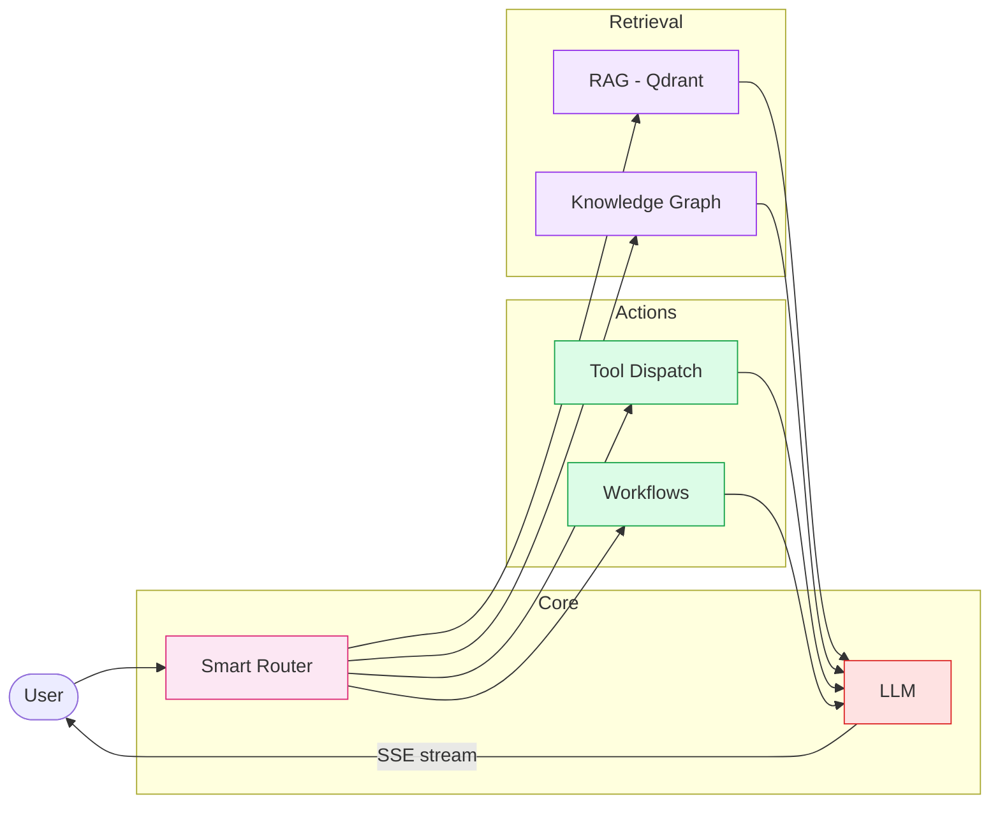
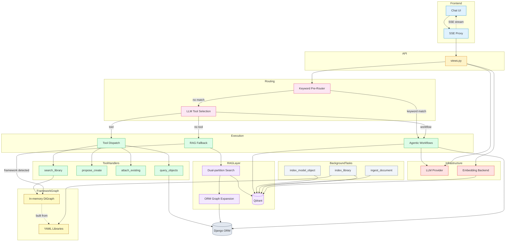
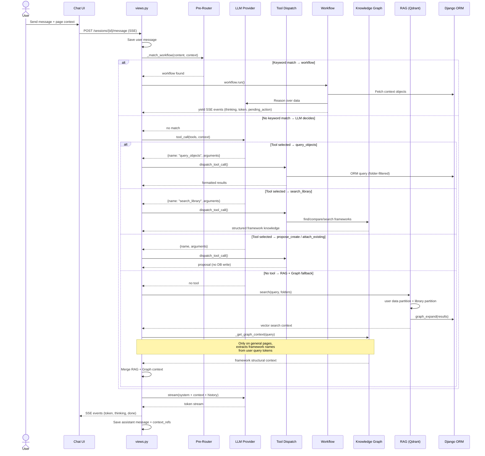
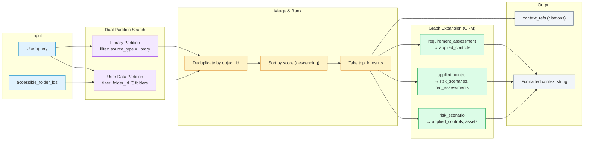
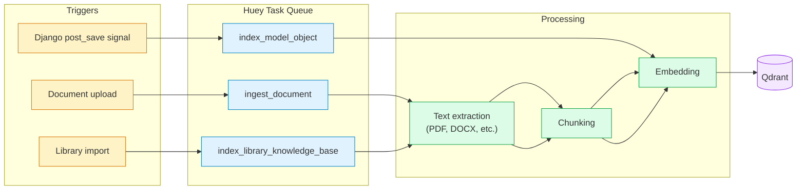

# CISO Assistant — AI Chat Architecture

## Executive Summary

The AI chat module is an embedded assistant that helps GRC practitioners navigate their security data, explore compliance frameworks, and take action — all through natural language. It is designed to run with **local LLMs** (Ollama) for data sovereignty, with optional OpenAI-compatible backends.



**Key concepts:**

| Block | What it does | Key constraint |
|-------|-------------|----------------|
| **Smart Router** | Decides *how* to answer: keyword pre-routing for reliability, LLM selection as fallback | Small local models are unreliable at tool selection — deterministic routing compensates |
| **RAG (Qdrant)** | Semantic similarity search across user data and library content | Two partitions: user data is RBAC-filtered, library content is shared |
| **Knowledge Graph** | Structural navigation of 150+ frameworks (sections, mappings, comparisons) | In-memory DiGraph (~60k nodes) — no external graph DB, built lazily from YAML |
| **Tool Dispatch** | ORM queries, creation/attachment proposals — always permission-filtered | Never auto-executes — emits proposals for user confirmation |
| **Agentic Workflows** | Multi-step reasoning (suggest controls, risk treatment, evidence guidance) | Context-aware: only available on relevant pages |
| **LLM** | Response generation with streamed output (token-by-token SSE) | Supports Ollama (local) and OpenAI-compatible backends |

**Design principles:**
- **Proposals, not actions** — The assistant never writes to the database directly. All mutations require explicit user confirmation.
- **RBAC everywhere** — Every query is filtered by the user's accessible folders. Library content is the only shared data.
- **Local-first** — Designed for on-premise LLMs via Ollama. No data leaves the network by default.
- **Graceful degradation** — If no LLM is available, RAG context is returned as-is. If no Qdrant, the graph still works.

---

## Detailed Architecture

### Layers & Components



---

## Request Flow



---

## File Map

| File | Purpose |
|------|---------|
| `views.py` | REST endpoints, message orchestration, SSE streaming, pre-routing |
| `providers.py` | LLM/embedding abstraction (Ollama, OpenAI-compat, sentence-transformers) |
| `tools.py` | Tool schemas, dispatch, MODEL_MAP, sanitization |
| `orm_query.py` | Permission-filtered ORM queries, pagination, formatting |
| `rag.py` | Qdrant vector search (dual-partition), graph expansion, context formatting |
| `knowledge_graph.py` | In-memory DiGraph from YAML libraries, framework queries |
| `page_context.py` | Parse SvelteKit URLs → `ParsedContext(model_key, object_id, page_type)` |
| `workflows/base.py` | Workflow base class, SSE event types, streaming helpers |
| `workflows/registry.py` | Lazy workflow loading, tool-name resolution |
| `workflows/*.py` | Individual workflows (suggest_controls, risk_treatment, evidence, ebios_rm) |
| `models.py` | ChatSession, ChatMessage, IndexedDocument |
| `serializers.py` | DRF serializers (read/write split) |
| `tasks.py` | Huey background tasks for Qdrant indexing |
| `urls.py` | Router registration |

---

## RAG Layer — Semantic Retrieval (`rag.py`)

### Purpose

Retrieve relevant context from the vector database using semantic similarity, then enrich results by traversing ORM relationships.

### Architecture



### Dual-Partition Search

User data and library knowledge live in the **same Qdrant collection** but are searched separately with independent queries:

| Partition | Filter | Scope |
|-----------|--------|-------|
| **User data** | `folder_id ∈ accessible_folder_ids` | Risk scenarios, applied controls, assets, etc. — RBAC-filtered |
| **Library** | `source_type = "library"` | Framework requirements, threats, reference controls — shared |

Results are merged, deduplicated by `object_id`, and sorted by score. This prevents framework content from drowning out user-specific results and vice versa.

### Graph Expansion

After the initial vector retrieval, `graph_expand()` traverses **one ORM hop** to enrich context with related objects:

| Starting object | Expanded relations |
|-----------------|--------------------|
| `risk_scenario` | `applied_controls`, `assets` |
| `applied_control` | `risk_scenarios`, `requirement_assessments` |
| `requirement_assessment` | `applied_controls` |

Only objects within the user's `accessible_folder_ids` are included. Expansion results are labeled as `source: "graph_expansion"` in context refs.

### Qdrant Point Schema

```json
{
  "text": "Human-readable description of the object",
  "folder_id": "uuid (null for library)",
  "source_type": "model | library | document",
  "object_type": "risk_scenario | framework | requirement_node | ...",
  "object_id": "uuid",
  "name": "Display name",
  "ref_id": "REF-001",
  "framework": "ISO 27001 (library points only)",
  "urn": "urn:intuitem:risk:... (library points only)"
}
```

### When RAG Is Used

RAG is the **fallback path** — it runs when neither a workflow nor a tool is selected:

1. The LLM is asked to select a tool
2. If it returns no tool, the message is treated as a general question
3. `rag.search()` retrieves semantically similar content
4. `rag.graph_expand()` enriches with ORM neighbors
5. On general pages (no `object_id`), knowledge graph context is also injected (see below)
6. The merged context is passed to the LLM for response generation

---

## Knowledge Graph Layer — Structural Framework Queries (`knowledge_graph.py`)

### Purpose

Provide deterministic structural navigation of the 150+ security frameworks. Flat vector search fails for queries like *"compare ISO 27001 and NIST CSF"* because cosine similarity treats all 60k entries as a flat bag — one framework's nodes flood the results. The graph gives O(1) structural lookups.

### Architecture

```mermaid
flowchart TB
    subgraph Source["Source Data"]
        YAML["150+ YAML library files\nbackend/library/libraries/*.yaml"]
    end

    subgraph Build["Build Phase - lazy, ~27s"]
        Parse["Parse all YAML files"]
        Nodes["Create nodes ~60k"]
        Edges["Create edges ~123k"]
    end

    subgraph Graph["In-Memory DiGraph - singleton, thread-safe"]
        FW["framework"]
        RN["requirement_node"]
        TH["threat"]
        RC["reference_control"]
    end

    subgraph Queries["Query Functions"]
        Q1["find_frameworks"]
        Q2["get_framework_detail"]
        Q3["compare_frameworks"]
        Q4["search_requirements"]
        Q5["find_mappings"]
        Q6["find_controls_for_threat"]
    end

    YAML --> Parse
    Parse --> Nodes --> FW
    Parse --> Edges --> FW
    Nodes --> RN
    Nodes --> TH
    Nodes --> RC

    FW -->|has_requirement| RN
    RN -->|parent_child| RN
    RN -->|addresses_threat| TH
    RN -->|implemented_by| RC
    FW -.->|has_mapping| FW
    RN -.->|maps_to| RN

    Graph --> Q1
    Graph --> Q2
    Graph --> Q3
    Graph --> Q4
    Graph --> Q5
    Graph --> Q6

    classDef source fill:#f1f5f9,stroke:#64748b
    classDef build fill:#fef3c7,stroke:#d97706
    classDef kg fill:#fef9c3,stroke:#a16207
    classDef query fill:#dcfce7,stroke:#16a34a

    class YAML source
    class Parse,Nodes,Edges build
    class FW,RN,TH,RC graph
    class Q1,Q2,Q3,Q4,Q5,Q6 query
```

### Custom DiGraph Implementation

A lightweight directed graph with zero external dependencies (NetworkX is incompatible with Python 3.14.1):

```
_nodes: dict[str, dict]       # node_id → attributes
_out:   dict[str, dict]       # src → {dst → edge_attrs}
_in:    dict[str, dict]       # dst → {src → edge_attrs}
```

All lookups are O(1). Thread-safe via a singleton `_graph_lock`. Built lazily on first `get_graph()` call.

### Node & Edge Schema

**Nodes** (keyed by URN):

| Type | Attributes | Example |
|------|-----------|---------|
| `framework` | `name`, `provider`, `locale`, `description`, `ref_id`, `urn` | ISO 27001:2022 |
| `requirement_node` | `name`, `description`, `ref_id`, `urn`, `framework_urn` | A.5.1 Information security policies |
| `threat` | `name`, `description`, `provider`, `ref_id`, `urn` | Phishing attack |
| `reference_control` | `name`, `description`, `provider`, `ref_id`, `urn` | Access control policy |

**Edges**:

| Type | From → To | Meaning |
|------|-----------|---------|
| `has_requirement` | framework → requirement_node | Framework contains this requirement |
| `parent_child` | requirement_node → requirement_node | Hierarchical nesting |
| `addresses_threat` | requirement_node → threat | Requirement mitigates this threat |
| `implemented_by` | requirement_node → reference_control | Requirement implemented by this control |
| `has_mapping` | framework → framework | Mapping exists between frameworks |
| `maps_to` | requirement_node → requirement_node | Cross-framework equivalence |

### Framework Resolution

`_resolve_framework()` does fuzzy matching in priority order:
1. Exact URN match
2. Exact `ref_id` match (case-insensitive)
3. Partial name match (case-insensitive substring)

### How the Graph Is Accessed

The knowledge graph is used in **two distinct paths**:

#### Path 1: `search_library` tool (explicit)

When the LLM selects `search_library`, the tool dispatcher calls the appropriate query function directly:

```
LLM selects search_library(action="compare_frameworks", framework="iso-27001", framework_b="nist-csf-2.0")
  → tools._dispatch_search_library()
    → knowledge_graph.compare_frameworks("iso-27001", "nist-csf-2.0")
      → formatted comparison text
```

This path is deterministic — the LLM picks the action, the graph does the lookup.

#### Path 2: RAG fallback augmentation (implicit)

When no tool is selected and the user's query mentions framework names, `_get_graph_context()` in `views.py` extracts framework names from the query tokens and injects framework detail into the RAG context:

```
User: "What is 3CF about?"
  → No tool selected → RAG fallback
  → _get_graph_context("What is 3CF about?")
    → detects "3CF" as a framework name
    → knowledge_graph.get_framework_detail("3CF")
    → injects structural detail alongside RAG results
```

This only runs on **general pages** (no `object_id` in context) to prevent polluting workflow-specific pages.

### Output Formatting

- Sections capped at **15** per framework detail
- Mappings capped at **50** per query
- `format_graph_result()` converts dicts/lists to readable text for LLM context

---

## RAG vs Knowledge Graph — When Each Is Used

| Scenario | RAG | Knowledge Graph | Why |
|----------|-----|-----------------|-----|
| "Show me my high-priority risks" | query_objects tool | — | User data query, no framework involved |
| "What is ISO 27001?" | fallback | implicit (augment) | Framework name detected, graph adds structure |
| "Compare 3CF and AirCyber" | — | explicit (search_library) | Structural comparison, RAG can't do this |
| "Find controls related to phishing" | — | explicit (search_library) | Reverse graph traversal |
| "What controls should I implement?" | — | — | Workflow (suggest_controls), uses ORM directly |
| "Tell me about my asset server-01" | fallback | — | User data, no framework reference |
| "How does NIST CSF map to ISO 27001?" | — | explicit (search_library) | Cross-framework mapping |
| Generic question, no framework mention | fallback | — | Pure semantic search |

---

## Core Design Decisions

### 1. Deterministic Pre-Routing

Small local LLMs (e.g., Mistral via Ollama) are unreliable at selecting the correct tool from 5+ options. Deterministic keyword matching bypasses LLM tool selection for high-confidence workflow matches:

```
(model_key=requirement_assessment, keywords=["control", "comply"]) → suggest_controls
(model_key=risk_scenario, keywords=["treat", "mitigat"])           → risk_treatment
(model_key=applied_control, keywords=["evidence", "proof"])        → evidence_guidance
```

The LLM is only consulted when no keyword match is found.

### 2. Proposal Pattern (Never Auto-Execute)

All creation and attachment actions emit **proposals** as `pending_action` SSE events. The frontend renders confirmation cards. The user must explicitly accept before any database write occurs. This prevents the LLM from making irreversible changes.

### 3. Context-Aware Scoping

`page_context` from the frontend URL determines:
- Which workflows are available
- How ORM queries are scoped (auto-filter to parent object)
- Whether graph context is injected (only on general pages, not detail/edit)
- What auto-attach suggestions to generate

---

## Configuration

### Environment Variables

| Variable | Default | Purpose |
|----------|---------|---------|
| `QDRANT_URL` | `http://localhost:6333` | Vector database endpoint |

### Global Settings (Django admin → General Settings)

| Setting | Options | Purpose |
|---------|---------|---------|
| `llm_provider` | `ollama`, `openai_compatible` | LLM backend |
| `ollama_base_url` | `http://localhost:11434` | Ollama server URL |
| `ollama_model` | e.g. `mistral` | Model for generation |
| `ollama_embed_model` | e.g. `nomic-embed-text` | Model for embeddings |
| `openai_api_base` | — | OpenAI-compatible API URL |
| `openai_model` | — | Model name |
| `embedding_backend` | `ollama`, `sentence-transformers` | Embedding strategy |
| `chat_system_prompt` | — | Custom system prompt override |

---

## Indexing Pipeline



---

## SSE Event Protocol

Events streamed from `POST /sessions/{id}/message`:

| Event | Data | Purpose |
|-------|------|---------|
| `token` | `{"content": "..."}` | LLM response text chunk |
| `thinking` | `{"content": "..."}` | LLM reasoning (collapsible in UI) |
| `pending_action` | `{"action_type": "create\|attach", ...}` | Confirmation card for user |
| `done` | `{"context_refs": [...]}` | End of stream with citations |
| `error` | `{"message": "..."}` | Error message |

---

## Known Limitations & Pending Work

1. **Control search broadness** — The suggest_controls workflow returns the same ~20 controls regardless of the requirement. Needs better scoping or re-ranking.
2. **EBIOS RM workshop workflows** — Individual refinement workflows for each EBIOS RM workshop step are not yet built.
3. **LLM tool selection reliability** — Small local models still occasionally select the wrong tool. Pre-routing covers the most common cases but not all.
4. **Graph rebuild latency** — Building the knowledge graph from YAML takes ~27s. Acceptable at startup but blocks the first query if not pre-warmed.
