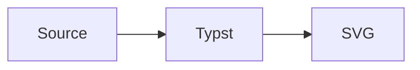

# merman

Render Mermaid diagrams in Typst with the `merman` Rust renderer.

`merman` embeds a WebAssembly plugin so Typst documents can render Mermaid diagrams directly during compilation while reusing the parser, layout, and SVG renderer from the broader `merman` project. This README documents the `0.3.0` package and requires Typst `0.15.0` or newer.

## Quick Start

Import `mermaid` and pass a Mermaid source string:

```typst
#import "@preview/merman:0.3.0": mermaid

#mermaid("
flowchart TD
  A[Write Mermaid] --> B[Render with merman]
  B --> C[Embed SVG in Typst]
")
```

## Version Mapping

| Typst package | merman source version | Typst plugin ABI | Notes |
| --- | --- | --- | --- |
| `0.3.0` | `0.8.0-alpha.6` | `2` | Size-optimized WASM package; requires Typst `0.15.0` or newer. |
| `0.2.0` | `0.8.0-alpha.6` | `2` | Requires Typst `0.15.0` or newer. |
| `0.1.0` | `0.8.0-alpha.1` | `1` | Previous package API. |

The Typst package version tracks the `@preview/merman` wrapper API. The merman source version is the Rust workspace version used to build the package. The Typst plugin ABI tracks the WebAssembly export names and byte payload contracts; wrapper-only API breaks do not require an ABI bump when that plugin surface stays stable. Render option JSON follows shared binding options schema `2`, including `presentation` for first-party profiles and host themes, `layout` for geometry, and `environment` for text measurement and math rendering. This options schema is independent from Typst plugin ABI 2 and native ABI 3.

The API and example sections below describe the `0.3.0` package.

Version `0.3.0` rebuilds the plugin after removing ICU4X collation data and generated font-metric tables from the production WebAssembly closure. Layout still uses the deterministic Unicode-aware measurement provider, and the host text-measurement callback seam remains available to transports that can provide one. The Typst plugin ABI remains `2`; this release changes the packaged implementation closure, not the exported protocol.

## Examples

- [basic.typ](examples/basic.typ): minimal `#mermaid(...)` usage.
- [document-context.typ](examples/document-context.typ): opt-in document typography and width bridging.
- [elk.typ](examples/elk.typ): Mermaid's `layout: elk` frontmatter and the bundled ELK backend.
- [profile.typ](examples/profile.typ): reusable renderer settings shared by direct calls and raw blocks.
- [figure.typ](examples/figure.typ): Mermaid diagrams wrapped as Typst figures with reusable layout defaults.
- [raw-block.typ](examples/raw-block.typ): document-wide Mermaid fences with `show-mermaid-blocks`.
- [options.typ](examples/options.typ): themes, stable IDs, `mermaid-result`, SVG export, and placeholder errors.
- [print.typ](examples/print.typ): print-friendly white-background output.
- [presentation.typ](examples/presentation.typ): dark slide-sized output.
- [svg-export.typ](examples/svg-export.typ): raw SVG and structured render payloads.

Package fixtures are grouped by behavior family under `distribution/typst/merman/tests` in the Merman source repository. They cover API, render environments, context, errors, figures, raw blocks, README examples, historical issues, and visual smoke coverage; test fixtures are not included in the published Typst package.

## ELK Layout

The `0.3.0` publish profile includes Mermaid's ELK layout backend. Select it in Mermaid source with frontmatter:

```typst
#mermaid("---\nconfig:\n  layout: elk\n---\nflowchart LR\n  Source --> Layout\n  Layout --> SVG\n")
```

ELK is an embedded, modified Rust translation of Eclipse ELK. The wrapper and Merman-authored code remain under `MIT OR Apache-2.0`; the ELK-derived portion is under `EPL-2.0`. This is a component-level license boundary, not a relicensing of the whole package. When redistributing the package or a derivative artifact, preserve `THIRD_PARTY_NOTICES.md` and the matching files under `THIRD_PARTY_LICENSES/`.

## Document Fonts

`mermaid(...)` is explicit-only by default. It does not automatically inherit the surrounding Typst font, text size, or container width.

Pass `document-context: true` to content-rendering APIs when you want opt-in document context bridging. This forwards the current Typst text font, text size, and available width as renderer options unless you override them directly.

```typst
#mermaid(source, document-context: true, width: 100%)

#show raw.where(lang: "mermaid"): show-mermaid-blocks(
  document-context: true,
  width: 100%,
)
```

You can also pass typography intent explicitly:

```typst
#mermaid(
  source,
  typography: (
    font: ("Source Sans 3", "Arial", "sans-serif"),
    size: "16px",
  ),
)
```

The typography size accepts CSS `px` strings, absolute Typst lengths, or numeric CSS pixels. Typst lengths are converted through the SVG 96-DPI coordinate system (`72pt == 96px`) so layout measurement and CSS presentation use the same pixel value. Typst font descriptors are projected to their ordered family names; descriptor `covers` constraints have no CSS or deterministic-measurer equivalent and are therefore not preserved.

This changes the SVG style intent sent to the headless renderer. It does not mean the Typst plugin measured the exact Typst font file. The plugin has no synchronous font-measurement host import and therefore advertises and uses only the built-in `deterministic` provider. Browser-style host callbacks and Typst font-asset measurement are not available through this transport.

Check the compiled plugin capability surface with:

```typst
#let capabilities = merman-capabilities()
#capabilities.capabilities.text_measurement
```

## Profiles

Use `mermaid-profile(...)` for reusable diagram settings:

```typst
#let diagrams = mermaid-profile(
  typography: (
    font: ("Source Sans 3", "Arial", "sans-serif"),
    size: "16px",
  ),
  background: "#ffffff",
  theme-name: "base",
  figure: (
    placement: bottom,
    scope: "parent",
    caption-position: top,
    gap: 1em,
    outlined: false,
  ),
)

#mermaid(source, profile: diagrams, width: 100%)
#mermaid-figure(source, profile: diagrams, caption: [System flow], width: 100%)
```

Profiles work with `mermaid(...)`, `mermaid-figure(...)`, `mermaid-svg(...)`, `mermaid-result(...)`, `analyze-mermaid(...)`, and raw-block show rules. The optional `figure` section is consumed only by `mermaid-figure(...)`; it does not change raw SVG rendering or non-figure image calls.

For normal documents, start with `width`, `theme-name`, `theme`, `background`, `typography`, `document-context`, and reusable `profile` values. Lower-level renderer fields remain available when you need parity debugging or deterministic fixture control, but they are not the main authoring path.

`base-theme` is a lower-priority compatibility alias for `theme-name`; prefer `theme-name` in new documents. When both are supplied, `theme-name` wins.

Raw `options` always wins. Without it, precedence is field-specific and deterministic:

- site config: profile full object, profile theme shorthands, direct full object, direct theme shorthands;
- environment: profile full object, profile measurement/math shorthands, direct full object, direct measurement/math shorthands;
- host theme: document context, profile typography, profile host theme, direct typography, direct host theme;
- layout: profile layout followed by container shorthands, unless a direct full `layout` object is present, in which case that object replaces the layout shorthands;
- scalar fields: direct value, profile value, package or renderer default.

Theme shorthands replace the `theme` or `themeVariables` field at their layer; they do not deep-merge individual theme-variable keys.

A direct `site-config` object replaces the profile `site-config` object; use the direct `theme-name` and `theme` shorthands when you want the documented theme-layer precedence instead of replacing the full object.

A profile that contains raw `options` is an opaque binding-options bundle: it bypasses the profile and call-site shorthands. Pass a direct raw `options` dictionary to replace that bundle, or use the structured profile fields when you want field-level overrides.

## Raw Blocks

Use `show-mermaid-blocks` with Typst's `raw.where` selector:

````typst
#import "@preview/merman:0.3.0": show-mermaid-blocks

#show raw.where(lang: "mermaid"): show-mermaid-blocks(width: 100%)


````

Raw-block show rules default to `error-mode: "placeholder"`, so one invalid fence stays visible as a marked block instead of aborting the whole document. Pass `error-mode: "panic"` when a document-wide rule must fail the compile on the first render error.

Avoid setting a fixed `id` in a document-wide raw-block show rule unless the document has only one Mermaid block; otherwise multiple diagrams will share the same SVG id.

For document-context-aware rendering, pass `document-context: true`. This reads the current Typst text font, text size, and container width inside `context`, then forwards them to the renderer.

```typst
#import "@preview/merman:0.3.0": show-mermaid-blocks

#show raw.where(lang: "mermaid"): show-mermaid-blocks(
  document-context: true,
  width: 100%,
)
```

## API Migration

This refactor intentionally removes compatibility-only context wrappers:

```typst
// Old:
#mermaid-context(source, width: 100%)
#show raw.where(lang: "mermaid"): show-mermaid-blocks-context(width: 100%)

// New:
#mermaid(source, document-context: true, width: 100%)
#show raw.where(lang: "mermaid"): show-mermaid-blocks(
  document-context: true,
  width: 100%,
)
```

`context` is a Typst keyword, so the public parameter is named `document-context`.

The current development package also moves measurement and math selection to the binding options schema `2` render environment:

```typst
#mermaid(source, text-measurement: "deterministic", math-renderer: "none")
#mermaid(
  source,
  environment: (
    text_measurement: "deterministic",
    math_renderer: "none",
  ),
)
```

The removed layout fields are rejected; they are not translated through a compatibility path.

## API

### `mermaid(source, ..)`

Renders a Mermaid string or raw block as an SVG image.

Common parameters:

- `width`, `height`, `fit`, `alt`: forwarded to Typst's `image`.
- `scale`: wraps the rendered image with Typst `scale`; accepts ratios such as `120%` or numbers such as `1.2`.
- `document-context`: `false` by default. Set to `true` to inherit Typst text font, text size, and finite available width for image rendering. An auto-width page reports an infinite outer width, so Merman keeps its renderer default instead of serializing infinity.
- `profile`: reusable options produced by `mermaid-profile(...)`.
- `typography`: high-level font and size intent, merged into the Typst host theme and projected to `presentation.theme`.
- `presentation-profile`: first-party Merman presentation profile ID, such as `"merman-modern"`. This is independent from Mermaid themes and SVG output policy.
- `id`: stable SVG root id. `diagram-id` is the lower-level binding name; direct values override profile values, and `diagram-id` overrides `id` at the same call layer.
- `background`: SVG root background color, mapped to `svg.root_background_color`.
- `theme-name`: Mermaid theme name, such as `"base"` or `"dark"`.
- `theme`: Mermaid `themeVariables`.
- `error-mode`: `"panic"` by default. Use `"placeholder"` or `"text"` to show diagram errors in the document instead of failing the Typst compile. These modes handle structured errors returned by `merman`; missing wasm files, Typst plugin loading failures, invalid `error-mode` values, and SVG image decoding failures still fail the Typst compile.

This entry point is explicit-only unless `document-context: true` is set.

Advanced renderer parameters:

- `pipeline`: `"resvg-safe"` by default for embedded Typst images. Use `"parity"` when you need Mermaid-like SVG DOM output, or `"readable"` for inline SVG inspection.
- `site-config`: full Mermaid site config object.
- `host-theme`: lower-level, already-normalized values projected to `presentation.theme`. Use stable semantic role IDs such as `"actor-background"`; this is independent from `theme-name`/`theme`, which configure Mermaid itself.
- `layout`: full binding layout object for container geometry. This overrides the container shorthands.
- `container-width`, `container-height`: shorthands for `layout.container_width` and `layout.container_height`.
- `environment`: full binding render-environment object. Use `text_measurement` and `math_renderer` fields when composing options directly.
- `text-measurement`, `math-renderer`: shorthands for `environment.text_measurement` and `environment.math_renderer`. Direct values override `environment`, which overrides profile environment values.
- `scoped-css`, `css-override-policy`, `drop-native-duplicate-fallbacks`: SVG post-processing shorthands.
  The package keeps `scoped-css` unopinionated by default: Merman resolves fallback typography
  from the original SVG/XHTML context before removing `foreignObject`, so ClassDiagram labels do
  not need a hidden global 16px override. If a document deliberately wants a host-specific paint
  policy, pass an explicit `scoped-css` string. Selectors matching the original SVG/XHTML context
  can affect fallback measurement; selectors matching the generated
  `.merman-foreignobject-fallback-text` marker are post-fallback paint hooks and cannot recompute
  wrapping or placement. CSS injected after fallback can therefore change painted font metrics but
  must not be treated as a new measurement pass.
- `fixed-today`, `fixed-local-offset-minutes`: deterministic date controls for date-sensitive diagrams.
- `options`: escape hatch; when present, it supplies the Rust binding options and overrides shorthand parameters. The plugin reserves the constrained `resources` ceiling; documents may provide stricter limits, while looser profiles or overrides return a structured options error.

Use `typography` for Typst-facing font intent: it accepts Typst font descriptors, absolute Typst lengths, and numeric or string CSS pixels. `host-theme` is the lower-level binding-shaped escape hatch; pass normalized `font_family`, `font_size`, and semantic role values there instead of raw Typst font descriptors or lengths.

### `mermaid-profile(..)`

Returns a reusable Typst settings dictionary. `profile` refers to this wrapper-level bundle, while `presentation-profile` selects a first-party Merman presentation profile. Profiles normalize into the same binding options used by direct parameters, so they do not create a second rendering path.

### `mermaid-figure(source, ..)`

Renders a Mermaid diagram and wraps it in a Typst `figure`.

Use `document-context: true` when the figure should opt into the same document-context bridge as `mermaid(...)`.

Figure layout parameters are forwarded to Typst's native `figure`: `placement`, `scope`, `supplement`, `numbering`, `gap`, and `outlined`. Use `caption-position` and `caption-separator` when you need a top caption or document-specific caption separator. Direct figure parameters override `profile.figure` defaults.

### `mermaid-svg(source, ..)`

Returns the rendered SVG as a string instead of embedding it as an image.

This value-returning API does not enter Typst `context`; pass `typography`, `host-theme`, `layout`, or `container-width` explicitly when exporting SVG text. Rendering failures panic; use `mermaid-result(...)` when the document needs programmatic error handling.

### `mermaid-result(source, ..)`

Returns a structured render payload:

```typst
#let result = mermaid-result("flowchart TD\nA --> B")
#if result.ok {
  result.svg
} else {
  result.message
}
```

The result also includes `operation`, `kind`, and `capability_id`. On failure, these fields let callers distinguish a missing compiled capability from invalid input or a general render error without parsing `message`.
Resource-limit failures additionally expose `details.resource` with the stable limit id, profile, and actual/max values.

### `analyze-mermaid(source, ..)`

Returns the canonical analysis schema 1 payload produced by the Rust bindings:

```typst
#let analysis = analyze-mermaid("flowchart TD\nA --> B")
#analysis.version
#analysis.valid
#analysis.summary.errors
#analysis.diagnostics
```

Invalid Mermaid source remains a schema-1 analysis payload with `valid: false`; transport, options, and missing-capability failures use the structured operation envelope instead.

### `merman-capabilities()`

Returns the compiled plugin capability payload, including the current text measurement boundary:

```typst
#let capabilities = merman-capabilities()
#capabilities.capabilities.text_measurement.provider_ids
```

The flat catalog reports the artifact's current capability, output, operation, registry, and resource sets. The plugin independently applies a fixed constrained resource ceiling to every render and analysis operation. Raw binding options may tighten individual resource limits but cannot loosen or silently replace that transport-owned policy. The options root and any `analysis` or `merman` wrapper must be JSON objects; malformed wrapper values return a structured options error before rendering or analysis begins.

### `show-mermaid-blocks(..)`

Returns a raw block show handler. This is the shortest way to enable Mermaid fences across a Typst document:

```typst
#show raw.where(lang: "mermaid"): show-mermaid-blocks(width: 100%)
```

## Development

The Typst package uses its own version track and is not locked to the Rust crate version. The embedded WebAssembly plugin also has a separate ABI version, documented in the Version Mapping table, for exported function and payload compatibility.

Build the publish Typst package locally:

```sh
cargo run --locked -p xtask -- build-typst-package --profile publish
```

The release build requires `wasm-tools` and Binaryen `wasm-opt version 131`. The package builder applies a pinned `wasm-opt -Oz` pass before stripping custom sections and records both tool versions in the artifact manifest.

The package is written to:

```sh
dist/typst/merman/0.3.0
```

The source package carries the examples shown above so they remain readable in the package review. `typst.toml` excludes `examples/**` from the runtime download; tests stay in the Merman source repository and are not bundled.

For a manual local install, copy that directory to `<package-root>/preview/merman/0.3.0` and pass the parent directory to Typst:

```text
<package-root>/preview/merman/0.3.0/typst.toml
<package-root>/preview/merman/0.3.0/lib.typ
<package-root>/preview/merman/0.3.0/merman_typst_plugin.wasm
```

```sh
typst compile --package-path <package-root> document.typ
```

The `typst-package-smoke` command creates this preview layout automatically in a temporary directory.

For local `@preview` smoke tests, copy the built package under a preview namespace package path and compile with `--package-path`:

```sh
cargo run --locked -p xtask -- typst-package-smoke --profile publish --skip-wasm-build
```

Use an explicit Typst binary when the CLI is downloaded outside `PATH`:

```sh
cargo run --locked -p xtask -- typst-package-smoke --profile publish --skip-wasm-build --typst /path/to/typst
```

Each smoke run owns an independent temporary directory under `target/typst-package-smoke/`. Positive fixtures preserve their nested output paths, and `tests/compile-fail/` fixtures must fail with the diagnostic declared by their adjacent `.error.txt` file. Successful runs remove their artifacts by default; pass `--keep-artifacts` to retain the run directory for inspection.

The build verifies artifact-recipe provenance from its private build directory, then stages only the
runtime wrapper, WASM, examples, and legal materials. The transaction snapshots source bytes,
verifies the complete file shape and contents, and rechecks live source identity immediately before
atomically replacing the version directory; build receipts are not included in the published package.

The sole package profile, `publish`, enables SVG rendering, analysis, the complete Mermaid language catalog, and the Cytoscape and ELK layout backends. There are no alternate bridge-only or SVG-only package profiles. ASCII, PNG, JPEG, and PDF are not compiled because this wrapper exposes no operation for those outputs. Maintainer experiments use direct Cargo features and do not create another package identity or release recipe.

## Current Limits

- Output is SVG embedded through Typst `image`; diagrams are not Typst-native vector elements.
- Font family and size can be forwarded as style intent, but exact Typst font glyph measurement is not automatic.
- RaTeX math rendering is not available in the Typst plugin. Its current upstream closure depends on browser system-font discovery; the capability will remain closed until a zero-browser-import implementation passes admission.
- Browser-only Mermaid interactions such as script callbacks and popup behavior are not expected to work in static Typst output.
- The package is smoke-tested with Typst 0.15.0. Typst 0.15 HTML export remains experimental and is not a package promise here.
- The `readable` and `parity` pipelines can embed SVG structures that Typst warns about; `resvg-safe` is the intended embedded-image path for package output.

## License

The wrapper and Merman-authored code are available under either MIT or Apache-2.0. The embedded ELK-derived implementation is a separate component under EPL-2.0; it does not relicense the rest of the package. `THIRD_PARTY_NOTICES.md` records the exact source revision, relationship, and scope for ELK and the other embedded or translated components, while `THIRD_PARTY_LICENSES/` contains their applicable legal files. Preserve these materials when redistributing the package or a derivative artifact.

The machine-readable Cargo dependency report remains in the source repository's release evidence instead of being duplicated in the downloaded Typst package.
