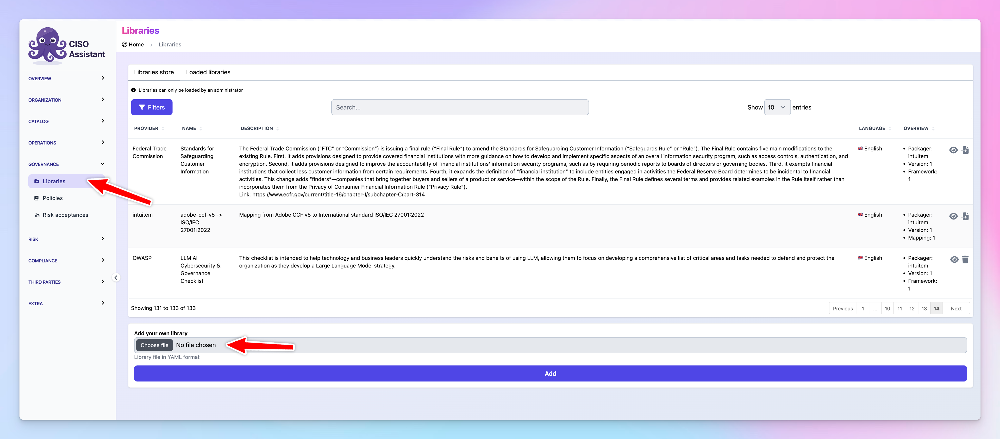
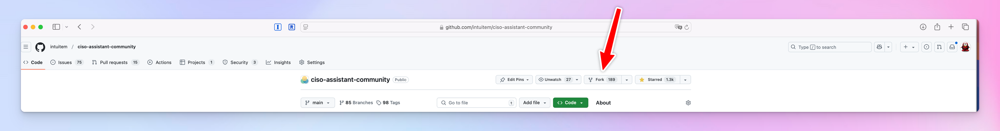
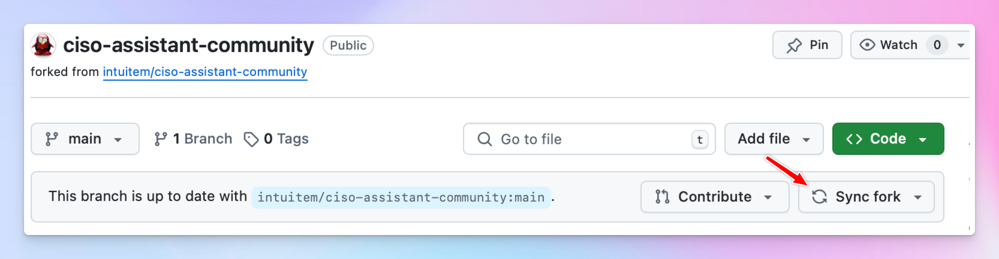
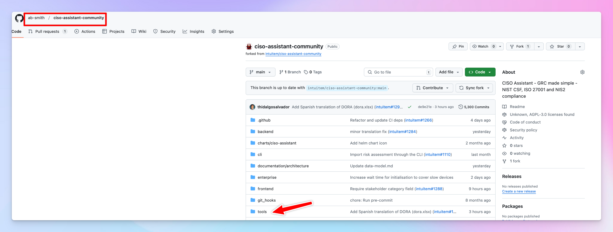
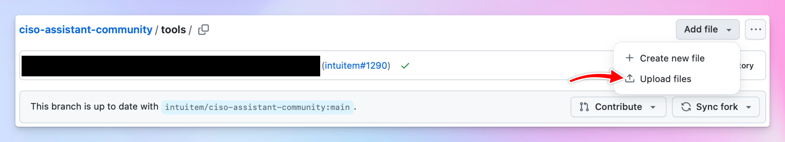
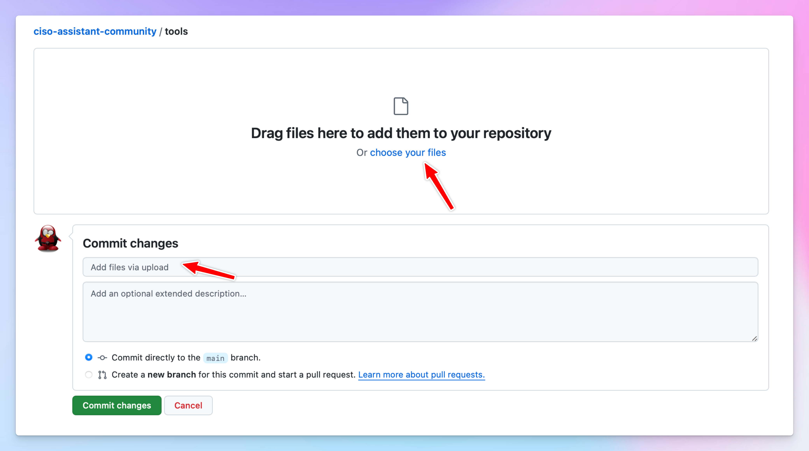
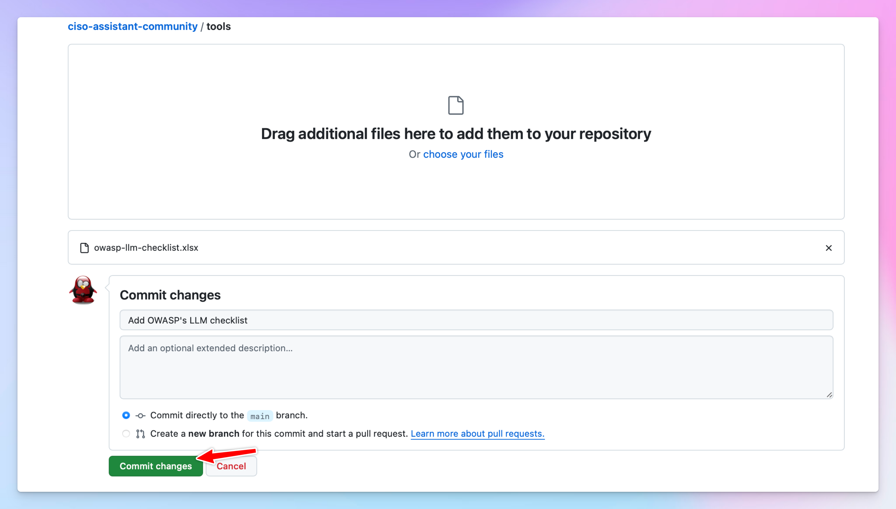
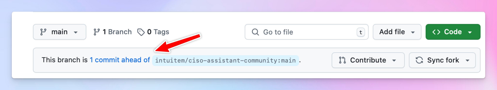
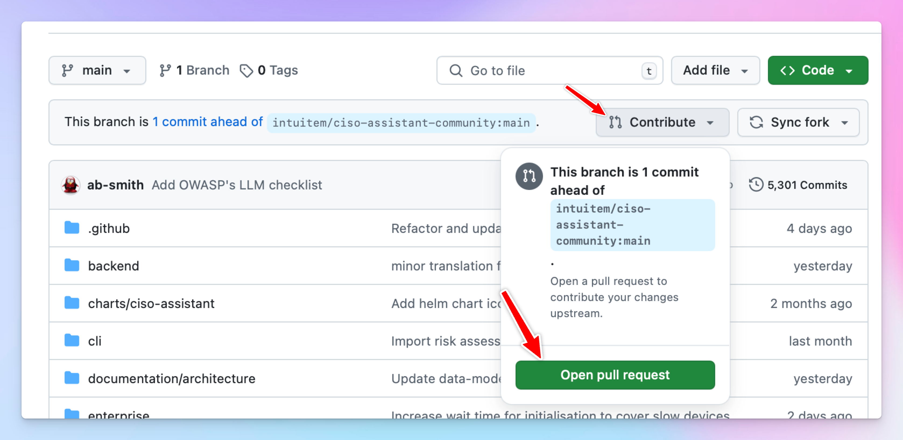
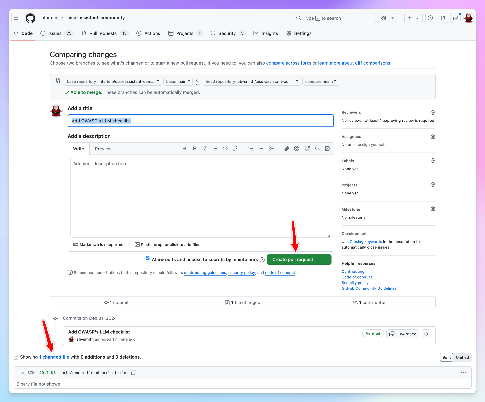

# Submit a library (Framework)

**If you are familiar with Github and Git, the submission is pretty straightforward:**

* fork the git repo and make sure it's sync-ed up
* add the excel sheet under the `tools` folder,
* &#x20;you can also add the generated yaml (assuming you have tested it) under `backend/library/libraries`&#x20;
* open a pull request and make sure you accept the CLA

and we'll take it from there :thumbsup:

**If you're not familiar with Github and the handling Git, you can follow these simplified steps using just the UI :**\

* create your excel sheet based on one of the samples in `tools` folder
* convert it to yaml using the `convert_library.py` tool

<figure><figcaption></figcaption></figure>

* Test it to make sure it can be parsed by the app and matches what you are expecting

<figure><figcaption></figcaption></figure>

<figure><figcaption></figcaption></figure>

* sign up on github to create an account and head to ciso assistant repository
* create your fork of the repository

<figure><figcaption></figcaption></figure>

<figure><figcaption></figcaption></figure>

* if it's not your first time, make sure your fork is up to date

<figure><figcaption></figcaption></figure>

* go to the `tools` folder

<figure><figcaption></figcaption></figure>

* click `Add file` and click `Upload files`&#x20;

<figure><figcaption></figcaption></figure>

* drag and drop the excel file you've prepared or pull it from your filesystem.
* add a commit message, something like "Submitting framework x"&#x20;

<figure><figcaption></figcaption></figure>

* commit the changes

<figure><figcaption></figcaption></figure>

* if everything went well, you should see a message indicating that you're 1 commit ahead.

<figure><figcaption></figcaption></figure>

* Optional: you can repeat this process to add the yaml file as well but on the `backend/library/libraries/` folder instead.
* You can now open the pull request:

<figure><figcaption></figcaption></figure>

<figure><figcaption></figcaption></figure>

There are of course other ways to achieve this in a much cleaner approach, but this is intended for a beginer discovering git and GitHub :wink:
