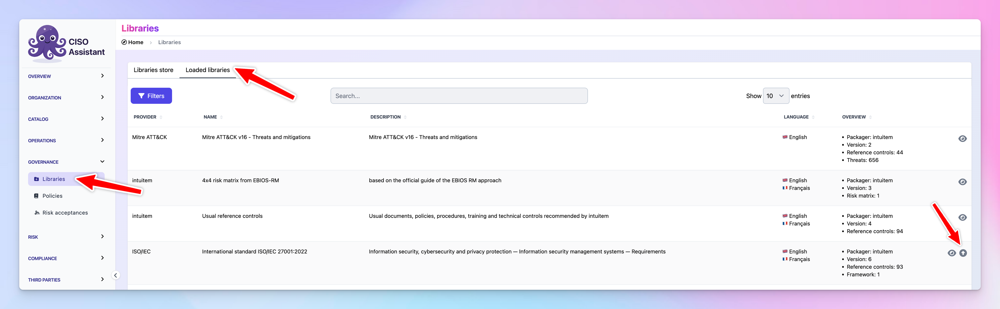

# Upgrading a library

In you've updated your instance and didn't see the changes on a loaded library, you can do the following to refresh the library to the latest version:

<figure><figcaption></figcaption></figure>

This also applies to custom framework as long as you respect the incremental step of the library's version.
