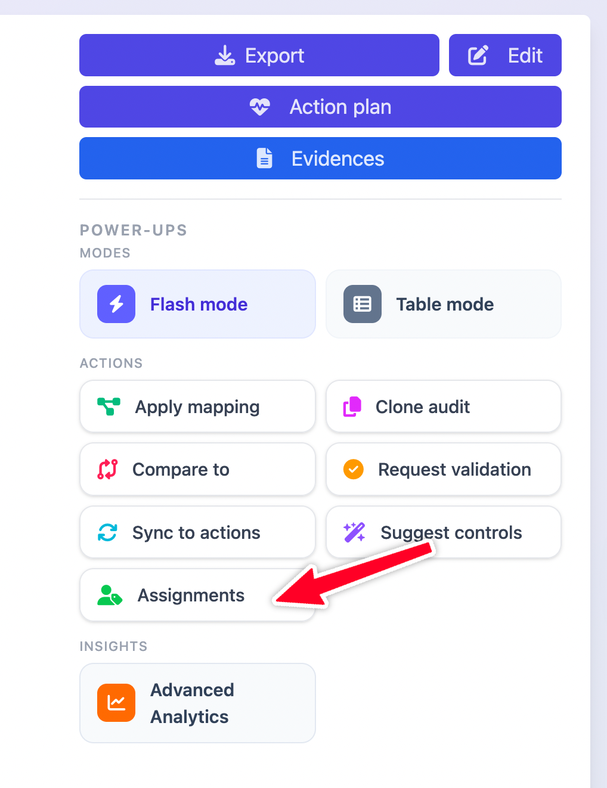

# Assignments / respondent mode

This feature is intended for organisations who wish to rely on a single audit where multiple users or teams will collaborate by responding to their specific sections (one or multiple requirements).

The feature flag can be enabled from Extra/Settings/Feature flags:

<figure><figcaption></figcaption></figure>

Once the feature flag is enabled, the design is as follows:

* an analyst (or higher role) starts an audit
* through the assignment management, we assign a group of requirements to one or multiple users or teams
* the assignments can be made to a user or a team, over one or multiple requirements\
  \
  

<figure><figcaption></figcaption></figure>

* the assignees need just the `respondent` role on the domain to interact with their assigned sections, and they can do that directly from the respondent view

<figure><figcaption></figcaption></figure>

* when `respondent` users sign it, they get automatically redirected to the dedicated page. Users can find it later on the side nav bar

<figure><figcaption></figcaption></figure>

* Users will see their assigned sections of all the audits organised by domains and they can interact with it by answering the compliance status, attaching applied controls or evidences directly.
* Keep in mind that `respondent` can create, pick or update applied controls or evidences of the domains, to encourage reusability.

<figure><figcaption></figcaption></figure>

### Workflow

The intereaction between the auditor and respondents follows these steps:\
 

<figure><figcaption></figcaption></figure>

The default state is `draft` and you can set them and send feedbacks individually:\
&#x20;&#x20;

<figure><figcaption></figcaption></figure>

For review, if the auditors don't have the permissions to update the requirements compliance result, which will be the general case to keep consistent inputs from the respondent side, they can interact with comments on each one:\
 

<figure><figcaption></figcaption></figure>
