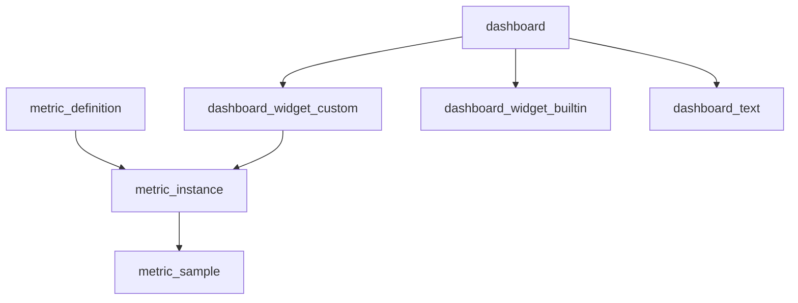

# Metrics

### Expected outcome

* define your metrics or import their definition
* instantiate them on your domains
* feed data to your metric instances
* create dashboards with builtin and custom metrics

### Key concepts

***

## Metric definitions

Consider metric definition as a template of your metric. It serves as the guideline of the actual metric instance that you will track accross your domains.

### Importing definitions

#### 1. Introduction

You will learn how to import off-the-shelf metrics definitions on CISO Assistant.

#### 2. Open Metric Definitions

Click "Metric definitions".

#### 3. Click import

Click here to proceed to the next menu.

#### 4. Import the library matching your criteria

You can also preview the content before importing it.

#### 5. Return to Metric Definitions

Click "Metric definitions" to revisit the main metrics page.

#### 6. Look for the metric definition you want

Click "Search..." to begin finding specific metrics.

#### 7. Select The Specific Metric

You can now instantiate this metric as you see fit for your domains.

You can now instantiate this metric as needed across your domains. Keep in mind that you can also create your own metric definition directly without going through the library.

### Creating a definition

Metrics can be quantitative (number with unit) or qualitative (choices):

<figure><figcaption>
Quantitative metric
</figcaption></figure>

You can add your options during declaration or afterward:

<figure><figcaption>
Qualitative metric
</figcaption></figure>

The "higher is better" setting is used to indicate if the trend is a good thing or not.

***

## Metric instance

The metric instance is the projection of the definition to a specific domain and it's _what you'll be tracking_.&#x20;

<figure><figcaption></figcaption></figure>

Parameters:

* Metric definition (it will inherit its settings)
* Domain: the scope of this metric
* Status: lifecycle of the metric. The stale is specially interesting as the application will auto-toggle it according to the data freshness
* Collection frequency: expected collection frequency, on which we add a grace period before toggling the metric to stale status
* Target value: expected target of this metric for this specific domain. This is handy as you can have different targets of the same metric definition according to the domain.
* Assigned to: owner of the metric instance and its update.

## Metric sample

This is the actual data of the metric instance on a given timestamp.&#x20;

<figure><figcaption></figcaption></figure>

Keep in mind that you can add the data manually or through all the supported integrations (API, n8n, etc.). Note that data cannot be in the future.

<figure><figcaption></figcaption></figure>

## Dashboards

Dashboards are the visual representation of the metrics and support:

* custom metrics instance (multiple charts)
* built-in metrics (multiple charts)
* markdown text widget

<figure><figcaption></figcaption></figure>

In edit mode, you can add different widgets, place and resize them as you see fit:

 

<figure><figcaption></figcaption></figure>

Once done, you can go back to view mode to see the result:

<figure><figcaption></figcaption></figure>

In addition to the custom metrics for your internal KPI and KRI, you can also include some of the built-in metrics tracked by the platform:\
\
.png>)

Those are updated on each change of your data and tracked as daily metrics.
