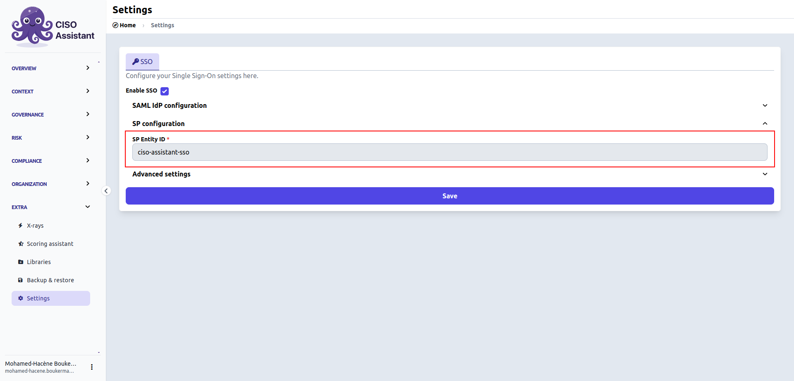
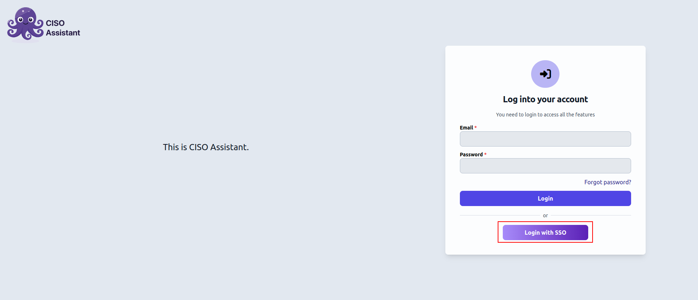

# SSO

[How to configure CISO Assistant](./#configure-ciso-assistant)

### Providers

* [Microsoft Entra ID](microsoft-entra-id.md)
* [Okta](okta.md)
* [Keycloak](keycloak.md)
* [Google Workplace](google-workplace.md)

### Configure CISO Assistant with SAML

Once you've retrieved the **IdP Entity ID,** the **Metadata URL** and the **Entity ID** from your provider (see the [list of providers](./#list-of-provider) for specific details), the configuration on CISO Assistant is pretty simple.

1.  Log in into CISO Assistant as an **administrator > Extra > Settings**\

    <figure><figcaption></figcaption></figure>
2.  **Enable SSO**

    <figure><figcaption></figcaption></figure>
3.  Enter the <mark style="color:purple;">**Idp Entity ID**</mark>\

    <figure><figcaption></figcaption></figure>
4.  Choose the option 1 or 2 depending of your provider and fill <mark style="color:purple;">**Metadata URL**</mark> or <mark style="color:purple;">**SSO URL**</mark>, <mark style="color:purple;">**SLO URL**</mark>, <mark style="color:purple;">**x509 certificate**</mark> retrieved from your provider\

    <figure><figcaption></figcaption></figure>
5.  Check that the <mark style="color:purple;">**SP Entity ID**</mark> is similar to the **Entity/Client ID** specified on your provider\

    <figure><figcaption></figcaption></figure>
6. And that's it ! Don't forget to save changes
7.  You should now be able to see the **Login with SSO** button\

    <figure><figcaption></figcaption></figure>


<mark style="color:orange;">Be aware that the user needs to be created on CISO Assistant to be authenticated with SSO.</mark>

