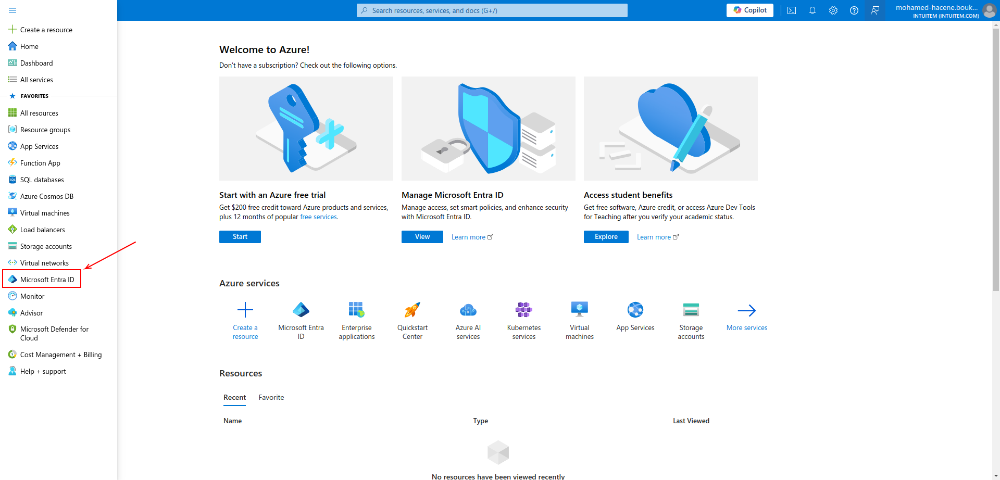
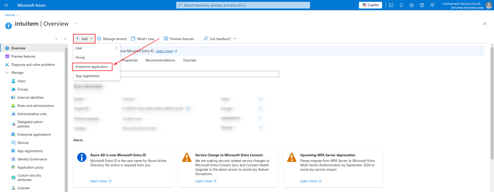
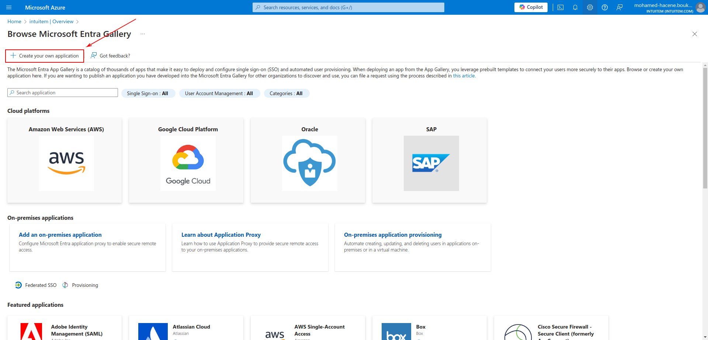
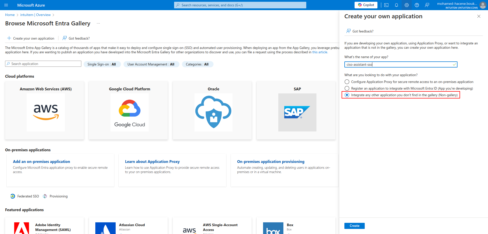
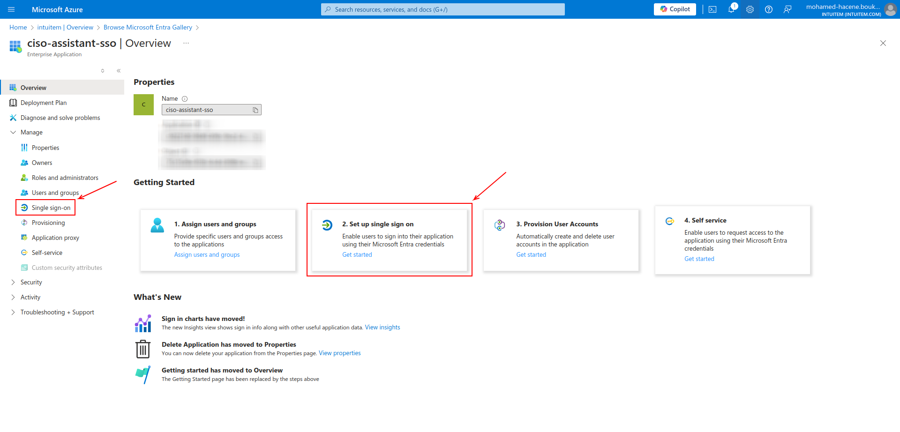
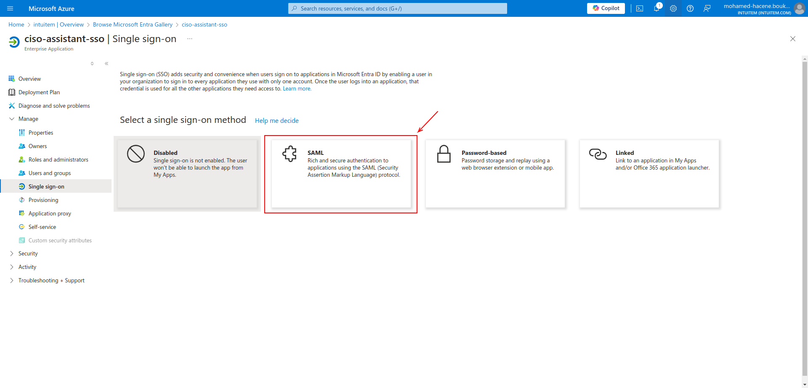
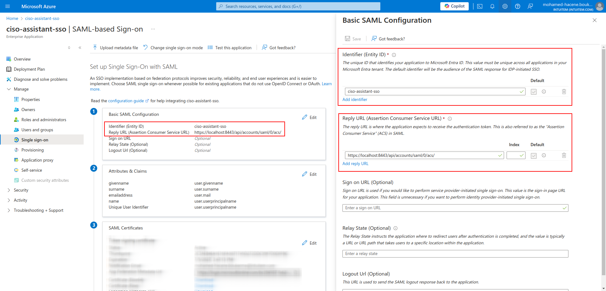
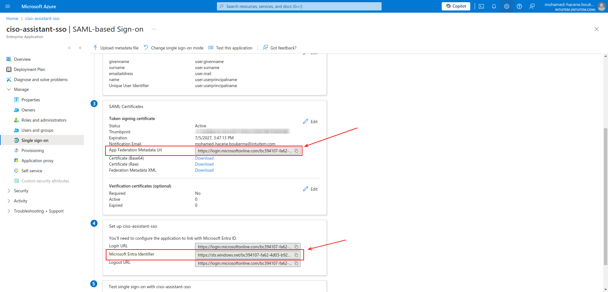
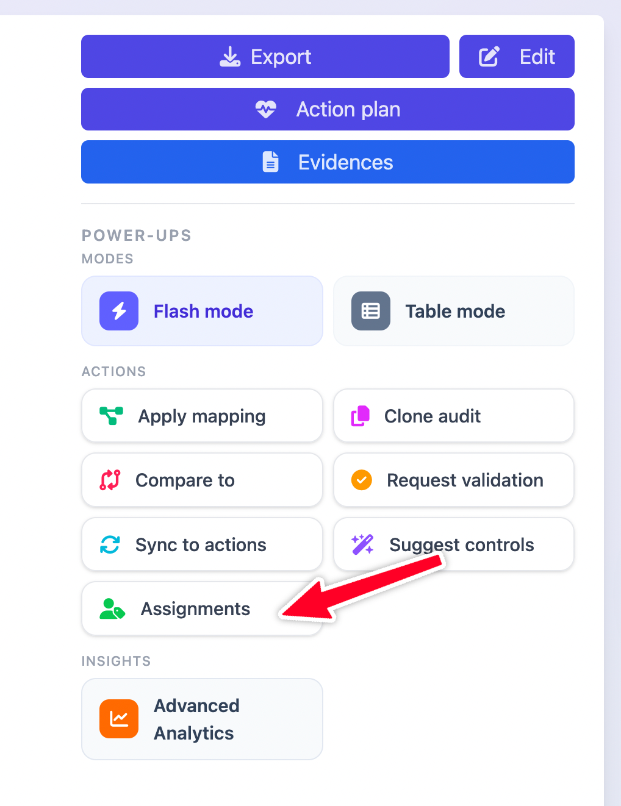
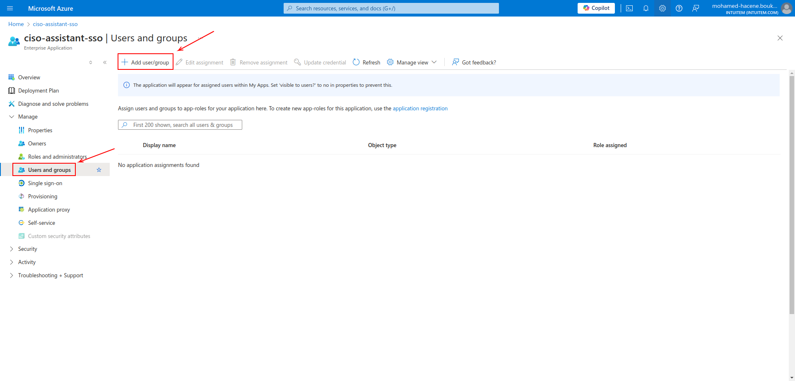

# Microsoft Entra ID

Go into your **Azur portal home**

1.  Open the sidebar menu and click on **Microsoft Entra ID**\

    <figure><figcaption></figcaption></figure>
2.  Click on **Add button > Entreprise application**\

    <figure><figcaption></figcaption></figure>
3.  Click on **Create your own application**\

    <figure><figcaption></figcaption></figure>
4.  Enter a name and then click **Integrate any other application you don’t find in the gallery (Non-gallery)**\

    <figure><figcaption></figcaption></figure>
5.  Click on **Single sign-on** from the sidebar menu or on **Set up single sign on** bellow Getting Started and choose **SAML**\

    <figure><figcaption></figcaption></figure>

    <figure><figcaption></figcaption></figure>
6. In the first box **Basic SAML Configuration**, specify the **Entity ID**, it has to be the same than <mark style="color:purple;">**SP Entity ID**</mark> in CISO Assistant (see next screenshot)
7.  Add the **Reply URL**: `<base_url>/api/accounts/saml/0/acs/`  (for example with localhost: `https://localhost:8443/api/accounts/saml/0/acs/`)\

    <figure><figcaption></figcaption></figure>
8. In the third box **SAML Certificates**, copy the **App Federation Metadata Url** as it is the <mark style="color:purple;">**Metadata URL**</mark>  in CISO Assistant (see next screenshot)
9.  In the fourth box **Set up \<App\_name>**, copy the **Microsoft Entra Identifier** as it is the <mark style="color:purple;">**IdP Entity ID**</mark> in CISO Assistant\

    <figure><figcaption></figcaption></figure>
10. Make sure you use the same Identifier (Entity ID) that you've set earlier and appear on block 1, on CISO Assistant SP Entity ID:\
    &#x20;
11. Click on **Users and groups** in the sidebar menu, and **Add user/group** to give them access to CISO Assistant with SSO. The matching key will be the email and you'll be able to grant their permissions on the applications.\

    <figure><figcaption></figcaption></figure>


<mark style="color:orange;">Add a user in your application doesn't automatically create the user on CISO Assistant</mark>


You can now [configure CISO Assistant](./#configure-ciso-assistant-with-saml) with the <mark style="color:purple;">**3 parameters**</mark> you've retrieved.

