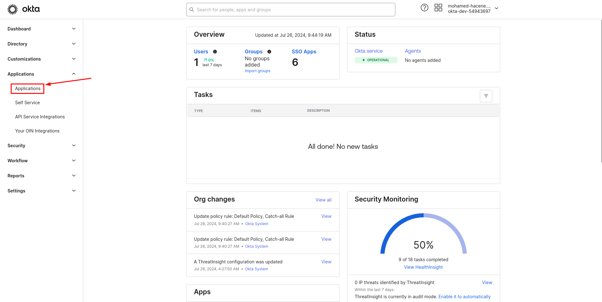
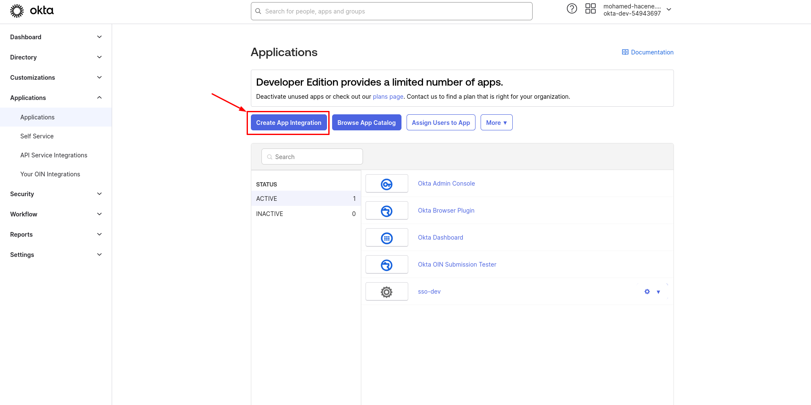
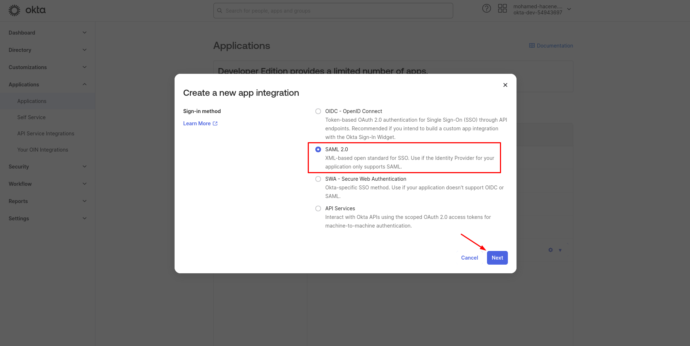
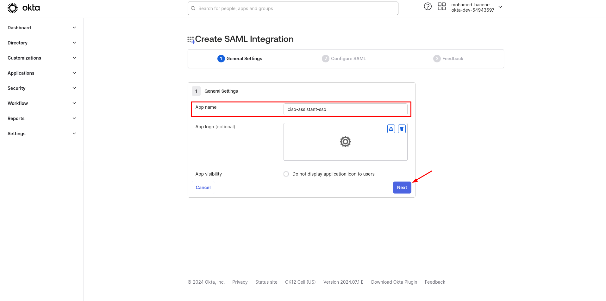
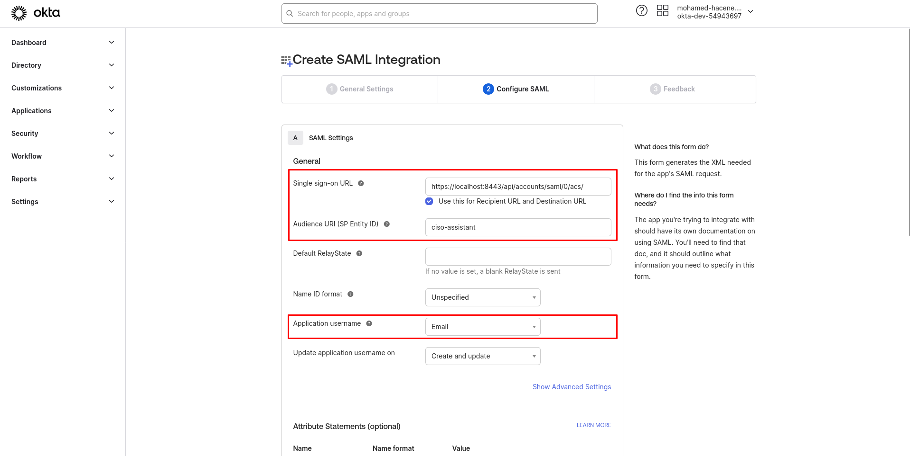
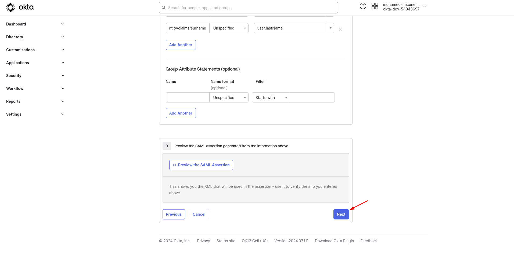
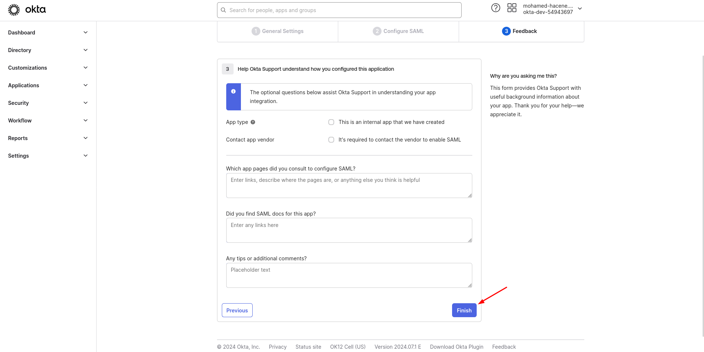
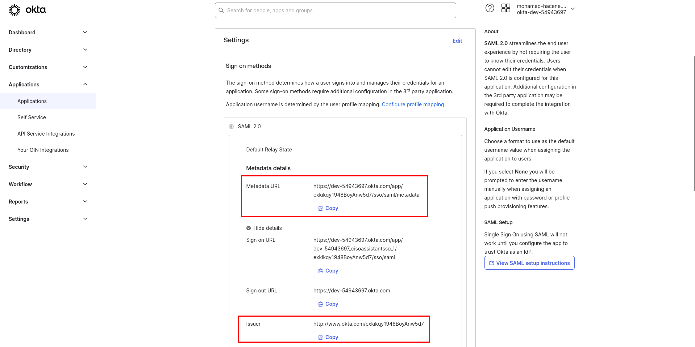
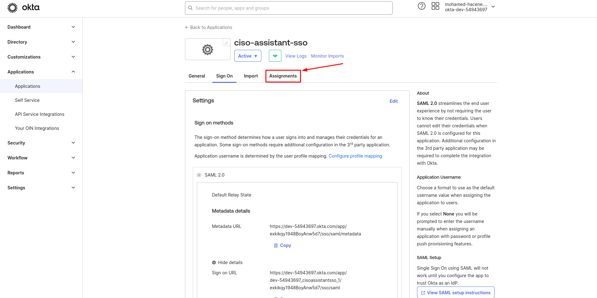
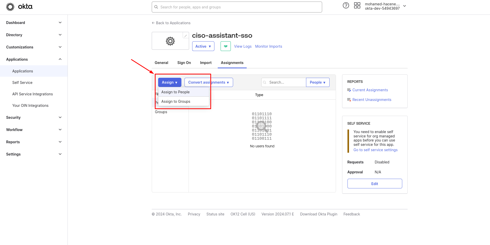

# Okta

Go into your **Okta admin console** (it should look like this: `https://<your_url>.okta.com/admin/dashboard`)

1.  In the sidebar menu, click on **Applications > Applications**&#x20;

    <figure><figcaption></figcaption></figure>
2.  Click now on **Create App Integration**

    <figure><figcaption></figcaption></figure>
3.  Select **SAML 2.0** and click on **Next**&#x20;

    <figure><figcaption></figcaption></figure>
4.  Choose an **App name** and click on **Next**&#x20;

    <figure><figcaption></figcaption></figure>
5. Add the **Single sign-on** **URL**: `<base_url>/api/accounts/saml/0/acs/`  (for example with localhost: `https://localhost:8443/api/accounts/saml/0/acs/`) (see screenshot below)
6. Add the **Audience URI (**<mark style="color:purple;">**SP Entity ID**</mark>**),** it has to be the same than <mark style="color:purple;">**SP Entity ID**</mark> in CISO Assistant (see screenshot below)
7.  Choose **Email** as the **Application username**&#x20;

    <figure><figcaption></figcaption></figure>
8.  Add **Attribute Statements**

    * `http://schemas.xmlsoap.org/ws/2005/05/identity/claims/givenname` for user's first name
    * `http://schemas.xmlsoap.org/ws/2005/05/identity/claims/surname` for user's last name&#x20;

    <figure><figcaption></figcaption></figure>
9.  Click on **Next** and fill in the **Feedback** page as you wish then click on **Finish**&#x20;

    <figure><figcaption></figcaption></figure>

    <figure><figcaption></figcaption></figure>
10. In the **Settings** box inside **SAML 2.0:**

    * Copy  the <mark style="color:purple;">**Metadata URL**</mark> and paste it into the <mark style="color:purple;">**Metadata URL**</mark> field in CISO Assistant
    * Copy the **Issuer** url and paste it into the <mark style="color:purple;">**IdP Entity ID**</mark> field in CISO Assistant

    <figure><figcaption></figcaption></figure>
11. Go to the **Assignments** tab&#x20;

    <figure><figcaption></figcaption></figure>
12. Click on **Assign** and choose whether you want to assign users or specific groups&#x20;

    <figure><figcaption></figcaption></figure>


<mark style="color:orange;">Add a user in your application doesn't automatically create the user on CISO Assistant</mark>


You can now [configure CISO Assistant](https://intuitem.gitbook.io/ciso-assistant/features-highlights/sso#configure-ciso-assistant-with-saml) with the <mark style="color:purple;">**3 parameters**</mark> you've retrieved.

