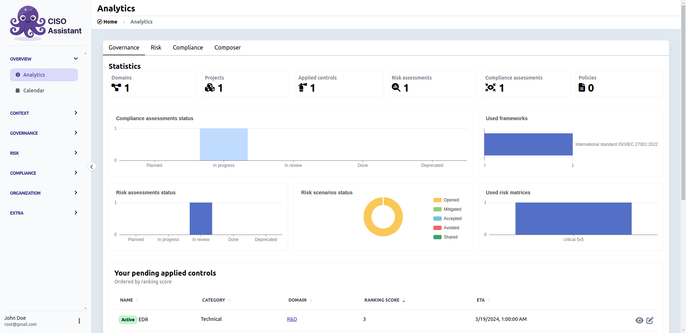
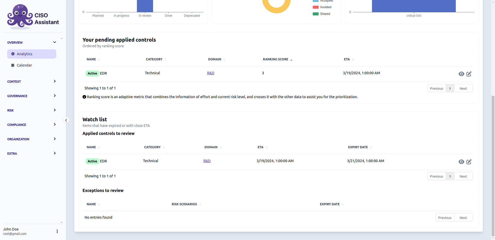
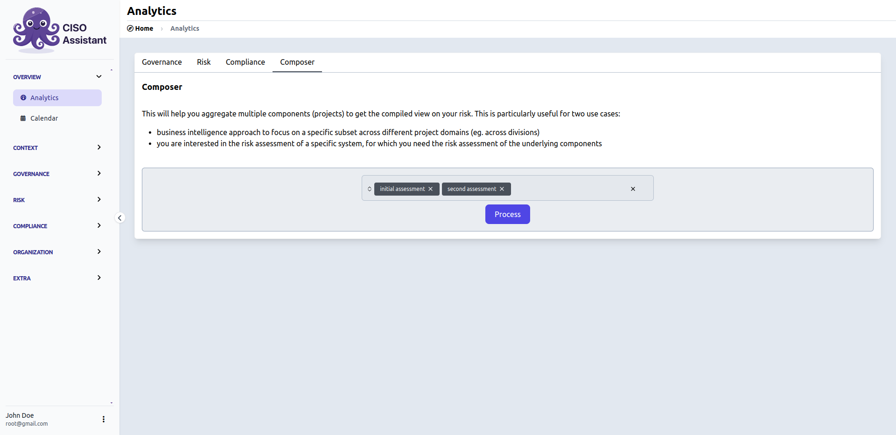
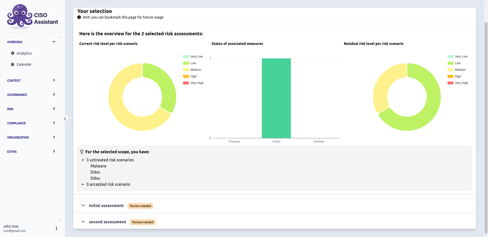
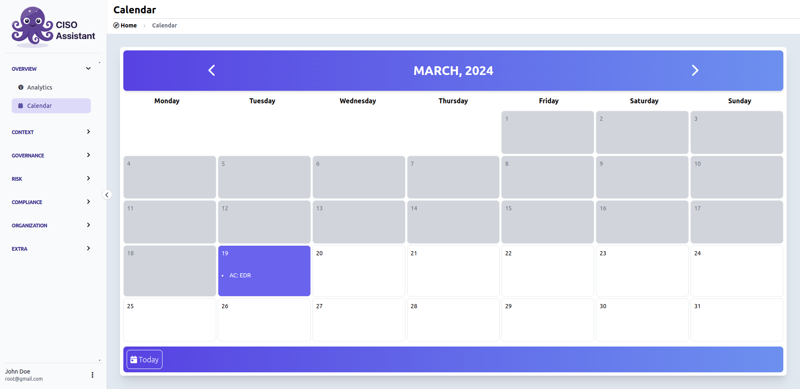

# 🔎 Overview

## Analytics

The main page to manage your perimeters through time. You can focus on risk or compliance with their respective tabs or have a global view from the governance one.

<figure><figcaption>
Governance tab
</figcaption></figure>

You can find on the bottom of the governance tab an applied controls ranking score and a watch list to warn you about incoming deadlines on applied controls or risk acceptances.


Applied controls ranking score table is here to help you prioritize


<figure><figcaption>
Focus on watch list
</figcaption></figure>

### Composer

This is a specific tab where you can cross-referencing analytics from different risk assessments.

<figure><figcaption>
Select targets
</figcaption></figure>

It will also tell you if one or many selected risk assessments should be reviewed based on inconsistencies found by x-rays.


X-rays is a CISO Assistant tool which will be detailed in [extra-tools.md](extra-tools.md "mention")


<figure><figcaption>
Composer
</figcaption></figure>

## Calendar


Calendar page has been moved to the "Operations" section


An integrated calendar to track the ETA of **upcoming/expired** applied controls or risk acceptances.

<figure><figcaption></figcaption></figure>
