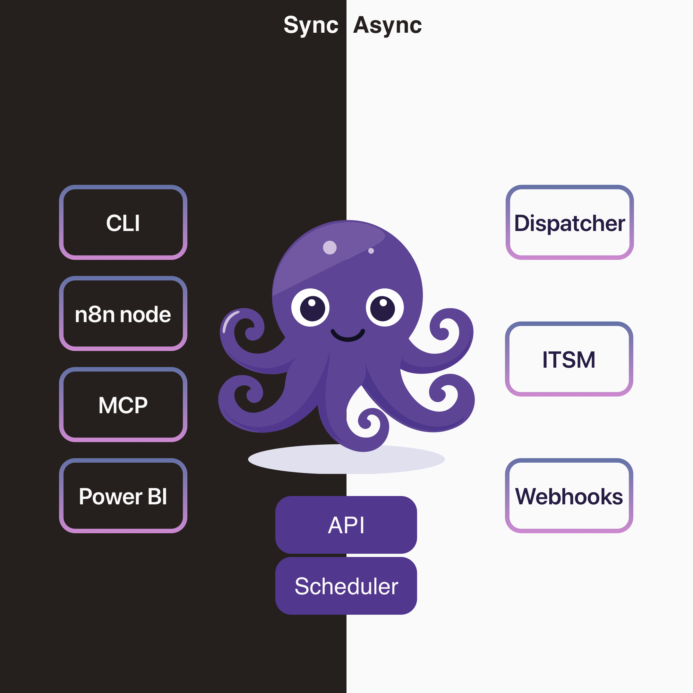

# Integration overview

<figure><figcaption></figcaption></figure>

* CLI : basic automation and batch actions
* n8n node: custom node for no-code / low-code automation leveraging the +1200 integration of n8n ecosystem
* MCP: plug your agents and/or  tools-capable LLM app for a chatting experience&#x20;
* Power BI: Expand and customize your data visualistions
* Dispatcher: Listen to a kafka bus to trigger events
* ITSM: Interact with your ITSM tool on incoming or outgoing events
* Webhooks: wake up external system on events, with thin or full webhooks&#x20;
