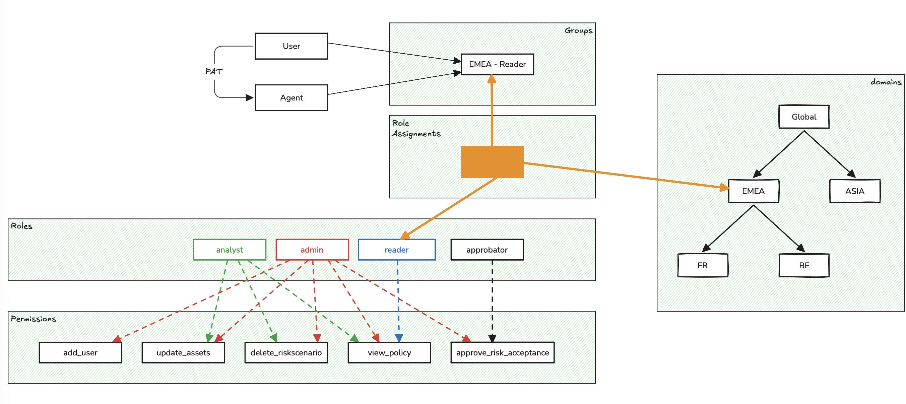

# Understanding the IAM model

Access security is a foundational aspect of any risk or compliance management platform. In this article, we’ll explore how **authentication**, **authorization**, and **accounting** — the three pillars of the AAA model — are structured and applied within **CISO Assistant**.

***

### 1. Authentication: SAML vs OIDC 

CISO Assistant integrates with leading identity providers (IdPs) via **SAML** and **OIDC**, enabling secure and seamless single sign-on (SSO).

#### 🔸 SAML 

* legacy protocol based on XML
* common in large enterprises, especially for AD
* browser-based redirection with signed assertions

#### 🔸 OIDC (OpenID Connect) 

* modern standard built on OAuth2
* uses JWT tokens for identity transport
* also browser-based, but more lightweight and versatile

> **Recommendation**: If your IdP supports both, **prefer OIDC** — it's more modern, flexible, and aligned with today’s security practices.

***

### 2. MFA 

Multi-Factor Authentication (MFA) is critical for access protection. CISO Assistant supports MFA in two distinct modes, depending on how users authenticate:

#### 🔸SSO-Based Authentication (SAML / federated OIDC) 

* MFA is handled entirely by the identity provider (IdP)
* the IdP enforces the policy (push notifications, TOTP, biometrics, etc.)

#### 🔸Local Authentication 

* for local accounts, CISO Assistant includes native MFA
* based on **TOTP** (e.g., Google/Microsoft Authenticators)

***

### 3. Authorization: Structured and Hierarchical RBAC 

CISO Assistant implements a robust **Role-Based Access Control (RBAC)** model that balances flexibility, clarity, and operational simplicity.

#### 🔸 Fine-Grained Permissions 

Each object type has granular **CRUD permissions** (create, read, update, delete). This model applies across all business entities: users, backups, risks, policies, incidents, data processing, and more. There are more than 200 permissions in CISO Assistant.

#### 🔸 Predefined Roles 

Permissions are grouped into a small set of **standard roles**:

* **Administrator** – full access to all objects and settings
* **Analyst** – full access to most objects, but cannot modify access control
* **Viewer** – read-only access
* **Approver** – strictly limited to **approving risk acceptance requests**

#### 🔸 Hierarchical Domains 

Roles are assigned **within a domain** — a flexible concept representing any relevant business context.

For example, a domain can represent:

* a **legal entity**
* a **country** or **region**
* a **subsidiary**
* a **business unit**
* any other meaningful organizational structure

> Domains are **hierarchical**: a role assigned to a parent domain (e.g., "Group") automatically applies to all its subdomains (e.g., subsidiaries, teams).

#### 🔸 Role Assignments 

Access control is defined via explicit assignments:

> _A role_ ➡️ _on a domain_ ➡️ _for a group of users_

#### 🔸 User Groups 

Users **do not have direct roles**. They inherit permissions through **membership in one or more groups**.

Groups act as the central pivot for managing access:

* receive role assignments
* grant users permissions via group membership
* defined locally
* optionally synced with an IdP (via external plugin)

🚀 This simple yet powerful model accommodates the vast majority of real-world access scenarios. And when needed, the system is fully extensible: it supports **custom roles**, **custom role assignments**, and **custom user groups** to fit even the most specific organizational needs.

***

### 4. Machine Identity: Personal Access Tokens with Expiration & Control 

CISO Assistant doesn’t just secure human access — it also supports secure, auditable access for **automated systems** and **integrations** through **Personal Access Tokens (PATs)**.

#### 🔸Definition 

A **Personal Access Token** is a time-limited secret that allows a script, CI/CD pipeline, or service to authenticate with the platform's API on behalf of a user or machine identity — without requiring an interactive login.

#### 🔸Key features 

* **time-bounded**: expiration is mandatory
* **RBAC-compliant**: inherits the creator’s permissions
* **revocable**: can be revoked by user or admin

#### 🔸Governance controls 

* admins can restrict who may generate PATs
* all tokens are auditable and managed via UI or API

> This ensures **tight control over non-human access**, balancing automation flexibility with strict security hygiene.

### 5. Illustration 

The following schematic illustrates the fundamental concepts of IAM in CISO Assistant.

<figure><figcaption></figcaption></figure>

### 6. Publication mechanism

All objects of CISO Assistant support a built-in flag called _**is\_published.**_&#x20;

Objects with the flag _is\_published_ are visible in subdomains as if they were attached to each subdomain of the object's domain. This mechanism only concerns visibility, not creation/udpate/deletion.\
All objects are currently published, except assessments (audits, risk analysis, BIA, entitiy assessments)

To avoid an object being published, the simplest solution is to put it in a leaf subdomain.

The plan is to remove this mechanism by Q2 2026 and introduce dynamic groups instead (e.g. the group of all users).

#### 🤔 Can I make an object visible to all users without attaching it to global?

You can attach this object to a subdomain (e.g. named "published"), and add every user in the group corresponding to reader role on the subdomain. This does not rely on the publication mechanism, and is more generic.

### 7. Accounting: Full Audit and Traceability 

CISO Assistant includes native tracking of all key actions:

* logins, restorations, configuration changes, approvals…
* a searchable audit log accessible via the UI or API

> This enables complete accountability over critical operations.

### 🧠 In Summary 

CISO Assistant's AAA model is built on:

* **Open standards** (SAML, OIDC, TOTP, RBAC)
* A **structured yet manageable authorization system**
* **secure automation** through scoped, revocable **Personal Access Tokens** (PATs)
* **Built-in traceability** from the ground up

It supports complex organizations while remaining readable, scalable, and compliant with modern security expectations.

