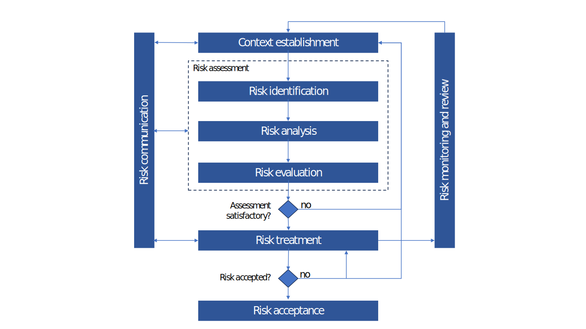

# 💣 Risk

<figure><figcaption>
ISO 27005 risk management workflow
</figcaption></figure>

## Risk assessment

You can create risk assessments in your perimeters. A risk assessment encompasses:

* risk identification, when you define your risk scenarios
* risk analysis, when you assess the probability, impact and strength of knowledge for each scenario
* risk evaluation, which is done automatically based on the selected risk matrix

In CISO Assistant, risk treatment is combined with risk assessment.

## Risk scenario

The scenarios can be defined directly from the risk assessment view or separately via this view.

## Risk acceptance

Risk acceptance is when an organization or individual decides to tolerate a certain level of risk without taking further action to reduce it.\
This view allows to manage a workflow to get formal approval of risk acceptances by the management.\
The approver of a risk acceptance must have a user account with approver role.\
To find out more about risk acceptance, you can have a look to the [ENISA risk management process](https://www.enisa.europa.eu/topics/risk-management/current-risk/risk-management-inventory/rm-process/risk-acceptance).
