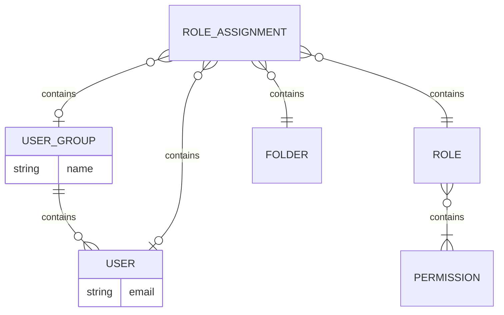
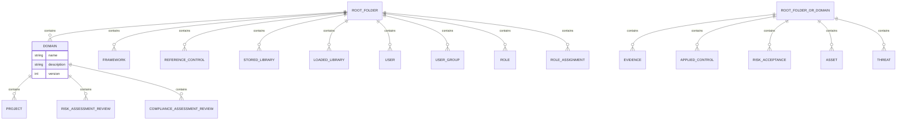
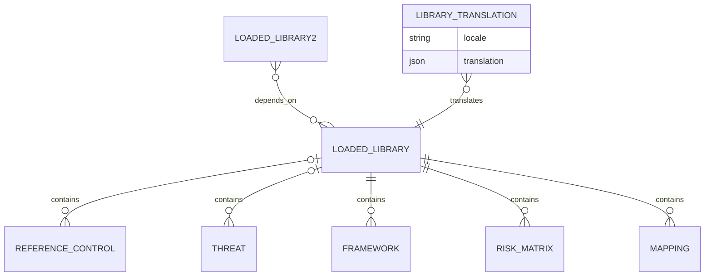
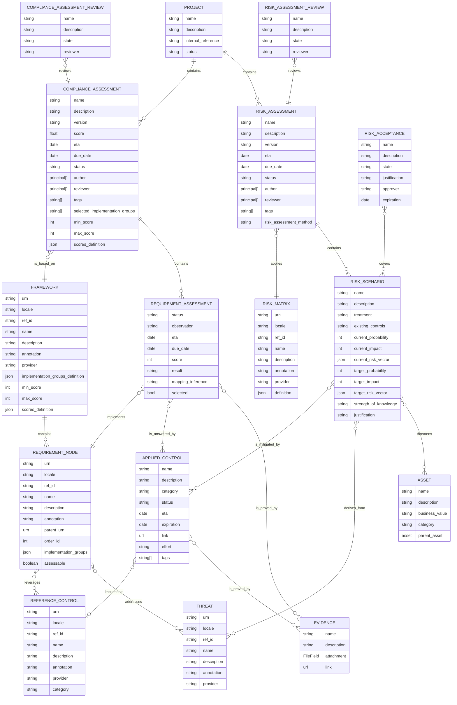
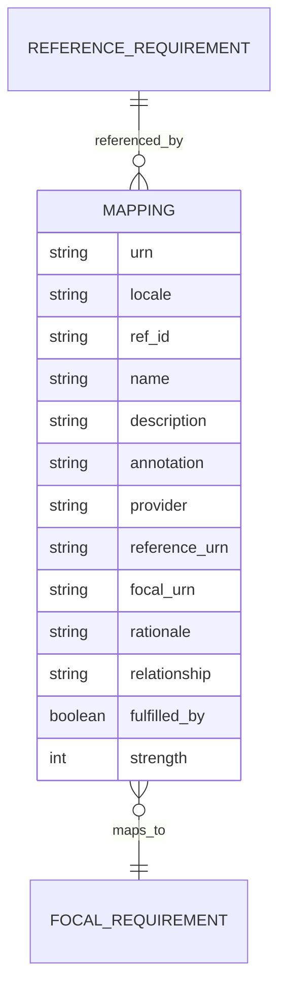
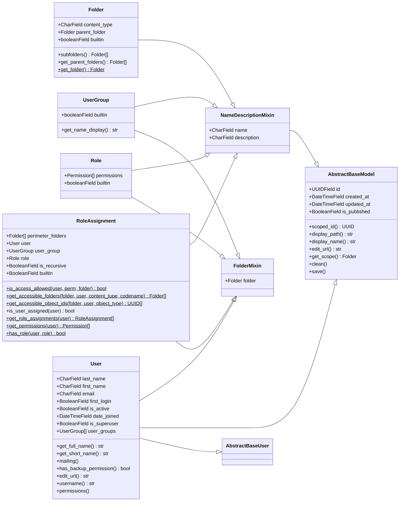

# CISO Assistant Data Model

## Entity-relationship diagram

### IAM



### Folder organization



### Library model



### General data model



### Mappings



## Class diagram for IAM objects



## Class diagram for general objects

```mermaid
classDiagram
direction RL

NameDescriptionMixin   <|-- RiskScenario
AbstractBaseModel      <|-- NameDescriptionMixin
NameDescriptionMixin   <|-- ReferentialObjectMixin
FolderMixin            <|-- ReferentialObjectMixin
ReferentialObjectMixin <|-- Threat
ReferentialObjectMixin <|-- ReferenceControl
ReferentialObjectMixin <|-- RiskMatrix
ReferentialObjectMixin <|-- Framework
ReferentialObjectMixin <|-- RequirementNode
ReferentialObjectMixin <|-- Mapping
ReferentialObjectMixin <|-- LibraryMixin
LibraryMixin           <|-- StoredLibrary
LibraryMixin           <|-- LoadedLibrary
NameDescriptionMixin   <|-- Assessment
FolderMixin            <|-- Project
NameDescriptionMixin   <|-- Project
FolderMixin            <|-- Asset
NameDescriptionMixin   <|-- Asset
FolderMixin            <|-- Evidence
NameDescriptionMixin   <|-- Evidence
FolderMixin            <|-- AppliedControl
NameDescriptionMixin   <|-- AppliedControl
FolderMixin            <|-- RiskAcceptance
NameDescriptionMixin   <|-- RiskAcceptance
AppliedControl         <|-- Policy
Assessment             <|-- RiskAssessment
Assessment             <|-- ComplianceAssessment
AbstractBaseModel      <|-- RequirementAssessment
FolderMixin            <|-- RequirementAssessment

namespace ReferentialObjects {
    class ReferentialObjectMixin {
        +CharField urn
        +CharField ref_id
        +CharField locale
        +CharField provider
        +CharField annotation
        +display_short() str
        +display_long() str
    }

    class LibraryMixin {
        +CharField copyright
        +IntegerField version
        +CharField provider
        +CharField packager
        +JsonField dependencies
        +BooleanField builtin
        +JSONField objects_meta
    }

    class StoredLibrary {
        +BooleanField is_loaded
        +CharField hash_checksum
        +TextField content
    }

    class LoadedLibrary {
        +LoadedLibrary[] dependencies
        +reference_count() int
    }

    class Threat {
        +LoadedLibrary library
        +is_deletable() bool
        +frameworks() Framework[]
    }

    class ReferenceControl {
        +LoadedLibrary library
        +CharField category
        +JSONField typical_evidence
        +is_deletable() bool
        +frameworks() Framework[]
    }

    class RiskMatrix {
        +LoadedLibrary library
        +JSONField json_definition
        +BooleanField is_enabled
        +CharField provider
        +is_used() bool
        +risk_assessments() RiskAssessment[]
        +projects() Project[]
        +parse_json()
        +get_detailed_grid()
        +render_grid_as_colors()
    }

    class Framework {
        +LoadedLibrary library
        +int get_next_order_id(obj_type, _parent_urn)
        +is_deletable() bool
    }

    class RequirementNode {
        +Threat[] threats
        +ReferenceControl[] REFERENCE_CONTROLs
        +Framework framework
        +CharField parent_urn
        +IntegerField order_id
        +json implementation_groups
        +BooleanField assessable
    }

    class Mapping {
        +CharField    reference_urn
        +CharField    focal_urn
        +CharField    rationale
        +CharField    relationship
        +BooleanField fulfilled_by
        +IntegerField strength
    }
}

namespace DomainObjects {

    class Project {
        +CharField internal_reference
        +CharField lc_status
        +overall_compliance()
    }

    class Asset {
        +CharField business_value
        +CharField type
        +Asset[] parent_assets
        +is_primary() bool
        +is_support() bool
        +ancestors_plus_self() Asset[]
    }

    class Evidence {
        +FileField attachment
        +URLField link
        +get_folder() Folder
        +filename() str
        +preview()
    }

    class AppliedControl {
        +ReferenceControl REFERENCE_CONTROL
        +Evidence[] evidences
        +CharField category
        +CharField status
        +DateField eta
        +DateField expiry_date
        +CharField link
        +CharField effort

        +RiskScenario[] risk_scenarios()
        +RiskAssessments[] risk_assessments()
        +Project[] projects()
        +Project parent_project()
        +mid()
        +csv_value()
        +get_ranking_score() int
        +get_html_url() str
        +get_linked_requirements_count() int
    }

    class RiskAcceptance {
        +RiskScenario[] risk_scenarios
        +User approver
        +CharField state
        +DateField expiry_date
        +DateTimeField accepted_at
        +DateTimeField rejected_at
        +DateTimeField revoked_at
        +CharField justification
        +get_html_url() str
        +set_state(state)
    }
}

class Assessment {
    +TextChoices Status
    +Project project
    +CharField version
    +CharField status
    +CharField authors
    +CharField reviewers
    +DateField eta
    +DateField due_date
}

class RiskAssessment {
    +RiskMatrix risk_matrix
    +path_display() str
    +get_scenario_count() int
    +quality_check()
    +risk_scoring(probability, impact, risk_matrix) int
}


class ComplianceAssessment {
    +Framework framework
    +CharField result
    +get_requirements_status_count() int
    +get_measures_status_count() int
    +donut_render()
    +quality_check()
}

class RequirementAssessment {
    +CharField status
    +Evidence[] evidences
    +TextField observation
    +ComplianceAssessment compliance_assessment
    +RequirementNode requirement
    +AppliedControl[] APPLIED_CONTROLs
}

class RiskScenario {
    +RiskAssessment risk_assessment
    +Asset[] assets
    +AppliedControl[] APPLIED_CONTROLs
    +Threat[] threats
    +TextField existing_controls
    +SmallIntegerField current_proba
    +SmallIntegerField current_impact
    +SmallIntegerField current_level
    +SmallIntegerField residual_proba
    +SmallIntegerField residual_impact
    +SmallIntegerField residual_level
    +CharField treatment
    +CharField strength_of_knowledge
    +CharField justification

    +Project parent_project()
    +RiskMatrix get_matrix()
    +get_current_risk(s) int
    +get_current_impact() int
    +get_current_proba() int
    +get_residual_risk() int
    +get_residual_impact() int
    +get_residual_proba() int
    +rid()
}

```



## Global fields

All models have the following fields:
- created_at: the date when the object has been created.
- modified_at: the date when the object has been lastly modified.

## Projects and domains

Projects are fundamental context objects defined by the entity using CISO Assistant. They are grouped in domains.

The domain is the fundamental perimeter for access control. All objects, in particular domains, within a domain, have consistent access rights. If this granularity is not sufficient, the entity shall define new domains.

Note: the IAM model is based on folders. A domain is a type of folder (the other one being the root folder).

Projects have the following fields:
- Name
- Description
- Internal reference
- Status: --/Design/Development/Production/End of life/Dropped

## Assets

Assets are context objects defined by the entity using CISO Assistant. They are optional, assessments can be done without using them.

Assets are of category primary or support. A primary asset has no parent, a support asset can have parent assets (primary or support), but not itself.

## Frameworks

The fundamental object of CISO Assistant for compliance is the framework. It corresponds to a given standard, e.g. ISO27001:2013. It mainly contains requirements nodes. A requirement node can be assessable or not (e.g. title or informational elements are not assessable). Assessable requirement nodes can be simply called "requirements".
The structure (tree) of requirements is defined by the requirement node objects. The *parent_urn* of a requirement node can either be the URN of another requirement node or null for top-level objects. This allows to simply define the structure of a framework. An assessable requirement node can be the child of another assessable requirement node, which is very convenient for frameworks that have lists of conditions attached to a requirement.

The implementation_groups field contains a comma-separated list of implementation groups where the requirement node is found, when this is relevant (e.g. for CMMC or CIS). Implementation groups are identified by their ref_id string. Implementation groups are independent, a requirement can be member of any implementation group. Implementation groups are defined in the implementation_groups_definition json field (None by default), that contains a list of objects containing the following fields (example for CMMC):

```json
{
  "ref_id": "1",
  "name": "Foundational",
  "description": "Practices that correspond to the basic safeguarding requirements specified in 48 CFR 52.204-21 commonly referred to as the FAR Clause"
}
```

A requirement node can be covered by typical reference controls. A requirement node can cover typical threats. This information is provided in the form of optional links between requirement nodes and reference controls/threats. This is only informative, but is an important added value of CISO Assistant.

The order_id variable allows to sort the requirements nodes, it starts at 0 and is incremented automatically in a given group at import.

A framework always has a numerical score scale from min_score to max_score. If not explicit, the default values are 0 and 100 (percentage). It is also possible to have a scores_definition json, that contains a list of score levels objects. Each score level is an object containing the following fields (example from TISAX):

```json
{
  "score": 1,
  "name": "Performed",
  "description": "Principle:\\nA process is followed which is not or insufficiently documented (“informal process”) and there is some evidence that it achieves its objective.\\nDefinition:\\n- The implemented process achieves its (process) purpose.\\n- The intended base practices are verifiably performed."
}
```

When present, the scores_definition allows to customize the score display as a drop-down list.

Note: the score scale for a framework can be overridden when creating a compliance assessment.

## Threats

Threats are referential objects used to clarify the aim of a requirement node or a applied  control. They are informative, assessments can be realised without using them.

## Reference controls

Reference controls are templates for Applied controls. They facilitate the creation of a applied  control, and help to have consistent Applied controls. They are not mandatory to create a applied  control, but recommended.

Reference controls have a category within the following possibilities: --/Policy/Process/Technical/Physical.

## Applied controls

Applied controls are fundamental objects for compliance and remediation. They can derive from a reference control, which provides better consistency, or be independent.

A applied  control has the following specific fields:
- a category (same as reference controls)
- a status (--/planned/active/inactive)
- an Estimated Time of Arrival date
- a validity date (expiration field)
- an effort (--/S/M/L/XL)
- a url link
- a list of user-defined tags

When a applied control derives from a reference control, the same category is proposed, but this can be changed.

## Compliance and risk assessments

Both types of assessments have common points:
- a name
- a description
- a version (defined by the analyst)
- an Estimated Time of Arrival date
- a due date
- a status: (--/planned/in progress/in review/done/deprecated) that facilitates reporting.
- a list of authors
- a list of reviewers
- a list of user-defined tags

An assessment review can be asked. When at least one principal is defined, the *done* status can only be set if a representant of each principal has reviewed and validated the assessment.

When the assessment status goes from *in progress* to *in review*, each defined reviewer is notified of the review request.
A review is deprecated if the assessment is changed. A warning shall be displayed to avoid doing that by error.

The state of a review can be: created/submitted/validated/changes requested/deprecated

### Compliance assessments

When a compliance assessment is created, each requirement of the corresponding framework is linked to a requirement assessment object. To cover a requirement, the assessor shall link it to Applied controls.

Here are the specific fields for requirement assessments:
- status: --/to do/in progress/done.
- result: --/compliant/non-compliant minor/non-compliant major/not applicable
- score: --/<integer value from min_score to max_score>.
- ETA (Estimated Time of Arrival) date
- due date. This is for example useful to organize an audit plan.

The compliance assessment score is a read-only field which is calculated when at least one requirement assessment is scored. We calculate the average of scored requriement assessments (ignoring requirement assessments with an undefined score or with status not-applicable).

Requirement assessments can have attached evidences. An evidence contains a name, a description, an attached file, a url link.

The auditor is free to use the result field (qualitative assessment), the score field (quantitative assessment), or both of them.

Compliance assessments have a selected_implementation_groups field that contains the selected implementation groups. The None default value consists in selecting all groups, which makes sense also for the case no implementation groups are defined.
For the sake of performance, when a change is done on the selected implementation groups, the "selected" field of corresponding requirement assessments is updated. When changing the selection, no data shall be lost, so auditors can easily test the effect of various selections.

Note: the selection is persistent, and used in particular for reporting and analytics. The UX could provide dynamic capacity to show or hide implementation groups independently of the selection (e.g. a button "show unselected requirements").

Compliance assessments have a score scale (min_score, max_score, score definition) that is inherited from the corresponding framework. But it is possible during the creation of the assessment to specify another score scale. The following hardcoded score scales are proposed as an alternative:
- percentage (0-100%, no score definition)
- CMMI (1-5, Initial/Managed/Defined/Quantitatively Managed/Optimizing)
- 0-5 (0-5, no score definition)
- 0-10 (0-10, no score definition)

### Mappings

Mappings are referential objects that describe relations between requirements from a reference framework to a focal framework. The definition of mappings is based on NIST OLIR program (see https://nvlpubs.nist.gov/nistpubs/ir/2022/NIST.IR.8278r1.ipd.pdf).

A mapping is defined by the following specific attributes:
- a reference requirement URN
- a focal requirement URN
- a rationale giving the explanation for why a Reference Document Element and a Focal Document Element are related. This will be syntactic, semantic, or functional.
- a relationship that provides the type of logical relationship that the OLIR Developer asserts the Reference Document Element has compared to the Focal Document Element. The Developer conducting the assertion should focus on the perceived intent of each of the Elements. This will be one of the following: subset of, intersects with, equal to, superset of, or not related to.
- a strength of relationship, optionally providing the extent to which a Reference Document Element and a Focal Document Element are similar. It is typically between 0 (no relation) to 10 (equal).

Mappings are used to automatically generate a draft compliance assessment for a focal framework, given existing reference assessments.

The following inference rules are used:
- there is an order relation in results: compliant > non-compliant minor > non-compliant major
- N/A or -- in reference makes the mapping not usable.
- when several mappings exist for a focal requirement, the strongest inference result is used to determine the compliance result.
- all mappings are described in the mapping_inference field.
- a superset or equal mapping pushes the reference result to the focal result.
- an subset mapping pushes a most a partial compliance result to the focal result

### Risk assessments and risk matrices

A risk assessment is based on scenarios, covered by Applied controls. Gathering the risk scenarios constitutes the "risk identification" phase.

A risk assessment has an *risk_assessment_method* field that can take the following values: 0 (risk matrix)/1 (Open FAIR). This cannot be changed once the risk assessment is created. Similarly, the risk matrix cannot be changed once the risk assessment is created.

To analyse the risk, each scenario contains Existing Controls, current probability and impact, proposed controls, residual probability and impact. To facilitate using an assistant to estimate probability and impact, or for advanced methods like openfair, the json fields *current_risk_vector* and *residual_risk_vector* are aimed at keeping the data used to calculate to the estimation.

A risk scenario contains a treatment option with the values --/open/mitigate/accept/avoid/transfer

A risk scenario also contains a "strength of knowledge", within the values --/0 (Low)/1 (Medium)/2 (High). This can be used to represent a third dimension of risk, as recommended by the Society for Risk Analysis. The field "justification" can be used to expose the knowledge.

The risk evaluation is automatically done based on the selected risk matrix.

## Risk matrices

Risk matrices are referential objects that are imported from a library.

The definition JSON field has the following format:

```json
{
  "type": "risk_matrix",
  "fields": {
        "probability" : [
            {"abbreviation": "L", "name": "Low", "description": "Unfrequent event"},
            {"abbreviation": "M", "name": "Medium", "description": "Occasional event"},
            {"abbreviation": "H", "name": "High", "description": "Frequent event"}
        ],
        "impact": [
            {"abbreviation": "L", "name": "Low", "description": "<100k$"},
            {"abbreviation": "M", "name": "Medium", "description": "between 100 to 1000k$"},
            {"abbreviation": "H", "name": "High", "description": ">1000k$"}
        ],
        "risk": [
            {"abbreviation": "L", "name": "Low", "description": "acceptable risk", "hexcolor": "#00FF00"},
            {"abbreviation": "M", "name": "Medium", "description": "risk requiring mitigation within 2 years", "hexcolor": "#FFFF00"},
            {"abbreviation": "H", "name": "High", "description": "unacceptable risk", "hexcolor": "#FF0000"}
        ],
        "grid": [
            [1, 2, 2],
            [0, 1, 2],
            [0, 0, 1]]
  }
}
```

## Risk acceptance

A risk acceptance can be asked on a list of scenarios that are part of validated risk assessments (assessment in the *done* state with at least one reviewer). It is directed to an approver that should be the risk owner.

The state of a risk acceptance can be: created/submitted/accepted/rejected/revoked

The justification field can be edited only by the approver.

Once a risk acceptance is active, the correponding risk assessments are frozen. They shall be cloned to make evolutions.

## Libraries

Libraries can contain:
- frameworks (including requirement nodes)
- threats
- reference controls
- risk matrices

It is recommended that libraries be modular, with only one type of object, but this is not mandatory.

Libraries have a copyright that contains relevant copyright information.

Libraries have a URN to uniquely identify them.

Libraries have a locale that describes the locale for the whole content of the library.

Libraries have an integer version that completes the URN. The highest version for a given URN shall always be privileged. So:
- a library loading is performed if and only if there is no greater or equal version already loaded, for the same urn and locale.
- if a breaking change is necessary, the URN should be changed.


Libraries have a provider (which entity produced the original content), and a packager (which entity did the library). Objects in the library inherit their provider from the library's.

Libraries can depend on other libraries, thanks to the "dependencies" section, that contains a list of URNs. When loading a library, CISO Assistant first loads the dependent libraries. If a dependency is missing, the loading is cancelled.

When a library is loaded, this loading is stored in the database, and the corresponding objects keep a link to the library. This allows removing all objects from a library in a single action.

Deleting a library is possible only if none of its objects is currently used. Removing individual elements of a library is not possible. Dependencies are not concerned by the deletion, they should be deleted individually.

## Referential objects

Frameworks (including requirement nodes), mappings, threats, reference controls and risk matrices are called "referential objects", as they constitute the basis of an assessment.

Referential objects can be downloaded from a library. They are called "global referential objects" or "library objects" in that case, and they have the following characteristics:
- they have a non-null URN identifier *urn* of the form: ```urn:intuitem:<domain>:<object_type>:[<framework>:]<short_id>```. Client-defined URNs are also possible. The framework part is present for items that are part of a framework.
- they are read-only in the database once imported. They can be removed only by removing the corresponding library.
- they are attached to the root folder.
- Everyone has the right to read them, they are "published" to all domains.
- The couple (URN, locale) is unique.
- They have a link to their library.

Conversely, a referential object with a null URN is called a "local referential object" has the following characteristics:
- it is created by a user in a given domain (not in the root folder)
- it can be edited with proper permission.
- The URN cannot be edited and is hidden.

Referential objects have the following optional fields:
- ref_id: reference used in the standard for this object (e.g. A.5.5).
- provider: describes where the object comes from, e.g. ISO, NIST, CIS, MITRE ATT&CK...
- annotation: provided by the library packager or the user to clarify the meaning of the object. They can be used for search, and are displayed when available.

Framework and risk matrix objects can only come from a library.

The URN allows in particular having a threat or reference control used in several frameworks.

It is possible to mix global and local referential objects. For example, a client can use threats coming from the MITRE referential and also define custom threats directly in CISO Assistant.

Note: links to URN occur only in libraries, links in the database shall always use the UUID of the object.

The library_manager role will be defined to manage library objects.

## Referential objects translation

When a several locales are loaded for a same library (same URN), the first one is loaded normaly, and becomes the reference version. The next ones are loaed in a LibraryTranslation object, that is used to adapt the UI.

The translation JSON field contains a dictionary with urn as key and a dictionary of (field_name, value) as value.

Example: 
```
{
    "urn:intuitem:risk:req_node:iso27001-2022:4": [["name","Contexte de l'organisation"],["description","..."],["annotation","..."]], 
    "urn:intuitem:risk:req_node:iso27001-2022:4.3", ...
}
```

## Access control model

All objects in CISO Assistant follow a simple and consistent RBAC IAM model, including IAM objects themselves.

### Granularity

There are two dimensions: rights and perimeter.

There granularity of rights is mapped on Django convention:
- Add
- View
- Change
- Delete

There is one such right for each type of object. This is the standard Django model for views.

Practically, the Add, Change or Delete permissions require the View permission. This is an assumption for the UI.

The perimeter for access control is based on the folder concept, with all its content, including subfolders. Boolean parameters allow a finer-grain definition of the perimeter, as will be seen later.

Practically, the perimeter is either:
- global, corresponding to the root folder
- a domain, corresponding to a folder of level 1.

### Folder organization

For Access Control purpose, CISO Assistant data is organized in a tree of folders, starting from a root folder. The organization of the tree is not hardcoded, it is entirely determined by configuration. Any object in CISO Assistant is attached to a folder (including folders), either directly or indirectly through a parent object that is attached to a folder. The root folder is attached to None.

A folder contains the following attributes:
- name: the short name given to the folder
- description: a longer description of the folder
- contentType: an enum representing the type of content. Currently GLOBAL and DOMAIN. This parameter is aimed at adjusting the UI depending of the type of content.
- folder: the parent folder. None for root folder.

Currently, the folder organization is as follows:
- The root folder has contentType=GLOBAL.
- The root folder can only contain referential objects.
- There is only one level of subfolders, each subfolder with contentType=DOMAIN.
- Folders are not displayed as such, they are visible only to the programmer.


### Roles and role assignments

To simplify access control, we use a RBAC model.

Role               | Permissions
-------------------|------------
Administrator      | full access (except approval), and specifically management of domains, users and users rights
referential_manager| capacity to manage referentials in the root folder
Domain manager     | full access to selected domains (except approval), in particular managing rights for these domains. Read access to global objects
Analyst            | readwrite acces to selected projects/domains. Read access to global and domain objects
Reader             | read access to selected projects/domains
Risk approver      | like reader, but with additional capability to approve risk acceptances
Reviewer           | like reader, but with additional capability to review assessments.


Note: a DJANGO superuser is given administrator rights automatically on startup.

Principals are either:
- users
- group of users

Role assignements are described as a table containing the following attributes:
- user: the user that receives the role assignment (can be None)
- user_group: the group that receives the role assignment (can be None)
- role: the role assigned to the principal
- folders: list of folders that form the perimeter of the assignment.
- is_recursive: a boolean indicating if the perimeter includes the subfolders

This table is the golden source of all access management in CISO Assistant, no additional information is necessary to know who has access to what.

### Published global objects

All objects have a boolean attribute is_published, that specifies if the object is visible in read-only mode in the folder and subfolders from anyone having read access to such local objects. For example, if a reference control F1 is published in the root folder, and a user has read access to reference controls in a domain, this user can use see and use F1 (but not modify it, even if given update access in the domain).

### Built-in objects

Built-in objects are predefined in CISO Assistant. They can be viewed following the general IAM model, but they cannot be deleted nor changed. A built-in object is characterized by the "builtin=True" attribute.
Types that can be built-in are: folders, roles, role assignments and groups.

Names of built-in objects can be internationalized.
