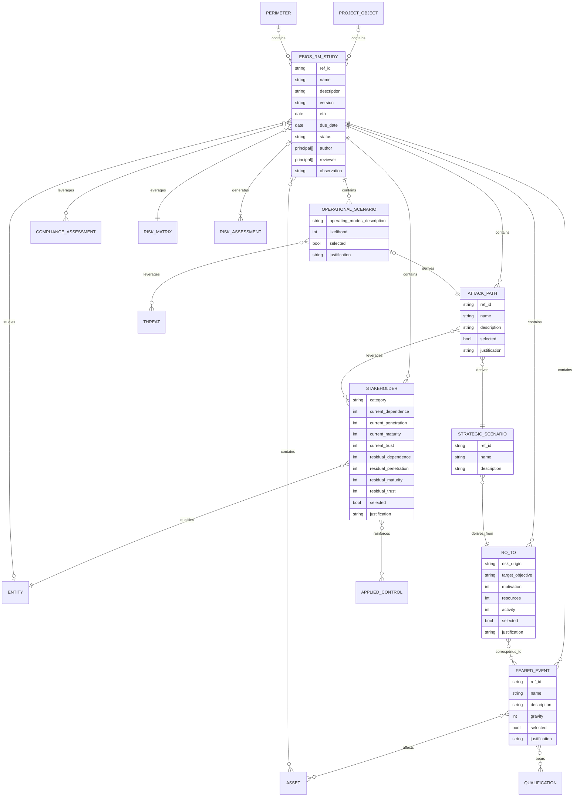

# CISO Assistant Data Model

## Entity-relationship diagram

### IAM


### Folder organization


### Library model


### Project management model


### General data model


### Requirement mappings


### Labels

All objects can be linked to user-defined labels. Labels are simple strings with no blank, regex r"\w{0:36}".

Labels are attached to the root folder. They can be read by everyone, added by any contributor, and modified or deleted only by global administrators.


In all views and analytics, a filter on label shall be displayed.

Note: For now, labels are attached to the following objects: vulnerabilities, assets, findings, threats, reference controls, applied controls.

## Global fields

All models have the following fields:

- created_at: the date when the object has been created.
- modified_at: the date when the object has been lastly modified.

## Project management, perimeters and domains

### Domains

The domain is the fundamental perimeter for access control. All objects, in particular domains, within a domain, have consistent access rights. If this granularity is not sufficient, the entity shall define new domains.

Note: the IAM model is based on folders. A folder has a type among:

- ROOT: the root folder, which is also called "global domain".
- DOMAIN: a user-defined domain.
- ENCLAVE: a invisible folder used to confine the actions of a third party.

### Perimeters

Inside a domain, assessments can be grouped in perimeters, with no impact on access control.
The perimeter has the following fields:

- ref_id
- name
- description
- status: --/Design/Development/Production/End of life/Dropped

An assessment can only be attached to a perimeter that is in the same domain as the assessment.

Note: perimeters were previously named "projects", but this was misleading.

### Project objects

Project objects are defined by the entity using CISO Assistant. Assessments can be attached to a project object, though this is optional. Project objects are organized hierarchically, each project object can have a parent, but loops are not allowed.

Projects objects have the following fields:

- ref_id (ex internal reference)
- Name
- Description
- Phase: --/Initiation/Planning/Execution/Monitoring/Closure/Closed/Dropped
- Category: --/Portfolio/Program/Project/Initiative/Activity

Here is an example of a project management structure:


## Qualifications

Qualifications are qualities/objectives that can be used to qualify risk scenarios or to set security objectives to primary assets. Some of them are hardcoded, but in the PRO version the administrator can define additional values and rename existing ones.

The following values are preloaded:

| abbreviation | q_order | so_order | name            | description | translations | urn                                             |
| ------------ | ------- | -------- | --------------- | ----------- | ------------ | ----------------------------------------------- |
| C            | 1       | 1        | confidentiality |             | ...          | urn:intuitem:risk:qualification:confidentiality |
| I            | 2       | 2        | integrity       |             | ...          | urn:intuitem:risk:qualification:integrity       |
| A            | 3       | 3        | availability    |             | ...          | urn:intuitem:risk:qualification:availability    |
| P            | 4       | 4        | proof           |             | ...          | urn:intuitem:risk:qualification:proof           |
| Aut          | 5       | 5        | authenticity    |             | ...          | urn:intuitem:risk:qualification:authenticity    |
| Priv         | 6       | 6        | privacy         |             | ...          | urn:intuitem:risk:qualification:privacy         |
| Safe         | 7       | 7        | safety          |             | ...          | urn:intuitem:risk:qualification:safety          |
| Rep          | 8       |          | reputation      |             | ...          | urn:intuitem:risk:qualification:safety          |
| Ope          | 9       |          | operational     |             | ...          | urn:intuitem:risk:qualification:operational     |
| Leg          | 10      |          | legal           |             | ...          | urn:intuitem:risk:qualification:legal           |
| Fin          | 11      |          | financial       |             | ...          | urn:intuitem:risk:qualification:financial       |

Qualifications that have so_order defined can be used to set security objectives to primary assets.

The role of urn is to enable updates with a library, and to facilitate export/import between instances (not in MVP).

Note: the order can be changed in a translation. This makes easy to transform CIAP (English) in DICP (French) (not in MVP).

## Assets, security and disaster recovery objectives

Assets are context objects defined by the entity using CISO Assistant. They are optional, assessments can be done without using them.

Assets are of type primary or supporting. A primary asset has no parent, a supporting asset can have parent assets (primary or supporting), but not itself.

The following disaster recovery objectives (measured in seconds) can be defined on assets:

| Abbreviation | Name                       | Description |
| ------------ | -------------------------- | ----------- |
| RTO          | Recovery Time Objective    | ...         |
| RPO          | Recovery Point Objetive    | ...         |
| MTD          | Maximum Tolerable Downtime | ...         |

Assets have security objectives. Security objectives are specific goals or requirements that an organization, system, or process aims to achieve in order to ensure its security and protect its primary assets. They are a subset of qualifications.

Security objectives are measured using a specifc scale. For now, the following scales are defined:

- 0-3: coded as 0-3
- 1-4: coded as 0-3
- 0-4: coded as 0-4
- 1-5: coded as 0-4
- FIPS-199: coded as 0-3

There is a correspondance between the 0-3, 1-4, 0,4, 1-5 and FIPS-199 scales (called "discrete scales"):

| scale    | internal value | scale value |
| -------- | -------------- | ----------- |
| 0-3      | 0              | 0           |
| 0-3      | 1              | 1           |
| 0-3      | 2              | 2           |
| 0-3      | 3              | 3           |
| 0-3      | 4              | 3           |
| 1-4      | 0              | 1           |
| 1-4      | 1              | 2           |
| 1-4      | 2              | 3           |
| 1-4      | 3              | 4           |
| 1-4      | 4              | 4           |
| FIPS-199 | 0              | low         |
| FIPS-199 | 1              | moderate    |
| FIPS-199 | 2              | moderate    |
| FIPS-199 | 3              | high        |
| FIPS-199 | 4              | high        |
| 0-4      | 0              | 0           |
| 0-4      | 1              | 1           |
| 0-4      | 2              | 2           |
| 0-4      | 3              | 3           |
| 0-4      | 4              | 4           |
| 1-5      | 0              | 1           |
| 1-5      | 1              | 2           |
| 1-5      | 2              | 3           |
| 1-5      | 3              | 4           |
| 1-5      | 4              | 5           |

THe scale to use is a global parameter. It has no impact on the encoding in the database, which always uses the internal value.

## Frameworks

The fundamental object of CISO Assistant for compliance is the framework. It corresponds to a given standard, e.g. ISO27001:2013. It mainly contains requirements nodes. A requirement node can be assessable or not (e.g. title or informational elements are not assessable). Assessable requirement nodes can be simply called "requirements".
The structure (tree) of requirements is defined by the requirement node objects. The _parent_urn_ of a requirement node can either be the URN of another requirement node or null for top-level objects. This allows to simply define the structure of a framework. An assessable requirement node can be the child of another assessable requirement node, which is very convenient for frameworks that have lists of conditions attached to a requirement.

The implementation_groups field contains a comma-separated list of implementation groups where the requirement node is found, when this is relevant (e.g. for CMMC or CIS). Implementation groups are identified by their ref_id string. Implementation groups are independent, a requirement can be member of any implementation group. Implementation groups are defined in the implementation_groups_definition json field (None by default), that contains a list of objects containing the following fields (example for CMMC):

```json
{
  "ref_id": "1",
  "name": "Foundational",
  "description": "Practices that correspond to the basic safeguarding requirements specified in 48 CFR 52.204-21 commonly referred to as the FAR Clause"
}
```

A requirement node can be covered by typical reference controls. A requirement node can cover typical threats. This information is provided in the form of optional links between requirement nodes and reference controls/threats. This is only informative, but is an important added value of CISO Assistant.

The order_id variable allows to sort the requirements nodes, it starts at 0 and is incremented automatically in a given group at import.

A framework always has a numerical score scale from min_score to max_score. If not explicit, the default values are 0 and 100 (percentage). It is also possible to have a scores_definition json, that contains a list of score levels objects. Each score level is an object containing the following fields (example from TISAX):

```json
{
  "score": 1,
  "name": "Performed",
  "description": "Principle:\\nA process is followed which is not or insufficiently documented (“informal process”) and there is some evidence that it achieves its objective.\\nDefinition:\\n- The implemented process achieves its (process) purpose.\\n- The intended base practices are verifiably performed."
}
```

When present, the scores_definition allows to customize the score display as a drop-down list.

Note: the score scale for a framework can be overridden when creating a compliance assessment.

## Threats

Threats are referential objects used to clarify the aim of a requirement node or a applied control. They are informative, assessments can be realised without using them.

## Vulnerabilities

Vulnerabilities are used to clarify a risk scenario and to follow remediations, e.g. after a pentest. They are informative, risk assessments can be realised without using them. Reference to CVE, CISA KEV or any other catalog can be done in the references field, but this is not mandatory. Therefore, custom vulnerabilities can also be defined, e.g. to point a weakness in an internal process.

Vulnerabilities have a status among the following values: --/potential/exploitable/mitigated/fixed.

The format of the references field is list of the following objects (* for mandatory):

- string ref_id (*)
- url reference_link
- boolean is_cve
- boolean is_kev
- ...

The UX shall facilitate the proper edition of references.

Vulnerabilities also have a ref_id (defaults to empty string), a name, a description, and a severity within values --/low/medium/high/critical (coded as an integer from -1 to 3).

## Reference controls

Reference controls are templates for Applied controls. They facilitate the creation of a applied control, and help to have consistent Applied controls. They are not mandatory to create a applied control, but recommended.

Reference controls have a category within the following possibilities: --/Policy/Process/Technical/Physical.

Reference controls have a csf_function within the following possibilities: --/Govern/Identify/Protect/Detect/Respond/Recover.

## Applied controls

Applied controls are fundamental objects for compliance and remediation. They can derive from a reference control, which provides better consistency, or be independent.

A applied control has the following specific fields:

- a category (same as reference controls)
- a csf_function (same as reference controls)
- a status (--/planned/active/inactive)
- an Estimated Time of Arrival date
- a validity date (expiration field)
- an effort (--/S/M/L/XL)
- a cost (--/float value)
- a url link
- a progress (between 0 and 100)

When a applied control derives from a reference control, the same category and csf_function are proposed, but this can be changed.

Costs are measured in a global currency/multiple that is defined in global settings.

## Compliance and risk assessments

Both types of assessments have common fields:

- a name
- a description
- a version (defined by the analyst)
- an Estimated Time of Arrival date
- a due date
- a status: (--/planned/in progress/in review/done/deprecated) that facilitates reporting.
- a list of authors
- a list of reviewers

An assessment review can be asked. When at least one principal is defined, the _done_ status can only be set if a representant of each principal has reviewed and validated the assessment.

When the assessment status goes from _in progress_ to _in review_, each defined reviewer is notified of the review request.
A review is deprecated if the assessment is changed. A warning shall be displayed to avoid doing that by error.

The state of a review can be: created/submitted/validated/changes requested/deprecated

### Compliance assessments

When a compliance assessment is created, each requirement of the corresponding framework is linked to a requirement assessment object. To cover a requirement, the assessor shall link it to Applied controls.

Here are the specific fields for requirement assessments:

- result: --/compliant/partially compliant/non-compliant/not applicable
- score: --/`<integer value from min_score to max_score>`.
- a status: (todo/in progress/in review/done) that facilitates reporting.

The compliance assessment score is a read-only field which is calculated when at least one requirement assessment is scored. We calculate the average of scored requriement assessments (ignoring requirement assessments with an undefined score or with status not-applicable).

Requirement assessments can have attached evidences. An evidence contains a name, a description, an attached file, a url link.

The auditor is free to use the result field (qualitative assessment), the score field (quantitative assessment), or both of them.

Compliance assessments have a selected_implementation_groups field that contains the selected implementation groups. The None default value consists in selecting all groups, which makes sense also for the case no implementation groups are defined.
For the sake of performance, when a change is done on the selected implementation groups, the "selected" field of corresponding requirement assessments is updated. When changing the selection, no data shall be lost, so auditors can easily test the effect of various selections.

Note: the selection is persistent, and used in particular for reporting and analytics. The UX could provide dynamic capacity to show or hide implementation groups independently of the selection (e.g. a button "show unselected requirements").

Compliance assessments have a score scale (min_score, max_score, score definition) that is inherited from the corresponding framework. But it is possible during the creation of the assessment to specify another score scale. The following hardcoded score scales are proposed as an alternative:

- percentage (0-100%, no score definition)
- CMMI (1-5, Initial/Managed/Defined/Quantitatively Managed/Optimizing)
- 0-5 (0-5, no score definition)
- 0-10 (0-10, no score definition)

### Requirement Mapping set

Requirement mapping sets are referential objects that describe relations between requirements from a source framework to a target framework. The definition of requirement mapping sets is based on NIST OLIR program (see <https://nvlpubs.nist.gov/nistpubs/ir/2022/NIST.IR.8278r1.ipd.pdf>).

A requirement mapping set contains a unique specific attribute in json format called mapping_rules.

A mapping_rules is a list of elements containing:

- a source requirement URN
- a target requirement URN
- a rationale giving the explanation for why a Source Document Element and a Target Document Element are related. This will be syntactic, semantic, or functional.
- a relationship that provides the type of logical relationship that the OLIR Developer asserts the Source Document Element has compared to the Target Document Element. The Developer conducting the assertion should focus on the perceived intent of each of the Elements. This will be one of the following: subset of, intersects with, equal to, superset of, or not related to.
- a strength of relationship, optionally providing the extent to which a Source Document Element and a Target Document Element are similar. It is typically between 0 (no relation) to 10 (equal).

Requirement mapping rules are used to automatically generate a draft compliance assessment for a target framework, given existing source assessments.

The following inference rules are used:

- there is an order relation in results: compliant > non-compliant minor > non-compliant major
- N/A or -- in source makes the mapping not usable.
- when several mappings exist for a target requirement, the strongest inference result is used to determine the compliance result.
- all requirement mappings are described in the mapping_inference field.
- a superset or equal mapping pushes the source result to the target result.
- an subset mapping pushes a partial compliance result to the target result

### Risk assessments and risk matrices

A risk assessment is based on scenarios, covered by Applied controls. Gathering the risk scenarios constitutes the "risk identification" phase.

The risk matrix cannot be changed once the risk assessment is created.

A risk assessment has an _risk_assessment_method_ field that can take the following values: 0 (risk matrix)/1 (Open FAIR). This cannot be changed once the risk assessment is created. Similarly, the risk matrix cannot be changed once the risk assessment is created.

To analyse the risk, each scenario contains Existing Controls, current probability and impact, proposed controls, residual probability and impact. To facilitate using an assistant to estimate probability and impact, or for advanced methods like openfair, the json fields _current_risk_vector_ and _residual_risk_vector_ are aimed at keeping the data used to calculate to the estimation.

A risk scenario contains a treatment option with the values --/open/mitigate/accept/avoid/transfer

A risk scenario also contains a "strength of knowledge", within the values --/0 (Low)/1 (Medium)/2 (High). This can be used to represent a third dimension of risk, as recommended by the Society for Risk Analysis. The field "justification" can be used to expose the knowledge.

A risk scenario also contains qualifications.

The risk evaluation is automatically done based on the selected risk matrix.

## Risk matrices

Risk matrices are referential objects that are imported from a library.

The definition JSON field has the following format:

```json
{
  "type": "risk_matrix",
  "fields": {
    "probability": [
      { "abbreviation": "L", "name": "Low", "description": "Unfrequent event" },
      {
        "abbreviation": "M",
        "name": "Medium",
        "description": "Occasional event"
      },
      { "abbreviation": "H", "name": "High", "description": "Frequent event" }
    ],
    "impact": [
      { "abbreviation": "L", "name": "Low", "description": "<100k$" },
      {
        "abbreviation": "M",
        "name": "Medium",
        "description": "between 100 to 1000k$"
      },
      { "abbreviation": "H", "name": "High", "description": ">1000k$" }
    ],
    "risk": [
      {
        "abbreviation": "L",
        "name": "Low",
        "description": "acceptable risk",
        "hexcolor": "#00FF00"
      },
      {
        "abbreviation": "M",
        "name": "Medium",
        "description": "risk requiring mitigation within 2 years",
        "hexcolor": "#FFFF00"
      },
      {
        "abbreviation": "H",
        "name": "High",
        "description": "unacceptable risk",
        "hexcolor": "#FF0000"
      }
    ],
    "grid": [
      [1, 2, 2],
      [0, 1, 2],
      [0, 0, 1]
    ]
  }
}
```

## Risk acceptance

A risk acceptance can be asked on a list of scenarios that are part of validated risk assessments (assessment in the _done_ state with at least one reviewer). It is directed to an approver that should be the risk owner.

The state of a risk acceptance can be: created/submitted/accepted/rejected/revoked

The justification field can be edited only by the approver.

Once a risk acceptance is active, the correponding risk assessments are frozen. They shall be cloned to make evolutions.

## Security exceptions

Security exceptions are used to trace assumed non-compliances, whether for assets, requirement assessments, risk scenarios, applied controls, vulnerabilities, or even something not linked to an existing object.

Security exceptions can have zero, one or several owners.
Security exceptions can have zero, or one approver.

Security exceptions can be mitigated by applied controls.

Security exceptions also have the following fields:

- ref_id (defaults to empty string)
- name
- description
- severity within values --/low/medium/high/critical (coded as an integer from -1 to 3)
- status within values draft/in_review/approved/resolved/expired/deprecated
- expiration date

Only the approver shall be able to set the status to approved.

Security exceptions are located in the governance menu.

The performance of the UX shall be optimized, by avoiding to preload all possible targets for the security exception.

## Incidents

Significant security incidents can be traced in CISO Assistant. An incident object has the following fields:
- ref_id/name/description
- qualifications
- severity (like security exceptions)
- status: new/in progress/solved/closed/rejected

Incidents can be linked to threats, assets, owners.

Incidents contain a table of timeline_entry objects.

Timeline_entry objects have the following fields:
- entry (a string to describe the entry)
- entry_type within detection/mitigation/observation/status_changed/severity_changed
- observation
- timestamp (we can report an event that has occured in the past)

status_changed and severity_changed entries are automatically generated.

Entry type cannot be updated.

## Libraries

Libraries can contain:

- frameworks (including requirement nodes)
- threats
- reference controls
- risk matrices
- requirement mapping sets

It is recommended that libraries be modular, with only one type of object, but this is not mandatory.

Libraries have a copyright that contains relevant copyright information.

Libraries have a URN to uniquely identify them.

Libraries have a locale that describes the main locale for the whole content of the library.

Libraries have an integer version that completes the URN. The highest version for a given URN shall always be privileged. So:

- a library loading is performed if and only if there is no greater or equal version already loaded, for the same urn.
- if a breaking change is necessary, the URN should be changed.

Libraries have a provider (which entity produced the original content), and a packager (which entity did the library). Objects in the library inherit their provider from the library's.

Libraries can depend on other libraries, thanks to the "dependencies" section, that contains a list of URNs. When loading a library, CISO Assistant first loads the dependent libraries. If a dependency is missing, the loading is cancelled.

When a library is loaded, this loading is stored in the database, and the corresponding objects keep a link to the library. This allows removing all objects from a library in a single action.

Deleting a library is possible only if none of its objects is currently used. Removing individual elements of a library is not possible. Dependencies are not concerned by the deletion, they should be deleted individually.

## Referential objects

Frameworks (including requirement nodes), mappings, threats, reference controls and risk matrices are called "referential objects", as they constitute the basis of an assessment.

Referential objects can be downloaded from a library. They are called "global referential objects" or "library objects" in that case, and they have the following characteristics:

- they have a non-null URN identifier _urn_ of the form: `urn:intuitem:<domain>:<object_type>:[<framework>:]<short_id>`. Client-defined URNs are also possible. The framework part is present for items that are part of a framework.
- they are read-only in the database once imported. They can be removed only by removing the corresponding library.
- they are attached to the root folder.
- Everyone has the right to read them, they are "published" to all domains.
- The URN is unique.
- They have a link to their library.

Conversely, a referential object with a null URN is called a "local referential object" has the following characteristics:

- it is created by a user in a given domain (not in the root folder)
- it can be edited with proper permission.
- The URN cannot be edited and is hidden.

Referential objects have the following optional fields:

- ref_id: reference used in the standard for this object (e.g. A.5.5).
- annotation: provided by the library packager or the user to clarify the meaning of the object. They can be used for search, and are displayed when available.
- provider: describes where the object comes from, e.g. ISO, NIST, CIS, MITRE ATT&CK...
- translations: JSON containing the translations of the object.

Framework and risk matrix objects can only come from a library.

The URN allows in particular having a threat or reference control used in several frameworks.

It is possible to mix global and local referential objects. For example, a client can use threats coming from the MITRE referential and also define custom threats directly in CISO Assistant.

Note: links to URN occur only in libraries, links in the database shall always use the UUID of the object.

The library_manager role will be defined to manage library objects.

## Referential objects translation

Referential objects translations are contained inside a JSON called previously _translations_. The translation takes place directly inside the yaml at the point where the object is defined.

Example:

```yaml
{
    - urn: urn:intuitem:risk:req_node:iso27001-2022:4
      assessable: false
      depth: 2
      parent_urn: urn:intuitem:risk:req_node:iso27001-2022:core
      ref_id: '4'
      name: 'Context of the organization '
      translations:
        fr:
          name: Contexte de l'organisation
          description: null
        ...
}
```

Everything in the library can be translated, from the library itself to the the last object. To specify that the library is available in a language other than the default one, _translations_ field has to be filled for the language(s) concerned.

Example:

```yaml
{
    urn: urn:intuitem:risk:library:iso27001-2022
    locale: en
    ref_id: ISO/IEC 27001:2022
    name: International standard ISO/IEC 27001:2022
    description: "Information security, cybersecurity and privacy protection \u2014 Information\
    \ security management systems \u2014 Requirements"
    copyright: See https://www.iso.org/standard/27001
    version: 3
    provider: ISO/IEC
    packager: intuitem
    translations:
    fr:
        name: Norme internationale ISO/IEC 27001:2022
        description: "S\xE9curit\xE9 de l'information, cybers\xE9curit\xE9 et protection\
        \ de la vie priv\xE9e \u2014 Information syst\xE8me de management de la s\xE9\
        curit\xE9 \u2014 Exigences"
        copyright: Voir https://www.iso.org/standard/27001
}
```

## Internationalization approach

The general approach is to translate everything in the frontend. We use paraglide to faciliate this process.

The only exception is that referential objects are translated by the backend. The ACCEPT_LANGUAGE header in the request is used to indicate which language is used on the frontend side. The backend selects the most appropriate language to use (either the requested language, or the default language of the library).

Note: generated documents (pdf, excel, word) are currently translated in the backend, but this should be migrated in the frontend.

## Access control model

All objects in CISO Assistant follow a simple and consistent RBAC IAM model, including IAM objects themselves.

### Granularity

There are two dimensions: rights and perimeter.

There granularity of rights is mapped on Django convention:

- Add
- View
- Change
- Delete

There is one such right for each type of object. This is the standard Django model for views.

Practically, the Add, Change or Delete permissions require the View permission. This is an assumption for the UI.

The perimeter for access control is based on the folder concept, with all its content, including subfolders. Boolean parameters allow a finer-grain definition of the perimeter, as will be seen later.

Practically, the perimeter is either:

- global, corresponding to the root folder
- a domain, corresponding to a folder of level 1.

### Folder organization

For Access Control purpose, CISO Assistant data is organized in a tree of folders, starting from a root folder. The organization of the tree is not hardcoded, it is entirely determined by configuration. Any object in CISO Assistant is attached to a folder (including folders), either directly or indirectly through a parent object that is attached to a folder. The root folder is attached to None.

A folder contains the following attributes:

- name: the short name given to the folder
- description: a longer description of the folder
- contentType: an enum representing the type of content. Currently GLOBAL and DOMAIN. This parameter is aimed at adjusting the UI depending of the type of content.
- folder: the parent folder. None for root folder.

Currently, the folder organization is as follows:

- The root folder has contentType=GLOBAL.
- The root folder can only contain referential objects.
- There is only one level of subfolders, each subfolder with contentType=DOMAIN.
- Folders are not displayed as such, they are visible only to the programmer.

### Roles and role assignments

To simplify access control, we use a RBAC model.

| Role                | Permissions                                                                                                                       |
| ------------------- | --------------------------------------------------------------------------------------------------------------------------------- |
| Administrator       | full access (except approval), and specifically management of domains, users and users rights                                     |
| referential_manager | capacity to manage referentials in the root folder                                                                                |
| Domain manager      | full access to selected domains (except approval), in particular managing rights for these domains. Read access to global objects |
| Analyst             | readwrite acces to selected domains. Read access to global and domain objects                                                     |
| Reader              | read access to selected domains                                                                                                   |
| Risk approver       | like reader, but with additional capability to approve risk acceptances                                                           |
| Reviewer            | like reader, but with additional capability to review assessments.                                                                |

Note: a DJANGO superuser is given administrator rights automatically on startup.

Principals are either:

- users
- group of users

Role assignements are described as a table containing the following attributes:

- user: the user that receives the role assignment (can be None)
- user_group: the group that receives the role assignment (can be None)
- role: the role assigned to the principal
- folders: list of folders that form the perimeter of the assignment.
- is_recursive: a boolean indicating if the perimeter includes the subfolders

This table is the golden source of all access management in CISO Assistant, no additional information is necessary to know who has access to what.

### Published global objects

All objects have a boolean attribute is_published, that specifies if the object is visible in read-only mode in the folder and subfolders from anyone having read access to such local objects. For example, if a reference control F1 is published in the root folder, and a user has read access to reference controls in a domain, this user can use see and use F1 (but not modify it, even if given update access in the domain).

### Built-in objects

Built-in objects are predefined in CISO Assistant. They can be viewed following the general IAM model, but they cannot be deleted nor changed. A built-in object is characterized by the "builtin=True" attribute.
Types that can be built-in are: folders, roles, role assignments and groups.

Names of built-in objects can be internationalized.

## SSO

Global SSO settings for the instance are defined in a dedicated object SSO_SETTINGS.

A user can be authenticated either locally or with SSO.

When SSO is activated, all users can use SSO.

When the force_sso global flag is set, all users without keep_local_login:
- have their password disabled, 
- cannot ask for a password reset,
- cannot have their password changed by an administrator.

## TPRM evolution

### Objective

The goal of Third-Party Risk Management is to manage the risk incurred by a provider (vendor, partner, supplier, contractor, service provider). The point of view for the modeling is focusing on risk.

### Retained approach

The following approach has been retained:

- An "entity" model is added to modelize third parties in a generic way.
- A third party is an entity that is provider of the entity representing the client using CISO Assistant.
- An evaluation of a third party is based on a compliance assessment, to leverage a huge amount of existing models and code.
- This compliance assessment is done by the third party.
- This compliance assessment is reviewed by the client, requirement by requirement.
- An import/export functionality for compliance assessments shall be available to transmit a filled questionnaire from the third-party to the client.
- Review features are added to compliance assessment to enable this workflow in a generic way.
- A requirement node can include questions (which is a generic improvement, as many frameworks have questions), as a JSON form. This will correspond to a JSON answer in the corresponding requirement assessment.

### Entity-relationship diagram


### New models

#### Entity

An entity represents a legal entity, a corporate body, an administrative body, an association. An entity can be:

- the main subject for the current CISO Assistant instance ("main entity").
- a subisdiary of another entity.
- a provider of another entity.
- a threat actor.
- ...

An entity can own a domain. The entity that owns the global domain is the main subject for the current CISO Assistant instance.

An entity can provides a solution to another entity (see solution model). TPRM is done mainly for providers of the main entity, but nothing prevents doing an entity evaluation for any entity.

#### Entity assessment

An entity assessment is similar to a risk assessment, but focused on the risk incurred by the provider of a solution.

An entity assessment is based on a questionnaire/compliance assessment, and/or on an existing document, stored in an evidence (variable "external_questionnaire"). This allows beginning the assessment without questionnaire, adding an existing external questionnaire if available, and starting a new integrated questionnaire later.

Typically, the main entity can use the requirement group selector to tailor the questionnaire before sending it to the third-party, then a self-assessment is done by the provider, then a review is done by the main entity.

An entity assessment has the following specific fields:

- conclusion: --|blocker|warning|ok|N/A
- penetration: as defined by ebios RM
- dependency: as defined by ebios RM
- maturity: as defined by ebios RM
- trust: as defined by ebios RM

#### Solution

A solution represents what en entity provides to one another.

The criticality of a solution is an integer representing the importance of the solution for the client of the solution in decreasing sensitivity (0: most critical). This can be determined grossly at the beginning, and revised after an entity or risk assessment. This number is used to prioritize entity assessments.

#### Representative

This represents a person that is linked to an entity (typically an employee), and that is relevant for the main entity, like a contact person for an assessment.

There is no link between representatives (modeling of the ecosystem) and users of the solution (access control mechanism).

### Evolution of existing models

## Assessments (risk/compliance/entity)

- add field observation

### Requirement assessment

- add the following fields:
  - answers: a json corresponding to the answers of the requirement node questions.

### Compliance assessment

- add the following fields:
  - implementation_group_selector: a json describing a form that allows the selection of relevant implementation groups by answering simple questions.

### Requirement node

- Add the following fields:
  - questions: a json corresponding to the optional questions of the requirement node.

### Applied control

- Add a "contract" category
- Add a foreign key "contract" to point to a contract

The foreign key contract shall be non-null only if the category is set to "contract". The UX shall reflect this constraint.

Note: in the future, we will use the same approach for policies.

### Question and answer format

The format for questions and answers json fields will evolve over time. The initial format is the following:

- questions:

```json
{
    "urn:intuitem:risk:req_node:example:a.1:question:1": {
        "type": "unique_choice",
        "choices": [
            {
                "urn": "urn:intuitem:risk:framework:example:answer01:choice:1",
                "value": "yes"
            },
            {
                "urn": "urn:intuitem:risk:framework:example:answer01:choice:2",
                "value": "no"
            },
            {
                "urn": "urn:intuitem:risk:framework:example:answer01:choice:3",
                "value": "n/a"
            }
        ],
        "text": "Question title",
    },
    "urn:intuitem:risk:req_node:example:a.1:question:2": {
    ...
    }
}
```

- answers:

```json
{
    "urn:intuitem:risk:req_node:example:a.1:question:1": [
        "urn:intuitem:risk:framework:example:answer01:choice:1",
        "urn:intuitem:risk:framework:example:answer01:choice:2"
    ],
    "urn:intuitem:risk:req_node:example:a.1:question:2": "yes",
    ...
}
```

The schema variable follows JSON Schema standard (WIP).

### Enclave security approach

The objects manipulated by the third party (compliance assessment and evidences) are put in a dedicated folder called an "enclave". This folder is a subfolder of the domain. Enclaves are not shown in the UI, they are only used for security implementation.

### Simplifications for the MVP version

- The main entity is automatically created and owns the global domain. The name is set to "Main", and can be changed.
- Other entities own no domain.
- Solutions are automatically provided to the main entity.
- The change in applied control is not retained.
- implementation_group_selector is not retained.
- ebios-RM parameters are not retained.

## EBIOS-RM evolution

### Mapping of essential concepts

| EBIOS-RM (english)    | EBIOS-RM (french)         | CISO Assistant                                            |
| --------------------- | ------------------------- | --------------------------------------------------------- |
| Study                 | Etude                     | Study                                                     |
| Studied object        | Objet de l'étude         | Description of the Study                                  |
| Mission               | Mission                   | Mission of the reference entity added to the Study        |
| Business asset        | Valeurs métier           | Primary asset                                             |
| Supporting asset      | Bien support              | Supporting asset                                          |
| Feared event          | Evénement redouté       | Risk analysis at asset level                              |
| Impact                | Impact                    | Impact in a risk analysis                                 |
| Security baseline     | Socle de sécurité       | Compliance frameworks and audits                          |
| Risk origins          | Sources de risque         | RoTo                                                      |
| Target objectives     | Objectifs visés          | RoTo                                                      |
| Ecosystem             | Ecosystème               | Third Party Risk Management                               |
| Strategic scenarios   | Scénarios stratégiques  | Risk analysis at strategic level (focus on impact)        |
| Security controls     | Mesures de sécurité     | Reference/applied controls                                |
| Operational scenarios | Scénarios opérationnels | Risk analysis at operational level (focus on probability) |
| Risk treatment        | Traitement du risque      | Applied controls in a risk analysis                       |

### EBIOS-RM study

The type EBIOS-RM study is a sort of assessment. It contains the following specific fields:

- reference risk matrix (chosen at creation and immutable after creation)
- ref_id
- name of the study
- description of the study
- reference entity
- a list of primary assets and corresponding secondary assets (workshop 1)
- a list of audits for the security baseline (workshop 1)
- a list of feared events (workshop 1)
- a list of risk_origin_target_objective (workshop 2)
- a list of stakeholders (workshop 3)
- a list of strategic scenarios/attack paths (workshop 3)
- a list of opeating scenarios (workshop 4)
- a resulting risk assessment (workshop 5)

The object feared events (workshop 1) contains the following fields:

- primary asset
- ref_id
- name
- description
- list of impact qualifications
- gravity (from the risk matrix impact scale)
- selected
- justification

The object risk_origin_target_objective (workshop 2) contains the following fields:

- risk origin (--/state/organized crime/terrorist/activist/professional/amateur/avenger/pathological/)
- target objective (text)
- motivation (--/1 very low/2 low/3 significant/4 strong) (--/très peu/peu/assez/fortement motivé)
- resources (--/1 limited/2 significant/3 important/4 unlimited) (--/limitées/significatives/importantes/illimitées)
- pertinence (--/1 Irrelevant/2 partially relevant/3 fairly relevant/4 highly relevant) (--/peu pertinent/moyennement pertient/plutôt pertinent/très pertinent) -> calculated
- activity (--/1/2/3/4)
- selected
- justification

The object ecosystem entity (workshop 3) links to a TPRM entity, and contains the following fields:

- category (provider/partner/client/...)
- third-party entity from TPRM (optional)
- Dependence
- Penetration
- Cyber maturity
- trust
- selected
- justification

The object strategic attack path (workshop 3) contains the following fields:

- risk_origin_target_objective
- description
- affected stakeholders
- intial threat level
- Controls
- residual threat level
- selected
- justification

THe object operational scenario (workshop 4) contains the following fields:

- strategic attack path
- list of techniques/threats (typically from Mitre Att@ck)
- description
- likelihood
- selected
- justification

The frontend for risk study shall propose the following steps:

- workshop 1: framing and security baseline (cadrage et socle de sécurité)
  - define the study, the reference entity and its mission
  - select/define primary assets ("valeurs métier")
    - the nature "process" or "information" can be defined as a label
  - select/define secondary assets ("biens support")
  - define feared events
  - list of reference audits
- workshop 2: risk origin/target objectives (sources de risque)
  - define risk_origin_target_objective objects
- workshop 3:
  - list of stakeholders
  - list of strategic scenarios/attack paths
- workshop 4: operational scenarios
  - list of operational scenarios
  - The risk assessment is generated automatically, thanks to a dedicated button. When the risk assessment is generated again, automatic versioning is applied, and mitigations can be copied on demand (based on ref_id of operational scenarios).
- workshop 5: risk treatment
  - After generation, a risk assessment is fully editable, to allow customisation, and the risk assessment can be managed normally as any other risk assessment.
  - risk treatment is based on the risk assessment.




### Implementation

- EBIOS-RM objects are defined within a dedicated Django "application" ebios_rm.
- the current and residual "criticity" are calculated on stakeholders, so they are not seen as fields.

## Domain import/export

### MVP

- It is possible to export a domain, and reimport it on another instance.
- The imported domain is created as a new child domain of the global domain.
- The name of the domain is not exported. The name of the imported domain is selected at import. It shall be unique.
- Subdomains are not exported, only the domain itself.
- Objects coming from a library shall be available on the target. If not, an error message is displayed to point to the missing library.
- Objects not coming from library are created in the target domain, even if they come from an upper domain.
- The export is a zip file containing a json dump of concerned objects and attached evidences.
- The import is atomic, any error provokes a rollback.
- The export function is only available in the PRO version.
- The version of CISO Assistant is published in the export. The version at import shall be identical.

### Additional features

- It shall be possible to see the list of objects that would be exported, and to select/deselect some of them while keeping consistency. This should include evidences with their size.
- It shall be possible to visualize objects that would be imported, and to select/deselect some of them while keeping consistency.  This should include evidences with their size.
- It shall be possible to optionally export subdomains along with the domain. The import shall be flattened if the target is not a PRO version.

## Findings assessments

This new type of assessments is intended to gather and manage findinds. The section is present in governance with the name "follow-up"/"Suivi".

A findings assessment has the following specific fields:
- category: --/pentest/audit/internal

A finding ("constat") has the following fields:
- ref_id/name/description
- severity, like for vulnerabilities
- a status among: --/draft/Identified/Confirmed/Dismissed/Assigned/In Progress/Mitigated/Resolved/Deprecated

A finding can have related reference controls, applied controls, vulnerabilities.

## Tasks


The schedule_definition contains the following fields:

```json
SCHEDULE_JSONSCHEMA = {
    "$schema": "https://json-schema.org/draft/2020-12/schema",
    "title": "Schedule Definition",
    "type": "object",
    "properties": {
        "interval": {
            "type": "integer",
            "minimum": 1,
            "description": "Number of periods to wait before repeating (e.g., every 2 days, 3 weeks).",
        },
        "frequency": {
            "type": "string",
            "enum": ["DAILY", "WEEKLY", "MONTHLY", "YEARLY"],
        },
        "days_of_week": {
            "type": "array",
            "items": {"type": "integer", "minimum": 1, "maximum": 7},
            "description": "Optional. Days of the week (0=Sunday, 6=Saturday)",
        },
        "weeks_of_month": {
            "type": "array",
            "items": {
                "type": "integer",
                "minimum": -1,
                "maximum": 4,
            },
            "description": "Optional. for a given weekday, which one in the month (1 for first, -1 for last)",
        },
        "months_of_year": {
            "type": "array",
            "items": {"type": "integer", "minimum": 1, "maximum": 12},
            "description": "Optional. Months of the year (1=January, 12=December)",
        },
        "start_date": {
            "type": ["string"],
            "format": "date",
            "description": "Date when recurrence begins.",
        },
        "end_date": {
            "type": ["string"],
            "format": "date",
            "description": "Date when recurrence ends.",
        },
        "occurrences": {
            "type": ["integer", "null"],
            "minimum": 1,
            "description": "Optional. Number of occurrences before recurrence stops.",
        },
        "overdue_behavior": {
            "type": "string",
            "enum": ["DELAY_NEXT", "NO_IMPACT"],
            "default": "NO_IMPACT",
            "description": "Optional. Behavior when tasks become overdue.",
        },
    },
    "required": ["interval", "frequency", "start_date", "end_date"],
    "additionalProperties": False,
}
```

The task_date is copied in the start_date of the schedule for recurring tasks.

The task_date is copied in the due_date of the task_node for a non-recurring task.

When enabled is set to False, the schedule is suspended (for recurring task), and generated tasks are hidden (past and future).

The following concepts will not be included in the MVP:
- subtasks
- exceptions
- overdue_behavior (will be NO_IMPACT)

### Implementation

Future task_nodes are generated partially in advance at creation/update of a task_template and with a daily refresh done with huey. This shall take in account end_date, and the following limits:
- 5 years for yearly frequency
- 24 months for monthly frequency
- 53 weeks for weekly frequency
- 63 days for daily frequency
