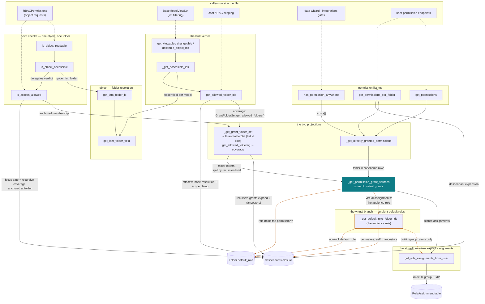

# IAM grant resolution

How an access question is answered in `backend/iam/models.py`. Companion to the
ADR [Remove all `is_published` fields; visibility becomes a folder default role](decisions/is-published-field-removal.md),
which records why the model looks like this; this page records how the code is
wired so a change can be reviewed against the intended structure.

There are two grant sources:

- **stored role assignments** — `RoleAssignment` rows, recursive or not;
- **virtual assignments** — `Folder.default_role`, granted non-recursively to
  the folder's members (see the ADR for the audience rule), computed on read
  and never written anywhere.

And two kinds of question:

- **verdicts** — "may this user do X here?", point or bulk;
- **listings** — "which permissions does this principal hold, and where?".

The two sources are enumerated in **exactly one function**,
`_get_permission_grant_sources`, which returns them as a pair of branches. Each question
axis is a projection of that pair, and the coverage predicate they feed — a
folder is covered when a non-recursive grant names it, or a recursive grant
names it or an ancestor — is stated exactly once (as `GrantFolderSet`'s own
data). It has **two evaluation sites**, not one: `get_allowed_folder_ids`
evaluates it over every folder (the bulk shape), and `is_access_allowed`
evaluates the same predicate anchored at the one folder being asked about (the
point shape) — cheaper because a folder has few ancestors, so the recursive
half of the predicate is one indexed lookup scoped to that folder, instead of
a join over the whole `ancestors` relation followed by a clamp back down to
one id. Both sites read the same `GrantFolderSet` fields, so they cannot drift
apart. Focus mode is handled the same way on both sides — as a gate anchored
at the folder in question, not a detour through the other site. Everything
else is plumbing.

## Call graph

The solid teal node is the single meeting point of the two grant sources;
orange edges are the virtual (default-role) branch; dashed arrows come from
outside the file. Special-case leaves (`_get_actor_accessible_ids_by_perm`,
`_get_permission_accessible_ids`, and the `FilteringLabel` add — which reads
the stored branch of `_get_permission_grant_sources` directly) are listed in the table
rather than drawn.

## The four invariants

1. **One meeting point.** The grant sources are enumerated only inside
   `_get_permission_grant_sources`; its two consumers are the projections
   `_get_grant_folder_set` (verdict axis: flat folder-id lists by recursion
   kind) and `_get_directly_granted_permissions` (listing axis: folder × codename
   rows). No other function reads `Folder.default_role` or combines
   assignments with default roles — so verdicts and listings agree by
   construction. Django forbids filtering a union, so the permission filter is
   applied per branch *inside* the builder; consumers project and combine the
   branches, they never re-derive them.
2. **Virtual grants never cascade.** The verdict projection merges the
   default-role folders into `GrantFolderSet.non_recursive_grant_folder_ids`,
   never into the recursive bucket — non-recursion is a property of the data
   shape, not a check.
3. **One coverage predicate, two evaluation sites.** Coverage — a
   non-recursive grant names the folder, or a recursive grant names it or an
   ancestor — is stated once, as `GrantFolderSet`'s own data. It is evaluated
   in two shapes, deliberately, not accidentally: `get_allowed_folder_ids`
   (via `GrantFolderSet.get_allowed_folders()`) evaluates it over every
   folder, clamped by an inline scope filter (folder is the base folder or a
   descendant) when focus mode or `base_folder` narrows the scope; scope and
   coverage must stay in **chained** `.filter()` calls there, since both join
   the multi-valued `ancestors` relation and a single call would force one
   ancestor row to satisfy both. `is_access_allowed` evaluates the same
   predicate anchored at the one folder being asked about — a focus-mode gate
   first (`folder.id == focused_folder_id` or `folder.ancestors.filter(id=focused_folder_id).exists()`,
   with the same root exception as the bulk clamp, #4470), then `folder.id`
   against the materialized non-recursive/recursive id sets, falling back to
   `folder.ancestors.filter(id__in=recursive_ids).exists()` only when neither
   set already contains `folder.id` — cheaper than the bulk site because both
   the focus gate and the recursive check cost one indexed lookup scoped to
   that folder, instead of a bulk join clamped back down to `id=folder.id`
   after the fact. Both sites read the same `GrantFolderSet` fields, so they
   cannot drift apart. `GrantFolderSet` itself is materialized in **one round
   trip** — a top-level union of (folder id, is_recursive) pairs — so only
   literal id lists ever reach either evaluation site (the PostgreSQL parser
   hazard is unions inside subqueries).
4. **Raw `RoleAssignment` queries are for write-capability or conservative
   fast paths only.** Any *view*-access answer computed from the table alone
   misses virtual grants; a raw query is acceptable only where a false negative
   falls through to an accurate primitive.

These invariants are executable: `backend/iam/tests/test_access_oracle.py`
checks the resolver against a brute-force plain-Python oracle over seeded
worlds (point ⟺ bulk ⟺ listings, focus and base-folder clamps included).
A refactor of this subsystem should leave that file untouched and green.
The read cost is pinned too: `TestVerdictQueryBudget` (in
`backend/iam/tests/test_folders.py`) asserts the bulk verdict
(`get_allowed_folder_ids`) always costs exactly 3 queries — the feature-flag
read, the grant-pairs union, the coverage query — while the point check
(`is_access_allowed`, outside focus mode) costs only 2 when `folder` is a
direct grant, paying a third, `folder`-anchored query only when it must climb
to find a covering recursive grant.

The model itself is pinned by `test_materialized_model_equivalence` (same
file as the oracle): the dynamic spec equals the **materialized model** —
virtual grants written down as explicit non-recursive assignments, evaluated
by pure role-assignment semantics — plus exactly one read-time backstop (a
third party never receives virtual grants, however misplaced), and the
backstop's delta is exactly those would-be grants, nothing else. Any layer-2
evolution of the audience rule must keep this equivalence green or amend the
materialized model consciously; if the virtual rows are ever materialized for
real, `materialize_virtual_assignments` is the projector's specification.

## Function reference

| Function | Contract | Calls |
|---|---|---|
| **Point checks** | | |
| `is_object_readable` | Alias: `is_object_accessible` with `view`. | `is_object_accessible` |
| `is_object_accessible` | Resolves the object to its governing folder (existence, `Actor` delegation, IAM scope), then delegates the verdict. | `get_iam_folder_id` · `is_access_allowed` |
| `is_access_allowed` | Model-level special cases — anonymous, `Permission` view-only, `FilteringLabel` add (the stored branch alone: a default role is view-only, so the virtual branch cannot carry an add permission) — then a focus gate anchored at `folder` (a covered root stays reachable outside the focused subtree, #4470), then the verdict itself: direct hit against a materialized `GrantFolderSet`'s id sets, else an ancestor-membership query scoped to `folder` alone. Never touches `get_allowed_folder_ids`. | `_get_grant_folder_set` · `_get_permission_grant_sources` |
| **The bulk verdict** | | |
| `get_allowed_folder_ids` | The bulk evaluation site: coverage from `GrantFolderSet.get_allowed_folders()`, clamped by an inline scope filter (folder is the base folder or a descendant) when focus mode or `base_folder` narrows the scope (the narrower of the two wins when nested; disjoint → empty; a covered root stays reachable in focus mode). | `_get_grant_folder_set` · `GrantFolderSet.get_allowed_folders` |
| **The coverage method** | | |
| `GrantFolderSet.get_allowed_folders` | The coverage rule, stated once (invariant 3), as a method on the dataclass: a folder is covered when a non-recursive grant names it, or a recursive grant names it or an ancestor. Returns a `QuerySet[Folder]`, not ids — the id projection and the `.distinct()` for the `ancestors` join duplication are the caller's job. | — |
| **The meeting point** | | |
| `_get_permission_grant_sources` | The single function where the two grant sources are enumerated, as a (stored assignments, virtual default-role folders) pair of branch querysets. Principal dispatch lives here (`User` → effective assignment set, `UserGroup` → its own assignments); the optional permission filter is applied per branch. | `get_role_assignments_from_user` · `_get_default_role_folder_ids` |
| **The two projections** | | |
| `_get_grant_folder_set` | Verdict projection: flat folder-id lists split by recursion kind, fetched in one round trip (top-level union of (folder id, is_recursive) pairs); virtual folders join the non-recursive bucket (invariant 2). Materialized — the verdict path carries no querysets. | `_resolve_permission` · `_get_permission_grant_sources` |
| `_get_directly_granted_permissions` | Listing projection: one row per (folder, codename, name, is_recursive) a grant names, unexpanded; NULL-perimeter rows preserved for parity. The permission-filtered form is for existence checks, not projection. | `_get_permission_grant_sources` |
| **The stored branch — explicit assignments** | | |
| `get_role_assignments_from_user` | Effective assignments: direct ∪ group-carried ∪ IdP-mapped; inactive users get none. | — |
| **The virtual branch — ambient default roles** | | |
| `_get_default_role_folder_ids` | The audience rule: builtin-group-carried grants → non-enclaved perimeters → self ∪ ancestors carrying a default role. The third-party backstop lives here; service accounts never reach it (their assignments carry no builtin group). | `get_role_assignments_from_user` |
| **Object-id layer** | | |
| `get_viewable/changeable/deletable_object_ids` | Per-model object ids the user may view/change/delete. | `_get_accessible_ids` |
| `_get_accessible_ids` | Objects whose governing folder is allowed; special-cases `Permission` (everyone views, nobody writes) and `Actor` (per-prefix delegate over the readable User ∪ Team ∪ Entity). | `get_allowed_folder_ids` · `get_iam_folder_field` |
| **Permission listings** | | |
| `has_permission_anywhere` | "Holds the codename on any folder" — an `exists()` on the filtered relation. | `_get_directly_granted_permissions` |
| `get_permissions` | Codename map of everything the principal holds, virtual grants included. | `_get_directly_granted_permissions` |
| `get_permissions_per_folder` | folder-id → codenames map; recursive rows expand to descendants through one bulk closure query. | `_get_directly_granted_permissions` |
| **Object → folder scope** | | |
| `get_iam_folder_id` / `get_iam_folder_field` | Governing folder of an object: its `folder` field, or the field named by `IAM_SCOPE_FIELD` (undeclared models raise `IAMNotImplementedError`). | — |

Function names, not line numbers, anchor this page: lines drift with every
edit, the structure only changes when someone adds a grant source — which, per
invariant 1, must happen inside `_get_permission_grant_sources` and nowhere else.
