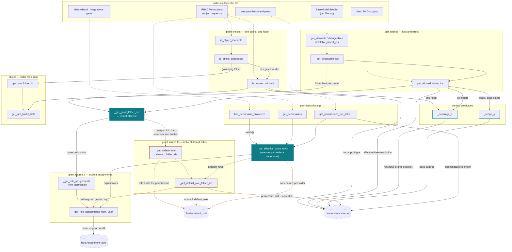

# IAM grant resolution

How an access question is answered in `backend/iam/models.py`. Companion to the
ADR [Remove all `is_published` fields; visibility becomes a folder default role](decisions/is-published-field-removal.md),
which records why the model looks like this; this page records how the code is
wired so a change can be reviewed against the intended structure.

There are two grant sources:

- **explicit role assignments** — `RoleAssignment` rows, recursive or not;
- **ambient default roles** — `Folder.default_role`, granted to the folder's
  members (see the ADR for the audience rule).

And two kinds of question:

- **verdicts** — "may this user do X here?", point or bulk;
- **listings** — "which permissions does this principal hold, and where?".

Each axis has exactly one place where the two grant sources meet, and the
verdict axis has exactly one coverage rule. Everything else is plumbing.

## Call graph

Solid teal nodes are the two meeting points (one per axis); teal-outlined nodes
are the two predicates; orange edges are the ambient (default-role) path;
dashed arrows come from outside the file. Special-case leaves
(`_get_actor_accessible_ids`, `_get_permission_accessible_ids`, the
`FilteringLabel` add) are listed in the table rather than drawn.

## The four invariants

1. **One meeting point per axis.** The grant sources meet only inside
   `_get_grant_folder_set` (verdict axis, folder-id sets) and
   `_get_effective_grant_rows` (listing axis, folder × codename rows). No other
   function reads `Folder.default_role` or unions the sources on its own — so
   verdicts and listings agree by construction.
2. **Ambient never cascades.** Default-role folders are merged into
   `GrantFolderSet.non_recursive_grant_folder_ids`, never into the recursive
   bucket — non-recursion is a property of the data shape, not a check.
3. **One verdict rule.** `_coverage_q` states coverage once — a non-recursive
   grant names the folder, or a recursive grant names it or an ancestor — and
   is applied to one folder (`is_access_allowed`) or to all folders
   (`get_allowed_folder_ids`). Focus mode and `base_folder` narrow the bulk
   result with `_scope_q`; they never introduce a second coverage rule. The two
   predicates must stay in **chained** `.filter()` calls: both join the
   multi-valued `ancestors` relation, and a single call would force one
   ancestor row to satisfy both.
4. **Raw `RoleAssignment` queries are for write-capability or conservative
   fast paths only.** Any *view*-access answer computed from the table alone
   misses ambient grants; a raw query is acceptable only where a false negative
   falls through to an accurate primitive.

These invariants are executable: `backend/iam/tests/test_access_oracle.py`
checks the resolver against a brute-force plain-Python oracle over seeded
worlds (point ⟺ bulk ⟺ listings, focus and base-folder clamps included).
A refactor of this subsystem should leave that file untouched and green.

## Function reference

| Function | Contract | Calls |
|---|---|---|
| **Point checks** | | |
| `is_object_readable` | Alias: `is_object_accessible` with `view`. | `is_object_accessible` |
| `is_object_accessible` | Resolves the object to its governing folder (existence, `Actor` delegation, IAM scope), then delegates the verdict. | `get_iam_folder_id` · `is_access_allowed` |
| `is_access_allowed` | The point verdict. Owns the prologue — anonymous, `Permission` view-only, `FilteringLabel` add, the focus-mode gate (root exempt) — then evaluates coverage on the one folder. | `_get_grant_folder_set` · `_coverage_q` |
| **The two predicates** | | |
| `_coverage_q` | The coverage rule, stated once (invariant 3). Grant-folder ids are materialized into flat literal `IN` lists: they are small by nature, and inlining them keeps unions out of subqueries (PostgreSQL parser-depth limit). | — |
| `_scope_q` | The clamp: folder is the base folder or a descendant. Combined with coverage via chained `.filter()` calls only. | — |
| **The two meeting points** | | |
| `_get_grant_folder_set` | Verdict axis. Explicit perimeters split by recursion kind, ambient default-role folders merged into the non-recursive bucket → `GrantFolderSet`. | `_get_role_assignments_from_permission` · `_get_default_role_allowed_folder_ids` |
| `_get_effective_grant_rows` | Listing axis. One row per (folder, codename, name, is_recursive) a grant names, unexpanded; NULL-perimeter rows preserved for parity. With a `permission` argument the relation is restricted to matching roles — for existence checks, not projection. Accepts `User` or `UserGroup` principals. | `get_role_assignments_from_user` · `_get_default_role_folder_ids` |
| **Grant source 1 — explicit** | | |
| `_get_role_assignments_from_permission` | The user's assignments whose role holds the permission. | `get_role_assignments_from_user` · `_resolve_permission` |
| `get_role_assignments_from_user` | Effective assignments: direct ∪ group-carried ∪ IdP-mapped; inactive users get none. | — |
| **Grant source 2 — ambient** | | |
| `_get_default_role_allowed_folder_ids` | Member folders whose default role holds the permission, materialized to a plain list. | `_get_default_role_folder_ids` |
| `_get_default_role_folder_ids` | The audience rule: builtin-group-carried grants → non-enclaved perimeters → self ∪ ancestors carrying a default role. The third-party backstop lives here; service accounts never reach it (their assignments carry no builtin group). | `get_role_assignments_from_user` |
| **Bulk checks** | | |
| `get_viewable/changeable/deletable_object_ids` | Per-model object ids the user may view/change/delete. | `_get_accessible_ids` |
| `_get_accessible_ids` | Objects whose governing folder is allowed; special-cases `Permission` (everyone views, nobody writes) and `Actor` (delegates to the wrapped User/Team/Entity). | `get_allowed_folder_ids` · `get_iam_folder_field` |
| `get_allowed_folder_ids` | The bulk verdict: coverage over all folders, clamped by `_scope_q` when focus mode or `base_folder` narrows the scope (the narrower of the two wins when nested; disjoint → empty). In focus mode a covered root stays reachable. | `_get_grant_folder_set` · `_coverage_q` · `_scope_q` |
| **Permission listings** | | |
| `has_permission_anywhere` | "Holds the codename on any folder" — an `exists()` on the filtered relation. | `_get_effective_grant_rows` |
| `get_permissions` | Codename map of everything the principal holds, ambient included. | `_get_effective_grant_rows` |
| `get_permissions_per_folder` | folder-id → codenames map; recursive rows expand to descendants through one bulk closure query. | `_get_effective_grant_rows` |
| **Object → folder scope** | | |
| `get_iam_folder_id` / `get_iam_folder_field` | Governing folder of an object: its `folder` field, or the field named by `IAM_SCOPE_FIELD` (undeclared models raise `IAMNotImplementedError`). | — |

Function names, not line numbers, anchor this page: lines drift with every
edit, the structure only changes when someone adds a grant source — which, per
invariant 1, must happen inside the two meeting points and nowhere else.
