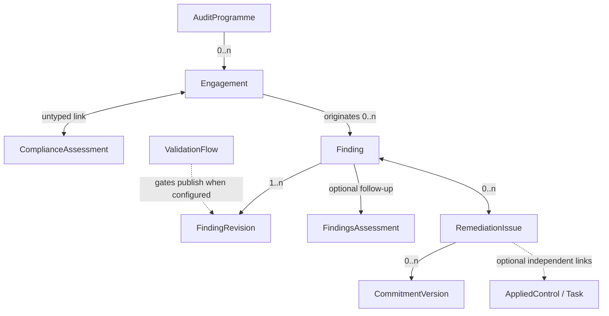

# CISO Assistant — Audit, Findings and Remediation Target Model

**Status:** Proposed design — consolidated review draft
**Date:** 16 August 2026
**Scope:** Audit programme and engagement management, finding publication and validation, findings follow-up, and formal remediation issues

## 1. Executive summary

CISO Assistant already provides strong framework-based compliance assessments, findings follow-up, tasks, and rich Applied Controls. The target model adds three capabilities without weakening those existing concepts:

1. **Audit engagement management** for auditors who need to manage missions that may not use a framework.
2. **Finding publication** — immutable, versioned auditor assertions, optionally gated by the global validation system.
3. **Remediation Issues** for cases where two sides need to formalize, agree, and track a remediation path without necessarily creating Applied Controls.

The design deliberately keeps the following concepts separate:

- A **Finding** is an observation or formal assertion.
- A **Remediation Issue** is a governed remediation case containing discussion and an agreed commitment.
- A **Task** is a work item.
- An **Applied Control** is CA's rich, durable action-plan and safeguard object.
- An **OrganisationIssue** is an ISO 27001 organizational-context issue (*enjeu*) and is completely unrelated to a Remediation Issue.

The model favors explicit links, independent lifecycles, immutable published audit content, no implicit access inheritance, and compatibility with supported existing workflows. Existing Finding status codes and metrics remain valid; the target model gives previously undefined role interactions explicit semantics rather than treating them as a compatibility contract.

## 2. Design goals

- Support internal and frameworkless audit missions.
- Preserve the existing framework-based `ComplianceAssessment` workflow.
- Separate confidential auditor work from recipient-side follow-up.
- Allow lightweight finding tracking without requiring an Issue.
- Add formal remediation dialogue and bilateral commitment only when needed.
- Keep Applied Controls optional and independent.
- Reuse existing Comments, Documents, history, IAM, Validation flows, Tasks, and Applied Controls.
- Preserve flexibility: links do not own objects, synchronize statuses, or grant permissions.
- **Upgrade without invented history:** existing Findings remain editable drafts, keep their status vocabulary and historical metrics, and become immutable only after an explicit first publication.

## 3. Non-goals

- Replacing `ComplianceAssessment`.
- Replacing `FindingsAssessment`.
- Creating a lightweight variant of Applied Controls.
- Turning Engagements into a document, meeting, calendar, or resource-planning system.
- Combining ISO organizational context issues with remediation cases.
- Defining the full permission matrix. The access principles and the respondent-role mechanism are fixed in §13; exact permission lists are implementation.

## 4. Target concepts

| Model | User-facing concept | Responsibility |
|---|---|---|
| `AuditProgramme` | Audit programme / annual audit plan | Portfolio of planned Engagements |
| `Engagement` | Audit engagement / mission d'audit | Auditor-side mission workspace; carries the validation configuration |
| `ComplianceAssessment` | Compliance assessment / audit | Framework-based assessment; existing model |
| `Finding` | Finding / constat | Stable identity: follow-up state plus a chain of assertion revisions |
| `FindingRevision` | Finding revision | One immutable published assertion (or the single working draft) |
| `ValidationFlow` | Validation | Existing global validation request; gates publication when configured |
| `FindingsAssessment` | Follow-up / suivi des constats | Recipient-side collection and coordination of Findings; existing model |
| `RemediationIssue` | Issue / problème | Formal remediation dialogue, commitment, acceptance, and verification |
| `CommitmentVersion` | (internal) | One version of an Issue's commitment text and due date |
| `AppliedControl` | Applied control | Rich action plan and durable safeguard; existing model |
| `Task` | Task | Atomic work item (`TaskTemplate` + generated `TaskNode`s); existing model |
| `OrganisationIssue` | Organizational issue / enjeu | ISO 27001 internal or external context issue; existing and completely distinct |

## 5. Domain overview

Additional rules:

- Each Engagement belongs to zero or one Audit Programme.
- Each Finding originates from zero or one Engagement.
- Each Finding — draft or published — belongs to zero or one Findings Assessment.
- A Findings Assessment may aggregate Findings from several Engagements or external sources.
- Findings and Remediation Issues have a many-to-many relationship.
- The Engagement–Findings Assessment relationship is derived through Findings; it is not stored directly.
- All links grant **zero** access by themselves.

## 6. Audit programme management

### 6.1 Purpose

`AuditProgramme` represents an annual or multi-year portfolio of audit missions. It is a living planning object, not an immutable approved document.

### 6.2 Minimum fields

| Field | Requirement |
|---|---|
| `reference` | Optional programme identifier |
| `name` | Required |
| `description` | Optional rich text |
| `objectives` | Optional rich text |
| `period_start`, `period_end` | Programme horizon |
| `status` | Required; never unset |
| `approved_by`, `approved_at` | Informational; filled automatically by the transition to `approved` |
| `cancellation_reason` | Required when cancelled |
| Documents | Existing Documents linked to the programme |
| Engagements | Zero or more; each Engagement has at most one programme |

### 6.3 Lifecycle

| Status | Meaning |
|---|---|
| `draft` | Programme is being prepared |
| `approved` | Programme is authorized but has not started |
| `active` | Programme period is underway |
| `completed` | Programme is closed |
| `cancelled` | Programme was abandoned |

All transitions are explicit user actions; nothing is derived from dates. The transition to `approved` automatically records `approved_by` and `approved_at` — the status change *is* the approval, and the metadata documents who performed it and when.

An approved programme remains editable. Changes are captured through ordinary history and do not create immutable programme revisions or reset the approval.

A cancelled programme may be explicitly reactivated to `draft`, `approved`, or `active`. Reactivation is authorized and historical; it has no automatic effect on its Engagements.

## 7. Engagement management

### 7.1 Purpose

`Engagement` is the confidential auditor-side workspace for a mission. It supports missions with or without a framework and remains independent from recipient-side follow-up.

### 7.2 Minimum fields

| Field | Requirement |
|---|---|
| `reference` | Optional mission identifier |
| `name` | Required |
| `description` | Optional context |
| `objectives` | Optional rich text |
| `scope` | Optional rich text |
| Scope links | Optional untyped M2Ms to perimeters, entities, and assets (see §7.6) |
| `status` | Required; never unset |
| `planned_start_date`, `planned_end_date` | Optional schedule |
| `started_at`, `completed_at` | Actual lifecycle timestamps |
| `cancellation_reason` | Required when cancelled |
| `audit_programme` | Optional; at most one |
| `final_report_document` | Optional reference to an existing Document |
| Validation layers | Up to three validator lists plus two concurrency flags (see §9) |
| Compliance Assessments | Untyped many-to-many links |
| Documents | Minutes, workpapers, evidence, draft reports, and other material |
| Findings | Zero or more originating Findings |

### 7.3 Lifecycle

| Status | Meaning |
|---|---|
| `planned` | Mission is scheduled but has not started |
| `in_progress` | Audit work is underway |
| `in_review` | Conclusions or deliverables are being reviewed |
| `done` | Audit work and reporting are complete |
| `cancelled` | Mission was stopped or never started |

Engagement completion is independent of remediation. Open Findings, Issues, Tasks, Applied Controls, or Findings Assessments do not keep an Engagement open.

Before closure, the UI should identify draft Findings that have been neither published nor explicitly discarded. This is a consistency check rather than a lifecycle cascade.

A cancelled Engagement may be explicitly reactivated to `planned` or `in_progress`. The prior cancellation actor, date, and reason remain in history, and reactivation has no automatic effect on linked objects.

### 7.4 Documents and final report

Meeting minutes, working papers, evidence, and reports reuse the existing Document models. No `EngagementMeeting` or `AuditReport` model is introduced.

`final_report_document` identifies the official deliverable while the Document retains its own lifecycle and version history. A final report is not globally required; methodologies or templates may make it mandatory.

### 7.5 Compliance Assessments

Engagements and Compliance Assessments use a simple, untyped many-to-many link:

- neither object owns the other;
- each retains its own lifecycle;
- the relation has no workflow meaning;
- the relation grants no access.

This lets a mission coordinate several framework assessments and lets an assessment be referenced from more than one mission where needed.

### 7.6 Scope links

Beyond the free-text `scope`, an Engagement may link perimeters, entities, and assets. These links are optional and untyped: they enable cross-reporting ("all engagements touching asset X", "audits of supplier Y") and carry no workflow meaning and no access consequences, like every other link in this design.

## 8. Findings: identity, revisions, and publication

### 8.1 One identity, reified revisions

A single `Finding` exists from draft through follow-up. A separate `EngagementFinding` model is not introduced.

The assertion content lives in **`FindingRevision` rows**, taking the document-management revision mechanism as inspiration (revision rows, a current pointer, a single working draft) without mandating reuse of its components:

- Each revision carries a `version_number` and a status: `draft`, `published`, or `superseded`.
- **At most one draft revision exists per Finding at any time.** Corrections to a published Finding create a new draft based on the latest published revision.
- The Finding holds a **`current_published_revision` pointer**. It moves **only on publish**, atomically: the new revision is stamped `published_at`/`published_by`, the previously published revision becomes `superseded`, and the pointer flips. A coexisting draft never changes what recipient-side readers see.
- **Assertion fields are frozen at the model level once a revision leaves `draft`.** Published and superseded revisions are never edited; a newer revision supersedes the previous one, it does not rewrite it.
- Each validation submission and published revision stores an immutable, generated **`assertion_manifest` JSON**, its **`assertion_hash`**, and a manifest schema version. The manifest contains the relevant assertion context and a reference capsule for each referenced object: object type, stable ID or URN, display context, public-hash version, and public hash.
- Referenced models expose a versioned public-hash method covering their material public fields, not secondary detail. The Finding hash is calculated from a canonical serialization of the manifest. This detects material dependency changes while avoiding irrelevant invalidation and without requiring a snapshot table per referenced model.
- Relational fields and live links remain the working data. The stored manifest is the immutable, human-readable validation and publication record; it is generated by the backend and is never manually edited.
- A published Finding may be **withdrawn** with an actor, date, and reason, recorded on the Finding identity. Withdrawal is a formal retraction and is distinct from revision supersession. A Finding is never deleted to simulate withdrawal.

Withdrawal is terminal for the Finding identity. A withdrawn Finding cannot receive or publish another revision. If the matter must be raised again, a new Finding is created; ordinary corrections use a newer revision without withdrawing the Finding.

This mechanism is deliberately designed as a general pattern — a lifecycle contract (identity, revision chain, current pointer, single draft, gated publish) with a per-model assertion-manifest payload — so it can be **backported to other models in the future** (assessments, policies), progressively superseding the immutability role of the rudimentary `is_locked` flag. The campaign-deadline role of `is_locked` is a separate concern and is unaffected.

### 8.2 Publication and follow-up are separate actions

Publishing a Finding does not require a Findings Assessment. Two independent actions exist:

1. **Publish** — make the auditor assertion official and immutable, subject to the validation condition of §9.
2. **Add to follow-up** — place the Finding in a recipient-side `FindingsAssessment`.

The UI may offer **Publish and add to follow-up** as the common combined action.

Publication itself does not grant access. Any recipient access is assigned explicitly through IAM (§13).

Only a published Finding represents a formal auditor assertion. An Issue created directly from a Requirement Assessment is not automatically included as a Finding in an Engagement's final report. If the matter must become a formal conclusion, the auditor creates and publishes a Finding, then links it to the existing Issue.

`Finding.created_from` is an optional immutable creation-provenance reference. It identifies a Requirement Assessment or another supported source when the Finding is generated from one and is empty for a manually authored Finding. `originating_engagement` remains the separate mission provenance: it may change before first publication, which invalidates any validation submission, and becomes immutable after first publication.

Findings created directly in a Findings Assessment with no Engagement — externally sourced or transcribed findings — may remain unpublished drafts indefinitely and stay freely editable; with no engagement there is no validation configuration, so publishing them, when desired, is direct.

### 8.3 Assertion fields and follow-up fields

Assertion content belongs to the revision and freezes at publication. Follow-up data belongs to the stable Finding identity and remains mutable throughout. The complete classification of the current model's fields:

| Assertion — on the revision, frozen at publication | Follow-up / identity — mutable |
|---|---|
| Title and description | Follow-up `status` (§8.5) |
| Observation | `priority` (remediation urgency) |
| Severity | Owner / assignee |
| Requirement references | `eta`, `due_date` |
| Threats and vulnerabilities | Linked Issues |
| Reference controls (recommended) | Linked Applied Controls |
| Affected assets | Follow-up evidences (existing `Finding.evidences`) |
| Auditor recommendation (new field) | Recipient responses |
| — | `ref_id` (stable human reference across revisions) |

For list views and search, the projection depends on the authorized perspective: recipient-side views use `current_published_revision`, while auditor-side working views may show the draft. Any denormalized headline fields are caches only; the selected revision remains the source of truth and draft content must never leak through a recipient-side index.

### 8.4 Publication lifecycle

Publication state is derived rather than stored independently:

- `withdrawn_at` is set → `withdrawn`;
- otherwise, `current_published_revision` exists → `published`;
- otherwise → `draft`.

A newer unpublished draft may coexist with the current published revision. Publishing the new revision makes it current. It does not reset follow-up state or invalidate linked Issue commitments. Notification of recipients on publication follows the notification rules (future work, §16).

Publication requires a non-`--` follow-up status. A published Finding cannot return to `--`. A dismissed Finding must first return to a non-terminal follow-up status before publication, and a Finding that has ever been published cannot subsequently be marked `dismissed`; formal retraction uses withdrawal.

### 8.5 Follow-up lifecycle: additive evolution

The existing status vocabulary is **kept, not remapped** — it remains the follow-up dimension, and historical data and metrics stay valid. The values serve two populations: *triage* states matter for imported findings (scanner output, transcribed external reports), while for engagement-authored findings the publication dimension supplies the formal assertion lifecycle.

| Status | Phase | Notes |
|---|---|---|
| `--` | Draft | Not set; legitimate while a never-published Finding is still tentative; default for new drafts |
| `identified` | Triage | Matter has been identified |
| `confirmed` | Triage | |
| `dismissed` | Terminal | Rejected at triage; never used after publication |
| `assigned` | Active | |
| `in_progress` | Active | |
| `mitigated` | Active | Risk reduced / compensating control |
| `resolved` | Resolution | Remediation reported complete; may still require formal verification/closure |
| `closed` | Terminal | Remediation verified and Finding formally closed |
| `risk_accepted` | Terminal | **New** — resulting risk accepted |
| `deprecated` | — | Grandfathered; valid on existing rows, hidden for new findings |

- No separate "outcome" field is introduced: terminal statuses carry the outcome.
- Existing metrics continue to treat both `resolved` and `closed` as dealt with, while the workflow retains their useful distinction between reported resolution and verified closure.
- Dashboards group statuses into draft / triage / active / resolution / terminal phases; grouping is presentation only — stored codes never change meaning.

Finding follow-up remains useful without a Remediation Issue. When an Issue exists, both lifecycles remain independent and are never synchronized automatically.

### 8.6 Findings Assessment

`FindingsAssessment` remains the existing recipient-side follow-up container and keeps its current database name.

- It contains many Findings; a Finding belongs to at most one Findings Assessment.
- It may aggregate Findings from several Engagements or from no Engagement.
- Its `category` (pentest, audit, self-identified, responsible disclosure…) is a broad informational classification of the Follow-up, not authoritative provenance and not a constraint on its Findings. Exact provenance, when available, belongs to each Finding and its source relationships.
- Its status remains manually managed. It may be marked `done` while Findings remain open, after a strong warning and explicit confirmation.
- Closing it never cascades to Findings, Issues, Tasks, or Applied Controls.
- **Deleting** a Findings Assessment that contains findings asks the user what to do (§15).

Its existing status values, including unset and `deprecated`, remain for backward compatibility. New models do not adopt `deprecated`.

## 9. Finding validation workflow

### 9.1 Principle

**Validation is a condition for publishing, nothing more.** It does not freeze content (immutability comes from publication, §8.1), it never retro-affects a published revision, and it is entirely optional.

The gate reuses the **global `ValidationFlow` model** — its inbox, its `FlowEvent` history, its requester/approver separation and deadlines — rather than an embedded reviewer workflow. Review states live on the flow; the revision status stays minimal (`draft`/`published`/`superseded`).

### 9.2 Configuration: validation layers on the Engagement

The Engagement carries up to **three validation layers**. Each layer is a list of validator users; layers 2 and 3 each carry a boolean `wait_for_previous`.

- **Validation is required if and only if at least one layer is non-empty.** The configuration *is* the assignment: there is no way to require validation without saying who validates. An engagement with no validators — and any finding without an engagement — publishes directly.
- **OR within a layer:** any one validator of the layer suffices.
- **AND between layers:** every non-empty layer must be satisfied.
- **`wait_for_previous` = true:** the layer is blocked until all *earlier non-empty* layers are satisfied (empty layers never block). False: the layer may validate concurrently.
- The three lists must be disjoint.
- Example — "first X and Y, then Z": X in layer 1; Y in layer 2 with wait = false; Z in layer 3 with wait = true.
- Assignment to a validation layer grants no access. Every configured validator must independently hold the IAM permission and role required to view and validate the Finding, normally an auditor-side role such as Analyst. Submission does not auto-grant anything.

The plain case "any of these people" is simply layer 1 alone.

### 9.3 Mechanics

- Submitting a draft creates a validation submission identified by `submission_id`. It stores the generated assertion manifest and hash and snapshots the Engagement's layer configuration.
- The submission creates **one shared ValidationFlow per non-empty layer**, not one per validator. Each layer flow carries its authorized validator list and one current status.
- Any authorized validator may transition the layer's shared status. `FlowEvent` records the natural user who acted. Several validators in a layer are alternatives acting on one state; there are no sibling flows, votes, or dropped siblings.
- `wait_for_previous` controls when a layer is actionable. A waiting layer cannot transition until all earlier non-empty prerequisite layers are accepted; a concurrent layer may act immediately.
- Changing the Engagement's validators affects future submissions, never an in-flight submission whose configuration has already been snapshotted.
- The publication requirement is exposed as a single predicate — “every non-empty layer of the current submission is accepted for the current assertion hash” — checked by the publish transition.

### 9.4 Rules

- **Any assertion-hash change makes the submission stale.** This includes a draft edit, a relationship change, a change of originating Engagement, or a material public-hash change in a referenced object. Secondary changes excluded from a referenced object's public hash do not invalidate validation.
- Staleness is detected lazily by recomputing the manifest and hash when validation state is displayed or publication is attempted; cross-model event listeners are not required. A stale draft must be resubmitted under a new `submission_id`.
- `change_requested` is the shared current state of its layer. Any authorized validator may later change that same state to `accepted`; an accepted layer cannot simultaneously carry an outstanding change request.
- Publication requires every non-empty layer to be currently `accepted`. There is no publish-with-warning path.
- Publication atomically recomputes and compares the assertion hash, checks all layers, publishes the revision, and marks the accepted submission as consumed (for example with `used_for_publication_at` or a link to the published revision).
- A consumed submission, its validator snapshot, and all of its layer states are immutable. Objections after publication use comments, a revised Finding, or terminal withdrawal; they never rewrite the validation record that authorized publication.
- `rejected`, `revoked`, and `expired` matter only before publication. Retraction of a published Finding is withdrawal (§8.1), never flow revocation.
- Whether a draft's author may appear among its validators is UI policy (discouraged), not a core data constraint.

## 10. Remediation Issues

### 10.1 Purpose and creation threshold

`RemediationIssue` is used only when CA users want to formalize the remediation path. It is not required for every Finding, failed Requirement Assessment, comment thread, or task.

An Issue adds:

- explicit Lead and optional Respondent sides;
- a structured dialogue using existing Comments;
- at most one current remediation proposal or agreed commitment;
- acceptance by all represented sides;
- target date, execution phase, evidence, verification, and resolution;
- links to relevant business objects without lifecycle coupling.

An Issue may be created standalone or from a Finding, Requirement Assessment, Risk, or other supported object. **Creation provenance is a first-class, immutable `created_from` reference** set at creation (empty for standalone Issues) — queryable and shown in the UI. Other links are untyped, and later link changes are captured in history.

`OrganisationIssue` is not a special source type and has no dedicated relationship to Remediation Issues.

### 10.2 Minimum fields

| Field | Requirement |
|---|---|
| `reference` | Optional identifier |
| `title` | Required |
| `description` | Required self-contained problem context |
| `priority` | Optional; no Issue severity field |
| `status` | Required; defaults to `planned` |
| `created_from` | Optional immutable creation provenance |
| Commitment | Zero or one current proposed/agreed version; see §10.4 |
| Acceptance state | Absent without a commitment; otherwise one state per represented side for the current version |
| `resolution` | Required when `done` |
| `closure_justification` | Required when `done`; authoritative reason why closure is justified |
| `cancellation_reason` | Required when `cancelled` |
| `closed_at` | Set on closure and preserved in history on reopening |
| Related objects | Optional untyped links |
| Comments, Documents and `evidences` | Existing models; optional Issue evidence M2M |

Issue priority expresses remediation urgency. Severity remains on source Findings, Risks, or assessment results and is not copied into an aggregate Issue field.

### 10.3 Actors and sides

Issue participation assigns existing actors—Users, Teams, or Entities—to:

- side: `lead` or `respondent`;
- capacity: `representative` or `contributor`.

No new Party model is introduced.

- The Lead side exists conceptually; the Respondent side is optional.
- Each side may have several representatives and contributors.
- Representatives of one side act interchangeably as a single logical actor.
- Acceptance is recorded once per side, not once per representative.
- History records the effective actor, represented side, and natural user performing an action.
- An Issue may temporarily lack representatives; it then cannot progress through representative-dependent actions.
- On the respondent side, actions are exercised by users holding the respondent role (§13).
- Contributors may participate in dialogue but cannot propose, revise, or accept a commitment.

### 10.4 Commitment model

An Issue has **zero or one current commitment version** and zero or more historical **`CommitmentVersion` rows**. Each row contains a version number, rich text, optional due date, author, represented actor and side, and timestamp. There is no user-facing Commitment collection and no special dialogue-entry model: the UI shows a single proposed or agreed commitment; versions are plumbing that acceptance can reference reliably.

An Issue may be created before a remediation proposal exists—for example, when the Lead formally asks the Respondent to propose a solution. In that state, acceptance is absent and the UI shows **Awaiting remediation proposal**. Any representative of either side may create version 1 or propose a later revision. Before bilateral acceptance the UI calls the current version the **Proposed commitment**; after acceptance it becomes the **Agreed commitment**.

Existing Comments support negotiation. The current commitment version is the authoritative agreement; previous versions and their acceptance events remain queryable history.

Acceptance covers only:

- commitment text;
- commitment due date.

It does **not** cover linked Tasks, Applied Controls, Documents, evidence, Comments, or other object links. Binding steps or milestones must be stated in the commitment text.

**Any change to the commitment text or due date creates a new version and resets both side acceptances.** There is no materiality judgment and no minor-edit exception.

Creating a version uses optimistic concurrency: the request includes `based_on_version_id` (null for the first proposal), and the backend accepts it only if that value is still current. A conflict returns the newer proposal for review; the model never creates competing current branches.

### 10.5 Bilateral acceptance

With no current commitment, there are no acceptance states and no acceptance action. When a commitment exists, each represented side has one acceptance state for that version:

- `pending`
- `accepted`
- `changes_requested`

The overall state is derived with the precedence **changes_requested > pending > accepted**:

| Condition | Overall state |
|---|---|
| Any side has requested changes | Changes requested |
| No changes requested; Lead pending | Pending Lead acceptance |
| No changes requested; Lead accepted, Respondent pending | Pending Respondent acceptance |
| All represented sides accepted | Accepted |

There is no imposed order: either side may accept first. When no Respondent side exists, Lead acceptance is sufficient. Acceptance is distinct from Issue execution status.

Representatives of a side act as one logical person: the model does not collect votes or require unanimity among representatives. The same natural user may technically act for both sides; a UI policy may discourage or prevent this, but it is not a core data constraint.

Acceptance events record the commitment version, side, represented actor, natural user, state, and timestamp. When a current version exists, adding a Respondent side creates its pending acceptance. Removing the side means that its acceptance no longer participates in the current overall state, but the event remains in history. Participant changes do not reset other acceptances; the UI warns before removing a side that has participated.

### 10.6 Issue lifecycle

| Status | Meaning |
|---|---|
| `planned` | Issue is recorded but active handling has not started |
| `in_discussion` | Parties are defining or revising the commitment |
| `in_remediation` | Changes are being implemented |
| `in_review` | Remediation awaits verification |
| `done` | Resolution has been verified |
| `cancelled` | Issue workflow was abandoned |

Status and acceptance are orthogonal. For example, implementation may continue while a commitment amendment is being discussed.

No status changes automatically when acceptance changes. After bilateral acceptance, the UI may offer **Start remediation**, but an authorized user explicitly performs the transition.

The normal path uses `in_review`, but the backend need not require it before `done`. Any non-terminal status may exist before a proposal is made: status describes operational reality, while commitment and acceptance describe formal agreement. Closure requires a current commitment accepted by every represented side and a closure justification.

### 10.7 Terminal outcomes and reopening

Recommended `done` resolutions:

- `remediated`
- `accepted_as_is` — English "Accepted as-is"; French "Accepté en l'état"
- `not_applicable`

Recommended cancellation reasons:

- `duplicate`
- `superseded`
- `withdrawn`
- `created_in_error`
- `other`

`accepted_as_is` is a resolution, not an Issue status, and is distinct from acceptance of the commitment. Its commitment documents the decision and any conditions; its due date may be empty.

`closure_justification` explains what was verified and why the selected resolution permits closure. The actor and time of verification come from the transition history and `closed_at`; no separate Verification model is introduced. The justification, current commitment, and its acceptances are frozen while the Issue is `done`.

The UI labels this field **Closure justification** in English and **Justification de clôture** in French.

A `done` Issue may be explicitly reopened. Previous closure data stays in history. Reopening makes the commitment and acceptance workflow editable again; a changed remediation path creates a new commitment version and resets acceptance. A genuinely new problem should create a new Issue instead.

A cancelled Issue is terminal because it is a formal abandoned workflow record. Renewed handling creates a new Issue rather than reactivating the cancelled one.

### 10.8 Dialogue and evidence

The existing Comment model is used for Issue dialogue. No `RemediationIssueEntry` model is introduced.

- Finding comments discuss the observation, scope, severity, or factual challenge.
- Issue comments discuss the remediation commitment, execution, and verification.
- Comments are not copied when an Issue is created.
- Comments are text-only. **Evidence is provided through linked Documents and the explicit optional `evidences` M2M to the existing Evidence model**, not through comment attachments.
- Existing `Finding.evidences` and `FindingsAssessment.evidences` remain valid for lightweight follow-up. Issue evidence is independent: evidence is never copied or synchronized automatically between a Finding, its Follow-up, and a linked Issue.
- A combined activity view may display both contexts when the user can independently access them.

When an Issue is created from a source, the UI may prefill its title and description. The creator must review and explicitly save the copied text because Issue participants may not have access to the source. The Issue content is independent and never synchronized from the source.

### 10.9 Supported creation paths

The model supports both lightweight and formal audit paths:

1. **Direct remediation:** Requirement Assessment → Remediation Issue.
2. **Formal audit conclusion:** Requirement Assessment → Finding → Remediation Issue.
3. **Early collaboration followed by publication:** create the Issue from the Requirement Assessment, then later create the Finding and link it to the same Issue.
4. **Frameworkless audit:** Engagement → Finding → optional Findings Assessment → optional Remediation Issue.
5. **External source:** create a Finding directly in a Findings Assessment, with no Engagement.
6. **Standalone remediation:** create a Remediation Issue with no source object.

The third path never creates a second Issue. The Finding and Requirement Assessment become untyped related objects of the existing remediation case.

## 11. Tasks and Applied Controls

Applied Controls remain CA's rich action plans and durable safeguards. Remediation Issues do not replace or simplify them.

- Task links follow the existing pattern: **`TaskTemplate` carries the M2M links** (it already links findings, applied controls, and assessments) and gains a `remediation_issues` M2M. Generated `TaskNode` occurrences follow their template; nothing links nodes directly.
- Tasks and Applied Controls are optional links from an Issue.
- They are not part of the accepted commitment unless described explicitly in its text.
- Their lifecycle never changes the Issue automatically.
- Issue closure never closes a Task or Applied Control.
- Completing a Task or Applied Control never closes an Issue.
- A durable Applied Control may remain active after the Issue that prompted it is closed.

The same independence applies between Findings and their Tasks or Applied Controls.

## 12. Relationship and lifecycle rules

| Event | Automatic effect |
|---|---|
| Link two objects | No access grant and no lifecycle change |
| Publish Finding revision | Locks assertion revision; no follow-up status change |
| Publish a revised Finding | No Issue commitment reset |
| Withdraw a Finding | Finding becomes terminal; no linked-object closure; show warnings |
| Assertion hash changes under validation | Current submission becomes stale; resubmission required |
| Validator requests changes | Shared layer state becomes `change_requested`; publication is blocked until accepted |
| Validation requirement satisfied | Publish becomes available; no automatic publication |
| Publish using accepted validation | Validation submission is consumed and sealed |
| Accept commitment | No automatic move to `in_remediation` |
| Edit accepted commitment (text or due date) | New version; reset both acceptances |
| Add or remove Issue participants | Record history; no link-based permission or automatic reset of other acceptances |
| Edit commitment or acceptance on a `done` Issue | Rejected; reopen the Issue first |
| Complete Applied Control or Task | No automatic Issue or Finding closure |
| Close Issue | No automatic Finding closure |
| Close Finding | No automatic Issue closure |
| Complete Engagement | No follow-up or remediation closure |
| Complete Findings Assessment | No child-object closure |

Consistency warnings are preferred over cascading updates or broad hard blocks, except for explicit invariants: immutable published assertion content, accepted current commitment and closure justification before Issue completion, terminal withdrawal and Issue cancellation, and the exact validation condition before publication.

### 12.1 Ownership and deletion

Independent relationships never imply cascading deletion. Internal revision/version rows and parent-bound Comments are owned children.

| Deleted object | Required behavior |
|---|---|
| Audit Programme | Detach and preserve its Engagements |
| Engagement with only draft Findings | Detach and preserve those Findings and linked Compliance Assessments |
| Engagement with published or withdrawn originating Findings | Protect deletion; the user must retain the Engagement or explicitly delete the Findings if authorized |
| Findings Assessment containing Findings | Require an explicit API/UI choice: detach by default, or delete only Findings the caller is independently authorized to delete |
| Finding | Delete its owned Finding Revisions, parent-bound Comments, and external link rows; never delete linked Issues, Evidence, Documents, Tasks, or Applied Controls |
| Remediation Issue | Delete its owned Commitment Versions, parent-bound Comments, and external link rows; never delete linked Findings, Evidence, Documents, Tasks, or Applied Controls |

Database relationships use `SET_NULL`, M2M removal, or `PROTECT` according to this table. Cascading deletion is reserved for true internal children.

Documents, Evidence, Tasks, Applied Controls, Compliance Assessments, and other independently permissioned objects are never deleted merely because a linking Programme, Engagement, Follow-up, Finding, or Issue is deleted.

## 13. Access-control principles

- **IAM checks** answer whether an actor may perform an operation on an object. **Consistency checks** answer whether the requested mutation is valid for the actor's side, capacity, the object's state, and the domain invariants. Both are enforced by the backend/API; UI views only present the available operations.
- A relationship grants no permission.
- Engagement, Compliance Assessment, Finding, Findings Assessment, Issue, Document, Task, and Applied Control permissions are evaluated independently.
- Publishing or linking does not implicitly expose Engagement workpapers or source objects.
- Issue descriptions must contain enough context for participants who cannot access linked sources.
- The auditor workspace is private by default; recipients normally interact through published Findings, Findings Assessments, and Issues.
- User, Team, and Entity actors are reused; no new Party identity model is added.

**Auditee access reuses the existing respondent role (`BI-RL-ADE`)**, extended with finding, follow-up, and issue permissions:

- Respondents see only Findings that have been formally issued — publication state `published` or `withdrawn` (a withdrawal is information the recipient needs, shown with its status). Drafts are structurally invisible: the base view permission means "published only", and draft visibility requires an additional auditor-side permission. In practice the respondent filter is "has a current published revision".
- CA does not require field-level IAM permissions, but a caller with object-level change permission cannot submit an arbitrary patch. Backend consistency checks expose and enforce an explicit mutable surface for the requested auditor-side or respondent-side operation.
- Published assertion content is structurally immutable for everyone. Respondents may modify only respondent-relevant follow-up fields. Analysts can see everything a respondent can see but cannot necessarily modify respondent-owned fields.
- The folder of the respondent role assignment is the visibility boundary; per-model permissions keep Engagements, Documents, and workpapers invisible without further mechanism.
- The same role naturally carries Issue-side respondent operations, while consistency rules distinguish representative from contributor capacity. Only representatives may propose, revise, or accept a commitment.

Before this target model, the Respondent role was defined for participation in audits and had no supported responsibility or authoring semantics for Findings. Any Respondent access to Finding drafts or assertion fields was incidental and is not a compatibility contract. The target model introduces the first explicit Respondent workflow for Findings: access to published assertions and modification of permitted recipient-side follow-up fields. A user who must author, validate, or review Finding assertions requires an auditor-side role such as Analyst.

## 14. Navigation proposal

### Audit management

- Audit programmes
- Engagements
- Compliance assessments

### Findings and remediation

- Follow-ups
- Issues

Findings remain primarily accessible from their originating Engagement or Findings Assessment rather than requiring another top-level menu.

Terminology (decided):

| Model | English UI | French UI |
|---|---|---|
| `AuditProgramme` | Audit programme | Programme d'audit |
| `Engagement` | Audit engagement | Mission d'audit |
| `Finding` | Finding | Constat |
| `FindingsAssessment` | Follow-up | Suivi des constats |
| `RemediationIssue` | Issue | Problème |
| `OrganisationIssue` | Organizational issue | Enjeu organisationnel |

"Issue / Problème" follows the convention of localized GRC platforms, and is unambiguous once `OrganisationIssue` is relabeled "Organizational issue / Enjeu organisationnel".

## 15. Migration approach

- Keep `FindingsAssessment` and its existing records, APIs, and status values.
- Do not infer or create Engagements for existing follow-ups.
- **Existing Findings migrate as drafts**, not as published: their current assertion fields become the single working draft revision, they remain freely editable, and immutability begins per Finding at its first explicit publish. No publication timestamps or historical assertions are invented.
- **Finding status migration is purely additive:** every existing value keeps its code and meaning, including `--`, `resolved`, `closed`, and `deprecated`; `risk_accepted` is added. `--` remains the default drafting facility for a tentative, never-published Finding. `resolved` means remediation reported complete, while `closed` means verified formal closure. `deprecated` remains valid on existing rows and is hidden for new Findings. Historical metric buckets require no remapping.
- `findings_assessment` becomes optional, and its delete behavior changes from CASCADE to **PROTECT**. Deleting a Findings Assessment that contains findings asks the user whether to delete the findings or detach and keep them; published findings default to detach (withdrawal is the retraction instrument, not container deletion). The API takes the equivalent explicit parameter; an unparameterized delete of a non-empty follow-up fails cleanly.
- Preserve all current Finding follow-up metadata.
- Do not automatically create Issues from existing Findings, Tasks, or Applied Controls.
- Add `created_from`, originating Engagement, publication, revision, and Issue-link fields forward-compatibly. Existing `created_from` and originating Engagement values are empty.
- New M2M and FK additions (ValidationFlow → finding revisions; Comment → remediation issue, including the rewrite of the exactly-one-parent constraint) must be reviewed for PostgreSQL behavior, not only SQLite.
- Existing history remains authoritative for pre-migration changes.

## 16. Future work

- Bulk generation of draft Findings from non-compliant Requirement Assessments when an Engagement wraps a framework audit.
- Backport of the publication/revision mechanism to other models (assessments, policies), retiring `is_locked`'s immutability role.
- Notification rules, reminders, and escalation policies (including publication notifications).
- API endpoints and event names.
- Search, dashboard, and reporting roll-ups across independent lifecycles.

## 17. Review status and residual risks

This design was critically reviewed on 16 August 2026; all findings were resolved and the decisions are folded into the present version (respondent-role access, revision mechanism, validation layers, additive status evolution, drafts-first migration, terminology).

Residual risks are interaction-design, not entity-structure:

| Risk | Mitigation |
|---|---|
| Users confuse follow-up status, publication state, and Issue acceptance | Show them as clearly labeled independent dimensions; never synchronize them |
| Issues duplicate comments or Tasks | Create Issues only for formalized remediation; reuse Comments and keep Tasks atomic |
| Finding and Issue discussions fragment | Distinguish assertion discussion from remediation discussion; provide permission-aware combined activity views |
| Validation inbox noise on large layers | One shared flow per layer avoids per-validator flow multiplication; waiting layers are not actionable before their prerequisites |
| Findings Assessment aggregates unrelated sources | Treat category as broad classification and show each Finding's own provenance; keep one Finding in at most one Follow-up |

The UI must make the escalation path obvious:

1. Track a Finding directly for lightweight follow-up.
2. Create a Remediation Issue when agreement and verification need formalization.
3. Add Tasks or Applied Controls only when operational planning or durable control management is warranted.
