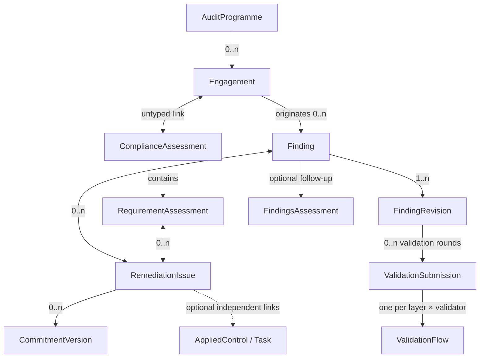
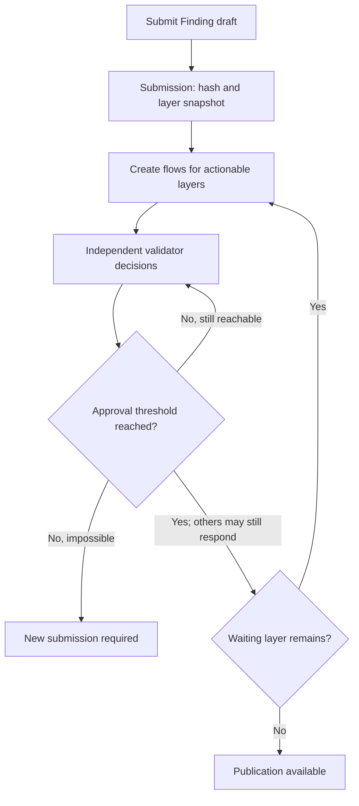

# CISO Assistant — Audit, Findings and Remediation Target Model

**Status:** Proposed design — consolidated target model
**Date:** 17 August 2026
**Scope:** Audit programme and engagement management, finding publication and validation, findings follow-up, and formal remediation issues

## 1. Executive summary

CISO Assistant already provides strong framework-based compliance assessments, findings follow-up, tasks, and rich Applied Controls. The target model adds three capabilities without weakening those existing concepts:

1. **Audit engagement management** for auditors who need to manage missions that may not use a framework.
2. **Finding publication** — immutable, versioned auditor assertions, optionally gated by the global validation system.
3. **Remediation Issues** for cases where two sides need to formalize, agree, and track a remediation path without necessarily creating Applied Controls.

Delivery is intentionally phased. Remediation Issues come first and operate directly on today's `RequirementAssessment` and `Finding` models. Audit Programmes, Engagements, and the Finding publication mechanism can be delivered later without changing or recreating those Issues.

The design deliberately keeps the following concepts separate:

- A **Finding** is an observation or formal assertion.
- A **Remediation Issue** is a governed remediation case containing discussion and an agreed commitment.
- A **Task** is a work item.
- An **Applied Control** is CA's rich, durable action-plan and safeguard object.
- An **OrganisationIssue** is an ISO 27001 organizational-context issue (*enjeu*) and is completely unrelated to a Remediation Issue.

The model favors explicit links, independent lifecycles, immutable published audit content, no implicit access inheritance, and compatibility with supported existing workflows. Existing Finding status codes and metrics remain valid; the target model gives previously undefined role interactions explicit semantics rather than treating them as a compatibility contract.

## 2. Design goals

- Support internal and frameworkless audit missions.
- Preserve the existing framework-based `ComplianceAssessment` workflow.
- Separate confidential auditor work from recipient-side follow-up.
- Allow lightweight finding tracking without requiring an Issue.
- Add formal remediation dialogue and bilateral commitment only when needed.
- Keep Applied Controls optional and independent.
- Reuse existing Comments, Documents, history, IAM, Validation flows, Tasks, and Applied Controls.
- Preserve flexibility: links do not own objects, synchronize statuses, or grant permissions.
- **Upgrade without invented history:** existing Findings remain editable drafts, keep their status vocabulary and historical metrics, and become immutable only after an explicit first publication.

## 3. Non-goals

- Replacing `ComplianceAssessment`.
- Replacing `FindingsAssessment`.
- Creating a lightweight variant of Applied Controls.
- Turning Engagements into a document, meeting, calendar, or resource-planning system.
- Combining ISO organizational context issues with remediation cases.
- Defining the full permission matrix. The access principles and the respondent-role mechanism are fixed in §13; exact permission lists are implementation.

## 4. Target concepts

| Model | User-facing concept | Responsibility |
|---|---|---|
| `AuditProgramme` | Audit programme / annual audit plan | Portfolio of planned Engagements |
| `Engagement` | Audit engagement / mission d'audit | Auditor-side mission workspace; carries the validation configuration |
| `ComplianceAssessment` | Compliance assessment / audit | Framework-based assessment; existing model |
| `RequirementAssessment` | Requirement assessment | Assessment result for one framework requirement; existing model and direct Issue-link context |
| `Finding` | Finding / constat | Stable identity: follow-up state plus a chain of assertion revisions |
| `FindingRevision` | Finding revision | One immutable published assertion (or the single working draft) |
| `ValidationFlow` | Validation | Existing global, single-approver validation request, reused unchanged |
| `ValidationSubmission` | (internal) | One validation round for a Finding draft: assertion manifest and hash, snapshotted layer rules, generated flows, and consumption at publication |
| `FindingsAssessment` | Follow-up / suivi des constats | Recipient-side collection and coordination of Findings; existing model |
| `RemediationIssue` | Issue / problème | Formal remediation dialogue, commitment, acceptance, and verification |
| `CommitmentVersion` | (internal) | One version of an Issue's commitment text and due date |
| `AppliedControl` | Applied control | Rich action plan and durable safeguard; existing model |
| `Task` | Task | Atomic work item (`TaskTemplate` + generated `TaskNode`s); existing model |
| `OrganisationIssue` | Organizational issue / enjeu | ISO 27001 internal or external context issue; existing and completely distinct |

## 5. Domain overview

Additional rules:

- Each Engagement belongs to zero or one Audit Programme.
- Each Finding originates from zero or one Engagement.
- Each Finding — draft or published — belongs to zero or one Findings Assessment.
- Each Validation Submission belongs to one Finding Revision and groups the Validation Flows generated for that validation round.
- A Findings Assessment may aggregate Findings from several Engagements or external sources.
- Requirement Assessments and Findings may each link directly to Remediation Issues; no Engagement is required.
- Findings and Remediation Issues have a many-to-many relationship.
- The Engagement–Findings Assessment relationship is derived through Findings; it is not stored directly.
- All links grant **zero** access by themselves.

## 6. Audit programme management

### 6.1 Purpose

`AuditProgramme` represents an annual or multi-year portfolio of audit missions. It is a living planning object, not an immutable approved document.

### 6.2 Minimum fields

| Field | Requirement |
|---|---|
| `ref_id` | Optional user-managed programme identifier |
| `name` | Required |
| `description` | Optional rich text |
| `objectives` | Optional rich text |
| `period_start`, `period_end` | Programme horizon |
| `status` | Required; never unset |
| `approved_by`, `approved_at` | Informational; filled automatically by the transition to `approved` |
| `cancellation_reason` | Required when cancelled |
| Documents | Existing Documents linked to the programme |
| Engagements | Zero or more; each Engagement has at most one programme |

### 6.3 Lifecycle

| Status | Meaning |
|---|---|
| `draft` | Programme is being prepared |
| `approved` | Programme is authorized but has not started |
| `active` | Programme period is underway |
| `completed` | Programme is closed |
| `cancelled` | Programme was abandoned |

All transitions are explicit user actions; nothing is derived from dates. The transition to `approved` automatically records `approved_by` and `approved_at` — the status change *is* the approval, and the metadata documents who performed it and when.

An approved programme remains editable. Changes are captured through ordinary history and do not create immutable programme revisions or reset the approval.

A cancelled programme may be explicitly reactivated to `draft`, `approved`, or `active`. Reactivation is authorized and historical; it has no automatic effect on its Engagements.

## 7. Engagement management

### 7.1 Purpose

`Engagement` is the confidential auditor-side workspace for a mission. It supports missions with or without a framework and remains independent from recipient-side follow-up.

### 7.2 Minimum fields

| Field | Requirement |
|---|---|
| `ref_id` | Optional user-managed mission identifier |
| `name` | Required |
| `description` | Optional context |
| `objectives` | Optional rich text |
| `scope` | Optional rich text |
| Scope links | Optional untyped M2Ms to perimeters, entities, and assets (see §7.6) |
| `status` | Required; never unset |
| `planned_start_date`, `planned_end_date` | Optional schedule |
| `started_at`, `completed_at` | Actual lifecycle timestamps |
| `cancellation_reason` | Required when cancelled |
| `audit_programme` | Optional; at most one |
| `final_report_document` | Optional reference to an existing Document |
| Validation layers | Up to three validator lists, an approval rule per layer, and two concurrency flags (see §9) |
| Compliance Assessments | Untyped many-to-many links |
| Documents | Minutes, workpapers, evidence, draft reports, and other material |
| Findings | Zero or more originating Findings |

### 7.3 Lifecycle

| Status | Meaning |
|---|---|
| `planned` | Mission is scheduled but has not started |
| `in_progress` | Audit work is underway |
| `in_review` | Conclusions or deliverables are being reviewed |
| `done` | Audit work and reporting are complete |
| `cancelled` | Mission was stopped or never started |

Engagement completion is independent of remediation. Open Findings, Issues, Tasks, Applied Controls, or Findings Assessments do not keep an Engagement open.

Before closure, the UI should identify draft Findings that have been neither published nor deleted. This is a consistency check rather than a lifecycle cascade.

A cancelled Engagement may be explicitly reactivated to `planned` or `in_progress`. The prior cancellation actor, date, and reason remain in history, and reactivation has no automatic effect on linked objects.

### 7.4 Documents and final report

Meeting minutes, working papers, evidence, and reports reuse the existing Document models. No `EngagementMeeting` or `AuditReport` model is introduced.

`final_report_document` identifies the official deliverable while the Document retains its own lifecycle and version history. A final report is not globally required; methodologies or templates may make it mandatory.

### 7.5 Compliance Assessments

Engagements and Compliance Assessments use a simple, untyped many-to-many link:

- neither object owns the other;
- each retains its own lifecycle;
- the relation has no workflow meaning;
- the relation grants no access.

This lets a mission coordinate several framework assessments and lets an assessment be referenced from more than one mission where needed.

### 7.6 Scope links

Beyond the free-text `scope`, an Engagement may link perimeters, entities, and assets. These links are optional and untyped: they enable cross-reporting ("all engagements touching asset X", "audits of supplier Y") and carry no workflow meaning and no access consequences, like every other link in this design.

## 8. Findings: identity, revisions, and publication

### 8.1 One identity, reified revisions

A single `Finding` exists from draft through follow-up. A separate `EngagementFinding` model is not introduced.

The assertion content lives in **`FindingRevision` rows**, taking the document-management revision mechanism as inspiration (revision rows, a current pointer, a single working draft) without mandating reuse of its components:

- Each revision carries a `version_number` and a status: `draft`, `published`, or `superseded`.
- **At most one draft revision exists per Finding at any time.** Corrections to a published Finding create a new draft based on the latest published revision.
- An abandoned draft revision is deleted, following the existing Document revision pattern; no `discarded` revision status is introduced.
- The Finding holds a **`current_published_revision` pointer**. It moves **only on publish**, atomically: the new revision is stamped `published_at`/`published_by`, the previously published revision becomes `superseded`, and the pointer flips. A coexisting draft never changes what recipient-side readers see.
- **Assertion fields are frozen at the model level once a revision leaves `draft`.** Published and superseded revisions are never edited; a newer revision supersedes the previous one, it does not rewrite it.
- Each validation submission and published revision stores an immutable, generated **`assertion_manifest` JSON**, its **`assertion_hash`**, and a manifest schema version. The manifest contains the relevant assertion context and a reference capsule for each referenced object: object type, internal UUID or URN, display context, public-hash version, and public hash.
- Referenced models expose a versioned public-hash method covering their material public fields, not secondary detail. The default — `ref_id`, `name`, and `description` — is implemented once on the shared model base, so individual models carry no code unless they define a custom material-field set; changing a model's hash contract requires incrementing its public-hash version. The Finding hash is calculated from a canonical serialization of the manifest. This detects material dependency changes while avoiding irrelevant invalidation and without requiring a snapshot table per referenced model.
- Relational fields and live links remain the working data. The stored manifest is the immutable, human-readable validation and publication record; it is generated by the backend and is never manually edited.
- A published Finding may be **withdrawn** with an actor, date, and reason, recorded on the Finding identity. Withdrawal is a formal retraction and is distinct from revision supersession. A Finding is never deleted to simulate withdrawal.

Withdrawal is terminal for the Finding identity. A withdrawn Finding cannot receive or publish another revision. If the matter must be raised again, a new Finding is created; ordinary corrections use a newer revision without withdrawing the Finding.

Withdrawing a Finding deletes any coexisting unpublished draft after its unresolved validation flows have been dropped. The current published revision and its validation record remain unchanged.

This mechanism is deliberately designed as a general pattern — a lifecycle contract (identity, revision chain, current pointer, single draft, gated publish) with a per-model assertion-manifest payload — so it can be **backported to other models in the future** (assessments, policies), progressively superseding the immutability role of the rudimentary `is_locked` flag. The campaign-deadline role of `is_locked` is a separate concern and is unaffected.

### 8.2 Publication and follow-up are separate actions

Publishing a Finding does not require a Findings Assessment. Two independent actions exist:

1. **Publish** — make the auditor assertion official and immutable, subject to the validation condition of §9.
2. **Add to follow-up** — place the Finding in a recipient-side `FindingsAssessment`.

The UI may offer **Publish and add to follow-up** as the common combined action.

Publication itself does not grant access. Any recipient access is assigned explicitly through IAM (§13).

Only a published Finding represents a formal auditor assertion. An Issue created directly from a Requirement Assessment is not automatically included as a Finding in an Engagement's final report. If the matter must become a formal conclusion, the auditor creates and publishes a Finding, then links it to the existing Issue.

`Finding.created_from` is an optional source reference. It identifies a Requirement Assessment or another supported source when the Finding is generated from one and is empty for a manually authored Finding. `created_from` and the separate `originating_engagement` reference may both change before first publication; changing either invalidates the current validation submission. Both freeze at first publication.

If a referenced `created_from` object is later deleted, the live relation is set to null. A published revision's assertion manifest continues to preserve the source type, UUID, display context, public-hash version, and public hash.

Findings created directly in a Findings Assessment with no Engagement — externally sourced or transcribed findings — may remain unpublished drafts indefinitely and stay freely editable; with no engagement there is no validation configuration, so publishing them, when desired, is direct.

A Finding carries **its own folder**. Creating a Finding from an Engagement defaults the folder to the Engagement's; creating one from a Findings Assessment defaults it to the Follow-up's. The creator may choose another folder. Linking an existing Finding never changes its folder. Access is always evaluated against the Finding's own folder (§13).

### 8.3 Assertion fields and follow-up fields

Assertion content belongs to the revision and freezes at publication. Follow-up data belongs to the stable Finding identity and remains mutable throughout. The complete classification of the current model's fields:

| Assertion — on the revision, frozen at publication | Follow-up / identity — mutable |
|---|---|
| Title and description | Follow-up `status` (§8.5) |
| Observation | `priority` (remediation urgency) |
| Severity | Owner / assignee |
| Requirement references | `eta`, `due_date` |
| Threats and vulnerabilities | Linked Issues |
| Reference controls (recommended) | Linked Applied Controls |
| Affected assets | Follow-up evidences (existing `Finding.evidences`) |
| Auditor recommendation (new field) | Recipient responses |
| — | `ref_id` (user-managed human reference shared across revisions) |

For list views and search, the projection depends on the authorized perspective: recipient-side views use `current_published_revision`, while auditor-side working views may show the draft. Any denormalized headline fields are caches only; the selected revision remains the source of truth and draft content must never leak through a recipient-side index.

### 8.4 Publication lifecycle

Publication state is derived rather than stored independently:

- `withdrawn_at` is set → `withdrawn`;
- otherwise, `current_published_revision` exists → `published`;
- otherwise → `draft`.

A newer unpublished draft may coexist with the current published revision. Publishing the new revision makes it current. It does not reset follow-up state or invalidate linked Issue commitments. Notification of recipients on publication follows the notification rules (future work, §17).

Publication requires a non-`--` follow-up status. A published Finding cannot return to `--`. A dismissed Finding must first return to a non-terminal follow-up status before publication, and a Finding that has ever been published cannot subsequently be marked `dismissed`; formal retraction uses withdrawal.

### 8.5 Follow-up lifecycle: additive evolution

The existing status vocabulary is **kept, not remapped** — it remains the follow-up dimension, and historical data and metrics stay valid. The values serve two populations: *triage* states matter for imported findings (scanner output, transcribed external reports), while for engagement-authored findings the publication dimension supplies the formal assertion lifecycle.

| Status | Phase | Notes |
|---|---|---|
| `--` | Draft | Not set; legitimate while a never-published Finding is still tentative; default for new drafts |
| `identified` | Triage | Matter has been identified |
| `confirmed` | Triage | |
| `dismissed` | Outcome | Rejected at triage; never used after publication |
| `assigned` | Active | |
| `in_progress` | Active | |
| `mitigated` | Active | Risk reduced / compensating control |
| `resolved` | Resolution | Remediation reported complete; may still require formal verification/closure |
| `closed` | Outcome | Remediation verified and Finding formally closed |
| `risk_accepted` | Outcome | **New** — resulting risk accepted |
| `deprecated` | — | Grandfathered; valid on existing rows, hidden for new findings |

- No separate "outcome" field is introduced: the follow-up status carries the outcome where applicable.
- Existing metrics continue to treat both `resolved` and `closed` as dealt with, while the workflow retains their useful distinction between reported resolution and verified closure.
- Dashboards group statuses into draft / triage / active / resolution / outcome phases; grouping is presentation only — stored codes never change meaning.

Finding follow-up remains useful without a Remediation Issue. When an Issue exists, both lifecycles remain independent and are never synchronized automatically.

### 8.6 Findings Assessment

`FindingsAssessment` remains the existing recipient-side follow-up container and keeps its current database name.

- It contains many Findings; a Finding belongs to at most one Findings Assessment.
- It may aggregate Findings from several Engagements or from no Engagement.
- Its `category` (pentest, audit, self-identified, responsible disclosure…) is a broad informational classification of the Follow-up, not authoritative provenance and not a constraint on its Findings. Exact provenance, when available, belongs to each Finding and its source relationships.
- Its status remains manually managed. It may be marked `done` while Findings remain open, after a strong warning and explicit confirmation.
- Closing it never cascades to Findings, Issues, Tasks, or Applied Controls.
- **Deleting** a Findings Assessment that contains Findings asks the user what to do (§16). This is a frontend convenience composed from ordinary object operations, not a new bulk-delete domain operation.

Its existing status values, including unset and `deprecated`, remain for backward compatibility. New models do not adopt `deprecated`.

## 9. Finding validation workflow

### 9.1 Principle

**Validation is a condition for publishing, nothing more.** It does not freeze content (immutability comes from publication, §8.1), it never retro-affects a published revision, and it is entirely optional.

The gate reuses the **global `ValidationFlow` model, unchanged** — its inbox, its `FlowEvent` history, its requester/approver separation and deadlines — rather than an embedded reviewer workflow. Review states live on the flows; the revision status stays minimal (`draft`/`published`/`superseded`).

### 9.2 Configuration: validation layers on the Engagement

The Engagement carries up to **three validation layers**. Each layer comprises a list of validator users and an `approval_rule`; layers 2 and 3 also carry a boolean `wait_for_previous`.

- **Validation is required if and only if at least one layer is non-empty.** The configuration *is* the assignment: there is no way to require validation without saying who validates. An engagement with no validators — and any finding without an engagement — publishes directly.
- **Approval rule within a layer:** `any` requires one acceptance, `all` requires every configured validator, and `quorum` requires `required_approvals` acceptances. `required_approvals` is stored only for `quorum` and must be between 1 and the number of validators.
- **AND between layers:** every non-empty layer must be satisfied.
- **`wait_for_previous` = true:** the layer is blocked until all *earlier non-empty* layers are satisfied (empty layers never block). False: the layer may validate concurrently.
- The three lists must be disjoint.
- Example — "first X and Y, then Z": X in layer 1; Y in layer 2 with wait = false; Z in layer 3 with wait = true.
- Assignment to a validation layer grants no access. Every configured validator must independently hold the IAM permission and role required to view and validate the Finding, normally an auditor-side role such as Analyst. Submission does not auto-grant anything.

The UI presents **Any validator**, **All validators**, and **At least N validators**. `all` remains dynamic while the Engagement configuration is edited, so adding a validator does not require manually updating a count. A submission snapshots the validator list, rule, and effective threshold. First-response-wins and conditional-escalation policies are outside the target model.

### 9.3 Mechanics

- Submitting a draft creates a `ValidationSubmission` identified by `submission_id`. It belongs to the draft Finding Revision, stores the generated assertion manifest and hash, snapshots the Engagement's validators, approval rules, effective thresholds, ordering, and concurrency rules, and groups the generated Validation Flows.
- The submission creates **one ordinary ValidationFlow per (layer, validator)** — the existing addressed, single-approver flow, unchanged. The submitting auditor is the requester; the validator is the approver.
- Flows are created **when their layer becomes actionable**: immediately for layer 1 and concurrent layers, and only once all earlier non-empty prerequisite layers are satisfied for a `wait_for_previous` layer. Nobody is solicited before they can act.
- A layer's outcome is derived from its individual flows. It is **satisfied** when accepted flows reach its snapshotted threshold, **pending** while the threshold remains reachable, and **failed** when terminal decisions make the threshold unreachable.
- Reaching the threshold makes publication available but does not close sibling flows. Other validators may continue to respond until publication, and their decisions may affect whether the threshold remains satisfied.
- A layer that reaches its threshold despite **current unresolved** `change_requested` or `rejected` responses is shown as **Satisfied with objections**. This is a derived informational indicator, not another stored lifecycle state and not a veto. A previous objection that the same validator has replaced with acceptance is no longer shown as unresolved.
- Changing the Engagement's validators or approval rules affects future submissions, never an in-flight submission whose configuration has already been snapshotted.
- The publication requirement is exposed as a single predicate — “every non-empty layer of the current submission is satisfied for the current assertion hash” — checked by the publish transition.
- A Finding Revision may have several historical submissions but at most one current, usable submission. Creating a new one supersedes the previous current submission and drops its unresolved flows.

### 9.4 Rules

- **Any assertion-hash change invalidates the submission.** This includes a draft edit, a relationship change, a change of source or originating Engagement, or a material public-hash change in a referenced object. Secondary changes excluded from a referenced object's public hash do not invalidate validation.
- A material local Finding edit immediately clears the current validation association and drops its unresolved flows; returning the content to the same hash does not restore it. Material changes to referenced objects are detected lazily by recomputing the manifest and hash when validation state is displayed, before any validator decision, and at publication; a mismatch performs the same invalidation and flow cleanup. A stale submission cannot receive decisions or authorize publication. No separate persisted `stale` status is required: the current `submission_id` identifies the usable round.
- When the draft is resubmitted, the previous submission is marked superseded and becomes unusable for publication, its unresolved flows are closed as `dropped`, and completed decisions and their history remain immutable. The new validation round receives a new `submission_id`.
- `change_requested` is formal feedback on that validator's own flow and contributes no acceptance. There is no requester-side operation to resubmit an individual flow. While the assertion hash remains unchanged, the validator may revise their own current decision after clarification; the `FlowEvent` history is preserved. If the assertion changes, the whole submission is invalidated instead.
- `rejected`, `revoked`, `expired`, and `dropped` flows contribute no acceptance. A rejection by one validator does not veto a threshold reached by others. If the remaining flows can no longer reach the threshold, the layer fails and the draft must be submitted under a new submission.
- Revoking an acceptance before publication immediately removes it from the count. If the threshold is no longer met, the layer is no longer satisfied; sibling flows remain available until publication unless the submission itself becomes unusable.
- If a prerequisite layer loses satisfaction, downstream flows already created for a `wait_for_previous` layer and their completed decisions remain valid, but its pending flows become temporarily non-actionable. They resume when all prerequisites are satisfied again. The publication predicate re-checks every layer at publish time.
- Publication requires every non-empty layer of the current submission to be satisfied for the current assertion hash. Recorded objections do not block publication after the configured thresholds have been reached; the UI discloses them through the **Satisfied with objections** indicator.
- Publication atomically locks the revision and current submission, recomputes and compares the assertion hash, checks all layers, publishes the revision, consumes that exact submission, and closes its unresolved flows as `dropped`. The exact accepted manifest and hash are carried into the published revision.
- A consumed submission, its configuration snapshot, and all of its flows are immutable. Objections after publication use comments, a revised Finding, or terminal withdrawal; they never rewrite the validation record that authorized publication.
- Flow rejection, revocation, and expiry matter only before publication. Retraction of a published Finding is withdrawal (§8.1), never flow revocation.
- Finding validation flows follow the global **Allow self-validation** setting exactly as any other validation flow (requester versus approver). No additional Finding-specific author/validator constraint is introduced; authorship, submission, and validation remain visible in the record (§13).

## 10. Remediation Issues

### 10.1 Purpose and creation threshold

`RemediationIssue` is used only when CA users want to formalize the remediation path. It is not required for every Finding, failed Requirement Assessment, comment thread, or task.

An Issue adds:

- explicit, mandatory Lead and Respondent sides;
- a structured dialogue using existing Comments;
- at most one current remediation proposal or agreed commitment;
- bilateral acceptance;
- target date, execution phase, evidence, verification, and resolution;
- links to relevant business objects without lifecycle coupling.

An Issue may be created from a **Requirement Assessment** or a **Finding**, in which case that object alone is initially linked. It may also be created standalone and linked later to one or more Requirement Assessments and Findings. There is no stored creation provenance and no minimum-link rule. Ordinary history records creation and subsequent link changes, but no related object retains a privileged source role after creation.

These links have no relationship subtype: they express relevance only.

The doctrine is carried by guidance rather than enforcement: **the Issue view displays a short notice explaining that Issues serve to track commitments, not to track findings** — an ad-hoc, self-identified observation belongs as a Finding in a Follow-up, and an Issue is opened only when two parties need to formalize and track a commitment. Deleting a related object simply detaches its link.

`OrganisationIssue` is not a special source type and has no dedicated relationship to Remediation Issues.

### 10.2 Minimum fields

| Field | Requirement |
|---|---|
| `ref_id` | Optional user-managed identifier |
| `title` | Required |
| `description` | Required self-contained problem context |
| `priority` | Optional; no Issue severity field |
| `status` | Required; defaults to `planned` |
| Commitment | Zero or one current proposed/agreed version; see §10.4 |
| Acceptance state | Absent without a commitment; otherwise one state per side for the current version |
| `resolution` | Required when `done` |
| `closure_justification` | Required when `done`; authoritative reason why closure is justified |
| `cancellation_reason` | Required when `cancelled` |
| `closed_at` | Set on closure and preserved in history on reopening |
| Related objects | Optional links to one or more Requirement Assessments and Findings; initialized from the creation context when applicable |
| Comments, Documents and `evidences` | Existing models; optional Issue evidence M2M |

Issue priority expresses remediation urgency. Severity remains on related Findings or assessment results and is not copied into an aggregate Issue field.

An Issue's **initial folder defaults to the creation-context object's folder**, and the creator may choose another. For a Requirement Assessment, this is also the enclosing Compliance Assessment's folder because those folders are synchronized. Creating standalone requires the author to choose a folder. Linking an existing object never changes either object's folder, and later folder changes are independent. Access is always evaluated against the Issue's own folder (§13).

### 10.3 Actors and sides

Issue participation is stored as four plain many-to-many fields to the existing `Actor` model: `lead_representatives`, `respondent_representatives`, `lead_contributors`, and `respondent_contributors`. Each Actor wraps exactly one User, Team, or Entity. No participation through-model, capacity enum, or new Party model is introduced. Assignments name actors; actions are performed by natural users — a decision is always made by a user, and eligibility is resolved through the representative actors.

- Every Issue has exactly two logical sides: Lead and Respondent.
- **Representatives take the side's decisions:** only they may propose, revise, or accept a commitment and perform the side's transitions (§10.6). Eligibility resolves through the listed actors — a User directly, a Team through its members, an Entity through its representatives' user accounts, as for audits today. Representatives of one side act interchangeably as one logical decision-maker.
- **Contributors are informational only** — a displayed cast of who is involved. The field carries no mechanics: commenting and visibility are governed by ordinary folder permissions, not by participation.
- Acceptance is recorded once per side, not once per representative.
- History records the side and the user performing an action.
- An Issue may temporarily lack representatives on a side; no representative-dependent action can then be performed for that side. The UI should normally require representatives because the workflow cannot progress without them, but the backend imposes no assignment constraint.
- Participation does not carry IAM roles. The user performing an action must independently have the required IAM permission.

### 10.4 Commitment model

An Issue has **zero or one current commitment version** and zero or more historical **`CommitmentVersion` rows**. Each row contains a version number, rich text, optional due date, the authoring user and their side, a timestamp, and **the two per-side acceptance states — state, user, and timestamp for each side — directly on the version row**. There is no separate acceptance table; the audit log provides the event history. There is no user-facing Commitment collection and no special dialogue-entry model: the UI shows a single proposed or agreed commitment; versions are plumbing that acceptance references reliably.

Commitment content is immutable after version creation. Acceptance fields may change only while the version is current and must be updated atomically. Once superseded, the entire version is immutable. Acceptance changes remain available through audit history.

An Issue may be created before a remediation proposal exists—for example, when the Lead formally asks the Respondent to propose a solution. In that state, acceptance is absent and the UI shows **Awaiting remediation proposal**. Any representative of either side may create version 1 or propose a later revision. Before bilateral acceptance the UI calls the current version the **Proposed commitment**; after acceptance it becomes the **Agreed commitment**.

Existing Comments support negotiation. The current commitment version is the authoritative agreement; previous versions and their acceptance changes remain queryable in audit history.

Acceptance covers only:

- commitment text;
- commitment due date.

It does **not** cover linked Tasks, Applied Controls, Documents, evidence, Comments, or other object links. Binding steps or milestones must be stated in the commitment text.

**Any change to the commitment text or due date creates a new version and resets both side acceptances.** There is no materiality judgment and no minor-edit exception.

Creating a version uses optimistic concurrency: the request includes `based_on_version_id` (null for the first proposal), and the backend accepts it only if that value is still current. A conflict returns the newer proposal for review; the model never creates competing current branches.

### 10.5 Bilateral acceptance

With no current commitment, there are no acceptance states and no acceptance action. When a commitment exists, each side has one acceptance state for that version:

- `pending`
- `accepted`
- `changes_requested`

The overall state is derived with the precedence **changes_requested > pending > accepted**:

| Condition | Overall state |
|---|---|
| Any side has requested changes | Changes requested |
| No changes requested; Lead pending | Pending Lead acceptance |
| No changes requested; Lead accepted, Respondent pending | Pending Respondent acceptance |
| Both sides accepted | Accepted |

There is no imposed order: either side may accept first. Acceptance is distinct from Issue execution status.

Representatives of a side act as one logical person: the model does not collect votes or require unanimity among representatives. The backend applies the existing global **Allow self-validation** setting: when self-validation is disabled, the same natural user cannot perform commitment actions for both sides of one Issue, including through overlapping Team or Entity representation. Comments are unaffected. The record captures the side and the user of every event (§13).

Each acceptance records the user, state, and timestamp for its side on the current commitment version; the audit log keeps the full event history. Changing representatives or contributors does not reset either side's acceptance; previous events remain in history.

### 10.6 Issue lifecycle

| Status | Meaning |
|---|---|
| `planned` | Issue is recorded but active handling has not started |
| `in_discussion` | Parties are defining or revising the commitment |
| `in_remediation` | Changes are being implemented |
| `in_review` | Remediation awaits verification |
| `done` | Resolution has been verified |
| `cancelled` | Issue workflow was abandoned |

Status and acceptance are orthogonal. For example, implementation may continue while a commitment amendment is being discussed.

No status changes automatically when acceptance changes. After bilateral acceptance, the UI may offer **Start remediation**, but an authorized user explicitly performs the transition.

Either side's representatives may discuss, propose, revise, and accept the commitment. A Respondent representative may submit completed remediation for review by moving the Issue to `in_review`. Only a Lead representative may move the Issue to `done`, provide the closure justification, cancel it, or reopen a `done` Issue. These domain checks are enforced by the backend in addition to IAM.

The normal path uses `in_review`, but the backend need not require it before `done`. Any non-terminal status may exist before a proposal is made: status describes operational reality, while commitment and acceptance describe formal agreement. Closure requires a current commitment accepted by both sides and a closure justification.

### 10.7 Terminal outcomes and reopening

Recommended `done` resolutions:

- `remediated`
- `accepted_as_is` — English "Accepted as-is"; French "Accepté en l'état"
- `not_applicable`

Recommended cancellation reasons:

- `duplicate`
- `superseded`
- `withdrawn`
- `created_in_error`
- `other`

`accepted_as_is` is a resolution, not an Issue status, and is distinct from acceptance of the commitment. Its commitment documents the decision and any conditions; its due date may be empty.

`closure_justification` explains what was verified and why the selected resolution permits closure. The actor and time of verification come from the transition history and `closed_at`; no separate Verification model is introduced. The justification, current commitment, and its acceptances are frozen while the Issue is `done`.

The UI labels this field **Closure justification** in English and **Justification de clôture** in French.

A `done` Issue may be explicitly reopened to a non-terminal status chosen by the user. Previous closure data stays in history. Reopening makes the commitment and acceptance workflow editable again; a changed remediation path creates a new commitment version and resets acceptance. A genuinely new problem should create a new Issue instead.

A cancelled Issue is terminal because it is a formal abandoned workflow record. Renewed handling creates a new Issue rather than reactivating the cancelled one.

### 10.8 Dialogue and evidence

The existing Comment model is used for Issue dialogue. No `RemediationIssueEntry` model is introduced.

- Finding comments discuss the observation, scope, severity, or factual challenge.
- Issue comments discuss the remediation commitment, execution, and verification.
- Comments are not copied when an Issue is created.
- Comments are text-only. **Evidence is provided through linked Documents and the explicit optional `evidences` M2M to the existing Evidence model**, not through comment attachments.
- Existing `Finding.evidences` and `FindingsAssessment.evidences` remain valid for lightweight follow-up. Issue evidence is independent: evidence is never copied or synchronized automatically between a Finding, its Follow-up, and a linked Issue.
- A combined activity view may display both contexts when the user can independently access them.

When an Issue is created from another object, the UI may prefill its title and description. The creator must review and explicitly save the copied text because Issue participants may not have access to that object. The Issue content is independent and never synchronized from it.

### 10.9 Supported creation paths

The model supports today's audits and Findings immediately, while remaining compatible with the later Engagement model:

1. **Direct remediation:** Requirement Assessment → Remediation Issue.
2. **Existing Finding:** Finding → Remediation Issue.
3. **Formal audit conclusion:** Requirement Assessment → Finding → Remediation Issue.
4. **Early collaboration followed by publication:** create the Issue from the Requirement Assessment, then later create the Finding and link it to the same Issue.
5. **Frameworkless audit, later phase:** Engagement → Finding → optional Findings Assessment → optional Remediation Issue.
6. **External or self-identified source:** create a Finding directly in a Findings Assessment, with no Engagement; create an Issue from it if a formal commitment becomes necessary.
7. **Standalone commitment:** create a Remediation Issue directly, choosing its folder and linking objects as needed.

The fourth path never creates a second Issue. The Finding and Requirement Assessment become related objects of the existing remediation case. Likewise, adding an Engagement later never replaces an Issue already created from a Requirement Assessment or Finding.

## 11. Tasks and Applied Controls

Applied Controls remain CA's rich action plans and durable safeguards. Remediation Issues do not replace or simplify them.

- Task links follow the existing pattern: **`TaskTemplate` carries the M2M links** (it already links findings, applied controls, and assessments) and gains a `remediation_issues` M2M. Generated `TaskNode` occurrences follow their template; nothing links nodes directly.
- Tasks and Applied Controls are optional links from an Issue.
- They are not part of the accepted commitment unless described explicitly in its text.
- Their lifecycle never changes the Issue automatically.
- Issue closure never closes a Task or Applied Control.
- Completing a Task or Applied Control never closes an Issue.
- A durable Applied Control may remain active after the Issue that prompted it is closed.

The same independence applies between Findings and their Tasks or Applied Controls.

## 12. Relationship and lifecycle rules

| Event | Automatic effect |
|---|---|
| Link two objects | No access grant and no lifecycle change |
| Create an object from a parent or context | New object's folder initially defaults to the context folder; creator may choose another |
| Link an existing object | No folder change on either object |
| Publish Finding revision | Locks assertion revision; no follow-up status change |
| Publish a revised Finding | No Issue commitment reset |
| Withdraw a Finding | Finding becomes terminal; no linked-object closure; show warnings |
| Assertion hash changes under validation | Current submission becomes unusable; a new submission is required |
| Validator requests changes | Formal feedback on that flow; contributes no acceptance and does not veto a threshold reached by other validators |
| A layer reaches its approval threshold | Layer is satisfied and publication may become available; sibling flows remain actionable until publication |
| A layer can no longer reach its threshold | Layer fails; a new validation submission is required |
| Validation requirement satisfied | Publish becomes available; no automatic publication |
| Publish using accepted validation | Validation submission is consumed and sealed; unresolved flows close as `dropped` |
| Accept commitment | No automatic move to `in_remediation` |
| Edit accepted commitment (text or due date) | New version; reset both acceptances |
| Add or remove Issue participants | Record history; no link-based permission or automatic reset of either side's acceptance |
| Edit commitment or acceptance on a `done` Issue | Rejected; reopen the Issue first |
| Complete Applied Control or Task | No automatic Issue or Finding closure |
| Close Issue | No automatic Finding closure |
| Close Finding | No automatic Issue closure |
| Complete Engagement | No follow-up or remediation closure |
| Complete Findings Assessment | No child-object closure |

Consistency warnings are preferred over cascading updates or broad hard blocks, except for explicit invariants: immutable published assertion content, accepted current commitment and closure justification before Issue completion, terminal withdrawal and Issue cancellation, and the exact validation condition before publication.

### 12.1 Ownership and deletion

Independent relationships never imply cascading deletion. Internal revision/version rows and parent-bound Comments are owned children.

| Deleted object | Required behavior |
|---|---|
| Audit Programme | Detach and preserve its Engagements |
| Engagement with only draft Findings | Detach and preserve those Findings and linked Compliance Assessments |
| Engagement with published or withdrawn originating Findings | Protect deletion; the user must retain the Engagement or explicitly delete the Findings if authorized |
| Findings Assessment containing Findings | Frontend asks for detach by default or deletion of all Findings; no backend bulk-delete operation is introduced |
| Finding | Delete its owned Finding Revisions, parent-bound Comments, and external link rows; never delete linked Issues, Evidence, Documents, Tasks, or Applied Controls |
| Remediation Issue | Delete its owned Commitment Versions, parent-bound Comments, and external link rows; never delete linked Findings, Evidence, Documents, Tasks, or Applied Controls |

For a non-empty Findings Assessment, the frontend offers **Delete Findings** only when its permission check indicates that the user may delete every contained Finding. It then deletes Findings one by one through their ordinary endpoints. On the first failure it stops and leaves the Findings Assessment in place; Findings already deleted remain deleted. The Findings Assessment is deleted only after every Finding deletion succeeds. This is a comfort feature, not an atomic domain operation. Detach remains the default choice.

Database relationships use `SET_NULL`, M2M removal, or `PROTECT` according to this table. Cascading deletion is reserved for true internal children. In particular, deletion of an object referenced by `Finding.created_from` sets the live reference to null; published manifests retain the recorded context.

Documents, Evidence, Tasks, Applied Controls, Compliance Assessments, and other independently permissioned objects are never deleted merely because a linking Programme, Engagement, Follow-up, Finding, or Issue is deleted.

## 13. Access-control principles

- **IAM checks** answer whether an actor may perform an operation on an object. **Consistency checks** answer whether the requested mutation is valid for the actor's side, capacity, the object's state, and the domain invariants. Both are enforced by the backend/API; UI views only present the available operations.
- A relationship grants no permission.
- Engagement, Compliance Assessment, Finding, Findings Assessment, Issue, Document, Task, and Applied Control permissions are evaluated independently.
- Publishing or linking does not implicitly expose Engagement workpapers or source objects.
- Issue descriptions must contain enough context for participants who cannot access linked sources.
- The auditor workspace is private by default; recipients normally interact through published Findings, Findings Assessments, and Issues.
- User, Team, and Entity actors are reused; no new Party identity model is added.
- The global **Allow self-validation** setting applies to both Finding validation (as any other validation flow) and bilateral Issue commitment actions: when disabled, the same natural user cannot act for both sides of one Issue. Changes apply prospectively; previously recorded validation and acceptance events remain valid.

**Auditee access reuses the existing respondent role (`BI-RL-ADE`)**, extended with finding, follow-up, and issue permissions:

- Respondents see only Findings that have been formally issued — publication state `published` or `withdrawn` (a withdrawal is information the recipient needs, shown with its status). Drafts are structurally invisible: the base view permission means "published only", and draft visibility requires an additional auditor-side permission. In practice the respondent filter is "has a current published revision".
- CA does not require field-level IAM permissions, but a caller with object-level change permission cannot submit an arbitrary patch. Backend consistency checks expose and enforce an explicit mutable surface for the requested auditor-side or respondent-side operation.
- Published assertion content is structurally immutable for everyone. Respondents may modify only respondent-relevant follow-up fields. Analysts can see everything a respondent can see but cannot necessarily modify respondent-owned fields.
- The folder of the respondent role assignment is the visibility boundary; per-model permissions keep Engagements, Documents, and workpapers invisible without further mechanism. Per-party isolation reuses the existing enclave pattern: an Issue created from an object defaults to that object's folder, so third-party Issues normally start inside the party's enclave, invisible to other parties.
- The same role naturally carries Issue-side respondent operations. Only representatives may propose, revise, or accept a commitment; contributors are informational.

These capabilities follow the delivery phases (§16): the Issue-side respondent operations ship with phase 1, while the published-Finding visibility rules belong to the later publication phase — until Finding publication ships, Finding visibility remains governed by ordinary folder permissions.

Before this target model, the Respondent role was defined for participation in audits and had no supported responsibility or authoring semantics for Findings. Any Respondent access to Finding drafts or assertion fields was incidental and is not a compatibility contract. The target model introduces the first explicit Respondent workflow for Findings: access to published assertions and modification of permitted recipient-side follow-up fields. A user who must author, validate, or review Finding assertions requires an auditor-side role such as Analyst.

## 14. Security

This design introduces no security mechanism of its own; it deliberately rides the existing ones:

- **IAM is the sole access authority.** Every operation is authorized by the existing folder-scoped RBAC, evaluated against each object's own folder (§13). Participation, validation-layer assignment, links, and publication grant no access.
- **Lead versus Respondent follows the existing pattern:** internal users act through their ordinary auditor-side roles; external respondents act through the existing respondent role (`BI-RL-ADE`) scoped to their enclave folder — exactly as third-party audits work today. The sides of an Issue are workflow semantics on top of IAM, never a parallel permission system.
- **Integrity guarantees are structural, not procedural:** published assertion content and consumed validation records are immutable at the model level, commitments version instead of mutating, and the audit log records the side and natural user of every decision.
- The global **Allow self-validation** setting is the single configured segregation-of-duties control, applied to Finding validation and Issue commitment actions alike (§13).

**The threat model is unchanged compared to TPRM and third-party audits:** the same external population (entity respondents) reaches the same boundary (their enclave folder) through the same role. This design adds objects inside that boundary; it adds no new exposure, principal type, or trust relationship.

## 15. Navigation proposal

### Audit management

- Audit programmes
- Engagements
- Compliance assessments

### Findings and remediation

- Follow-ups
- Findings
- Issues

Terminology (decided):

| Model | English UI | French UI |
|---|---|---|
| `AuditProgramme` | Audit programme | Programme d'audit |
| `Engagement` | Audit engagement | Mission d'audit |
| `Finding` | Finding | Constat |
| `FindingsAssessment` | Follow-up | Suivi des constats |
| `RemediationIssue` | Issue | Problème |
| `OrganisationIssue` | Organizational issue | Enjeu organisationnel |

"Issue / Problème" follows the convention of localized GRC platforms, and is unambiguous once `OrganisationIssue` is relabeled "Organizational issue / Enjeu organisationnel".

## 16. Delivery and migration approach

### 16.1 Phase 1 — Remediation Issues on the current model

Remediation Issues are the first delivery increment. They do not depend on Audit Programmes, Engagements, Finding Revisions, publication, or validation layers.

- Implement `RemediationIssue`, `CommitmentVersion`, participants, bilateral acceptance, lifecycle transitions, Comments, Documents, Evidence, and history.
- Make Issue creation and linking available directly from the existing `RequirementAssessment` and `Finding` user interfaces and APIs. Contextual creation initializes only that object's link and folder default; linking an existing object later never changes the Issue's folder.
- Add optional Remediation Issue links to `TaskTemplate` and Applied Controls without lifecycle synchronization.
- Do not migrate, wrap, or otherwise change existing audits and Findings merely to enable Issues.
- Do not automatically create Issues from existing audits, Findings, Tasks, or Applied Controls. Existing records acquire only the ability to link to an Issue when a user chooses to formalize remediation.
- Existing Finding and Findings Assessment behavior, fields, statuses, APIs, and metrics remain unchanged during this phase.
- Extending the respondent role (`BI-RL-ADE`) with Issue permissions applies to existing role assignments: external respondents who already hold the role for questionnaire work gain Issue visibility in their folders as soon as Issues exist there. This is intended — third-party material is segmented by enclave folders — and release notes must mention it.
- Review the new relationships and the Comment exactly-one-parent constraint against PostgreSQL behavior, not only SQLite.

An Issue created in phase 1 remains the same object when later audit-management capabilities are introduced. It may acquire additional links, but it is never recreated or silently migrated into another workflow.

### 16.2 Later phase — audit management and Finding publication

Audit Programmes, Engagements, and the Finding publication and validation mechanisms may be delivered in a later increment. At that point:

- Keep `FindingsAssessment` and its existing records, APIs, and status values.
- Do not infer or create Engagements for existing Follow-ups or Compliance Assessments.
- **Existing Findings migrate as drafts**, not as published: their current assertion fields become the single working draft revision, they remain freely editable, and immutability begins per Finding at its first explicit publish. No publication timestamps or historical assertions are invented.
- **Finding status migration is purely additive:** every existing value keeps its code and meaning, including `--`, `resolved`, `closed`, and `deprecated`; `risk_accepted` is added. `--` remains the default drafting facility for a tentative, never-published Finding. `resolved` means remediation reported complete, while `closed` means verified formal closure. `deprecated` remains valid on existing rows and is hidden for new Findings. Historical metric buckets require no remapping, but metric definitions that classify statuses as dealt with (for example the unresolved-important exclusion set) must include `risk_accepted` alongside `mitigated`, `resolved`, `dismissed`, and `closed`.
- `findings_assessment` becomes optional, and its delete behavior changes from CASCADE to **PROTECT**. Deleting a Findings Assessment that contains Findings asks the user whether to detach and keep them or delete them. Detach is the default. The frontend offers deletion only when it believes the user may delete every Finding, performs the ordinary Finding deletions sequentially, stops on the first failure, and deletes the Findings Assessment only after all succeed. There is no bulk-delete API or atomicity guarantee.
- Preserve all current Finding follow-up metadata, folder assignments, and existing Remediation Issue links.
- Add Finding `created_from`, originating Engagement, publication, and revision fields forward-compatibly. Existing `created_from` and originating Engagement values are empty.
- Review the `ValidationSubmission` relationships to Finding Revisions and generated Validation Flows against PostgreSQL behavior, not only SQLite.

### 16.3 Migration invariants

- Existing history remains authoritative for pre-migration changes.
- No migration invents publication, approval, acceptance, commitment, or provenance history.
- New links grant no access and trigger no lifecycle transition.
- Every phase remains usable on its own; deploying Remediation Issues does not force deployment of Engagements.

## 17. Future work

- Bulk generation of draft Findings from non-compliant Requirement Assessments when an Engagement wraps a framework audit.
- Backport of the publication/revision mechanism to other models (assessments, policies), retiring `is_locked`'s immutability role.
- Notification rules, reminders, and escalation policies (including publication notifications).
- API endpoints and event names.
- Search, dashboard, and reporting roll-ups across independent lifecycles.

## 18. Review status and residual risks

This design was critically reviewed through 17 August 2026; the decisions are folded into the present version (Issue-first delivery, respondent-role access, revision mechanism, validation layers, additive status evolution, drafts-first migration, and terminology).

Residual risks are interaction-design, not entity-structure:

| Risk | Mitigation |
|---|---|
| Users confuse follow-up status, publication state, and Issue acceptance | Show them as clearly labeled independent dimensions; never synchronize them |
| Issues duplicate comments or Tasks | Create Issues only for formalized remediation; reuse Comments and keep Tasks atomic |
| Finding and Issue discussions fragment | Distinguish assertion discussion from remediation discussion; provide permission-aware combined activity views |
| Validation inbox noise on large layers | Waiting layers are solicited only when actionable; publication readiness is clearly indicated while remaining validators may still respond until publication |
| Findings Assessment aggregates unrelated sources | Treat category as broad classification and show each Finding's own provenance; keep one Finding in at most one Follow-up |

The UI must make the escalation path obvious:

1. Track a Finding directly for lightweight follow-up.
2. Create a Remediation Issue when agreement and verification need formalization.
3. Add Tasks or Applied Controls only when operational planning or durable control management is warranted.
