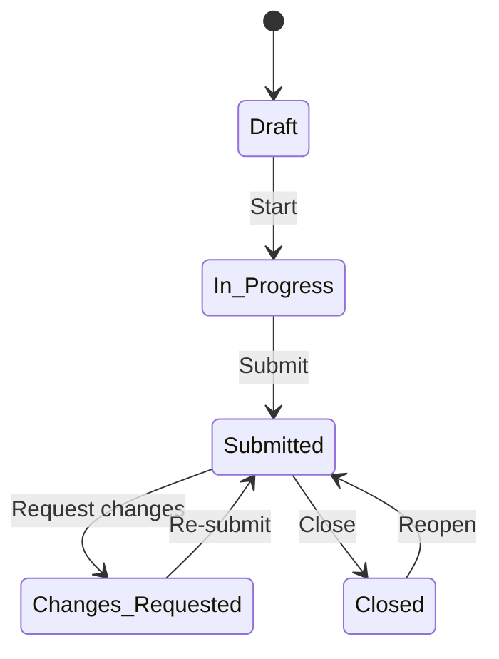

# Assignment Submission & Review Workflow

## Overview

The assignment workflow allows managers to delegate audit work to respondents (auditees) and track their progress through a structured review cycle. Respondents work independently on their assigned requirements, submit when ready, and reviewers can close or request changes — all without locking the entire audit.

## Workflow

| State | Respondent can edit? | Description |
|-------|---------------------|-------------|
| **Draft** | No | The manager is setting up assignments. Respondents are not yet notified. |
| **In Progress** | Yes | The assignment has been started. Respondents receive an email and can begin working. |
| **Submitted** | No | The respondent has submitted their work. It is now read-only and awaiting review. |
| **Changes Requested** | Yes | The reviewer has sent it back with feedback. The respondent can edit and re-submit. |
| **Closed** | No | The reviewer has closed the assignment. Can be reopened if needed. |

## For Managers / Reviewers

From the **Assignments** page of a compliance assessment:

1. **Create assignments** — select requirements from the tree and assign them to one or more actors.
2. **Start** — when ready, start individual assignments or use **Start All** to notify all respondents at once. An email is sent to each assigned actor.
3. **Review responses** — each non-draft assignment card has a **Review responses** link that opens the respondent's assessment view, scoped to only the requirements in that assignment. This lets you see exactly what the respondent sees.
4. **Review submissions** — when a respondent submits, you can:
   - **Close** — mark the assignment as done. The respondent is notified.
   - **Request Changes** — send it back with an observation describing what needs to be fixed. The respondent is notified and can edit again.
5. **Reopen** — a closed assignment can be reopened, returning it to submitted status for further review.

> Assignments can only be edited or deleted while in **Draft** or **In Progress** state.
> Respondents must assess all assigned requirements before they can submit.

## For Respondents (Auditees)

From the **Auditee Dashboard**:

- Each assignment appears as a separate card, showing the audit name, framework, assigned actor, progress, and current status.
- **Not started yet** — the manager has not started your assignment yet. No action needed.
- **In Progress** / **Changes Requested** — click to open the assessment and work on your assigned requirements.
- **Submitted** / **Closed** — click **Review responses** to view your work in read-only mode.

From the **Assessment** page:

- The assessment is scoped to the requirements included in your assignment.
- A status banner at the top shows your current state.
- If changes were requested, the reviewer's observation is displayed so you know what to fix.
- Use the **filter chips** above the table of contents to quickly filter requirements by compliance result (e.g. show only "Not assessed" items).
- When you are done, click **Submit for Review**. All assigned requirements must be assessed before submission is allowed. This locks the assessment until the reviewer responds.

## Email Notifications

| Event | Who is notified |
|-------|----------------|
| Assignment started | Assigned respondents |
| Respondent submits | Audit reviewers (or authors if no reviewers are set) |
| Reviewer closes, reopens, or requests changes | Assigned respondents |
