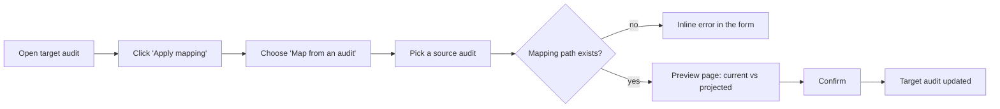

# Apply Mapping (Map to / Map from)

## Overview

Both mapping directions live behind a single **Apply mapping** action on a compliance assessment. Clicking it presents two cards:

| Card | Direction (from the current audit) | You pick | Outcome |
|---|---|---|---|
| **Map to a framework** | outward → | a target **framework** | creates a **new** audit, mapped from this one |
| **Map from an audit** | inward ← | a source **audit** | merges mapped results **into this** audit |

Both reuse the same mapping engine; they differ only in direction and outcome. **Map to a framework** is the original behavior (create a new audit). The rest of this document focuses on **Map from an audit**, which is the inbound direction added later.

Typical use of **Map from an audit**: you maintain a detailed ISO 27001 audit and want to seed/refresh a CyFun (or any mapped framework) audit with what you already assessed, without re-doing the work.

> **Design invariant:** if the target audit is completely empty, *Map from an audit* produces exactly the same result as *Map to a framework* would when creating it from the same source.

## Using it

From a compliance assessment detail page (internal users only), the **Actions** panel has an **Apply mapping** button. It opens a two-card chooser (both cards are always shown); pick **Map from an audit**.

1. **Pick a source audit.** The picker lists every audit you can view (the current one is excluded). The framework is shown so you can tell same- vs cross-framework sources apart.
2. **Preflight.** On submit, the modal calls the preview endpoint. If no mapping path connects the two frameworks, the error is shown **inline in the form** — you never reach a broken preview page.
3. **Preview.** The preview page shows the **current** vs **projected** compliance distribution, a per-requirement diff (with the contributing **source requirements** and any controls/evidences/exceptions that would be added), and an honest count of how many requirements would actually change.
4. **Confirm.** Applying merges the data into the target audit.

## Merge strategy

For every target requirement reached by the mapping, the merge depends on the **coverage** (derived from the mapping relationship):

| Relationship | Coverage | Scalars (result, status, score, is_scored, documentation_score) | Observation | applied_controls | evidences / security_exceptions |
|---|---|---|---|---|---|
| `equal`, `superset`, or **same framework** | full | Copied from source — **unless the source value is its default** (e.g. `not_assessed`, `to_do`, no score) | Appended | Added (union) | Added (union) |
| `subset`, `intersect` | partial | Target kept; source value used **only where the target is still at its default** | Appended | Added (union) | Not added |
| `not_related` | — | Skipped | Skipped | Skipped | Skipped |

Key rules:

- **Defaults never clobber.** A source field equal to its default carries no information, so it never overwrites a real value on the target (full coverage included). This prevents a source's `not_assessed` from wiping a target's `partially_compliant`.
- **Observations are appended, idempotently.** Existing target text is kept and the source observation is appended below a separator; re-running from the same source does not duplicate it.
- **M2M links are unioned**, never replaced. Evidences travel with their applied controls, so partial coverage adds controls but not standalone evidences/exceptions.
- **Scoring is respected.** If the target audit has scoring disabled, `is_scored` is never left `true` on the mapped requirements.
- **Implementation groups are enforced on both sides.** Only the source's in-scope requirements contribute, and only the target's in-scope requirements are touched.

### Same framework vs cross framework

- **Same framework** is a direct 1:1 copy by requirement URN (no mapping engine, always treated as full coverage). No `mapping_inference` provenance is recorded — it is a plain copy.
- **Cross framework** runs the mapping engine. The resulting `mapping_inference` (which source requirements fed the target, via which path) is **merged** into any existing provenance on the target, not overwritten.

## Multi-hop coverage (weakest-link)

When no direct mapping exists between two frameworks, the engine chains through intermediates (e.g. `ISO 27001 → CyberFundamentals → CyFun`). Coverage along a path is the **weakest link**: a source requirement counts as *full* coverage of the final target only if **every** hop on its path is `equal`/`superset`. A single `subset`/`intersect` hop degrades it to *partial*.

Crucially, the copy decision is based **only on the source audit's own requirements** (the path origins) — not on intermediate-framework requirements. An intermediate that fully covers the target does not, by itself, make the source audit a full-coverage source.

> Example: `A.5.9 —intersect→ CFF —equal→ CyFun id.am-02.4`. The ISO requirement is **partial** coverage of the CyFun target (weakest link), even though the CFF→CyFun hop is `equal`.

## API

The "Map from an audit" flow is backed by these endpoints on `ComplianceAssessmentViewSet`. Both require change permission on the target; locked targets are rejected (`403`).

- `GET /api/compliance-assessments/{id}/map_from_preview/?source_audit_id=<uuid>`
  Read-only. Returns `current_results`, `projected_results`, `assessable_requirements_count` (implementation-group-correct), `updated_count` (requirements that actually change), and `differences[]` (each with `sources[]`). Returns `400` when no mapping path exists.

- `POST /api/compliance-assessments/{id}/map_from/` with body `{ "source_audit_id": "<uuid>" }`
  Applies the merge in a transaction and returns `{ updated_count, source_audit, source_framework }`.

The shared logic is `ComplianceAssessmentViewSet._compute_map_from_merge` (with `_merge_requirement`, `_is_full_coverage`, `_map_from_sources` helpers); the multi-hop/weakest-link computation is in `core/mappings/engine.py` (`map_audit_results`, `best_mapping_inferences`).

## Limitations

- Same-framework "Map from an audit" leaves no provenance trail (no `mapping_inference`).
- The preview recomputes the merge; confirming recomputes it again (no cached hand-off between the two steps).
- Coverage is computed per source requirement's path; a target is labelled *full* if any origin source requirement fully covers it.

## Tests

- Engine coverage (including weakest-link): `backend/app_tests/api/test_mapping_engine.py`.
- Endpoint + merge-strategy integration: `TestComplianceAssessmentMapFrom` in `backend/app_tests/api/test_api_compliance_assessments.py`.
