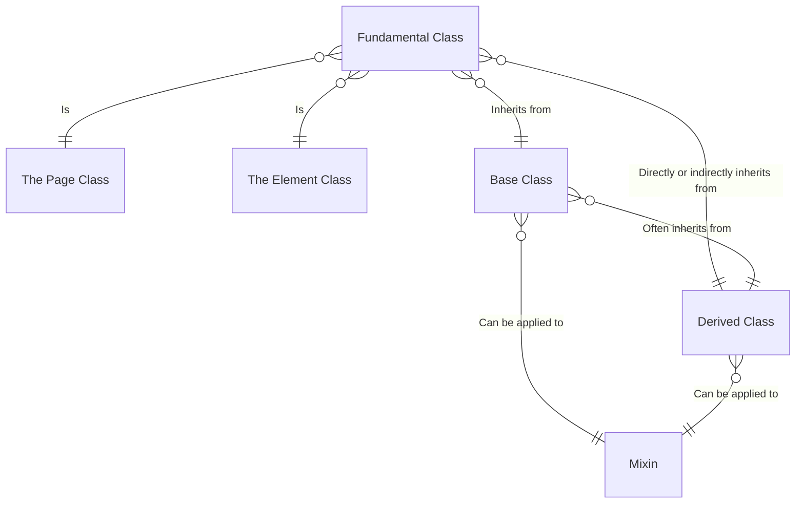
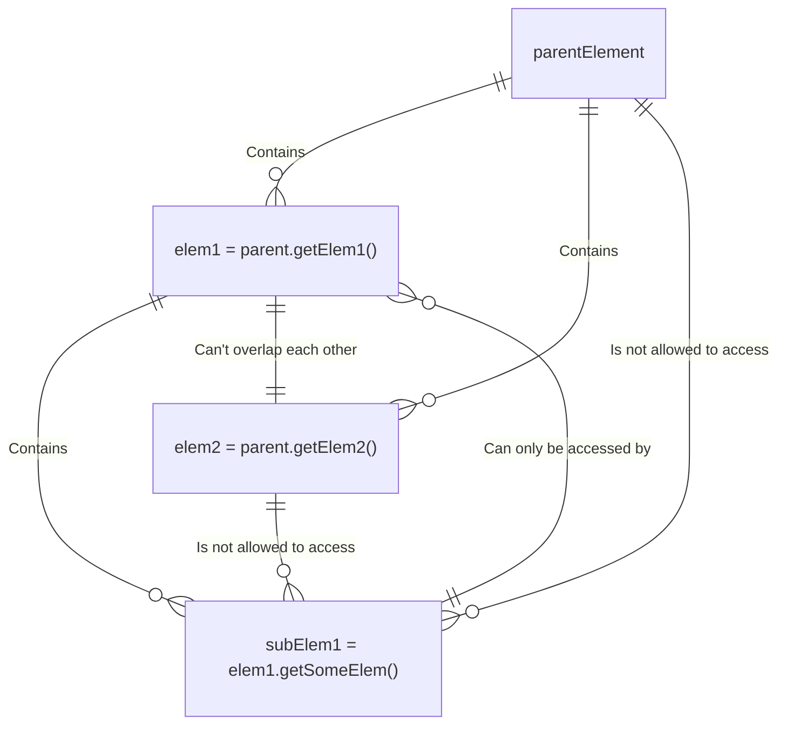
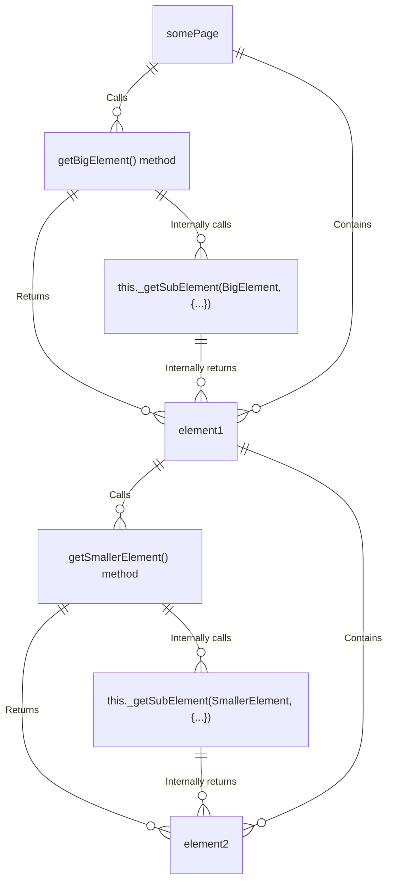

# Conventions

The expression `{REPO_BASE}` represents the base of the git repository.

All folders and files related to the functional tests must be stored under the **functional test base path** which location is `{REPO_BASE}/frontend/tests`.

All the relative paths cited in this spec will be relative to the **functional test base path**.

So for example the folder `./utils/core` as cited in this spec would therefore be located at `{REPO_BASE}/frontend/tests/utils/core`.

The syntax `{...}` represents either a part of a string/variable name/typescript code.

The syntax `{ClassName}` just represents the same thing as `{...}` except that it precises what the content represents and in what case it should be written to.

For example `{some-name}.ts` mean that the part between curly braces represents "some name" that you can give to the file, and the `some-name` is written in kebab-case which indicates that the name of this file (before the `.ts` extension) should be written in kebab-case.

The terms written in bold **like this** represent specific concepts explicitely defined somewhere in this spec.

For now we have both `./utilsv2` and `./utils`, `./utils` is the deprecated utils codebase while `./utilsv2` contain the refactored version of `./utils` with the new architecture describe in this spec.

This spec describe how the test codebase should be, not how it is at this exact moment.

Therefore all mentions of relative paths starting with `./utils` in this spec represent the future `./utils` folder, which is currently named `./utilsv2` until the end of the refactoring.

When code in the current `./utils` complelty stops being used by the functional tests the current `./utils` folder will be erased and the current `./utilsv2` folder will be renamed into the new `./utils` folder as described in this spec.

Some examples written with the syntax `(e.g. {...})` may not be in the codebase.

# File Architecture

All folders and files must have a kebab-case name.
For example a file defining a class `UserSettingsPage` will have to be named `user-settings-page.ts`.
All source files must written in typescript and end with the `.ts` extension.

- `./utils` Contains all the classes/fixtures/functions used in the tests
- `./utils/core` Contain core code used everywhere (fixtures, **fundamental classes**, core utilities etc...)
  - `test-data.ts` Contains the **global test data** which will be used by the test files (e.g. Role permissions, model infos etc...).
  - `base.ts` Contains the `test`, `expect` and `notImplemented` functions.
  - `fixtures.ts` Contains all the fixture definitions.
  - `page.ts` Defines the `Page` **fundamental class** and its **mixins**.
  - `element.ts` Defines the `Element` **fundamental class** and its **mixins**.
  - `utils.ts` Contains all the **core utilities** (e.g. `setHttpListener`).
- `./utils/base` Contains all the **base classes**.
- `./utils/derived` Contains all the **derived classes**, for example if we have a `ListView` **base class** it must be stored in the file `./utils/base/list-view.ts` and the **derived classes** of this **base class** must be stored in either a single file like `./utils/derived/list-view.ts` or in multiple files like `./utils/derived/list-view/{some-name}.ts` (one file per class).
- `./hot-reload` Contains all the hot reloaded code used during test development. Files in this directory shouldn't be commited except for the `_main.ts` file which contains some default code to start with as it may be hard to understand how to effectively use the hot reloader without it.
- `./output` Stores all the outputs generated by the test suite (e.g. The django backend logs).
- `./assets` Contains all the files used during the execution of the tests.
- `./tests` Contains all the tests.
- `./tests/{test-type}` Tests will be classified based on the kind of test they are the same way fuzz tests are in the `./tests/fuzz` folder, there must not be a single file in `./tests` but only folders containing test files.

# Class Architecture

## Class types

- `Fundamental classes` There are only 2 of them.
  1. `Page` Which represents a page of the application.
  2. `Element` Which represents an HTML element (which is usually a Svelte component).
- `Base classes` Inherit from a **fundamental class**. The main goal of a **base class** is to be used as a base for a **derived class**.
Using a **base class** as a **derived class** is fully authorized.
Note that a **base class** may end with a block of code like this one:
```ts
export namespace BaseClass {
  export type Derived = new(arg1: SomeType, arg2: SomeType2) => BaseClass;
}
```
The goal of this block of code is to create a `BaseClass.Derived` type which represents a **derived class** of `BaseClass`, this must be the only way of precising the type of **derived class** of a specific **base class** in the test code when using class polymorphism.
- `Mixins` Are functions that take a class as an argument and return a superclass of it, the sole purpose of a **mixin** is to be applied to either a **base class** or a **derived class**. To apply a **mixin** `HaveSomething` to a derived class `DerivedClass` with a base class `BaseClass` the syntax is `class DerivedClass extends HaveSomething(BaseClass)`.
Note that multiple mixins can be applied to the same class (e.g. `class DerivedClass extends HaveElem1(HaveElem2(HaveElem3(BaseClass)))`).
The sole purpose of a **mixin** is to add extra methods to a class, a **mixin** always targets a specific class.
  - If a **mixin** targets a class, it means that it can be applied to all the directly or indirectly **derived classes** of this class (e.g. a **mixin linked** to the `Page` class can be applied to any class directly or indirectly inheriting from `Page`).
  - If a **mixin** `HaveElem` targets a class `SomeClass` then we say that `HaveElem` is **linked** to `SomeClass`, we can also say that `SomeClass` is **linked** to `Mixin`.
  - A **Mixin** must always be defined in the same file as its target class.
  - For now all **mixins** must have a name of the form `Have{Something}`, because a **mixin** only indicates the presence of something (which is not always present). For example the `HaveSidebar` **mixin** indicates the presence of a `Sidebar` element in the page (which it not present in the login page), and the mixin implements the `getSidebar` method so that its target class can access the `Sidebar` object.
- `Derived classes` Inherit from a **base class** most of the time but might also inherit directly from a **fundamental class**. What make a **derived class** differs from a **base class** is its usage. The goal of a **derived class** is to be used directly while the main goal of a **base class** is to serve as a base for a **derived classes**.

- `Page class` Is how we call any class that inherits directory or indirectly from the `Page` **fundamental class**. We say that a `Page class` is an **abstraction** of a Page (a playwright Page) because it basically wraps a playwright Page and provide an abstraction to control it.
- `Element class` Is how we call any class that inherits directory or indirectly from the `Element` **fundamental class**. We say that an `Element class` is an **abstraction** of a Locator (a playwright Locator) because it basically wraps a playwright Locator and provide an abstraction to control it.

This is why the `getSelf` method is defined for both **fundamental classes** (`Page` and `Element`).
The `getSelf` method will always return what the object is an **abstraction** of.
For example `LoginPage.getSelf()` returns a playwright Page object while `sidebar.getSelf()` returns a playwright Locator object.



## Class Coding Rules (in ./utils)

1. **A base class MUST NEVER inherit from another base class !**
2. **A derived class MUST NEVER inherit from another derived class !**.
3. Every property of a class must be either `protected` or `private`.
4. Every property of a class must start with an underscore (e.g. `this._self`)
5. A **Page class** must have a name of the form `{...}Page`.
6. The constructor and methods of 2 **derived classes** from the same **base class** must have the same function signature.

### THE MOST IMPORTANT RULE (in ./tests)

**Importing variables from `./utils` in the test code is STRICTLY FORBIDDEN except for the following files:**
1. `./utils/core/base.ts`
2. `./utils/core/utils.ts`
3. `./utils/core/test-data.ts`
4. `./utils/core/hot-reloader.ts`
Note that this restriction doesn't include type-only import declarations.

### Fixture coding rules (in ./core/fixtures.ts)

1. All fixtures must be a `Page` object (except the `allFixtures` fixture).
2. Creating a fixture which performs any action before being passed to test by a `use` is strictly forbidden.
3. All newly created fixtures must be added to the `allFixtures` fixture.

## Element access

If a `Page`/`Element` `A` class can return an `Element` `B` we can say that:
- `A` **accesses**/can **access** `B`.
- `B` is **accessed**/accessible by `A`
- `B` is a **sub-element** of `A`

If `A` is an element we can say that:
- `A` is a **super-element** of `B`

If `A` is a page we can say that:
- `A` is the page of `B`

If a `Page`/`Element` `A` class returned an `Element` `B` we can say that:
- `A` generated `B`
- `B` has been generated by `A`

### Element Access Rules (also in ./utils)

1. **A Page/Element object MUST NEVER be able to return 2 HTML elements that overlap each other**. Let's say that `A` is any `Element` object/Locator returned by a class `Class` and `OTHERS` are all the other `Element` objects/Locators that can be returned from `Class` then:
  1. `A` Must not be present in `OTHERS` (no HTML element in `OTHERS` must be the same as `A`).
  2. `A` Must not be the parent of any HTML element in `OTHERS`.
  3. `A` Must not be a child of any HTML element in `OTHERS`.
2. An `Element` MUST ONLY be accessed by the underlying use of the `_getSubElement` **protected method** which is defined for both **fundamental classes** (`Page` and `Element`).
3. An `Element` MUST ONLY be able to access elements that are its children.
4. There must be ONE AND ONLY ONE way to access an `Element` object, for example you can't have `somePage.getModelTable().getFirstRow()` and another method `somePage.getFirstModelTableRow()` which returns the same thing.
5. All `Element` objects must only be externally accessible by a chain of `get{...}` method calls starting from a `Page` object.
6. The `getOpen{...}` methods are allowed to break these rules, for example in a method to open and get a modal, the modal may not be a child of the abstraction that opened it.

#### Example 1



#### Example 2
The following flowchart represents the following element access.
```ts
test(async ({ somePage }) => {
  const element1 = somePage.getBigElement();
  const element2 = element1.getSmallerElement();
})
```



### Super-element chain

The super-element chain (or "chain or super-elements") of an `Element` object is how we name its `_chain` private property.
When an `Element` object `elem` object is generated by a `Page` object `somePage` super-element.
- The private property `elem._page` is set to `somePage`.

When an `Element` object `elem` object is generated by an `Element` object `superElem`
- The private property `elem._page` is set to `superElem._page`.
- The private property `elem._chain` ie set to `[...superElem, superElem]` which mean `elem` inherits from the **super-element chain** of its superElement `superElem` before adding it at the end of its chain.

So if we have 4 `Element` objects `A`, `B`, `C`, `D` where `A` generates `B`, `B` generates `C` and `C` generates `D` the chain of elements for each one of these elements would be:
- `A` => `[]`
- `B` => `[A]`
- `C` => `[A, B]`
- `D` => `[A, B, C]`

And we would also have `A._page = B._page = C._page = D._page`.

### Context of an Element

A `Page`/`Element` class can have an optional `CONTEXT` static attribute of type `Context` (type defined in `./utils/core/element.ts`).

Also all `Element` objects have an internal private context `this._context` which can be accessed by multiple methods defined in the the `Element` fundamental class like `getContext` or `getHasContext`.

The context of an `Element` represents the aggregation of all its **context sources**.


When looking for a context value, the `Element` protected context-methods will look for the value in all the **context sources** in a specific order, when a value is found this value is returned even if occurences of this value exist in other **context sources**.

So if we have 2 **context sources** `A` and `B`, if `B` has a higher priority than `A` and both `B` and `A` have a `"someValue"` context value, then the context value of `"someValue"` will be equal to `A["someValue"]` instead of `B["someValue"]`.

Here is the list of the **context sources** order from the highest to the lowest priority:
1. The current element's `_context` private property.
2. The static `CONTEXT` property on the current element's class.
3. For each **super-element** of the Element's **chain** (from the last element of the chain to the first):
  1. The super-element's `_context` private property.
  2. The static `CONTEXT` property of the super-element's class.
4. The static `CONTEXT` property of the class of the element's class.

# Method architecture

All methods must be named after one of the folliwing prefixes:

- `check{Something}(expect, {...})` Checks for something, this is a wrapper around one or multiple playwright checks (e.g. checkUrl, checkBreadcrumbPath). A check function must always take an `Expect` as its first argument. Checks must never use the `expect.soft({...})` alternative of the original `expect` function.
- `do{Action}` Does an action (e.g. doFillForm, doCloseModal).
- `do{Action}P` Does an action that returns a page (this must be used if the action redirects to a new page e.g. doLoginP).
- `get{Object}` Usually return an `Element` object, a playwright Locator. But it can also return any kind of values (e.g. getNumberOfPages()).
- `getOpen{Object}` Opens an element (e.g. a modal) and returns the `Element` object or playwright Locator representing it.
- `goto{Object}` Goto a specific link and returns a `Page` object representing the newly loaded page (e.g. gotoSelf).
- `wait{Something}` Blocks the execution of the code until a specific event happen (e.g. waitUntilLoaded).

## Method Types

- `Regular methods` Are normal methods which correspond to none of the 2 following method types.
- `Abstract methods` Are methods implemented in a **base class**, an abstract method purely exist to indicate that this method must be implemented in its **derive classes** with the same function signature. An abstract method must be a single call to the `notImplemented` function defined in `./utils/core/base.ts`.
- `Protected methods` Are `protected` and defined either in a **base class** or **fundamental class**. They are methods prefixed with an underscore (e.g. `_getSubElement`) these methods are meant to exclusively be called internally.
For example a regular methods `doSomething` defined in multiple **derived classes** of the same **base class** `BaseClass` may just be a wrapper around a `BaseClass._doSomething` method under the hood.

Note that a wrapped **protected method** will usually also be paired with an **abstract method** version if itself.

So we could also have a `doSomething` abstract method in `BaseClass` to indicate that the **derived classes** must implement a `doSomething` method with the same function signature as the one declared in the **base class**.

# Miscellaneous

## Docstrings rules

Most docstrings should be short except for complex classes/functions.
Writing docstrings is a good practice, but some docstrings are optionnal while others are mandatory.

### Optional docstrings

- `check{...}` Methods must specify what it checks.
- `do{...}` Methods must specify what the action does and what are the impacts on the page.
- `do{...}P` Methods must specify everything like `do{...}` methods and precise what page it returns if it's not possible to deduce it with the function's signature.
- `wait{...}` Methods must specify what it waits for.
- `Page` classes must specify what page they representing (by giving an endpoint e.g. `/analytics`).
- `Mixins` Must specify what DOM Element presence they represent or/and what functionalities they bring.

### Mandatory docstrings

- `Utility core functions` Must precisely and exhaustively explain the meaning of their arguments, what they do, how they work and what they return. (The docstring must be more detailed for this type of function than for the other docstrings in the codebase).
- `Fixtures` Must have a docstring which specify what page it represents.
- `Element classes` and `get{...}` Methods, must specify the data-testid and component name of the element it represents (if there is one) with the following kind of syntax: `[data-testid="sidebar"] Get the <Sidebar/> of the page.`.

## Data-TestIDs rules

1. A data-testid must be written in kebab-case.
2. A data-testid representing a component `SomeComponent` must have a name which is the kebab-case version if this component which is `some-component` in this case.
3. A data-testid which represents an HTML element which is not a Svelte component must have a name of the form `{...}-elem`
4. A data-testid that is generated dynamically must be of the form `dyn-{...}-elem`, the prefix `dyn-` indicates to the developer test ID to search in the codebase have some kind of dynamic expression.
5. A data-testid must either be unique in his **scope** or be always assigned the same type of element if repeated
  - As mentionned in the rule number **4** of `Element Access Rules` an HTML Element `A` must only be accessible by one and only one abstraction `B`, therefore the **scope** of `A` is the `B` HTML Element.

## Test Data rules

There are 2 kinds of test data:
- `Global test data` (stored in `./core/test-data.ts`).
- `Local test data` which represents all data required for a specific test, the **local test data** must be stored same test file as the test which uses it.

