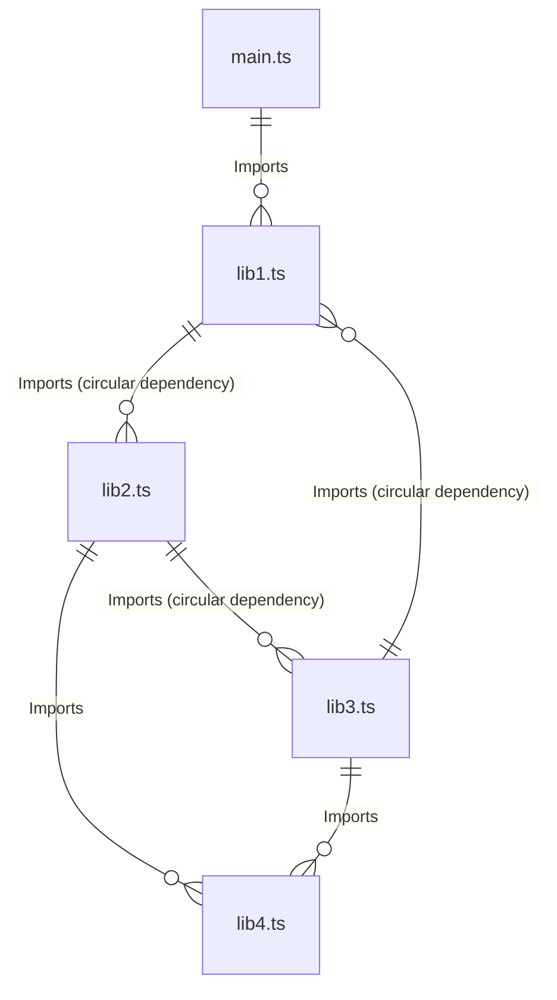
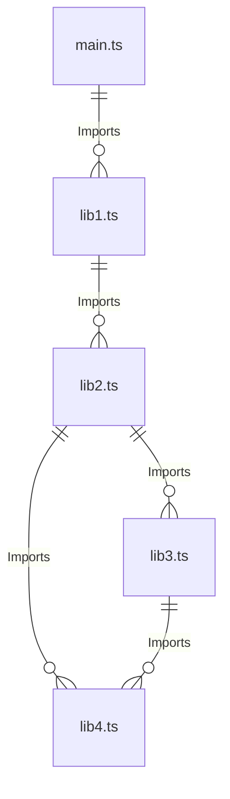

# Disclaimer

The spec for the functional tests can be found at `./documentation/tests/functional/architecture.md`.
This spec is about using the hot-reloader which is a feature meant to develop test faster by executing fragmented piece of codes and rerun them as you please.
This makes development faster as re-executing the entire playwright test for each test code modification is quite slow.

# Quick start

To create a hot reloader loop test put this code in any test file:

```ts
import { hotReloadLoop } from '../hot-reload/core/hot-reloader';
hotReloadLoop();
```

The best way to use the hot reloader is to copy the entire `utilsv2` codebase into `hot-reload`.
Then you can incrementally develop your test directly inside main.ts by taking advantage of the hot-reloader.

Here's the command you should now to use the hot reloader (executed from `frontend/tests`):

- Transfer the real utils codebase to the hot reloader utils codebase: `rm -rf hot-reload/core hot-reload/base hot-reload/derived && cp -r utilsv2/* hot-reload`
- Run the `HotReloadLoop` test: `./e2e-tests.sh -q -k -x --headed --grep="Hot-reloaded test"`
- Transfer the hot reloader utils codebase back to the real utils codebase: `rm -rf utilsv2/* && cp -r hot-reload/core hot-reload/base hot-reload/derived utilsv2`
- Create the `main.ts` entry point out of the default template: `cp hot-reload/_main.ts hot-reload/main.ts`

To test the hot-reloader for the time do:

- `rm -rf hot-reload/core hot-reload/base hot-reload/derived && cp -r utilsv2/* hot-reload` to load utilsv2 into the hot-reloader.
- `cp hot-reload/_main.ts hot-reload/main.ts` to make the `_main.ts` template file into the real `main.ts` entry point file.
- Import and call `hotReloadLoop` in any test file to execute the hot-reloader when executing the tests.
- `./tests/e2e-tests.sh -q -k -v --headed --grep="hot-reloaded` to start the hot-reloader.

The hot-reloaded code should log into the page as it's the default action of the `_main.ts` template file.
Go into your newly created `main.ts` and search for `[(ACTION = 2)]` and replace it with `[(ACTION = 3)]` to execute another action of the hot-reloaded code.
Further details about how to use the hot-reloader are written into the newly created `main.ts` file as it's more convenient.

# Run the tests locally

The script to run the tests locally is `./tests/e2e-tests.sh`.
Start by doing `./tests/e2e-tests.sh --help` to see all the options of the script.
All options not specified in the `--help` message will be passed as arguments to the playwright command.
To know all the playwright command argument check this [page](https://playwright.dev/docs/test-cli).

The best way to run the tests locally for development is: `./tests/e2e-tests.sh -q -k -v --headed --grep="hot-reloaded"`

The `-k` option is used to save the "initial database" so that you only have to build it a single time instead of builing it from scatch by applying all migrations each time you run the script.
When dealing with new migrations, you will have to either delete the `./db/test-database-initial.sqlite3` file or run the `e2e-tests.sh` script without the `-k` option once to rebuild the `test-database-initial.sqlite3` file with the new migrations.

The `-q` option makes playwright execute the tests exclusively in chromium, instead of doing it in multiple browsers.
The `-v` option makes the backend stores its logs into `./frontend/tests/output/backend.log`.

The `--headed` option makes playwright open the browser instead of running the tests in a headless browser (which is invisible).

When debugging a specific test, you must replace the value passed to the `--grep` by a substring of the test you want to debug.

# Hot Reloading

To develop tests faster, a hot reloading module is provided by `./utilsv2/core/hot-reloader.ts` (and `./utils/core/hot-reloader.ts` in the future).
This module exports 2 functions `hotReloadInTest` and `hotReloadLoop`.
To make the Hot Reloading effective pass the `--headed` argument to the `e2e-tests.sh` script so that you can see the effects of your hot-reloaded code directly in the browser.

## Functions

All the details of these functions are written in their docstring, this document doesn't exhaustively describe every argument of each function, its purpose is only to briefly explain how to use them.

### hotReloadLoop Usage:

Using this function is the most common and easy way to use the hot-reloader.
This function creates a loop which repeats the same test over and over.
The test will just executes hotReloadInTest infinitely which loops over the hot-reloaded code and execute it each time it changes.
The name of the test generated by this function is `Hot-reloaded test` therefore you must pass the `--grep="Hot-reloaded test"` argument to the `e2e-tests.sh` script to use this.
To use this function simply put `hotReloadLoop(test, expect);` inside an executed test file.

### hotReloadInTest Usage:

This function loops over the hot-reloaded code and executes it each time it being modified.
This function must be called inside a currently running test: `hotReloadInTest(test, expect, testInfo, allFixtures)`.
The function takes the `testInfo` value of the test as describe in this [page](https://playwright.dev/docs/api/class-testinfo), and the `allFixtures` fixture which is a fixture defined in the current codebase.

## Hot Reloading

When the hot reloader runs it executes the **hot-reloaded code** again each time it's being modified.
The **hot-reloaded code** is a long string of typescript code passed to an `eval` function, here's how it works:

### Hot-Reloaded module registration

A hot-reloaded module `{MODULE}` (which is a typescript file) is **registered** as followed:
1. The hot reloader begins by reading `{MODULE}`.
2. The content of `{MODULE}` is parsed into an AST, each typescript file imported in `{MODULE}` is added to the **dependency tree** if:
  1. It's imported as a relative path (e.g. import ... from `./{module}`/`../{module}`/`$lib/{module}`)
  2. The import declaration is not type-only (meaning it imports real javascript stuff and not only typescript types)
3. All files added to the **dependency tree** are also registered etc...

### Cycle breaking

Once the **dependency tree** has been built, the program checks for circular dependencies.
For each circular dependency discovered the last link of the circular dependency is broken.
#### Dependency tree before cycle breaking

#### After tree before cycle breaking
The last link of the circular dependency (the import of lib1 done by lib3) has been deleted:



### Code bundling

A unique string of typescript code (the **bundled code**) is created out of the dependency tree.
At the beginning the **bundled code** starts as an empty string.
Then each module with 0 dependency in its **dependency tree** is added to the **bundled code**
Then each module added to the **bundled code** is deleted from the dependency list of all modules in the **dependency tree** that imported them.
This process starts again and again until all modules are loaded.


### Typescript compilation

Once the **bundled code** has been created it's passed to the typescript compiler which transforms the code into vanilla javascript code, this code is the **final code**.
The line `"\n(async(args)=>_start(args))"` is then added to the **final code**.
Thanks to this line the evalutation of the **final code** becomes an async function which executes the `_start` async function declared in `frontend/tests/hot-reload/main.ts`.

## Coding with the Hot Reloader

As i said before the hot reloader executes the `_start` asynchronous function in `frontend/tests/hot-reload/main.ts`, `_start` serves as an entry point for the reloader.
Using the hot reloader can be a bit tricky without understanding how it works.

The hot reloader use the `eval` function after the bundled code has been compiled to typescript.
This combination does not support `import` declarations at all.
This is why the import system is simulated with the **module registration** and **code bundling** phases.
Only imports within the hot reloader path (which is `frontend/tests/hot-reload` by default) are simulated, which mean that all other imports are completly ignored.
For example `import { test } from './utilsv2/core/base'` and `import { expect } from @playwright/test` will be both ignored by the hot reloader.

The solution to this problem is simple, just put the import declaration inside the test file which executes the hot reloader, the code of the hot reloader can access everything imported inside its test file because a code executed with an `eval` function can access the global scope of the program.

Note that even though these import declarations (and also type only import declarations) are ignored by the hot reloader, they are still usefull for IDE autocompletion and typing.
You should code in the hot reloader path as you would code if you were in the real codebase.
