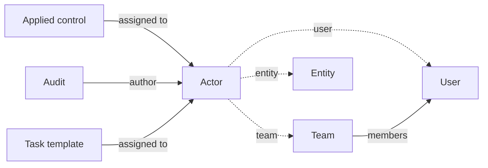

# Actors and teams

Almost every object in CISO Assistant has an **assignee** — the applied control someone is responsible for, the audit a team is running, the contract a supplier signs. The platform represents all these counterparties through a single abstraction: the **actor**.

## Mental model

The actor is a one-to-one wrapper that always points at exactly one of three concrete records — a user, a team, or an entity (the three dashed edges are exclusive: a database check constraint enforces XOR). Every _Assigned to_ / authorship / approver field on the platform (applied control assignee, audit author, task assignee, contract counterparty…) holds an actor, so a single code path resolves notifications and access regardless of the underlying type. Teams aggregate users via leader, deputies, and members — assigning to a team fans out to every user in it.

| User-facing | Internal | Notes |
|---|---|---|
| Actor | `Actor` | XOR(User / Team / Entity); auto-created with its target |
| User | `iam.User` | Platform account |
| Team | `Team` | Leader + deputies + members |
| Entity | `tprm.Entity` | Third-party party |

## Actors

An actor is the unifying handle for anyone who can be assigned to work in CISO Assistant. Every actor wraps exactly one of three concrete underlying objects:

- A **user** — a person with a platform account.
- A **team** — a named grouping of users for collaborative responsibility.
- An **entity** — an external party from the third-party register (typical for contracts and entity assessments).

The actor abstraction means the same _Assigned to_ field on an applied control can hold a user, a team, or a supplier without the consuming code caring which it is. Notifications, emails, assignments, and reporting all go through the actor — they fan out to the right addresses regardless of the underlying type.

Actors are created automatically when their underlying object is created. You don't manage actors directly; you manage users, teams, and entities, and the actor records follow.

## Teams

A team is a named grouping of users used for **collaborative assignment** — when the responsibility for something belongs to a working group rather than an individual.

A team has:

- A **leader** — a single user accountable for the team.
- **Deputies** — users who can act in the leader's place.
- **Members** — the broader group.
- An optional **team email** — used as the default notification address; if not set, emails fan out to the leader, deputies, and members individually.

Teams are first-class targets for assignments and notification routing. When work is assigned to a team, anyone with the appropriate role in the team's domain can act on it.

## Teams vs user groups

These two are easy to confuse:

- A **team** is a collaborative group with members, a leader, and deputies. It's about _who works together_. Teams are voluntary, organisational, and can span any domain.
- A **user group** is a `(role, domain)` pair on which users get placed. It's about _what permissions someone has where_. User groups are auto-created when a domain is created — one per role per domain.

You join a team for collaboration. You're placed in a user group for access. Both can carry users; they answer different questions.

## How actors are used across the platform

- **Applied controls** are assigned to one or more actors.
- **Requirement assessments** can be assigned to an actor for completion.
- **Tasks** are assigned to actors and notify them when due.
- **Risk scenarios** are assigned to one or more actors.
- **Entity assessments** have a representative (an actor of type user, tied to an entity).
- **Validation flows** route approvals through actors.

Because all of these use the same actor handle, an audit log that says "assignee changed from team A to user B" is unambiguous, and the platform can resolve notifications the same way everywhere.

## Related

- [Domains](domains.md) — where role-based access control happens
- [Vocabulary → Actor, Team, User, User group](../introduction/vocabulary.md)
- [Add and manage users](../configuration/organization/users.md)
- [User groups](../configuration/organization/user-groups.md)
- [Teams](../configuration/organization/teams.md)
