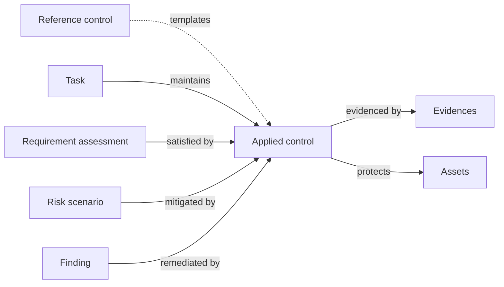

# Applied controls

An **applied control** is the main building block of the action plan: the actual action your team has implemented or will implement to address a security need. It can be technical, organisational, a process, a policy, a piece of documentation — anything that materially changes risk or compliance posture.

A single applied control can satisfy any number of requirements across any number of frameworks — it's where _what the framework asks_ meets _what the organisation actually does_.

## Mental model

The applied control sits at the centre — anything that asks for action **points to** it; everything that proves the action took place **hangs off** it. Compliance work (requirement assessments), risk work (scenarios), follow-up work (findings), and operational maintenance (tasks — periodic reviews, evidence refresh, ownership rotation) all reference the same control, while evidences and protected assets accumulate on the other side. This is the [decoupling principle](../introduction/philosophy.md) made concrete: one applied control, many demand-side users.

| User-facing | Internal | Notes |
|---|---|---|
| Applied control | `AppliedControl` | The action you take |
| Reference control | `ReferenceControl` | Optional library template; an applied control can also be created from scratch |
| Task | `TaskTemplate` (definition) / `TaskNode` (occurrence) | A task definition lists which controls it keeps alive; occurrences are the recurring instances |
| Evidence | `Evidence` | M2M; one evidence can prove several controls |

## Applied control

Applied controls are fundamental for both compliance and remediation. They can derive from a **reference control** for consistency, or be created independently. They are always defined by the organisation and can be attached to the global domain or to a specific domain.

## Reference control

A **reference control** is a template for an applied control. Reference controls facilitate the creation of applied controls and help keep them consistent across the organisation.

They can be provided by security frameworks imported from a library, or you can create your own — in the global domain or in a specific domain. Reference controls are optional but recommended.

## Policy

A **policy** is a specific type of applied control: a document describing what is expected from some part of your stakeholders. Putting your cybersecurity policies in CISO Assistant makes them readily available for audits, and lets you manage their lifecycle alongside the rest of your controls.

## Related

- [Policies](policies.md)
- [Audits](audits.md)
- [Findings assessments](findings-assessments.md)
- [Philosophy → Decoupling principle](../introduction/philosophy.md)
- [Vocabulary → Applied control / Reference control / Evidence](../introduction/vocabulary.md)
