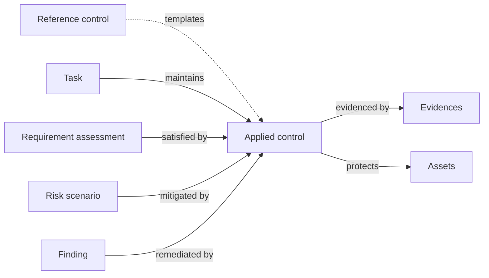
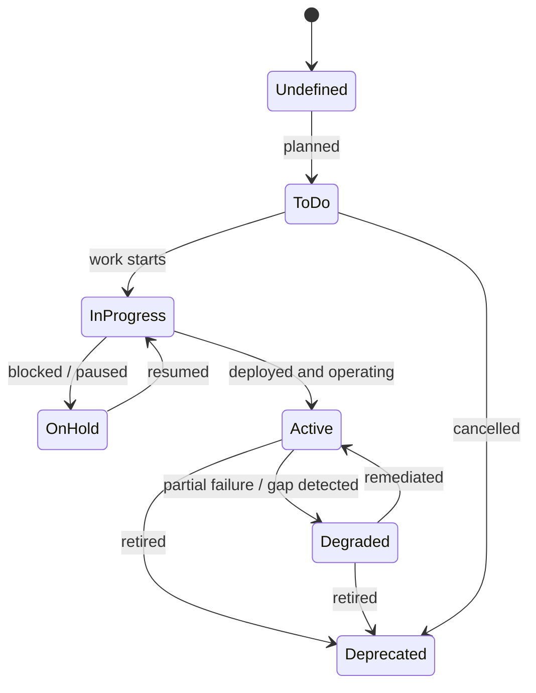

# Applied controls

An **applied control** is the main building block of the action plan: the actual action your team has implemented or will implement to address a security need. It can be technical, organisational, a process, a policy, a piece of documentation — anything that materially changes risk or compliance posture.

A single applied control can satisfy any number of requirements across any number of frameworks — it's where _what the framework asks_ meets _what the organisation actually does_.

## Mental model

The applied control sits at the centre — anything that asks for action **points to** it; everything that proves the action took place **hangs off** it. Compliance work (requirement assessments), risk work (scenarios), follow-up work (findings), and operational maintenance (tasks — periodic reviews, evidence refresh, assignee rotation) all reference the same control, while evidences and protected assets accumulate on the other side. This is the [decoupling principle](../introduction/philosophy.md) made concrete: one applied control, many demand-side users.

| User-facing | Internal | Notes |
|---|---|---|
| Applied control | `AppliedControl` | The action you take |
| Reference control | `ReferenceControl` | Optional library template; an applied control can also be created from scratch |
| Task | `TaskTemplate` (definition) / `TaskNode` (occurrence) | A task definition lists which controls it keeps alive; occurrences are the recurring instances |
| Evidence | `Evidence` | M2M; one evidence can prove several controls |

## Applied control

Applied controls are fundamental for both compliance and remediation. They can derive from a **reference control** for consistency, or be created independently. They are always defined by the organisation and can be attached to the global domain or to a specific domain.

## Status lifecycle

The **status** field is what turns an applied control from a static catalogue entry into a live, trackable piece of work. It's the single signal that drives roll-ups across audits, dashboards, action plans, and reporting — so it's worth understanding how it moves.

### Why "Active" — and why no "Done"

The target state of an applied control is **Active**, not _Done_. This is deliberate. A control is never finished in the way a project task is finished: a backup policy that's been written and approved still has to keep being followed, a firewall rule that's been deployed still has to keep being enforced, an access review that's been run still has to be run again next cycle. Reaching **Active** doesn't end the work — it starts the maintenance phase. The work shifts to _keeping the control in Active_, through periodic reviews, evidence refresh, and the [tasks](tasks.md) that "maintain" it.

This is why the lifecycle has **Active**, **Degraded**, and **Deprecated** rather than _Done_. A control that's failing partially moves to _Degraded_ (signal to act); a control that's no longer needed moves to _Deprecated_ (retire with history intact). There's no terminal "done" state on purpose — the whole point of cybersecurity controls is that they're a continuous effort to stay in Active, not a checkbox you tick once.

The lifecycle runs through seven states:

| Status | Meaning | Counts as "in place"? |
|---|---|---|
| **Undefined** | Default — status not yet set | No |
| **To do** | Planned but not started | No |
| **In progress** | Being implemented | No |
| **On hold** | Started then paused — blocked, deprioritised, or waiting on a dependency | No |
| **Active** | Implemented and operating as intended | **Yes** |
| **Degraded** | Was active, now partially failing — gap detected at audit or in operations | Partial |
| **Deprecated** | Retired or superseded — no longer in scope | No |

Why the lifecycle matters across the platform:

- **Risk model** — _Current risk_ uses controls in `active` (and partly `degraded`); _residual risk_ also factors in controls in `to_do` / `in_progress` (the planned ones). Moving a control from `to_do` to `active` is what closes the gap between residual and current.
- **Action plan** — the Kanban view and the Control Plan grid both swimlane by status. A control sitting in `on_hold` for too long is the signal to escalate.
- **ETA enforcement** — when ETA passes and the status isn't `active`, the control is flagged overdue. Reaching `active` is what stops the clock.
- **Framework / audit roll-ups** — compliance percentages and analytics treat `active` as "in place" and `degraded` as a partial signal that wants follow-up. Other statuses don't contribute coverage.
- **Deprecation** — preferred over deletion. A deprecated control keeps its history, evidence, and links to the requirements it once satisfied — useful for past-audit traceability — without polluting current views.

The transitions aren't enforced as a strict state machine — you can move a control between any two statuses — but staying within the lifecycle above makes audit trails and analytics meaningful.

## Reference control

A **reference control** is a template for an applied control. Reference controls facilitate the creation of applied controls and help keep them consistent across the organisation.

They can be provided by security frameworks imported from a library, or you can create your own — in the global domain or in a specific domain. Reference controls are optional but recommended.

## Policy

A **policy** is a specific type of applied control: a document describing what is expected from some part of your stakeholders. Putting your cybersecurity policies in CISO Assistant makes them readily available for audits, and lets you manage their lifecycle alongside the rest of your controls.

## Related

- [Policies](policies.md)
- [Audits](audits.md)
- [Findings assessments](findings-assessments.md)
- [Philosophy → Decoupling principle](../introduction/philosophy.md)
- [Vocabulary → Applied control / Reference control / Evidence](../introduction/vocabulary.md)
