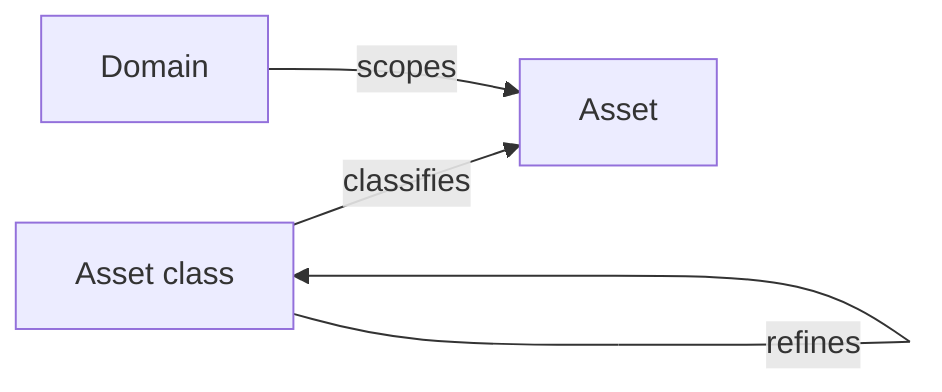

# Asset classes

An **asset class** answers "what kind of thing is this?" for an asset — a server, a business process, a set of personal data. Classes form a tree, so a class can be a refinement of a broader one, and every asset points at a single class.

CISO Assistant ships with a taxonomy derived from the CIS asset categories (Devices, Software, Data, Users, Network, Facilities, Documentation, Business Process, and their sub-classes). You can extend that tree with your own classes, and hide the shipped ones you don't use.

## Why it exists

The class is deliberately separate from the [domain](domains.md) an asset lives in and from its primary/supporting `type`. Those three answer different questions:

| Question | Field |
|---|---|
| Who owns and can see it? | Domain |
| Does it deliver value directly, or support something that does? | Type (primary / supporting) |
| What kind of thing is it? | Class |

Keeping them apart means you can classify a supporting asset in one domain and a primary asset in another under the same class, and then read your whole estate by class regardless of who owns it.

## Mental model

A class refines a parent class, forming the taxonomy tree. An asset is classified by at most one class — the link is optional, so an unclassified asset is valid and stays fully usable. The domain still scopes the asset; classes are organisation-wide and carry no access control of their own.

| User-facing | Internal | Notes |
|---|---|---|
| Asset class | `AssetClass` | Self-referencing tree via `parent` |
| Class (on an asset) | `Asset.asset_class` | Optional; a single class per asset |
| Built-in | `builtin` | Shipped with the product |
| Visible | `is_visible` | Controls whether the class is offered when classifying |

## Built-in versus your own classes

The shipped classes are marked **Builtin**. They are re-created every time the platform starts, which is why they behave differently from classes you create:

- They **cannot be renamed or deleted** — a rename would be undone and a deletion would silently reappear on the next restart. The edit form states this: _"Built-in classes are provided with the product: they can be hidden, but not renamed or deleted."_
- They **can be hidden**. Clearing **Visible** removes a class from the picker used when classifying an asset, without touching any asset already classified under it. The form notes: _"Hidden classes stay listed here but are no longer offered when classifying an asset."_

Classes you create are yours entirely — rename, re-parent, hide or delete them at will. Creating a class **under** a built-in one is the intended way to extend the shipped taxonomy: the child is your own class, and the built-in parent stays untouched.

Hiding a class that still has visible sub-classes does not orphan them. The class remains in the picker as a non-selectable grouping row so its descendants keep a readable path.

## Managing classes

In the sidebar under **Extra → Asset classes**.

The table lists **Name**, **Parent class**, **Description**, **Translations**, **Visible** and **Builtin**. Filters let you narrow to visible or built-in classes.


Creating, editing and deleting asset classes requires administrator rights. Other roles can see the taxonomy and use it to classify assets, but not change it.


### Creating a class

Use the add button on the **Asset classes** page. The form asks for:

- **Name** — free text.
- **Description** — optional.
- **Parent class** — optional. Leave it empty to create a top-level class. The picker is a tree, and it excludes the class you are editing along with everything beneath it, so a class can never become its own ancestor.
- **Translations** — see below.
- **Visible** — on by default.

To add a child directly under an existing class, open that class and use the add button on its children table: the **Parent class** is filled in for you.

### Translating class names

Built-in class names are translated by the interface itself and follow the language you are using. Classes you create are free text, so they need their own translations.

The **Translations** editor on the class form takes a **Name** and a **Description** per language. When you are using a language that has no entry, the class falls back to the name you typed when you created it. That fallback is why a class can look "untranslated": it means no entry exists for your current language, not that translation is unavailable.

### Deleting a class

Deleting a class also deletes every class beneath it. The confirmation dialog lists exactly what will go, so check it before confirming.

Assets classified under a deleted class are **never deleted** — they simply become unclassified. They keep every other property, and you can re-classify them afterwards.

## Classifying an asset

On the asset form, the **Class** field is a searchable tree. Only visible classes are offered. Type to search across the whole taxonomy, or expand the tree to browse it; the selected class shows its full path so you can tell two same-named classes apart.

## Browsing assets by class

The **Assets by class** page turns the taxonomy into a way to navigate your estate. Reach it from the **Assets** page using the tree icon.

Each class shows a count of the assets beneath it, rolled up through the tree, so a parent class with no assets of its own still shows what its children hold. Expanding a class lists the assets classified directly in it; classes with no assets at all are hidden unless you clear **Hide empty classes**.

Assets with no class appear in a separate **Unclassified** group at the bottom — a useful starting point when you are working through a backlog of unclassified assets.

Only assets you are allowed to see are counted or listed, so the totals on this page are yours, not the whole database's.


Assets load in batches as you expand a class, with a **Load more** control on large groups. The page is built to stay responsive on estates with tens of thousands of assets.


## Classes in import and export

Asset exports include an `asset_class` column holding the class's **full path**, with each level separated by `/` — for example `assetClassDevices/assetClassEnterpriseAssets/assetClassServers`.

The path is used rather than a display name because it is unambiguous (two classes may share a name under different parents) and stable across instances and languages. Imports accept the same format in an `asset_class` column, and also accept a bare class name when only one class in the tree carries it.

If an import names a class that does not exist, the asset is still imported — it simply arrives unclassified, and the row is reported as a warning.

Domain exports carry asset classes the same way. When you import a domain into another instance, any of your own classes that the target does not have are re-created, while built-in classes bind to the ones already there.

## Related

- [Assets](assets.md)
- [Terminology](terminology.md) — a different organisation-defined override
- [Object classifications](object-classification.md) — confidentiality labelling, not typology
