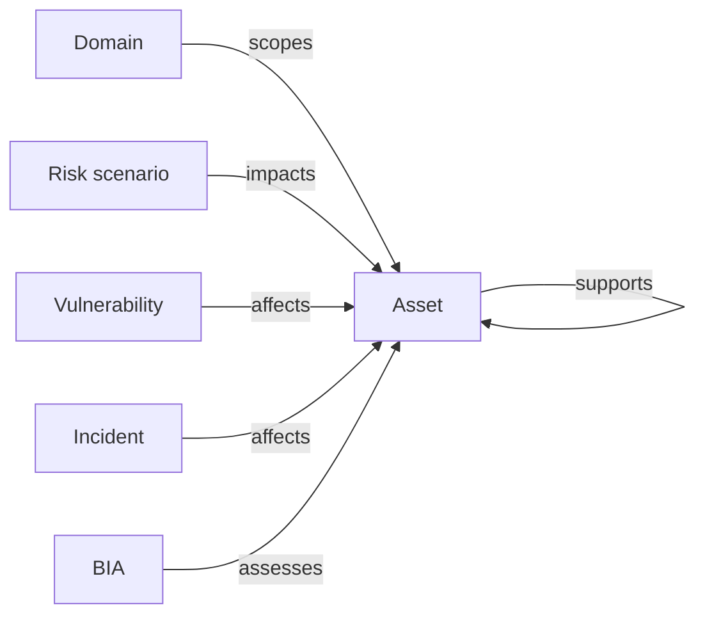

# Assets

An **asset** is anything of value worth protecting. Assets are first-class objects in CISO Assistant, decoupled from any specific risk study or audit, so the same asset can participate in many analyses without being duplicated.

Assets are always defined by the organisation and can be attached to the global domain or to a specific domain.

## Mental model

The asset is a hub other surfaces point at: risk scenarios impact it, vulnerabilities affect it, incidents affect it, and a Business Impact Analysis assesses it (through an intermediate `AssetAssessment` row, one per asset in the BIA). The `supports` self-loop captures the primary/support hierarchy — a support asset is recorded as a child of its primary parent through `parent_assets`.

| User-facing | Internal | Notes |
|---|---|---|
| Asset | `Asset` | First-class; primary vs support via `type` |
| Domain | `Folder` | Required; drives IAM scoping |
| Risk scenario | `RiskScenario` | Lives inside a `RiskAssessment` |
| Vulnerability | `Vulnerability` | First-class |
| Incident | `Incident` | First-class |
| BIA | `BusinessImpactAnalysis` | Bridges to assets via `AssetAssessment` |

## Primary vs supporting assets

- **Primary assets** are core resources directly contributing to the organisation's main objectives — business processes, data, intellectual property.
- **Supporting assets** indirectly aid primary functions — IT systems, services, locations, people.

The distinction matters for risk work: scenarios typically express _what can happen to a primary asset_ via _which supporting assets are involved_.

## Related

- [Risk assessments](risk-assessments.md)
- [Vocabulary → Asset](../introduction/vocabulary.md)
