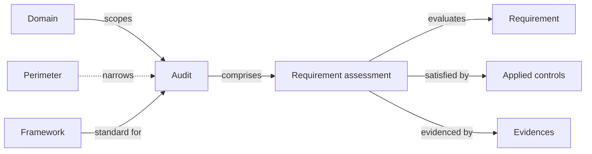

# Audits

An **audit** is the evaluation of a perimeter against a framework. It produces a per-requirement view of status, score, evidence, and the applied controls that substantiate each requirement.

Because applied controls are decoupled from compliance requirements, a single set of controls can be evaluated against many frameworks in parallel without re-doing the work.

## Mental model

An audit always lives inside a **domain** (the mandatory IAM scope) and is assessed against one **framework**. A **perimeter** can optionally narrow the audit further — e.g. to a specific service or process inside the domain. On creation the platform spawns one **requirement assessment** per requirement in the framework — those rows are where status, score, and the supporting **applied controls** and **evidences** live.

| User-facing | Internal | Notes |
|---|---|---|
| Audit | `ComplianceAssessment` | One audit = one framework × one domain (× optional perimeter) |
| Requirement assessment | `RequirementAssessment` | Per-requirement row inside the audit |
| Requirement | `RequirementNode` | Read-only catalog entry from the framework library |
| Domain | `Folder` | Required; drives IAM scoping |
| Framework | `Framework` | Read-only library import |

_Sources: `backend/core/models.py:6661` (ComplianceAssessment), `5661` (Assessment base — `perimeter` is `null=True, blank=True`; `folder` comes from `FolderMixin` and is required), `8043` (RequirementAssessment), `2488` (RequirementNode), `2374` (Framework). The audit also has direct M2Ms to assets and evidences for context that doesn't fit a specific requirement._

## Framework

The fundamental input to an audit is a **framework** — a published standard such as ISO/IEC 27001:2022 or NIST CSF. Frameworks ship as YAML libraries. If you can't find one that fits your needs, you can build your own and import it.

## Audit

An audit assesses compliance against the chosen framework. Each requirement carries one of the following statuses:

- **To do**
- **In progress**
- **Non compliant**
- **Partially compliant**
- **Compliant**
- **Not applicable**

The evaluation of a single requirement inside an audit is called a **requirement assessment**.

## Evidence

Evidence justifies the status of a compliance requirement or proves that an applied control has been implemented. It can be a description, a link, or an uploaded file, and it can be attached to any number of applied controls or requirement assessments.

## Related

- [Applied controls](applied-controls.md)
- [Findings assessments](findings-assessments.md)
- [Perimeters](perimeters.md)
- [Vocabulary → Audit / Requirement / Evidence](../introduction/vocabulary.md)
