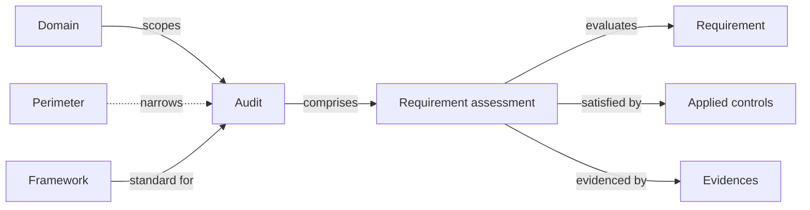

# Audits

An **audit** is the evaluation of a perimeter against a framework. It produces a per-requirement view of status, score, evidence, and the applied controls that substantiate each requirement.

Because applied controls are decoupled from compliance requirements, a single set of controls can be evaluated against many frameworks in parallel without re-doing the work.

## Mental model

An audit always lives inside a **domain** (the mandatory IAM scope) and is assessed against one **framework**. A **perimeter** can optionally narrow the audit further — e.g. to a specific service or process inside the domain. On creation the platform spawns one **requirement assessment** per requirement in the framework — those rows are where status, score, and the supporting **applied controls** and **evidences** live.

| User-facing | Internal | Notes |
|---|---|---|
| Audit | `ComplianceAssessment` | One audit = one framework × one domain (× optional perimeter) |
| Requirement assessment | `RequirementAssessment` | Per-requirement row inside the audit |
| Requirement | `RequirementNode` | Read-only catalog entry from the framework library |
| Domain | `Folder` | Required; drives IAM scoping |
| Framework | `Framework` | Read-only library import |

## Framework

The fundamental input to an audit is a **framework** — a published standard such as ISO/IEC 27001:2022 or NIST CSF. Frameworks ship as YAML libraries. If you can't find one that fits your needs, you can build your own and import it.

## Audit

An audit assesses compliance against the chosen framework. The evaluation of a single requirement inside an audit is called a **requirement assessment**.

A requirement assessment is not a single value — it captures _several dimensions_ at once, separating **the compliance result** from **how the work got done** and from **the depth of the implementation**. The point is that the same row tracks the auditor's view, the analyst's progress, and the maturity of the underlying implementation without conflating them.

### Progress column

Every audit in the audit tables (and on dashboards and campaigns) shows a **Progress** percentage. It answers a single question: _how much of the audit has been assessed?_

A requirement assessment counts as **assessed** as soon as it carries _any_ compliance result — **Compliant**, **Partially compliant**, **Non compliant**, or **Not applicable**. Requirements still on the default **Not assessed** state are the only ones that don't count. A requirement that only carries a score (no result) is also treated as assessed, so maturity- or scoring-only audits still show meaningful progress.

In other words, **progress is an auditing-activity signal, not a compliance signal**. An audit can be 100% _in progress_ and still be largely non-compliant — the column tells you the team has gone through every requirement and reached a verdict, not that the verdicts are good. The actual compliance picture lives in the donut and score read-outs computed from the [compliance result](#compliance-result) below.

Only **assessable** requirements count toward the denominator — section titles and headings from the framework are skipped. When the audit is scoped to specific [implementation groups](#implementation-groups), only the requirements inside those groups count, so progress reflects the work you actually committed to rather than the framework's full catalogue.

### Implementation groups

Several frameworks ship with their requirements pre-tagged into **implementation groups (IG)** — labels that act as filters over the requirement catalogue. They serve two recurring purposes, depending on how the framework's authors used them:

- **Maturity tiers** — _basic / intermediate / advanced_ (CIS Controls' IG1 / IG2 / IG3, CyFun's _Basic / Important / Essential_, FedRAMP's _Low / Moderate / High_). Picking IG1 narrows the audit to the minimum baseline; IG2 adds the next tier; IG3 expands to the full catalogue. This is the "how mature do we want to be?" axis.
- **Scope or applicability** — slices like _physical security_, _SaaS_, _cloud_, or framework-specific selectors like ISO 27001's `SoA` group. Picking these narrows the audit to the requirements that actually apply to your context, regardless of maturity.

The two patterns are not exclusive — a single framework can mix them, and several IGs can be combined on the same audit. If no IG is selected the audit covers the full catalogue, and you can change the selection later (adding or removing IGs) without losing the work already done on requirements that stay in scope.

Where IGs show up in the platform:

- **Audit scope** — selected at creation, editable afterwards. Anything outside the selection isn't dropped, it's simply hidden from the audit's assessable count.
- **Progress, score, donut, and analytics** — all roll-ups respect the IG selection. The [Implementation Groups Breakdown](../features/audit-analytics.md) widget in audit analytics shows progress _per IG_ when you want to compare tiers.
- **Framework report** — the report filter lets you re-slice the audit by IG after the fact, so the same audit can produce an IG1-only view and a full-catalogue view without re-running the assessment.

See [Multi-level support](../features/multi-level-support.md) for the mechanic of selecting IGs at audit creation, and the framework library's own documentation for which IG taxonomy a given standard ships with.

### Compliance result

The headline dimension — the actual answer to _"does this requirement hold?"_. Each requirement carries one of:

- **Compliant**
- **Partially compliant**
- **Non compliant**
- **Not applicable**

This is the field that feeds the framework's compliance percentages, the report, and the cross-framework roll-ups.

### Analyst dimension (assignee + workflow status)

Independently of the compliance result, each requirement assessment captures _who is working on it_ and _where they are in their process_:

- An **assignee** (an actor — user, team, or entity) — who is responsible for assessing this requirement.
- A **workflow status** — **To do** / **In progress** / **In review** / **Done**. This is the _analyst's_ status, not the auditor's verdict.

The two layers exist because the same requirement can be _Compliant_ but still _In review_ (the analyst has reached a conclusion, but a peer hasn't validated it yet) — and an _In progress_ requirement obviously doesn't have a final compliance result yet. Splitting analyst progress from compliance result lets dashboards and the campaign view show meaningful "still to do" counts without polluting the compliance percentage.

### Extended results (severity of non-conformities)

When you enable [extended results](extended-results.md) on the audit, each non-compliant or partially-compliant requirement can carry an additional qualification on a specific scale:

- **Major nonconformity**
- **Minor nonconformity**
- **Observation**
- **Opportunity for improvement**
- **Good practice**

This is the auditor's grading language, useful when the framework requires distinguishing _major_ from _minor_ non-conformities (ISO certification audits being the canonical case). It's an extra layer attached to the result — not a replacement for it.

### Scoring layers

Beyond the binary compliance result, each requirement assessment can carry a **score** on the framework's scale. Scoring captures _how mature or deep_ an implementation is, not just whether it exists. There are two ways to score, depending on what the audit needs:

- **Maturity score** _(single layer)_ — one score per requirement, typically used for CMMI-style or NIST-CSF-style maturity assessments.
- **Implementation + Documentation scores** _(two layers)_ — toggle on **documentation score** to split scoring into _is this implemented?_ and _is the implementation documented?_. The platform computes the maturity score as the average of the enabled layers.

Each requirement assessment uses an **effective scoring scale**. By default this is the audit's framework-level scale, but a requirement can define its own `min_score`, `max_score`, and level labels. The scoring UI, documentation score, exports, and tree views use that effective scale for the requirement.

When an audit contains mixed scales, average-based roll-ups normalise each requirement against its effective range before aggregating, then display the result on the audit scale. Sum-based roll-ups stay raw: they add `score x weight`, and their maximum is the sum of each requirement's effective maximum times its weight.

If **anchor N/A to target** is enabled, not-applicable requirements contribute the audit target projected onto their own effective range. If no target is configured, they contribute their effective maximum.

Together with the compliance result, the analyst dimension, the extended results, and the scoring layers, a single requirement assessment can record: _what's the compliance state_, _who is working on it and where they are_, _how severe any non-conformity is_, and _how mature the implementation is_ — all without conflating them.

### Comments

Each requirement assessment can carry a thread of **comments** — short, dated, author-attributed notes used for in-context conversation during the audit. They sit alongside the formal fields and don't change the compliance result or the score; they're where the back-and-forth between the analyst, the reviewer, and the auditee happens (clarifications, follow-up questions, agreed-upon next steps).

Each comment has a body, an author, a creation timestamp, and an **active / processed** toggle so resolved threads can be filtered out of the default view without losing the history. Comments can be edited (the platform records the edited state), preserving who said what and when.

Comments are not exclusive to requirement assessments — the same model is shared across **risk scenarios**, **applied controls**, and **findings**, so the same in-context discussion surface exists wherever it's useful to capture iterative review.

#### Feature flag and visibility

- The `comments` [feature flag](../configuration/settings/feature-flags.md) is the master switch. When off, the comment panel disappears from every supported surface and the per-audit visibility editor stops exposing the **Comments** field. _Default on._
- When the flag is on, the [audit field-visibility editor](../guides/customize-audit.md) treats **Comments** like any other field — you can choose whether respondents see them, whether they're auditor-only, or whether they're hidden — per audit.

This dual control means you can keep comments enabled platform-wide while still hiding the discussion thread from third-party respondents on sensitive audits.

## Evidence

Evidence justifies the status of a compliance requirement or proves that an applied control has been implemented. It can be a description, a link, or an uploaded file, and it can be attached to any number of applied controls or requirement assessments.

## Related

- [Applied controls](applied-controls.md)
- [Findings assessments](findings-assessments.md)
- [Perimeters](perimeters.md)
- [Vocabulary → Audit / Requirement / Evidence](../introduction/vocabulary.md)
