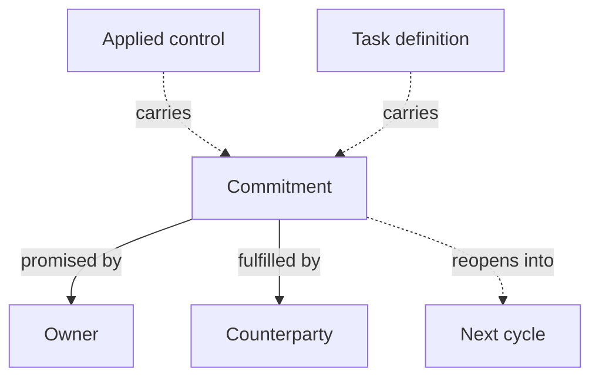

# Commitments

A **commitment** is the delivery date someone promises for a piece of remediation work — and the record of how that promise was arrived at, and what happened to it.

Every GRC tool has a due date field. What it doesn't have is the difference between *a date the analyst typed in* and *a date the owner agreed to*. Commitments make that difference explicit, and keep the history of the negotiation instead of overwriting it.

Commitments are gated by the **commitment_management** [feature flag](../configuration/settings/feature-flags.md), off by default.

## Mental model

A commitment hangs off the object it is about — an **applied control** or a one-off **task definition** — and adds no fields to it. Each round of negotiation is one commitment row, so a renegotiated date does not erase the one it replaced. Two roles are in play: the **owner**, who is accountable for the object and therefore makes the promise, and the **counterparty**, who is anyone who isn't.

| User-facing | Internal | Notes |
|---|---|---|
| Commitment | `Commitment` | One row per negotiation cycle |
| Owner | the object's accountable actor | `owner` on an applied control, `assigned to` on a task |
| Committed date | `committed_eta` | Frozen when the promise is made |

## The lifecycle

| State | Meaning |
|---|---|
| **Not started** | Nothing has been promised yet. |
| **In negotiation** | A date is being discussed. |
| **Committed** | The owner has promised a date. |
| **Declined** | The owner refused, with a reason. |
| **Fulfilled** | The counterparty confirmed delivery. |

The steps between them, and who may take each one:

| Step | Who | Requires |
|---|---|---|
| Not started → **Open a negotiation** | anyone who can change the object | — |
| In negotiation → **Commit to a date** | the owner | a date |
| In negotiation → **Decline** | the owner | a note |
| Committed → **Reopen the commitment** | anyone | a note |
| Committed → **Mark as fulfilled** | the counterparty — *not* the owner | — |
| Declined → **Reopen the commitment** | anyone | — |

Two rules carry the intent of the model:

**The owner cannot close their own commitment.** Someone who both makes and confirms delivery of a promise is self-certifying. Fulfilment is a counterparty step, deliberately.

**A third-party respondent is always the promising side.** They can commit and decline; they can't sign off their own delivery.

When nothing is accountable for the object — no owner set — there are no sides, and anyone who can change the object can run the whole lifecycle. That's a deliberate escape hatch so an unassigned control doesn't deadlock.

## Reopening keeps the history

Renegotiating doesn't overwrite the promised date. The current cycle is closed and a new one opens, carrying the previous committed date forward so a breach stays visible across the renegotiation. The panel shows **Reopened *n* times** and lists the closed cycles with the date each promised, who promised it, when, and the note that closed it.

This is the point of the whole feature: *"the fix slipped three times and each time we heard about it after the date had passed"* is a sentence a report can now support.

## Two derived signals

Neither is stored — both are read from the object every time it's displayed:

- **Slipped** — the object's own ETA is now later than the date that was promised. The work has moved; the promise hasn't been renegotiated.
- **Breached** — the promised date has passed and the commitment isn't fulfilled.

## Where commitments appear

- On an **applied control** or a one-off **task definition**, as a Commitment panel with the available steps and the history.
- On the **Commitments** page under Governance — every promised date across controls and tasks in one table, filterable by state, domain, and who committed. Reading it needs the *view commitment* permission; taking a step needs *Can take a commitment step*.

Recurring task definitions have no commitment panel at all: a recurring definition is a template, not a single promise. Making a task recurrent while a commitment is still live is refused — resolve the commitment first.

## Commitments and validation flows

The two look adjacent and aren't. A [validation flow](validation-flows.md) is a reviewer approving an object **as it stands**. A commitment is an owner promising **a future date**. One is a verdict on the present, the other a promise about the future, and an object can be subject to both.

## Related

- [Applied controls](applied-controls.md)
- [Tasks](tasks.md)
- [Validation flows](validation-flows.md)
