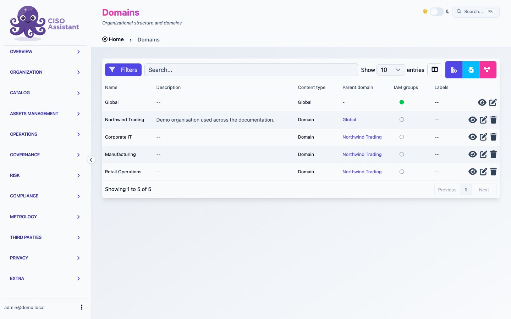

# Domains

A **domain** is a top-level container in CISO Assistant. It represents an organisational scope — a business unit, a subsidiary, or any boundary you want to manage access and reporting around.

Domains are the platform's primary mechanism for **access control** and **reporting boundaries**: a user's roles are granted _on a domain_, and most reports, dashboards, and audit roll-ups can be filtered by domain.

<figure><figcaption>
The domain list — the Parent domain column is what makes the hierarchy visible
</figcaption></figure>

## Building a hierarchy

A domain can have a **parent domain** (`parent_folder` internally) — that's how you build a tree of sub-domains beneath a top-level one. The hierarchy lets you mirror the shape of your organisation in the platform: a "Group" domain on top, "Region" or "Subsidiary" domains beneath, "Business unit" or "Programme" domains beneath those, and so on.

When a parent-child relationship is in place, two things follow:

- **Permissions can flow downward.** A user with a role on a parent domain can be configured to see and act on objects in its sub-domains, without re-assigning them at every level.
- **Reporting can roll up.** Dashboards and analytics aggregate across a domain _and_ its descendants, so leadership-level views work the same way the org chart does.


**Sub-domains are an Enterprise (PRO) feature.** The community edition ships with a flat structure — every domain you create sits directly at the root. The **Parent domain** field on the domain form is only exposed in the Enterprise edition, where you can nest domains to whatever depth you need to mirror your organisation.


The root is reserved for global, cross-organisation objects (built-in catalogues, the global library) — your own domains always live one level under it, even when no other hierarchy is in place.

## Restructuring the tree

The hierarchy is **not frozen at creation**. Editing a domain lets you change its **Parent domain** (PRO), which moves the whole sub-tree — the domain itself and every domain beneath it — under the new parent. Use this to:

- Reorganise as your business changes (a programme becomes a subsidiary, two business units merge).
- Promote a sub-domain to top-level by setting its parent back to the root.
- Re-parent for IAM reasons (giving a parent role-holder access to a sub-tree that wasn't previously under them).

The platform prevents cycles — you can't move a domain under one of its own descendants — but everything else is reachable.

## Objects move between domains

Almost every operational object in CISO Assistant is bound to a domain: assessments and audits, applied controls, evidences, risk scenarios, assets, tasks, policies, findings, incidents, exceptions, contracts, entities, and so on. The domain a record lives in is what drives who can see it and how it rolls up in reports.

Because reorganisations happen, the domain assignment is **not permanent**:

- **One at a time** — edit any object and pick a different **Domain** in the form. The platform re-evaluates IAM scoping on save, so the object disappears from one domain's views and appears in the other's.
- **In bulk** — for models that opt in to bulk operations, the [batch actions](../features/working-with-tables.md#batch-actions-many-rows) toolbar exposes a **Change folder** action: select multiple rows in the table, choose the destination domain, and the move is applied across the selection in one go. Useful when reorganising a subsidiary into its own sub-tree, or pulling a programme's controls into a dedicated domain.

A handful of objects whose domain is forced by a parent (e.g. risk scenarios always inherit their risk assessment's domain) intentionally don't expose the batch **Change folder** action — moving the parent moves the children.

## Related

- [Perimeters](perimeters.md)
- [Actors and teams](actors-and-teams.md) — how users, teams, and entities get scoped to a domain
