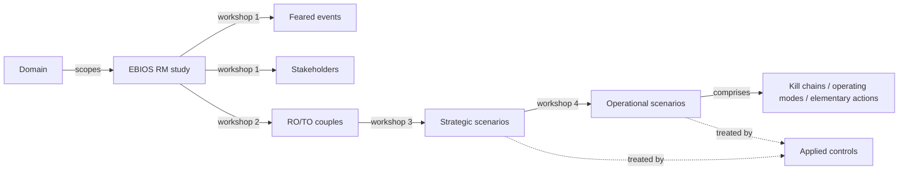

# EBIOS RM

**EBIOS RM** (_Expression des Besoins et Identification des Objectifs de Sécurité — Risk Manager_) is the structured risk-management method published by the French national cybersecurity agency, [ANSSI](https://cyber.gouv.fr/en/ebios-risk-manager).

CISO Assistant supports EBIOS RM natively, with a dedicated object graph rather than forcing the method into a generic risk-assessment shape.

## The five workshops

EBIOS RM organises a study around five workshops:

1. **Scope and security baseline** — define the studied system, its mission, and the regulations it must comply with.
2. **Risk origins and target objectives** — identify _who_ might attack and _what_ they want (the **RO/TO couples**).
3. **Strategic scenarios** — model attack paths through stakeholders to reach target objectives.
4. **Operational scenarios** — drop into technical detail: kill chains, attacker techniques, supporting assets touched.
5. **Risk treatment** — score residual risk and plan the action plan.

## Mental model

An EBIOS RM **study** lives in a **domain** (no perimeter — the study itself is the scope envelope). It unfolds through five workshops that produce, in order: **feared events** (undesirable outcomes on primary assets) and **stakeholders** in workshop 1; **RO/TO couples** (Risk Origin × Target Objective) in workshop 2; **strategic scenarios** showing high-level attack paths through stakeholders in workshop 3; and **operational scenarios** drilling into kill chains, operating modes, and elementary actions in workshop 4. Workshop 5 reuses the platform's standard objects — **applied controls**, **evidence**, residual risk — to treat both strategic and operational scenarios.

| User-facing | Internal | Notes |
|---|---|---|
| EBIOS RM study | `EbiosRMStudy` | Container for the five workshops |
| Feared event | `FearedEvent` | Workshop 1 outcome on a primary asset |
| Stakeholder | `Stakeholder` | Workshop 1 — internal/external party with trust + dependency scores |
| RO/TO couple | `RoTo` | Workshop 2 — Risk Origin × Target Objective |
| Strategic scenario | `StrategicScenario` | Workshop 3 — uses an attack path through stakeholders |
| Operational scenario | `OperationalScenario` | Workshop 4 — composed of kill chains, operating modes, elementary actions |
| Applied control | `AppliedControl` | Shared with the rest of the platform; used at workshop 5 |

## Mapping to qualitative risk

EBIOS RM scenarios sit alongside qualitative risk scenarios in the same risk register: both contribute to the residual-risk picture for a perimeter, and both can be treated with the same applied controls.

## Related

- [Risk assessments](risk-assessments.md)
- [Quantitative risk studies](quantitative-risk-studies.md)
- [Guide → EBIOS RM study](../guides/ebios-rm.md)
- [Vocabulary → EBIOS RM and related terms](../introduction/vocabulary.md)
