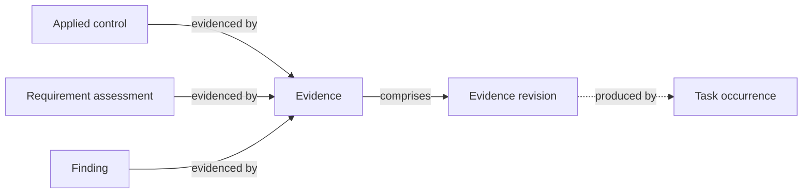

# Evidence

**Evidence** is anything that substantiates a claim in CISO Assistant — that a control has been implemented, that a requirement is met, or that a process is being followed as described.

Evidence is the connective tissue between what the audit asks and what the organisation actually does.

## Mental model

Evidence is the shared substantiation surface — the same record can back an applied control, a requirement assessment, and a finding at the same time, which is why a single proof can satisfy many frameworks at once. Each evidence comprises a chain of revisions; the latest revision holds the current attachment (with its SHA-256 hash) or external link. When a recurring task produces evidence, the corresponding task occurrence is recorded on the revision so the audit trail goes both ways.

| User-facing | Internal | Notes |
|---|---|---|
| Evidence | `Evidence` | Logical record (stable identity) |
| Evidence revision | `EvidenceRevision` | Versioned payload (file or link) |
| Task occurrence | `TaskNode` | Optional producer back-link |

## What counts as evidence

- An uploaded file — PDF, screenshot, configuration export, signed approval, exported policy.
- A link to an external system — a Jira ticket, a Confluence page, a Git commit, a monitoring dashboard, a signed agreement.
- A free-form description, when the proof is the assertion itself (rare but allowed).

## What evidence attaches to

Evidence attaches to two places:

- **Applied controls** — proof that the control is in place and working.
- **Requirement assessments** — proof that a specific compliance requirement is met.

Because the same applied control can satisfy many requirements across many frameworks, a single piece of evidence often substantiates compliance against several requirements at once — without duplication.

## Lifecycle

Evidence isn't attached once and forgotten. Each piece carries metadata — description, timestamp, expiry, assignee — and a status. Auditors regularly refresh evidence: a yearly penetration-test report needs to be re-uploaded each year; an exported configuration needs to be re-pulled after each significant change.

## Revisions

Each piece of evidence keeps a versioned history through **evidence revisions**. Replacing an attachment doesn't overwrite the previous file — it creates a new revision under the same evidence object. Every revision carries:

- A monotonically increasing **version number**.
- The **attachment** (file) or **link** for this revision.
- An **SHA-256 hash** of the attachment, computed automatically and used for integrity checks.
- An **observation** field for notes about what changed.
- An optional link to the **task occurrence** that produced it — when an evidence file is generated by completing a recurring task, the task occurrence is recorded on the revision so the audit trail goes both ways.

The current attachment shown on the evidence page is always the latest revision; older revisions remain accessible for audit. This matters when an assessor asks "what proof did you have on date X?" — the historical revision is still there.

## Related

- [Applied controls](applied-controls.md)
- [Audits](audits.md)
- [Tasks](tasks.md)
- [Vocabulary → Evidence](../introduction/vocabulary.md)
