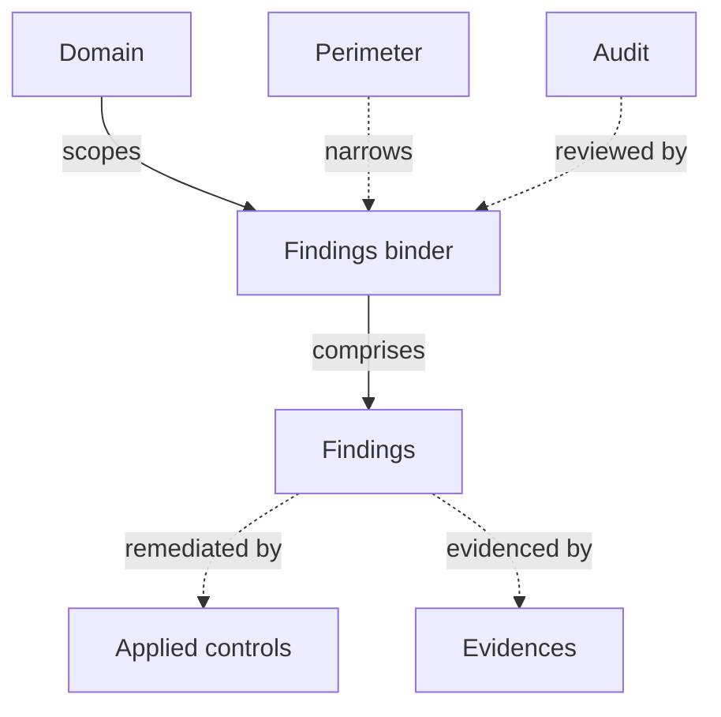

# Findings binders

A **findings binder** collects the issues raised by one review and drives their remediation through to closure. The issues themselves are **findings**, and they can come from a CISO Assistant audit, a penetration test, a technical posture scan, an external assessor's report, a responsible disclosure, or someone simply noticing something.

It's the place where the action plan meets reality: each non-compliance, observation, or recommendation gets an owner, a due date, and a status, and is followed all the way to closed.


Findings binders are the model formerly surfaced as **Follow-up**. The object, its API path (`findings-assessments`), and its data are unchanged — only the label moved.


## Mental model

A findings binder is an **assessment**, in the same family as audits, risk assessments, and business impact analyses: it lives in a **domain**, optionally narrows to a **perimeter**, carries authors, reviewers, a status and a version, and can be locked. Inside it sit the individual **findings**, each remediated by one or more **applied controls** and backed by **evidences**. A binder can point back at the **audit** whose findings it captures, which is what the [findings-from-requirements](#raising-a-finding-from-a-requirement) flow uses.

| User-facing | Internal | Notes |
|---|---|---|
| Findings binder | `FindingsAssessment` | Subclass of the shared `Assessment` base |
| Finding | `Finding` | Can stand alone — a binder is optional |
| Domain | `Folder` | Required; drives IAM scoping |
| Perimeter | `Perimeter` | Optional |
| Audit | `ComplianceAssessment` | Optional back-link, set by the findings tab |

## What a binder records

Beyond the assessment basics (name, version, status, authors, reviewers, domain, perimeter):

- **Category** — Pentest, Threat hunting, Red teaming, Audit, Self-identified, Posture follow-up, or Responsible disclosure. This is what lets dashboards separate "what the pentester found" from "what the auditor found".
- **Audit** — the audit whose findings this binder captures, when there is one.
- **Reference ID** and **Reference link** — the assessor's own identifier and a URL to the report, ticket, or external tracker.
- **Reported at** and **Start date** — when the review reported, and when it began.
- **Objectives** — what this campaign of findings sets out to achieve.
- **Budget** and **Expenses** — what the engagement was allotted, and what it has consumed so far.
- **Evidences** — the report itself, the scope letter, the rules of engagement.

Locking a binder freezes it: its findings can no longer be modified, which is how a signed-off pentest report stays the record of what was found.

## Findings

A finding carries a **severity** (from informational to critical), a **status** (undefined → identified → confirmed → assigned → in progress → mitigated → resolved → closed, plus dismissed and deprecated), an optional **priority** (P1–P4), an **owner**, and an **ETA** / **due date**.

Two text fields separate the observation from the answer to it:

- **Observation** — what was found.
- **Recommendation** — what should be done to close it.

A finding can also point at the things it concerns: an **asset**, a **requirement** and the **requirement assessment** it was raised from, **threats**, **vulnerabilities**, **reference controls**, and the **applied controls** that remediate it. The applied-control link is many-to-many: one control can close several findings, and one finding can need several controls.

### Standalone findings

A finding does not have to belong to a binder. Leave the binder empty and it stands on its own — appropriate for something spotted in passing that doesn't warrant a whole engagement record. Standalone and bound findings appear together in the **Findings** list under Governance, so nothing is lost by not opening a binder.

A bound finding takes its domain from its binder; detach it to move it elsewhere.

## Where findings come from

The same model serves every source, which is what makes cross-source reporting possible — *all open critical findings due this quarter* is one question, not one per review type:

- **Audits** — non-compliances raised while assessing requirements, especially with [extended results](extended-results.md) enabled.
- **Technical postures** — failing checks routed into a binder with the *Posture follow-up* category. See [technical postures](technical-postures.md).
- **External assessments** — pentest reports, third-party security reviews, regulator inspections. These are typically bulk-loaded through the [data import wizard](../configuration/data-import.md), which has a dedicated findings-binder importer.
- **Internal reviews and self-identified issues** — checks outside the formal audit cycle.
- **Responsible disclosure** — issues reported from outside the organisation.

### Raising a finding from a requirement

With the **findings_from_requirements** [feature flag](../configuration/settings/feature-flags.md) on, a requirement assessment gains a **Findings** tab and a **Raise a finding** action, so an auditor records the issue without leaving the requirement.

The first finding raised on an audit creates that audit's binder automatically — named after the audit, in the audit's domain and perimeter, with the *Audit* category — and every later finding on the same audit joins it. Creating it needs permission to add a findings binder in the audit's domain. If the audit already has binders, the oldest one is used.

## Related

- [Audits](audits.md)
- [Applied controls](applied-controls.md)
- [Technical postures](technical-postures.md)
- [Vocabulary → Findings binder](../introduction/vocabulary.md)
