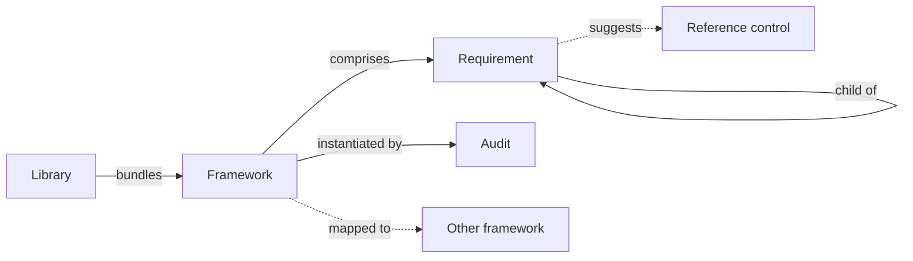

# Frameworks

A **framework** is a normative body of requirements that audits are measured against — an industry standard (ISO/IEC 27001, NIST CSF, SOC 2), a regulation (NIS2, DORA, GDPR), a custom internal standard, or any other structured set of requirements.

In CISO Assistant, frameworks are shipped as YAML libraries and are the foundation of every audit.

## Mental model

A framework lives inside a loaded library and is read-only. It comprises a tree of requirement nodes — some assessable, some structural — linked parent-to-child via the self-loop. Creating an audit instantiates the framework: each assessable node becomes a requirement assessment inside the audit. Requirements can optionally suggest reference controls (templates for the applied controls that satisfy them), and a framework can be mapped to other frameworks for cross-walks.

| User-facing | Internal | Notes |
|---|---|---|
| Framework | `Framework` | Read-only catalog object |
| Requirement | `RequirementNode` | Tree node (assessable or section) |
| Library | `LoadedLibrary` | Active library bundle |
| Audit | `ComplianceAssessment` | One per (framework × domain × optional perimeter) |
| Reference control | `ReferenceControl` | Template for an applied control |

## Structure

A framework is a tree of **requirement nodes**. Most nodes are _assessable_ — concrete requirements you evaluate one by one — while others act as section or chapter headings that organise the tree. Each assessable node becomes a [requirement assessment](audits.md) inside an audit, carrying its own status, score, and evidence.

## Built-in vs custom

CISO Assistant ships with 100+ built-in frameworks covering most international standards and regulations. When none of them fits your needs, you can build your own — see [Designing your own libraries](../configuration/libraries/custom-libraries.md) and [Getting your custom framework](../configuration/libraries/custom-frameworks.md).

## Mappings between frameworks

A **mapping** (or crosswalk) is a directed graph linking the requirements of one framework to those of another, using the [NIST OLIR](https://csrc.nist.gov/projects/olir) convention. Once a mapping is loaded, an existing audit can be projected onto the target framework — reusing requirement assessments where the mapping is strong, surfacing gaps where it isn't.

## Related

- [Audits](audits.md)
- [Libraries](libraries.md)
- [Mappings feature](../features/mappings.md)
- [Vocabulary → Framework / Requirement / Mapping](../introduction/vocabulary.md)
