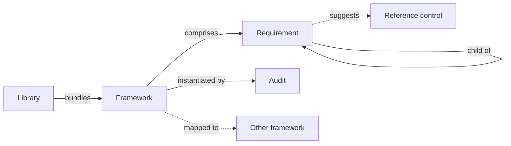

# Frameworks

A **framework** is a normative body of requirements that audits are measured against — an industry standard (ISO/IEC 27001, NIST CSF, SOC 2), a regulation (NIS2, DORA, GDPR), a custom internal standard, or any other structured set of requirements.

In CISO Assistant, frameworks are shipped as YAML libraries and are the foundation of every audit.

## Mental model



A framework lives inside a loaded library and is read-only. It comprises a tree of requirement nodes — some assessable, some structural — linked parent-to-child via the self-loop. Creating an audit instantiates the framework: each assessable node becomes a requirement assessment inside the audit. Requirements can optionally suggest reference controls (templates for the applied controls that satisfy them), and a framework can be mapped to other frameworks for cross-walks.

| User-facing | Internal | Notes |
|---|---|---|
| Framework | `Framework` | Read-only catalog object |
| Requirement | `RequirementNode` | Tree node (assessable or section) |
| Library | `LoadedLibrary` | Active library bundle |
| Audit | `ComplianceAssessment` | One per (framework × domain × optional perimeter) |
| Reference control | `ReferenceControl` | Template for an applied control |

## Structure

A framework is a tree of **requirement nodes**. Most nodes are _assessable_ — concrete requirements you evaluate one by one — while others act as section or chapter headings that organise the tree. Each assessable node becomes a [requirement assessment](audits.md) inside an audit, carrying its own status, score, and evidence.

## Scoring scales

Frameworks can define a default scoring scale with a minimum score, a maximum score, and optional level descriptions. For example, a CMMI-style framework may use `0..5`, while another framework may use `1..4` or `0..100`.

An individual requirement node can override that default scale with its own `min_score`, `max_score`, and `scores_definition`. These overrides are useful when a standard mixes different scoring shapes in the same tree: for example, a mostly maturity-based framework that also contains binary pass/fail requirements.

The override is resolved independently for each field:

- If a requirement defines `min_score`, that value is used; otherwise the audit-level minimum is used.
- If a requirement defines `max_score`, that value is used; otherwise the audit-level maximum is used.
- If a requirement defines `scores_definition`, those labels are used; otherwise the audit-level labels are used when they fit the requirement's effective range.

### Alternative scales registry

When several requirements share the same custom scale, the framework can declare a named **alternatives** registry alongside its default scale. Each requirement can then reference an entry by name instead of duplicating the labels:

```yaml
framework:
  scores_definition:
    scale:                # default scale, inherited by requirements that don't override
      - score: 0
        name: "N/A"
      - score: 1
        name: "Initial"
      - score: 5
        name: "Optimised"
    alternatives:
      binary:             # named alternative shared by several requirements
        - score: 0
          name: "No"
        - score: 1
          name: "Yes"
  requirement_nodes:
    - urn: ...:r1
      min_score: 0
      max_score: 1
      scores_definition: binary       # ← reference by name, DRY
    - urn: ...:r2
      min_score: 0
      max_score: 1
      scores_definition: binary       # ← same reference, same scale
    - urn: ...:r3
      min_score: 0
      max_score: 3
      scores_definition:              # ← inline (escape hatch for one-off scales)
        - score: 0
          name: "None"
        - score: 1
          name: "Partial"
        - score: 2
          name: "Most"
        - score: 3
          name: "Full"
```

The audit copies the framework's `scores_definition` (default scale + alternatives) at creation, so per-requirement references resolve against the audit's own copy. This keeps the audit self-contained: customising the audit's scale later doesn't break references on its requirements.

### Aggregation across mixed scales

Roll-ups keep mixed scales comparable. Average-based aggregation normalises each requirement score against its effective range before computing the parent or global score, then displays the result on the audit scale. Sum-based aggregation remains a raw weighted sum, so each requirement contributes its own effective maximum.

## Built-in vs custom

CISO Assistant ships with 100+ built-in frameworks covering most international standards and regulations. When none of them fits your needs, you can build your own — see [Designing your own libraries](../configuration/libraries/custom-libraries.md) and [Getting your custom framework](../configuration/libraries/custom-frameworks.md).

## Mappings between frameworks

A **mapping** (or crosswalk) is a directed graph linking the requirements of one framework to those of another, using the [NIST OLIR](https://csrc.nist.gov/projects/olir) convention. Once a mapping is loaded, an existing audit can be projected onto the target framework — reusing requirement assessments where the mapping is strong, surfacing gaps where it isn't.

## Related

- [Audits](audits.md)
- [Libraries](libraries.md)
- [Mappings feature](../features/mappings.md)
- [Vocabulary → Framework / Requirement / Mapping](../introduction/vocabulary.md)
