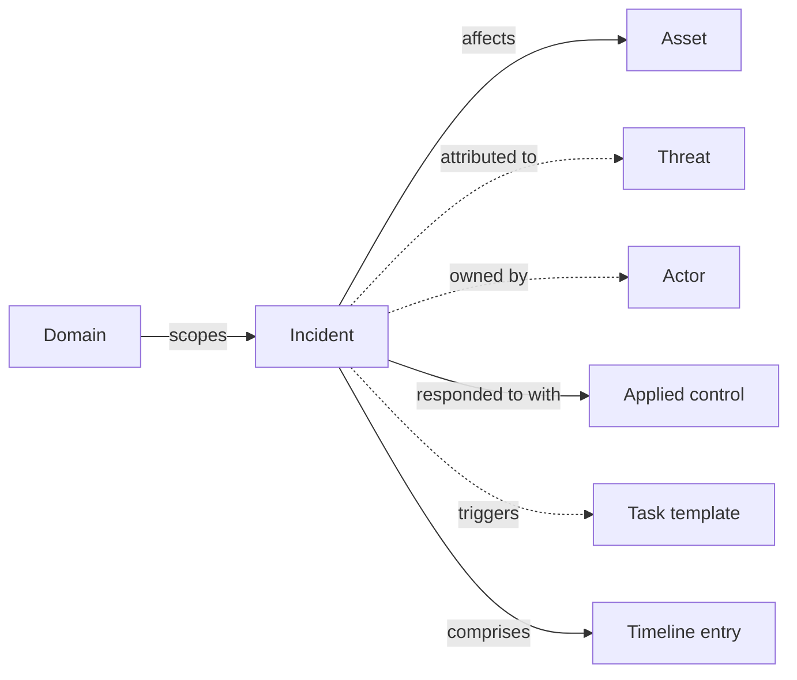

# Incidents

An **incident** is a security or operational event being investigated or responded to. CISO Assistant treats incidents as first-class objects so that detection, response, evidence, and the controls that should prevent recurrence all live in one place.

Incidents are deliberately distinct from related concepts:

- A **risk scenario** is a _potential_ adverse event — the possibility.
- A **vulnerability** is a _weakness_ that could be exploited — the gap.
- An **incident** is something that has _actually happened_ and is being handled.

## Mental model

An incident lives in a domain and aggregates everything about the event: the assets it affected, the threats it's attributed to, the actors handling it, the applied controls invoked during response, and any task templates set up for follow-up work (post-mortem, control review). Timeline entries are the append-only log of what happened and when — detection, mitigation, observation, severity / status changes.

| User-facing | Internal | Notes |
|---|---|---|
| Incident | `Incident` | First-class operational event |
| Threat | `Threat` | Library catalog object |
| Actor | `Actor` | XOR(User / Team / Entity) |
| Task template | `TaskTemplate` | Spawns occurrences |
| Timeline entry | `TimelineEntry` | Append-only response log |

## What an incident captures

- **Identifiers and classification** — a name, an optional reference ID, the severity (critical / major / moderate / minor / low / unknown), and the status through its lifecycle.
- **Timing** — when it occurred, when it was reported, when it was resolved.
- **Detection** — internal vs external, optionally with a link to the source signal.
- **Scope** — the affected assets, the threats believed to be in play, the entities (third parties) involved.
- **Assignees** — the actors handling the response.
- **Response and qualifications** — qualifying terminology, BCP-activation flag, resolution notes.
- **Linked controls and tasks** — the applied controls invoked during response, plus the task definitions that should run as follow-up (e.g. a post-mortem, a control review).

## Lifecycle

Incidents follow a five-state lifecycle:

`new` → `ongoing` → `resolved` → `closed` (or `dismissed` at any point if the event turns out not to be a real incident)

State transitions are recorded in the incident **timeline**, an append-only log of significant moments: detection, mitigation, free-form observation, severity changes, status changes. The timeline is what an auditor or a post-mortem author will read to reconstruct what happened.

## DORA incident reports

For regulated tenants, CISO Assistant ships a **DORA incident report** — a structured form aligned with the Digital Operational Resilience Act notification requirements (initial, intermediate, and final reports). It draws from the underlying incident but adds the regulatory fields and timing that DORA prescribes.

## Related

- [Risk assessments](risk-assessments.md)
- [Vulnerabilities](vulnerabilities.md)
- [Applied controls](applied-controls.md)
- [Tasks](tasks.md)
- [Vocabulary → Incident / Severity](../introduction/vocabulary.md)
