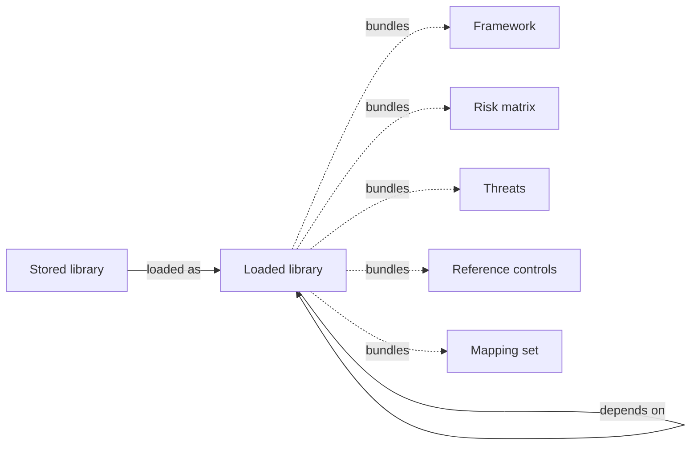

# Libraries

A **library** is a bundled set of catalog objects — frameworks, threats, risk matrices, reference controls, mappings, security advisories, CWE entries — distributed as a YAML file.

Libraries are how content gets into CISO Assistant. They make the platform extensible: anything from a regulator's framework to a vendor's threat feed to your organisation's internal control catalogue is just another library.

## Mental model

A library starts life as a **stored** record — its YAML is parsed and registered but contents stay inactive. Loading it materialises whatever catalog objects the YAML declares — any subset of framework, risk matrix, threats, reference controls, or mapping set (all dashed, all optional). A loaded library can also declare dependencies on other loaded libraries — for example, a framework library that ships its companion reference-control catalogue as a separate dependency.

| User-facing | Internal | Notes |
|---|---|---|
| Stored library | `StoredLibrary` | Inventory entry, contents inactive |
| Loaded library | `LoadedLibrary` | Activated; contents visible across the platform |
| Mapping set | `RequirementMappingSet` | Crosswalk between two frameworks |

## Stored vs loaded

A library can be in one of two states:

- **Stored** — the library is known to the instance but its content hasn't been activated yet. It's visible in the libraries store, ready to be loaded on demand.
- **Loaded** — the library is active. Its catalog objects show up across the platform: a loaded framework becomes available when creating an audit; a loaded threat appears in the threats list; loaded reference controls power autosuggestion.

## What's in a library

A library typically contains a single primary object (for example, one framework) but may bundle related ones — a framework alongside its companion reference-control catalogue and its mapping to a sibling framework.

Library content is referenced by **URN** (Uniform Resource Name), an immutable identifier that survives renames and re-imports.

## Built-in, community, and custom

- **Built-in libraries** ship with the platform — over 100 frameworks plus the standard threat, matrix, and reference-control catalogues.
- **Community libraries** are contributed by the open-source community; see [Contributing a framework or library](../contributing/framework.md).
- **Custom libraries** can be built locally and loaded without sharing them, useful for internal frameworks or control sets.

See [Designing your own libraries](../configuration/libraries/custom-libraries.md) for the format.

## Lifecycle

Libraries are versioned. When a newer version is available, you can upgrade in place — your existing audits keep using the version they were created with until you migrate them explicitly. See [Library upgrade](../configuration/libraries/library-upgrade.md) and [Library clean-up](../configuration/libraries/library-cleanup.md).

## Related

- [Frameworks](frameworks.md)
- [Threats](threats.md)
- [Vocabulary → Library / Catalog object / URN](../introduction/vocabulary.md)
