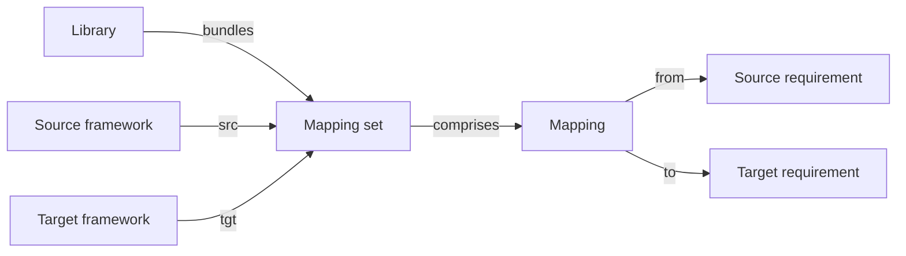
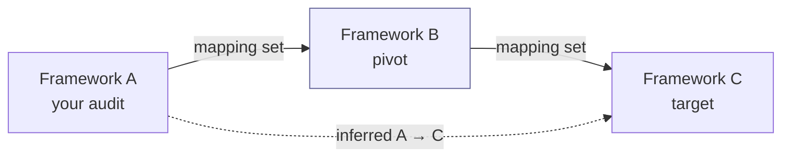

# Mappings

A **mapping** (also called a _crosswalk_) describes how the requirements of one framework relate to those of another. Once a mapping is loaded, an audit performed against the source framework can be **projected** onto the target framework — reusing the existing requirement assessments where the mapping is strong, surfacing gaps where it isn't.

Mappings are catalog objects: defined once as a YAML library, loaded into the platform, and applied on demand.

## Mental model

A mapping set is the unit shipped by a library — it pins exactly one source framework and one target framework. Inside the set, each individual mapping connects one source requirement node to one target requirement node and carries a relationship type (equal / subset / superset / intersect / not_related). Applying the set to an audit projects the existing requirement assessments onto the target framework: full-coverage relationships (`equal`, `superset`) copy directly; partial-coverage (`intersect`, `subset`) require manual review.

| User-facing | Internal | Notes |
|---|---|---|
| Mapping set | `RequirementMappingSet` | One per (source, target) library entry |
| Mapping | `RequirementMapping` | Single SRC → TGT pair, typed |
| Requirement | `RequirementNode` | Read-only catalog entry from a framework |

## Why they matter

Most organisations have to demonstrate compliance against multiple frameworks at once — ISO 27001 plus SOC 2 plus a sector-specific regulation, for instance. Without mappings, you re-assess the same control posture against every framework's requirement list, which is busywork. With mappings, you assess once and project.

## Structure

A mapping is a directed graph linking assessable nodes of a **source** (SRC) framework to assessable nodes of a **target** (TGT) framework, using the convention from [NIST's OLIR](https://csrc.nist.gov/projects/olir) project.

Each relationship between a SRC node and a TGT node has a **type**, which is easiest to read as a set relation between what each requirement covers:

- **No relationship** — the two requirements are disjoint; nothing carries over.
- **Equal** — the two requirements are equivalent in scope and intent.
- **Subset** — the SRC requirement is contained within (narrower than) the TGT requirement.
- **Superset** — the SRC requirement contains (is broader than) the TGT requirement.
- **Intersect** — the two overlap in part but neither contains the other.

The directionality matters: a mapping from A → B does not automatically imply B → A. Reverse mappings can be generated, but the relationship type usually inverts (a SRC subset becomes a TGT superset).

## Applying a mapping

Once a mapping library is loaded, it can be applied to an existing audit:

1. Open the source audit.
2. Click **Apply mapping** and pick the target framework.
3. The platform creates a new audit on the target framework and copies over the requirement assessments where the mapping is strong (typically _equal_), leaving the rest to be assessed.

The apply-mapping feature can also clone an audit onto the **same** framework — useful for creating a new revision while keeping the previous one for history.

## Transitive inference (pivot mappings)

You don't need a direct mapping between every pair of frameworks. If the platform holds a mapping from **A → B** and another from **B → C**, it can **chain them automatically** to project an A audit onto C, using B as a *pivot* — even though no one ever authored an A → C crosswalk.

The mapping engine treats the loaded mapping sets as a directed graph of frameworks and searches for a path between your audit's framework and the target you pick. When you open an audit and choose **Apply mapping**, the list of available targets already includes every framework reachable through the graph — both directly mapped ones and those reachable only through one or more pivots. You select the destination; the chaining happens behind the scenes.

How the chain behaves:

- **Coverage degrades to the weakest hop.** Full-coverage relationships (`equal`, `superset`) chain cleanly. If *any* hop in the path is partial (`subset`, `intersect`), the projected result is marked partial and flagged for manual review — a chain is only as strong as its loosest link.
- **The best path wins.** When several pivots connect A to C, the engine keeps the path that successfully maps the most requirements, and records which intermediate framework(s) it went through so the projection is auditable.
- **Depth is bounded.** Chaining is limited by the **Mapping max depth** setting in [General settings](../configuration/settings/general.md) (default **3** nodes — i.e. up to one pivot, A → B → C). Raise it (up to 5) to allow longer chains (A → B → C → D…), at the cost of progressively weaker, more indirect inferences and slower computation.

This is what makes a modest set of crosswalks go a long way: a hub framework such as ISO 27001 or NIST CSF that is mapped to many others effectively becomes a translation pivot between all of them.

## Loading vs authoring

Many cross-walks ship as built-in or community libraries (ISO 27001 ↔ NIST CSF, SOC 2 ↔ ISO 27002, and so on). When none of them fits, you can author your own — see [Designing your own libraries](../configuration/libraries/custom-libraries.md) and the `prepare_mapping_v2.py` tool that scaffolds a mapping skeleton between two loaded frameworks.

## Related

- [Frameworks](frameworks.md)
- [Audits](audits.md)
- [Libraries](libraries.md)
- [Mappings feature](../features/mappings.md) — the UI flow for applying a mapping
- [Mapping explorer](../features/mapping-explorer.md) — visualising a mapping graph
- [Vocabulary → Mapping / Requirement mapping set](../introduction/vocabulary.md)
