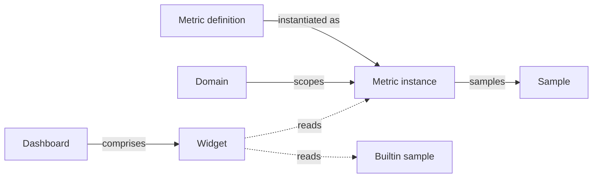

# Metrics

### Expected outcome

* define your metrics or import their definition
* instantiate them on your domains
* feed data to your metric instances
* create dashboards with builtin and custom metrics

## Mental model

A metric definition is the catalog template — qualitative (level) or quantitative (number with unit) — and can be shipped via a library. Each instance scopes one definition to a domain and carries the operational fields: assignee, target value, collection frequency (auto-stale logic kicks in when the latest sample exceeds the cadence + grace period). Samples are timestamped data points against an instance. Dashboards are independent of the metrology pipeline: they comprise widgets, and each widget either reads a custom metric instance, pulls from a **builtin sample** (a system-computed daily snapshot attached generically to any tracked object — assets, audits, projects, incidents, etc.), or just displays free text.

| User-facing | Internal | Notes |
|---|---|---|
| Metric definition | `MetricDefinition` | Catalog template; optional `library` FK |
| Metric instance | `MetricInstance` | One definition × one domain |
| Sample | `CustomMetricSample` | Timestamped data point on an instance |
| Builtin sample | `BuiltinMetricSample` | System-computed; daily; `ContentType` GFK to any object |
| Dashboard | `Dashboard` | Container |
| Widget | `DashboardWidget` | KPI / donut / pie / bar / line / area / gauge / sparkline / table / text |

***

## Metric definitions

Consider metric definition as a template of your metric. It serves as the guideline of the actual metric instance that you will track accross your domains.

### Importing definitions

#### 1. Introduction

You will learn how to import off-the-shelf metrics definitions on CISO Assistant.

#### 2. Open Metric Definitions

Click "Metric definitions".

#### 3. Click import

Click here to proceed to the next menu.

#### 4. Import the library matching your criteria

You can also preview the content before importing it.

#### 5. Return to Metric Definitions

Click "Metric definitions" to revisit the main metrics page.

#### 6. Look for the metric definition you want

Click "Search..." to begin finding specific metrics.

#### 7. Select The Specific Metric

You can now instantiate this metric as you see fit for your domains.

You can now instantiate this metric as needed across your domains. Keep in mind that you can also create your own metric definition directly without going through the library.

### Creating a definition

Metrics can be quantitative (number with unit) or qualitative (choices):

<figure><figcaption>
Quantitative metric
</figcaption></figure>

You can add your options during declaration or afterward:

<figure><figcaption>
Qualitative metric
</figcaption></figure>

The "higher is better" setting is used to indicate if the trend is a good thing or not.

***

## Metric instance

The metric instance is the projection of the definition to a specific domain and it's _what you'll be tracking_.&#x20;

<figure><figcaption></figcaption></figure>

Parameters:

* Metric definition (it will inherit its settings)
* Domain: the scope of this metric
* Status: lifecycle of the metric. The stale is specially interesting as the application will auto-toggle it according to the data freshness
* Collection frequency: expected collection frequency, on which we add a grace period before toggling the metric to stale status
* Target value: expected target of this metric for this specific domain. This is handy as you can have different targets of the same metric definition according to the domain.
* Assigned to: actor responsible for the metric instance and its updates.

## Metric sample

This is the actual data of the metric instance on a given timestamp.&#x20;

<figure><figcaption></figcaption></figure>

Keep in mind that you can add the data manually or through all the supported integrations (API, n8n, etc.). Note that data cannot be in the future.

## Derived metrics

A derived metric computes its own samples from the data already in the instance: the share of applied controls that are active, the average progress of the audits in a domain, the number of controls past their ETA. Nobody types the number in; the application reads it on a schedule.

A derived definition carries two things in addition to the usual fields:

* **Datasets**: named read configurations, each aggregating objects of one kind. A dataset names a model, optional filters on its fields, and a list of aggregates (count, distinct count, sum, average, minimum, maximum, median, percentile, standard deviation, optionally grouped by a field with a fixed set of values: a status, a yes/no field, a related object). A derived value is visible to everyone who may view the instance, so a dataset cannot group by a field holding free text such as a name or a description. The vocabulary is the one the workflow **Read objects** step uses in its "Numbers about the matches" mode; see the [action reference](../features/workflows/actions.md#numbers-about-the-matches).
* **Expression**: a [CEL](https://cel.dev) expression over the dataset results, for example `active.count * 100.0 / controls.count`. It can also read `previous` (the instance's latest sample), `metrics.<ref_id>.value` (the latest value of another instance in the same scope, by its reference id; a reference id that several instances in the scope share cannot be read), and `now` / `today`. Dataset filter values accept `{{today}}`, `{{now}}` and offsets such as `{{today-30d}}`. A quantitative metric returns a number; a qualitative one returns the name of a level.

The definition is the formula; the **instance** binds it to a domain. Every dataset reads that domain and its sub-domains, nothing above or beside it, and with no user identity: the value is a fact about the domain, the same for everyone allowed to see the instance. To cover several domains at once, create the instance in their common ancestor. Creating a derived instance requires the right to add metric instances in that domain.

Samples are computed on the instance's **collection frequency** (real-time means every quarter of an hour), and on demand with **Refresh now** on the instance page. Samples of a derived metric come from its formula only: they cannot be typed in or recorded by a workflow. A computation that fails, for instance because a worker-side aggregate exceeds the deployment's row ceiling, writes no sample and shows its error on the instance page instead. The definition form offers a **Preview** that evaluates the formula against a domain without writing anything, and shows what each dataset answered.

Older than a week, the application keeps one derived sample per instance and per day, so a long series does not grow by the hour.

### Metrics computed from other metrics

A derived formula can read other metrics instead of objects, the way a spreadsheet column computes from other columns: a phishing click rate from the clicks and the users trained, a group incident count summed over its sites. In the definition form, choose **The formula reads: Other metrics** and add one **input** per metric. A formula reads either objects or other metrics, not both.

Each input names another quantitative metric definition and how its instances combine:

* **One value**: the input takes the single instance of that metric in the instance's domain and its sub-domains. When there is none, or several, the instance shows an error.
* **Sum**, **Average**, **Minimum**, **Maximum**, **Count**: the input combines every instance of that metric in the domain and its sub-domains, for example the sites below a group domain.

The instance's **collection frequency** cuts time into calendar periods (quarter hours, hours, days, weeks starting on Monday, months, quarters, years, in UTC), and the expression runs once per period:

* An input's value for a period is its latest sample up to the end of that period. A sample older than the input's staleness threshold (36 hours for a daily metric, 32 days for a monthly one, and so on) no longer counts.
* When an input has no value, the period is skipped, unless the expression handles it, for example `trained == null ? 0 : trained`.
* `previous` is the result of the period before, which gives deltas and growth rates.

The series is complete from the start. A new instance computes every period since its inputs' first sample, up to 1,000 periods back; for hourly and real-time metrics, only the last week. When an input sample is added, corrected or deleted, the affected periods are recomputed at the next run, so past values can change. A figure that must not move belongs in a report.

A formula can read another computed metric. A metric cannot read itself, directly or through other formulas. To combine objects and metrics, make the dataset formula a metric of its own and add it as an input; its history starts on the day it was created.

The **Preview** takes a domain and a frequency, lists the instances each input found, and shows the last periods.

<figure><figcaption></figcaption></figure>

## Dashboards

Dashboards are the visual representation of the metrics and support:

* custom metrics instance (multiple charts)
* built-in metrics (multiple charts)
* markdown text widget

<figure><figcaption></figcaption></figure>

In edit mode, you can add different widgets, place and resize them as you see fit:

 

<figure><figcaption></figcaption></figure>

Once done, you can go back to view mode to see the result:

<figure><figcaption></figcaption></figure>

In addition to the custom metrics for your internal KPI and KRI, you can also include some of the built-in metrics tracked by the platform:\
\
.png>)

Those are updated on each change of your data and tracked as daily metrics.
