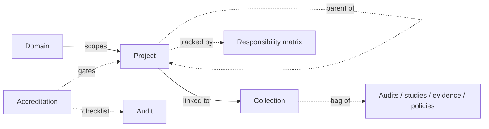

# Project management

The **project-management module** brings PMBOK-style planning into CISO Assistant: a structured way to organise complex, multi-stakeholder initiatives — go-lives, accreditations, transformation programmes — alongside the compliance and risk work they drive.

It's the newest concept in the platform, and the object graph will continue to evolve.

## Mental model

A project sits in a domain and can stack as a portfolio → programme → project hierarchy (the same model with three values of `kind`). On creation it's auto-paired with a **generic collection** — the flexible bag where the audits, risk studies, findings, evidences, and policies tied to the project accumulate. A **responsibility matrix** can be attached to one or more projects, encoding RACI / RASCI / RAPID assignments of actors to activities (each activity in turn references the work objects it covers). An **accreditation** is the formal authorisation event: it links its decision evidence and its compliance-assessment checklist back to the project's collection.

| User-facing | Internal | Notes |
|---|---|---|
| Project | `Project` | `kind` enum (Portfolio / Program / Project); self-FK `parent_project` |
| Collection | `GenericCollection` | Polymorphic bag (audits, risk / EBIOS / CRQ studies, findings, evidence, policies, exceptions) |
| Responsibility matrix | `ResponsibilityMatrix` | RACI / RASCI / RAPID / Custom; M2M to Project |
| Activity | `ResponsibilityMatrixActivity` | Row of a matrix; many M2Ms to work objects |
| Assignment | `ResponsibilityAssignment` | RACI cell — `(activity, actor, role)` unique |
| Accreditation | `Accreditation` | Linked to a Collection; `checklist` FK to ComplianceAssessment |

_Sources: `backend/pmbok/models.py:32` (GenericCollection — M2Ms to compliance / risk / CRQ / EBIOS / entity / findings assessments + documents + policies + exceptions; self-dep at 73), `80` (Accreditation — `linked_collection` FK at 140, `checklist` FK at 143, `decision_evidence` M2M at 160), `169` (Project — `Kind` enum at 170, `parent_project` self-FK at 308, `linked_collection` auto-created in `save` at 353), `521` (ResponsibilityMatrix — `preset`, `projects` M2M at 539, `roles` M2M), `567` (ResponsibilityMatrixActivity — `matrix` FK + M2Ms to AppliedControl / audits / BIA / etc.), `657` (ResponsibilityAssignment — `(activity, actor, role)` unique constraint)._

## Where it fits

Project objects don't replace [Perimeters](perimeters.md) — they sit alongside. Use a perimeter to define the _scope of assessment_; use a project to plan the _work needed to bring that scope into compliance_ or through an accreditation.

A single project typically references many perimeters, audits, applied controls, and findings assessments — it's the cross-cutting view the security organisation works against day-to-day.

## Disambiguating "project"

In older CISO Assistant documentation, "Project" used to be the name for what is now called a [Perimeter](perimeters.md). The legacy term has been retired everywhere; the **Project** described here is the new project-management object.

## Related

- [Perimeters](perimeters.md)
- [Vocabulary → Project / Accreditation / Responsibility matrix / Generic collection](../introduction/vocabulary.md)
