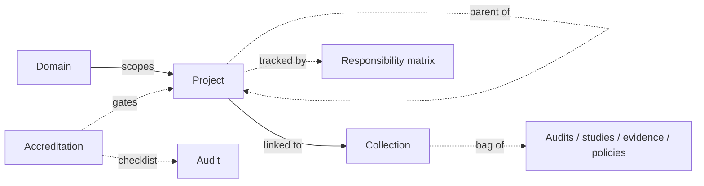

# Project management

The **project-management module** brings PMBOK-style planning into CISO Assistant: a structured way to organise complex, multi-stakeholder initiatives — go-lives, accreditations, transformation programmes — alongside the compliance and risk work they drive.

It's the newest concept in the platform, and the object graph will continue to evolve.

## Mental model

A project sits in a domain and can stack as a portfolio → programme → project hierarchy (the same model with three values of `kind`). On creation it's auto-paired with a **generic collection** — the flexible bag where the audits, risk studies, findings, evidences, and policies tied to the project accumulate. A **responsibility matrix** can be attached to one or more projects, encoding RACI / RASCI / RAPID assignments of actors to activities (each activity in turn references the work objects it covers). An **accreditation** is the formal authorisation event: it links its decision evidence and its compliance-assessment checklist back to the project's collection.

| User-facing | Internal | Notes |
|---|---|---|
| Project | `Project` | `kind` enum (Portfolio / Program / Project); self-FK `parent_project` |
| Collection | `GenericCollection` | Polymorphic bag (audits, risk / EBIOS / CRQ studies, findings, evidence, policies, exceptions) |
| Responsibility matrix | `ResponsibilityMatrix` | RACI / RASCI / RAPID / Custom; M2M to Project |
| Activity | `ResponsibilityMatrixActivity` | Row of a matrix; many M2Ms to work objects |
| Assignment | `ResponsibilityAssignment` | RACI cell — `(activity, actor, role)` unique |
| Accreditation | `Accreditation` | Linked to a Collection; `checklist` FK to ComplianceAssessment |

## Where it fits

Project objects don't replace [Perimeters](perimeters.md) — they sit alongside. Use a perimeter to define the _scope of assessment_; use a project to plan the _work needed to bring that scope into compliance_ or through an accreditation.

A single project typically references many perimeters, audits, applied controls, and findings assessments — it's the cross-cutting view the security organisation works against day-to-day.

## Budget — high-level on the project, details on the controls

Every project carries a **Budget** and an **Actual cost** field (with a currency that defaults to the instance setting), so leadership has a place to capture the financial envelope an initiative is operating under and what's been consumed against it.

This is **deliberately the high-level view only**. The project's budget number is not computed from anywhere — it's the planned envelope a sponsor signed off on, and the actual cost is whatever spend you record against it. Both are decimal money values, not roll-ups.

The **detailed financial picture** — line items, build vs run split, amortisation, who's spending — lives where the work actually happens: on the [applied controls](applied-controls.md#financial-tracking) referenced by the audits, risk studies, findings assessments, and other objects sitting in the project's [generic collection](../introduction/vocabulary.md). Each applied control carries its own structured cost; the [action plan](../features/action-plans.md) of every assessment in the collection rolls those costs up into a budget overview.

The link between the two layers is **indirect**: applied controls aren't attached to a project directly. They're attached to the work objects inside the project's collection (a control satisfies an audit's requirement, mitigates a risk scenario, remediates a finding), and through that chain they become part of the project's financial picture.

When the project budget and the rolled-up applied-control costs diverge, that gap is itself a signal — you've either committed more spend than the project envelope foresaw, or your action-plan controls are missing cost data. The platform doesn't flag the gap automatically; the numbers are surfaced on both sides for the project manager to reconcile.

## Related

- [Applied controls — Financial tracking](applied-controls.md#financial-tracking) — the detailed build / run cost model that drives the bottom-up view.
- [Action plans](../features/action-plans.md) — where the rolled-up cost of an assessment's controls is shown.
- [Perimeters](perimeters.md)
- [Vocabulary → Project / Accreditation / Responsibility matrix / Generic collection](../introduction/vocabulary.md)
