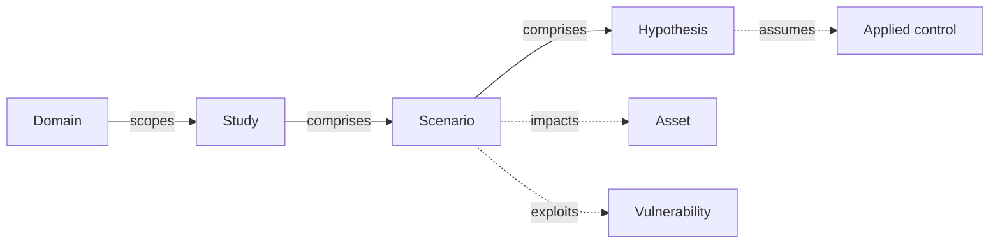

# Quantitative risk studies

A **quantitative risk study** evaluates risk in monetary terms — the expected annualised loss from each scenario — using probabilistic methods rather than a qualitative matrix.

It's the sibling of qualitative risk assessment and EBIOS RM: same problem (what could go wrong, how bad would it be), different lens (statistics rather than categories).

## Mental model

A study is the container for one quantitative analysis. It comprises scenarios — each one a discrete risk being modelled — and each scenario comprises one or more hypotheses, typically one per risk stage (inherent / current / residual). The hypothesis carries the probability and impact distributions plus the applied controls it assumes are in place — split into existing / added / removed sets so the delta between stages is explicit. Scenarios reference the assets they impact and the vulnerabilities they exploit, mirroring the qualitative side of the platform.

| User-facing | Internal | Notes |
|---|---|---|
| Study | `QuantitativeRiskStudy` | Container; carries risk tolerance + loss threshold |
| Scenario | `QuantitativeRiskScenario` | One row of risk |
| Hypothesis | `QuantitativeRiskHypothesis` | Parameter set + Monte-Carlo simulation cache |

## How it works

Each **scenario** in the study is parametrised by one or more **hypotheses**:

- A **loss-event frequency** distribution — how often the bad thing happens per year, expressed as a distribution rather than a point estimate.
- A **loss magnitude** distribution — how much it costs when it happens, also as a distribution.

The platform runs Monte-Carlo simulation over those distributions and derives the loss exceedance curve (LEC) plus aggregate metrics: expected loss, value-at-risk, tail loss.

## When to use it

- You need to compare risk against budget — "should we spend €X on control Y?" becomes tractable when both sides are in euros.
- You need to talk to the board or finance about risk in the language they speak.
- You have enough data — or enough informed judgement — to bound the loss distributions.

Qualitative methods stay useful for everything else.

## Related

- [Risk assessments](risk-assessments.md)
- [EBIOS RM](ebios-rm.md)
- [Guide → Cyber risk quantification](../guides/quantitative-risk.md) — click walkthrough for running a study.
- [Guide → Cyber risk quantification methodology](../guides/quantitative-risk-methodology.md) — the math behind the LEC, VaR, expected shortfall, ROSI, and tolerance overlay.
- [Vocabulary → Quantitative risk study / scenario / hypothesis](../introduction/vocabulary.md)
