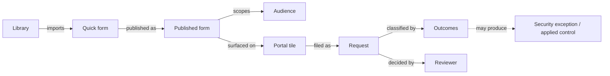
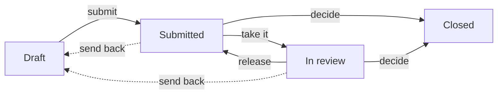

# Quick forms and requests

A **quick form** is a short, standalone questionnaire that someone fills in without an audit behind it: a derogation request, a vendor review request, a pre-qualification, an intake form. A **request** is one filled copy of that form, submitted to someone who decides on it.

It answers _"how does someone outside the security team ask us for something, and how do we decide and keep the record?"_ — the question that otherwise gets answered by email, a spreadsheet, or a ticketing tool that knows nothing about your controls.

The distinction from an audit matters. An audit measures an organisation against a framework, and every question hangs off a requirement. A quick form has no requirements, no assessable nodes and no compliance result — it has pages, questions, and an outcome.


Quick forms are gated by the **Forms and Requests** feature flag, off by default. Turn it on under **Settings → Feature flags**.

You also need **Custom portals**. A portal tile is currently the only way a requester starts a request, so a published form with no portal behind it cannot be reached.


## Mental model

A **quick form** arrives from a **library**, like a framework or a risk matrix does. On its own it cannot be filled — it must first be **published**, which is what names the **audience** allowed to file it and the domain their requests land in. A publication is then surfaced to people through a **portal tile**, which is where they click to start. Someone in that audience files a **request**, answers it, and submits. The answers compute a **score** and fire **outcomes**, which classify the request. A **reviewer** decides. An accepted request can then produce a real governed object, with the link back to the request that caused it.

| User-facing | Internal | Notes |
|---|---|---|
| Quick form | `QuickForm` | Library content; lives in the catalog, not in a domain |
| Page | `QuickFormPage` | Ordered; can be hidden by a condition on earlier answers |
| Published form | `QuickFormPublication` | The offer: which audience, which domain, which reviewers |
| Request | `QuickFormResponse` | One filed copy, with its own reference and lifecycle |
| Outcome | `QuickFormOutcome` | One row per rule that fired on the answers |
| Requester | `respondents` / `submitted_by` | Whoever is on the asking side |
| Reviewer | `reviewers` / `assignee` | Whoever may decide |

## Where each piece lives

Four places in the sidebar, and they are deliberately different audiences:

| Screen | Who it is for | What it holds |
|---|---|---|
| **Quick forms** (Catalog) | Anyone building the catalog | The form templates themselves, imported from libraries |
| **Published forms** | Whoever decides what may be asked for | One entry per form offered to an audience |
| **My requests** | Everyone | The requests *you* filed, including unfinished drafts |
| **Requests** (Governance) | Reviewers | The queue of requests waiting on a decision |

**My requests** is the only route back to an unfinished draft, and it is scoped by who you are rather than by domain permissions — a requester holds no role on the domain their request lands in.

## Publishing is what makes a form usable

A quick form sitting in the catalog cannot be filled by anyone. Publishing it is a separate, deliberate step, because the form says *what* is asked and the publication says *who may ask and where it lands*:

| Field | Meaning |
|---|---|
| **Audience** | Groups that may file this request. Empty means every user |
| **Submission domain** | Where responses land. The publication's own domain when left empty |
| **Default reviewers** | Who is put on each request as reviewer |
| **Allow multiple drafts** | Off: a requester with an unfinished draft is handed it back instead of starting a new one. Submitted requests are never limited |

The same form can be published more than once — to different audiences, landing in different domains, with different reviewers. That is how one derogation form serves several business units without being copied.

Publishing is necessary but not sufficient: a publication becomes reachable when a **portal tile** points at it. **My requests** lists the portals you can ask from, not the publications themselves.

Audience membership is the authorisation here. It is not folder permissions: someone in the audience can file a request into a domain they otherwise cannot see, and they will still not see anything else in it.

## Lifecycle

| Status | Meaning |
|---|---|
| **Draft** | Being filled. Answers save as you go; only the requester can change them |
| **Submitted** | Waiting for a reviewer. Content is frozen |
| **In review** | A reviewer has taken it. Claiming is optional — a quick decision does not require it first |
| **Closed** | Decided, with a resolution |

A closed request carries a **Resolution**: _Accepted_, _Rejected_, _Dropped_ (the requester withdrew it), or _Closed automatically_. Reject is the reviewer's act and drop is the requester's; neither substitutes for the other.

A reviewer can also send a request back to **Draft**, which returns it to the requester to change and resubmit.

## Separation of duties

Whoever submitted a request may not decide it, whatever permissions they hold. An analyst who files a derogation cannot approve their own derogation.

Two things follow:

- Deciding needs a specific permission, not merely write access to the domain. A reviewer who can edit everything in a domain still cannot decide a request they filed.
- Organisations too small to separate the two can turn on self-validation in the settings, which lifts the restriction deliberately rather than by accident.

The rule is anchored on who *submitted* the request, not who created the record — cloning and reassignment move authorship, and the check follows it.

## Outcomes — the decision the form makes for itself

Scores and outcomes are what separate a quick form from a web form that emails someone.

Each question can carry a score, and each form can carry **outcome rules** — expressions over the answers that classify the request when it is evaluated. All matching rules fire; a request can carry several outcomes at once.

Two ways to write a rule, both useful:

- **On a specific answer** — "personal data was ticked", "no compensating control is in place". Precise, and reads like the question it depends on.
- **On the total score** — "anything above 100 needs a full assessment". One threshold to tune, instead of an enumeration that grows each time a choice is added.

Outcomes are what the rest of the platform reacts to. They drive which supervised actions a reviewer is offered, and they are the hook for turning an accepted request into a governed object.


An outcome rule that references a question that does not exist — a typo, or a question removed later — does not raise an error. It simply never fires, and the form looks like it works. Fill a form in and check the outcomes before relying on them.


## From a request to a real object

A ticketing tool stops at "approved". The point of filing a derogation request here is that an accepted one can become a **security exception** — a governed object with an expiry, an approver and a place in the register.

That conversion is done by a **supervised action**: a workflow the reviewer runs deliberately on a request they have read, rather than something that fires on its own. The outcomes decide which actions are offered; the reviewer chooses whether to run one.

Whatever is produced keeps a link back to the request that caused it, visible from both ends — the request shows what it produced, and the produced object shows where it came from.

## Attachments

Questions can ask for a file. Uploads are held on the answer, and a reviewer who wants to keep one can promote it to an **evidence** in the domain — so a document that mattered to a decision stops being an attachment on a request and becomes part of the record.

## Authoring a form

Quick forms are library content. There are two ways to get one:

- **Import a library** that contains one, from **Libraries** — the same route as a framework or a risk matrix.
- **Build your own** in the library builder: **New quick form** creates the draft and opens the editor. Pages, questions, choices, scores, conditions and outcome rules are all edited there, and the result is a library you can export and re-import elsewhere.

Because a form is library content, it is versioned like one. Re-importing a newer version updates the form in place — except for questions already answered by a request that has left draft. Those are kept deliberately: deleting them would rewrite the record a decision was made on.
