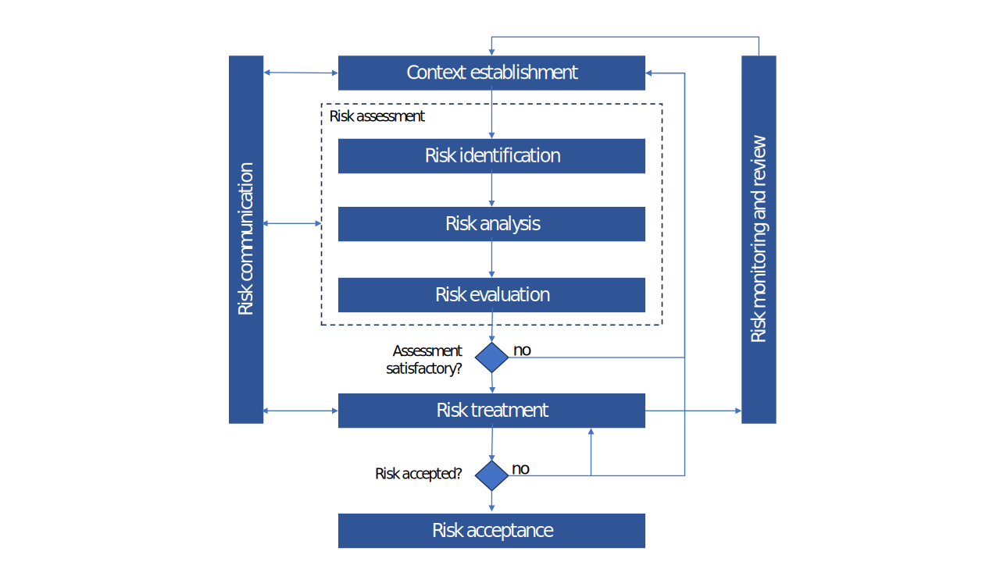
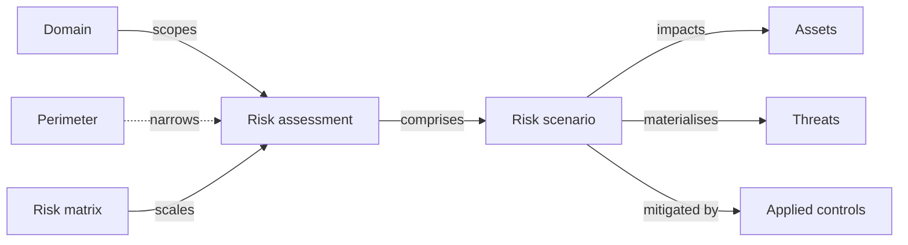

# Risk assessments

A **risk assessment** (also called a _risk study_) is a scenario-based evaluation of risk over a perimeter. CISO Assistant supports qualitative approaches (configurable risk matrices), quantitative approaches (Monte Carlo over loss distributions), and the structured EBIOS RM methodology.

The platform follows the ISO 27005 risk-management workflow.

## Mental model

A risk assessment always lives inside a **domain** (the mandatory IAM scope) and is bound to one **risk matrix** that supplies the probability × impact scale (the matrix can be swapped later; the platform refits existing scores onto the new scale). A **perimeter** can optionally narrow the assessment to a specific service or process inside the domain. The assessment is composed of **risk scenarios**; each scenario links to the **assets** it impacts, the **threats** it materialises, and the **applied controls** that mitigate it (split between _existing_ and _planned_ to drive the three-tier risk model below).

| User-facing | Internal | Notes |
|---|---|---|
| Risk assessment | `RiskAssessment` | Also called "Risk study" in the UI |
| Risk scenario | `RiskScenario` | A row inside the assessment |
| Risk matrix | `RiskMatrix` | Can be changed; the platform refits existing scenario scores onto the new scale |
| Domain | `Folder` | Required; drives IAM scoping |
| Threat | `Threat` | Catalog entry from a library |

## Risk assessment

A risk assessment encompasses three steps:

- **Risk identification** — defining the risk scenarios.
- **Risk analysis** — assessing probability, impact, and strength of knowledge for each scenario.
- **Risk evaluation** — done automatically based on the selected risk matrix.

In CISO Assistant, **risk treatment is combined with the risk assessment** rather than tracked as a separate phase.

## Risk scenario

Scenarios can be defined directly from the risk-assessment view or separately via the scenarios view. The same scenario can be reused across multiple studies.

## Risk levels: inherent, current, residual

CISO Assistant tracks three risk levels for each scenario, reflecting where the organisation stands along the treatment journey:

- **Inherent risk** — the natural level of the scenario _without any controls in place_. The starting point. Surfaced in the UI when the `inherent_risk` feature flag is on.
- **Current risk** — the level given the applied controls _already in place_. The state of risk today.
- **Residual risk** — the level expected once all _planned_ applied controls have been implemented. The target state, and the figure used in risk-acceptance decisions.

Each level has its own probability, impact, and overall level fields. When scoring, the platform expects monotonicity — residual should not exceed current, current should not exceed inherent — and warns if a scenario violates it.

## Risk acceptance

Risk acceptance is when an organisation or individual decides to tolerate a certain level of risk without taking further action to reduce it. CISO Assistant provides a workflow to capture formal approval of risk acceptances by management — the approver must hold the **Approver** role.

For context on the process itself, see the [ENISA risk-management process](https://www.enisa.europa.eu/topics/risk-management/current-risk/risk-management-inventory/rm-process/risk-acceptance).

## Risk matrix

Risk levels are calculated as a function of the probability and impact of a scenario, using a configurable **risk matrix**. Matrices are imported from libraries — pick one of the built-in matrices or define your own via a custom library.

Most organisations define an official matrix to be used for all risk assessments, but CISO Assistant lets you choose a different matrix per assessment when needed. The matrix **can be changed** after the assessment has been created — the platform performs a best-effort mapping of each scenario's existing probability and impact values onto the new scale (extra fitting computation runs to preserve as much of the prior scoring as possible). Review the migrated scenarios afterwards to confirm the new levels reflect your intent.

## Related

- [Assets](assets.md)
- [Applied controls](applied-controls.md)
- [Vocabulary → Threat / Risk assessment](../introduction/vocabulary.md)
