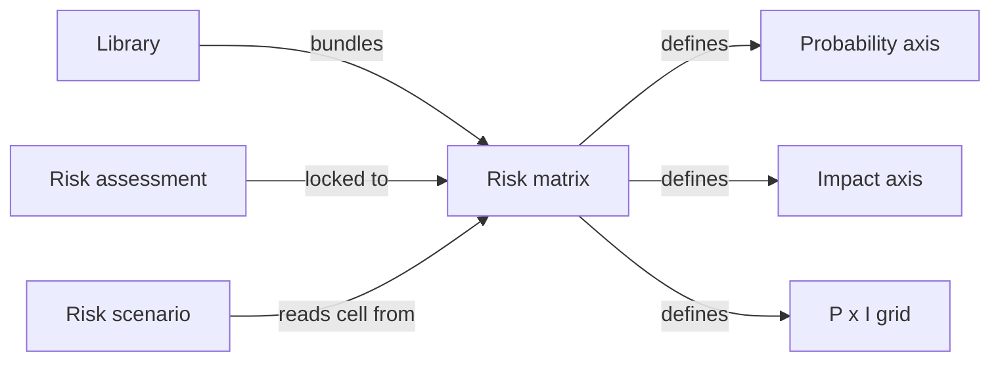

# Risk matrices

A **risk matrix** is a configurable lookup table that maps a `(probability, impact)` pair to a resulting risk level. It's what turns "likely × severe" into "critical" — the encoded judgement that lets a risk assessment be more than a free-form narrative.

Risk matrices are catalog objects: defined once, packaged into libraries, loaded into the platform, and reused across many risk assessments.

## Mental model

A risk matrix is a JSON definition (probability axis, impact axis, risk levels, and the grid linking them) bundled in a library. Once a risk assessment is created against a matrix the binding is permanent — the FK uses `on_delete=PROTECT` — because switching matrices mid-assessment would silently change every risk level, which is what auditors don't want. Each risk scenario in the assessment reads its inherent, current, and residual risk levels from the same matrix's grid using the `(probability, impact)` pair the assessor sets at each tier.

| User-facing | Internal | Notes |
|---|---|---|
| Risk matrix | `RiskMatrix` | `json_definition` with probability / impact / risk / grid |
| Risk assessment | `RiskAssessment` | `risk_matrix` FK is fixed at creation (`PROTECT`) |

## Anatomy

A matrix has four pieces:

- **Probability levels** — the ordered scale used for likelihood (e.g. negligible, low, medium, high, very high).
- **Impact levels** — the ordered scale used for severity (financial, reputational, operational, or whatever scale the organisation uses).
- **Risk levels** — the resulting categories (e.g. low / medium / high / critical), usually colour-coded.
- **The grid** — the lookup from each `(probability × impact)` cell to a risk level.

The grid is the substance of the matrix; the visual rendering (orientation, colours, layout) is handled by the UI based on the loaded matrix definition.

## Why a matrix is fixed per risk assessment

When a risk assessment is created, its risk matrix is captured and **stays fixed** for the lifetime of that assessment. Re-evaluating the same scenarios against a different matrix would silently change the risk levels under your feet, which is exactly what auditors don't want.

If you change matrices mid-programme, you create a new risk assessment against the new matrix and migrate the scenarios. The old assessment keeps its history; the new one starts clean against the new scale.

## Three-tier evaluation

Each scenario in a risk assessment is evaluated three times against the chosen matrix:

- **Inherent risk** — what the risk would be with no controls.
- **Current risk** — what it is today given existing applied controls.
- **Residual risk** — what it will be once planned applied controls are implemented.

The matrix is the same for all three tiers; what changes is the `(probability, impact)` pair the assessor sets at each tier. See [Risk assessments](risk-assessments.md) for how the three tiers are used.

## Authoring a matrix

Matrices ship as YAML libraries — the same format as frameworks, with `_meta` and `_content` sheets defining the probability/impact/risk axes and the grid. They are typically authored in Excel using the templates under `tools/excel/matrix/` and converted to YAML.

Designing a matrix correctly — particularly the grid — is non-trivial. Start from one of the existing examples and adapt the levels and grid logic rather than building from scratch. See [Designing your own libraries](../configuration/libraries/custom-libraries.md).

## Related

- [Risk assessments](risk-assessments.md)
- [Libraries](libraries.md)
- [Vocabulary → Risk matrix](../introduction/vocabulary.md)
- [Designing your own libraries](../configuration/libraries/custom-libraries.md)
