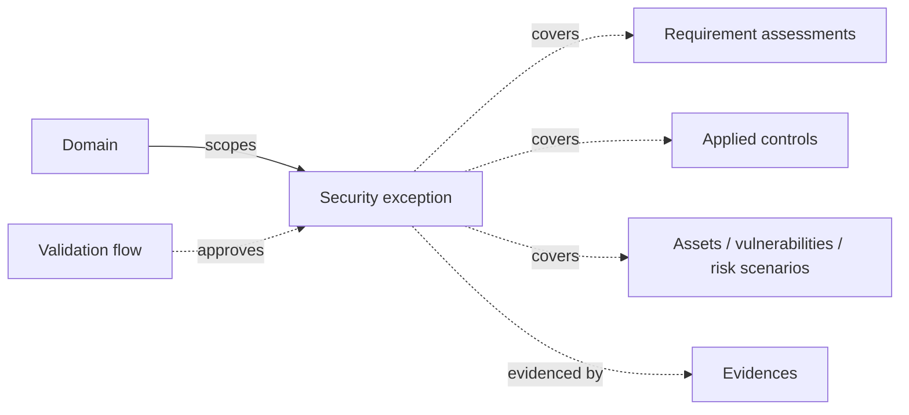

# Security exceptions

A **security exception** records a deliberate, documented deviation from what you would normally do: a requirement you can't meet yet, a control you've decided not to apply on a legacy system, a vulnerability you won't patch before the next maintenance window. Instead of leaving the gap silent, you write it down, say who owns it, how severe it is, and when it stops being acceptable.

The key word is **time-bound**. An exception carries an **expiration date**, and the platform reminds its owners before that date and keeps flagging it afterwards until someone closes it out. It's how a temporary waiver stays temporary.

Exceptions are listed under **Governance › Exceptions** in the sidebar.

## Mental model

A security exception always lives in a **domain**, which decides who can see and edit it. From there it points at whatever it deviates from: the **requirement assessments** of an audit it waives, the **applied controls** it suspends or weakens, and the **assets**, **vulnerabilities**, or **risk scenarios** it concerns. All of these links are optional and many-to-many: one exception can cover several objects, and one object can carry several exceptions. **Evidences** hold the supporting material (the signed waiver, the compensating-measure description, the vendor's end-of-life notice). Formal sign-off goes through a **validation flow**, which records who approved the exception and when.

| User-facing | Internal | Notes |
|---|---|---|
| Exception | `SecurityException` | Domain-scoped; listed as **Exceptions** |
| Domain | `Folder` | Required; drives IAM scoping |
| Assigned to | `owners` → `Actor` | A user, a team, or an entity |
| Validation | `ValidationFlow` | The approval workflow |
| Approver (Deprecated) | `approver` → `User` | Read-only; kept for existing records |
| Evidence | `Evidence` | Many-to-many |

## What an exception records

- **Identification** — a **Name**, an optional **ID**, a **Description**, and the **Domain** it belongs to.
- **Severity** — the same scale as vulnerabilities and findings: low, medium, high, critical, plus an informational level, or left undefined.
- **Status** — where the exception stands in its life (see below). New exceptions start as **Draft**.
- **Assigned to** — the owners accountable for the exception. They can be users, teams, or third-party entities, and they are the people notified about it.
- **Expiration date** — when the exception stops applying. The form warns you if you enter a date in the past, but doesn't block it, so you can record exceptions that have already lapsed.
- **Observation** — free-form notes in markdown: the justification, the compensating measures, the conditions under which the exception holds.
- **Link** — a URL to an external tracker (an ITSM ticket, a Jira issue, a SharePoint page).
- **Assets**, **Applied controls**, and **Evidences** — the objects the exception concerns and the material that supports it, all selectable from the form. When editing an existing exception, a **+** next to **Applied controls** lets you create a new control already linked to it (for example, the compensating measure).

The **Approver (Deprecated)** field is still shown on exceptions that had one, but it can no longer be set. Its help text says it plainly: _"This field is deprecated. Use validation flows to request approval of a security exception."_

## Status lifecycle

| Status | Meaning |
|---|---|
| **Draft** | Being written up; not yet submitted. The default. |
| **In review** | Submitted and awaiting a decision. |
| **Approved** | Granted. The deviation is accepted until the expiration date. |
| **Rejected** | Refused. The underlying gap has to be treated normally. |
| **Resolved** | No longer needed: the requirement is now met or the control is in place. |
| **Expired** | The expiration date has passed and the exception no longer applies. |
| **Deprecated** | Superseded or no longer relevant, kept for the record. |

Status is set by hand. Passing the expiration date doesn't switch an exception to **Expired** on its own. Instead the owners get an expiry alert (see [Reminders and notifications](#reminders-and-notifications)) so a person can decide what happens next: renew it with a new date, resolve it, or mark it expired.

**Rejected**, **Resolved**, **Expired**, and **Deprecated** are closing statuses: an exception in any of them gets no more expiry reminders.

## Where exceptions attach

You can link an exception from either side.

From the **exception's own form**, you pick **Assets**, **Applied controls**, and **Evidences**.

From the **other object's form**, an **Exceptions** field is available on:

- **Assets**
- **Applied controls** and policies, under **Relationships**
- **Vulnerabilities**
- **Risk scenarios**, on the scenario's edit page
- **Validations**, to bundle exceptions into an approval request

On an **audit**, open a requirement to find an **Exceptions** tab alongside the other tabs (applied controls, evidences, findings, and so on). From there you can **Add exception** to create one already linked to that requirement, or attach existing ones. The tab is part of the auditor's view; respondents answering through an [assignment](../features/assignments.md) don't see it.

The **risk scenario** detail page lists its exceptions in its own **Exceptions** section.

The exception's **detail page** shows the reverse view, with one tab per linked type: **Evidences**, **Applied controls**, **Assets**, **Vulnerabilities**, **Requirement assessments**, and **Risk scenarios**. Only the **Evidences** tab lets you create or attach from there. The others are read-only summaries, because those links are managed from the exception's form or from the other object.

## Evidence

Exceptions take evidences like most operational objects. Attach existing ones from the form or from the **Evidences** tab, or create a new evidence from that tab, which links it to the exception automatically. The evidence's own page then lists the exceptions it supports.

## Approval with validation flows

When the **Validations** feature is enabled, an exception's page shows a **Request validation** button. It opens a validation flow with the exception already attached; you pick the approver and add your notes. The flow's history (requests, decisions, and notes) then shows up on the exception page.

You can also bundle exceptions with other objects in one request from the **Validations** list, for example an audit together with the exceptions raised against it. See [Validation flows](validation-flows.md) for how approvers, deadlines, and decisions work.

A validation records the decision. It doesn't change the exception's **Status**, so update that too once the decision is made.

## Reminders and notifications

Notifications go to everyone in **Assigned to**. For a team, that means its team email, leader, deputies, and members.

| When | What owners receive |
|---|---|
| They are added to an exception | An assignment notification |
| The exception's status changes | A status-change notification naming the new status |
| The expiration date is 30, 7, and 1 day(s) away | An "expiring soon" reminder |
| The expiration date has passed | An "expired" alert, until the exception reaches a closing status |

The two deadline notifications are skipped for exceptions in a closing status (**Rejected**, **Resolved**, **Expired**, **Deprecated**), and they need an **Expiration date** to fire. Administrators can switch each of these notifications on or off per channel (in-app or email) for the whole instance. See [Notifications](../features/notifications.md).

Exceptions you co-own also appear under **Exceptions** on your [Assignments](../features/my-assignments.md) page, and on the **Calendar** on their expiration date.

## Custom fields

If your organisation tracks attributes of its own on exceptions, like a waiver reference from your risk committee or a business sponsor, you can define [custom fields](../features/custom-fields.md) for them. They appear at the bottom of the exception form and can be used to filter and search the list. Custom fields are a PRO capability.

## The exceptions list

The list shows **ID**, **Name**, **Severity**, **Status**, **Expiration date**, **Domain**, **Associated objects** (how many requirement assessments, controls, assets, vulnerabilities, risk scenarios, and evidences the exception is linked to), and **Created at**.

- **Filters** — **Domain**, **Severity**, **Status**, **Expiration date**, **Created at**, **Updated at**.
- **Batch actions** — select rows to **Change status**, **Change domain**, or **Delete** in bulk.
- **Export** — download the list as CSV or Excel.
- **Import** — exceptions can be loaded in bulk through [data import](../configuration/data-import.md#exceptions).

For a portfolio view, the **Governance** tab of **Analytics** has an **Exceptions breakdown** chart that shows how exceptions spread across severities and statuses. Each audit's [advanced analytics](../features/audit-analytics.md) has an **Exceptions Overview** for the exceptions raised against its requirements.

## Access and feature flag

Exceptions follow the usual [domain-based access rules](iam-and-scoping.md): you see the exceptions of the domains you have access to. With the built-in roles, analysts, domain managers, and administrators can create, edit, and delete them, while readers and approvers can only view them.

The whole module can be hidden with the **exceptions** [feature flag](../configuration/settings/feature-flags.md). It's on by default.

## Exceptions vs. risk acceptances

Both formalise a decision to live with something, but they answer different questions. A **risk acceptance** works at the level of a risk scenario: it says the residual risk is tolerated. An **exception** works at the level of a rule: it says this requirement or control won't be applied as written, for this scope, until this date. Exceptions can still be linked to risk scenarios when a deviation is part of a risk's story.

## Related

- [Validation flows](validation-flows.md)
- [Applied controls](applied-controls.md)
- [Audits](audits.md)
- [Risk assessments](risk-assessments.md)
- [Vulnerabilities](vulnerabilities.md)
- [Evidence](evidence.md)
- [Notifications](../features/notifications.md)
- [Vocabulary → Security exception](../introduction/vocabulary.md)
